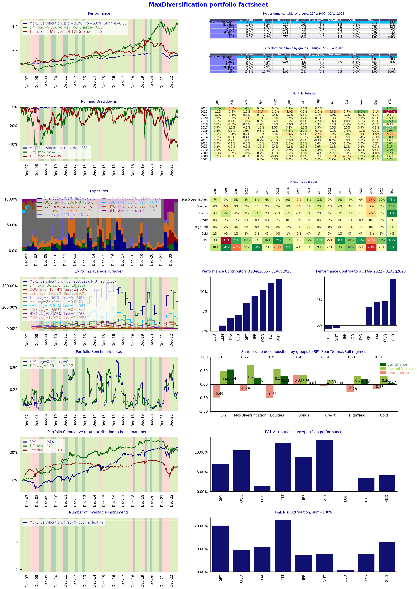

## **Optimal Portfolios Backtester** <a name="analytics"></a>

optimalportfolios package implements analytics for backtesting of optimal portfolios including:
1. computing of inputs (covariance matrices, returns) using roll forward computations (to avoid hindsight bias)
2. implementation of core solvers:
   1. Minimum variance
   2. Maximum quadratic utility
   3. Equal risk contribution
   4. Maximum diversification
   5. Maximum Sharpe ratio
   6. Maximum Cara utility under Gaussian mixture model
3. computing performances of simulated portfolios
4. reporting


OptimalPortfolios package is split into 5 main modules with the 
dependecy path increasing sequentially as follows.

1. ```optimisation``` is module containing implementation of quadratic and nonlinear solvers

2. ```reports``` is module for computing performance statistics and performance attribution including returns, volatilities, etc.

3. ```examples.crypto_allocation``` is module for computations and visualisations for 
paper "Optimal Allocation to Cryptocurrencies in Diversified Portfolios" [https://ssrn.com/abstract=4217841](https://ssrn.com/abstract=4217841)
   (see paper for description of the rolling-forward methodology and estimation of inputs)


# Table of contents
1. [Analytics](#analytics)
2. [Installation](#installation)
3. [Portfolio Optimisers](#optimisers)
   1. [Implemented optimisers](#implemented)
   2. [Adding an optimiser](#adding)
   3. [Default parameters](#params)
   4. [Price time series data](#ts)
4. [Examples](#examples)
   1. [Optimal Portfolio Backtest](#optimal)
   2. [Customised reporting](#report)
   3. [Parameters sensitivity backtest](#sensitivity)
   4. [Multi optimisers cross backtest](#cross)
   5. [Optimal allocation to cryptocurrencies](#crypto)
5. [Contributions](#contributions)
6. [Updates](#updates)
7. [Disclaimer](#disclaimer)

## **Installation** <a name="installation"></a>
install using
```python 
pip install optimalportfolios
```
upgrade using
```python 
pip install --upgrade optimalportfolios
```

close using
```python 
git clone https://github.com/ArturSepp/OptimalPortfolios.git
```


Core dependencies:
    python = ">=3.8,<3.11",
    numba = ">=0.56.4",
    numpy = ">=1.22.4",
    scipy = ">=1.9.0",
    pandas = ">=1.5.2",
    matplotlib = ">=3.2.2",
    seaborn = ">=0.12.2",
    seaborn = ">=0.12.2",
    scikit_learn = ">=1.3.0",
    cvxpy = ">=1.3.2",
    qis = ">=2.0.6",

Optional dependencies:
    yfinance ">=0.2.3" (for getting test price data),
    pybloqs ">=1.2.13" (for producing html and pdf factsheets)


To use pybloqs for pandas > 2.x, 
locate file "...\Lib\site-packages\pybloqs\jinja\table.html" and change line 44 from:



to:




## **Portfolio optimisers** <a name="optimisers"></a>


### 1. Implemented optimisers <a name="implemented"></a>

Subpackage ```optimisation.rolling```  implements specific optimisers 
with lookback rolling windows rebalanced at given rebalancing_freq

Implemented optimisers are enumerated in ```optimization.config.py```
```python 
class PortfolioObjective(Enum):
    # risk-based:
    MAX_DIVERSIFICATION = 1  # maximum diversification measure
    EQUAL_RISK_CONTRIBUTION = 2  # implementation in risk_parity
    MIN_VARIANCE = 3  # min w^t @ covar @ w
    RISK_PARITY_ALT = 4  # alternative implementation of risk_parity
    # return-risk based
    QUADRATIC_UTILITY = 5  # max means^t*w- 0.5*gamma*w^t*covar*w
    MAXIMUM_SHARPE_RATIO = 6  # max means^t*w / sqrt(*w^t*covar*w)
    # return-skeweness based
    MAX_MIXTURE_CARA = 7  # carra for mixture distributions
```


Each module in ```optimization.rolling``` implements specific optimisers and estimators for their inputs.

1. Module ```optimization.rolling.risk_based.py``` implements following optimisers
```
[PortfolioObjective.EQUAL_RISK_CONTRIBUTION,
PortfolioObjective.MAX_DIVERSIFICATION,
PortfolioObjective.RISK_PARITY_ALT,
PortfolioObjective.MIN_VAR]
```


2. Module ```optimization.rolling.max_utility_sharpe.py``` implements following optimisers
```
[PortfolioObjective.QUADRATIC_UTILITY,
PortfolioObjective.MAXIMUM_SHARPE_RATIO]
```

3. Module ```optimization.rolling.max_mixure_carra.py``` implements following optimisers
```
[PortfolioObjective.MAX_MIXTURE_CARA]
```

Module ```optimisation.engine.py``` wraps different optimisers into one function
```compute_rolling_optimal_weights()``` for each implemented
```PortfolioObjective``` listed in ```optimisation.config.py```


### 2. Adding an optimiser <a name="adding"></a>

1. Add analytics for computing rolling weights using a new estimator in
subpackage ```optimization.rolling```. Any third-party packages can be used

2. Add new optimiser type to ```optimisation.config.py``` and link implemented
optimiser in wrapper function ```compute_rolling_optimal_weights()``` in 
```optimisation.engine.py```


### 3. Default parameters <a name="params"></a>

Key parameters include the specification of the estimation sample.

1. ```returns_freq``` defines the frequency of returns for covariance matrix estimation. This parameter affects all methods. 

The default (assuming daily price data) is weekly Wednesday returns ```returns_freq = 'W-WED'```.

For price data with monthly observations 
(such us hedged funds), monthly returns should be used ```returns_freq = 'ME'```.


2. ```span``` defines the estimation span for ewma covariance matrix. This parameter affects all methods which use 
EWMA covariance matrix:
```
PortfolioObjective in [MAX_DIVERSIFICATION, EQUAL_RISK_CONTRIBUTION, MIN_VARIANCE]
```   
and 
```
PortfolioObjective in [QUADRATIC_UTILITY, MAXIMUM_SHARPE_RATIO]
```   

The span is defined as the number of returns
for the half-life of EWMA filter: ```ewma_lambda = 1 - 2 / (span+1)```. ```span=52``` with weekly returns means that 
last 52 weekly returns (one year of data) contribute 50% of weight to estimated covariance matrix

The default (assuming weekly returns) is 52: ```span=52```.

For monthly returns, I recommend to use ```span=12``` or ```span=24```.


3. ```rebalancing_freq``` defines the frequency of weights update. This parameter affects all methods.

The default value is quarterly rebalancing  ```rebalancing_freq='QE'```.

For the following methods 
```
PortfolioObjective in [QUADRATIC_UTILITY, MAXIMUM_SHARPE_RATIO, MAX_MIXTURE_CARA]
```   
Rebalancing frequency is also the rolling sample update frequency when mean returns and mixture distributions are estimated.


4. ```roll_window``` defines the number of past returns applied for estimation of rolling mean returns and mixture distributions.

This parameter affects the following optimisers 
```
PortfolioObjective in [QUADRATIC_UTILITY, MAXIMUM_SHARPE_RATIO, MAX_MIXTURE_CARA]
```   
and it is linked to ```rebalancing_freq```. 

Default value is ```roll_window=20``` which means that data for past 20 (quarters) are used in the sample
with ```rebalancing_freq='QE'```

For monthly rebalancing, I recomend to use ```roll_window=60``` which corresponds to using past 5 years of data

### 4. Price time series data <a name="ts"></a>

The input to all optimisers is dataframe prices which contains dividend and split adjusted prices.

The price data can include assets with prices starting an ending at different times.

All optimisers will set maximum weight to zero for assets with missing prices in the estimation sample period.  


## **Examples** <a name="examples"></a>

### 1. Optimal Portfolio Backtest <a name="optimal"></a>

See script in ```optimalportfolios.examples.optimal_portfolio_backtest.py```

```python 
# imports
import pandas as pd
import numpy as np
import matplotlib.pyplot as plt
import seaborn as sns
import yfinance as yf
from typing import Tuple
import qis as qis
from optimalportfolios.optimization.config import PortfolioObjective
from optimalportfolios.optimization.engine import compute_rolling_optimal_weights

# 1. we define the investment universe and allocation by asset classes
def fetch_universe_data() -> Tuple[pd.DataFrame, pd.DataFrame, pd.Series]:
    """
    fetch universe data for the portfolio construction:
    1. dividend and split adjusted end of day prices: price data may start / end at different dates
    2. benchmark prices which is used for portfolio reporting and benchmarking
    3. universe group data for portfolio reporting and risk attribution for large universes
    this function is using yfinance to fetch the price data
    """
    universe_data = dict(SPY='Equities',
                         QQQ='Equities',
                         EEM='Equities',
                         TLT='Bonds',
                         IEF='Bonds',
                         SHY='Bonds',
                         LQD='Credit',
                         HYG='HighYield',
                         GLD='Gold')
    tickers = list(universe_data.keys())
    group_data = pd.Series(universe_data)
    prices = yf.download(tickers, start=None, end=None, ignore_tz=True)['Adj Close'].dropna()
    prices = prices[tickers]  # arrange as given
    prices = prices.asfreq('B', method='ffill')
    benchmark_prices = prices[['SPY', 'TLT']]
    return prices, benchmark_prices, group_data


# 2. get universe data
prices, benchmark_prices, group_data = fetch_universe_data()

# 3.a. define optimisation setup
portfolio_objective = PortfolioObjective.MAX_DIVERSIFICATION  # define portfolio objective
min_weights = {x: 0.0 for x in prices.columns} # all weights >= 0
max_weights = {x: 1.0 for x in prices.columns}  # all weights <= 1
rebalancing_freq = 'QE'  # weights rebalancing frequency
returns_freq = None  # use data implied frequency = B
span = 72  # span of number of returns for covariance estimation = 3 months
is_gross_notional_one = True  # sum of weights = 1.0
is_long_only = True  # all weights >= 0

# 3.b. compute rolling portfolio weights rebalanced every quarter
weights = compute_rolling_optimal_weights(prices=prices,
                                          portfolio_objective=portfolio_objective,
                                          min_weights=min_weights,
                                          max_weights=max_weights,
                                          rebalancing_freq=rebalancing_freq,
                                          is_long_only=is_long_only,
                                          span=span)

# 4. given portfolio weights, construct the performance of the portfolio
funding_rate = None  # on positive / negative cash balances
rebalancing_costs = 0.0010  # rebalancing costs per volume = 10bp
portfolio_data = qis.backtest_model_portfolio(prices=prices,
                                              weights=weights,
                                              is_rebalanced_at_first_date=True,
                                              ticker='MaxDiversification',
                                              funding_rate=funding_rate,
                                              rebalancing_costs=rebalancing_costs,
                                              is_output_portfolio_data=True)

# 5. using portfolio_data run the reporting with strategy factsheet
# for group-based reporting set_group_data
portfolio_data.set_group_data(group_data=group_data, group_order=list(group_data.unique()))
# set time period for portfolio reporting
time_period = qis.TimePeriod('31Dec2005', '17Aug2023')
fig = qis.generate_strategy_factsheet(portfolio_data=portfolio_data,
                                      benchmark_prices=benchmark_prices,
                                      time_period=time_period,
                                      **qis.fetch_default_report_kwargs(time_period=time_period))
# save report to pdf and png
qis.save_figs_to_pdf(figs=[fig],
                     file_name=f"{portfolio_data.nav.name}_portfolio_factsheet",
                     orientation='landscape',
                     local_path="C://Users//Artur//OneDrive//analytics//outputs")
qis.save_fig(fig=fig, file_name=f"example_portfolio_factsheet", local_path=f"figures/")
```



### 2. Customised reporting <a name="report"></a>

Portfolio data class ```PortfolioData``` is implemented in [QIS package](https://github.com/ArturSepp/QuantInvestStrats)

```python
# 6. can create customised reporting using portfolio_data custom reporting
def run_customised_reporting(portfolio_data) -> plt.Figure:
    with sns.axes_style("darkgrid"):
        fig, axs = plt.subplots(3, 1, figsize=(12, 12), tight_layout=True)
    kwargs = dict(x_date_freq='YE', framealpha=0.8)
    portfolio_data.plot_nav(ax=axs[0], **kwargs)
    portfolio_data.plot_weights(ncol=len(prices.columns)//3,
                                legend_stats=qis.LegendStats.AVG_LAST,
                                title='Portfolio weights',
                                bbox_to_anchor=None,
                                ax=axs[1],
                                **kwargs)
    portfolio_data.plot_returns_scatter(benchmark_price=benchmark_prices.iloc[:, 0],
                                        ax=axs[2],
                                        **kwargs)
    return fig


# run customised report
fig = run_customised_reporting(portfolio_data)
# save png
qis.save_fig(fig=fig, file_name=f"example_customised_report", local_path=f"figures/")
```


### 3. Parameters sensitivity backtest <a name="sensitivity"></a>

See script in ```optimalportfolios.examples.parameter_sensitivity_backtest.py```


### 4. Multi optimisers cross backtest <a name="cross"></a>

See script in ```optimalportfolios.examples.multi_optimisers_backtest.py```


### 5. Optimal allocation to cryptocurrencies <a name="crypto"></a>

Computations and visualisations for 
paper "Optimal Allocation to Cryptocurrencies in Diversified Portfolios" [https://ssrn.com/abstract=4217841](https://ssrn.com/abstract=4217841)
   are implemented in module ```optimalportfolios.crypto_allocation```,
see [README in this module](https://github.com/ArturSepp/OptimalPortfolios/blob/master/optimalportfolios/examples/crypto_allocation/README.md)


## **Updates** <a name="updates"></a>

#### 8 July 2023,  Version 1.0.1 released

Implementation of optimisation methods and data considered in 
 Sepp A (2023), Optimal Allocation to Cryptocurrencies in Diversified Portfolios,
forthcoming in Risk. Available at SSRN: https://ssrn.com/abstract=4217841


#### 2 September 2023,  Version 1.0.8 released
Added subpackage ```optimisation.rolling``` with optimisers grouped by the type of inputs and
data thy require.


## **Disclaimer** <a name="disclaimer"></a>

OptimalPortfolios package is distributed FREE & WITHOUT ANY WARRANTY under the GNU GENERAL PUBLIC LICENSE.

See the [LICENSE.txt](https://github.com/ArturSepp/OptimalPortfolios/blob/master/LICENSE.txt) in the release for details.

Please report any bugs or suggestions by opening an [issue](https://github.com/ArturSepp/OptimalPortfolios/issues).


