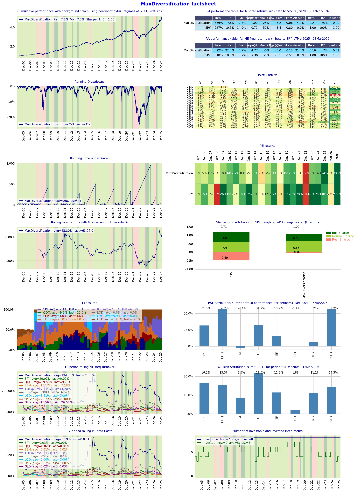
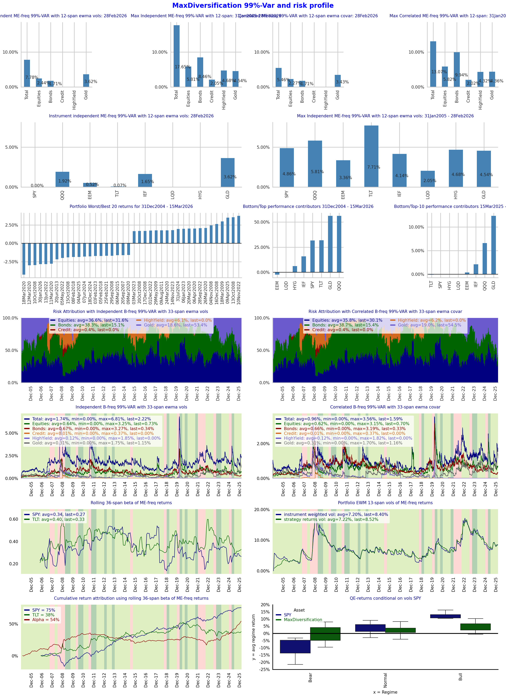
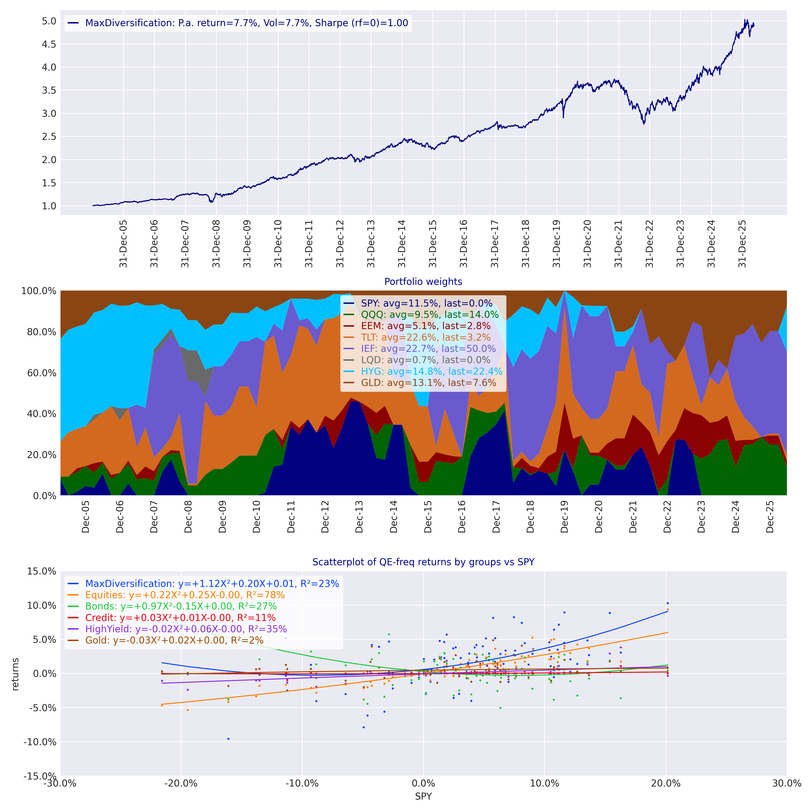
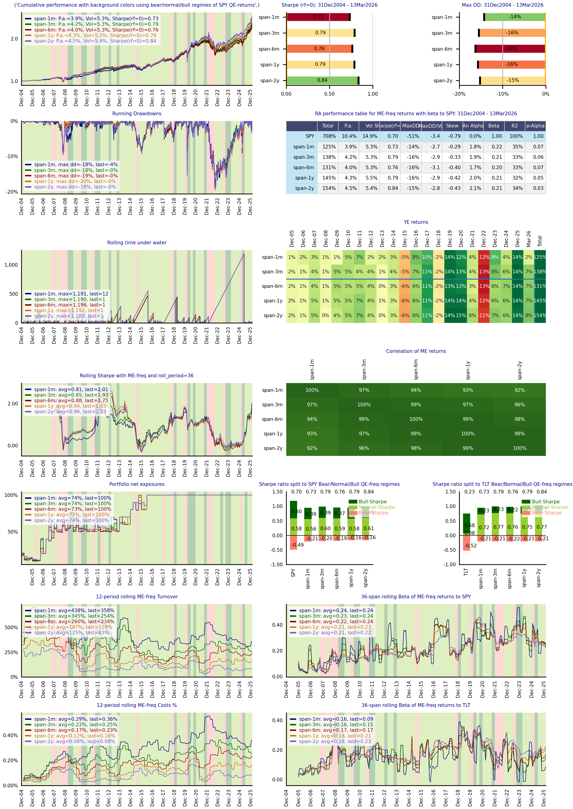
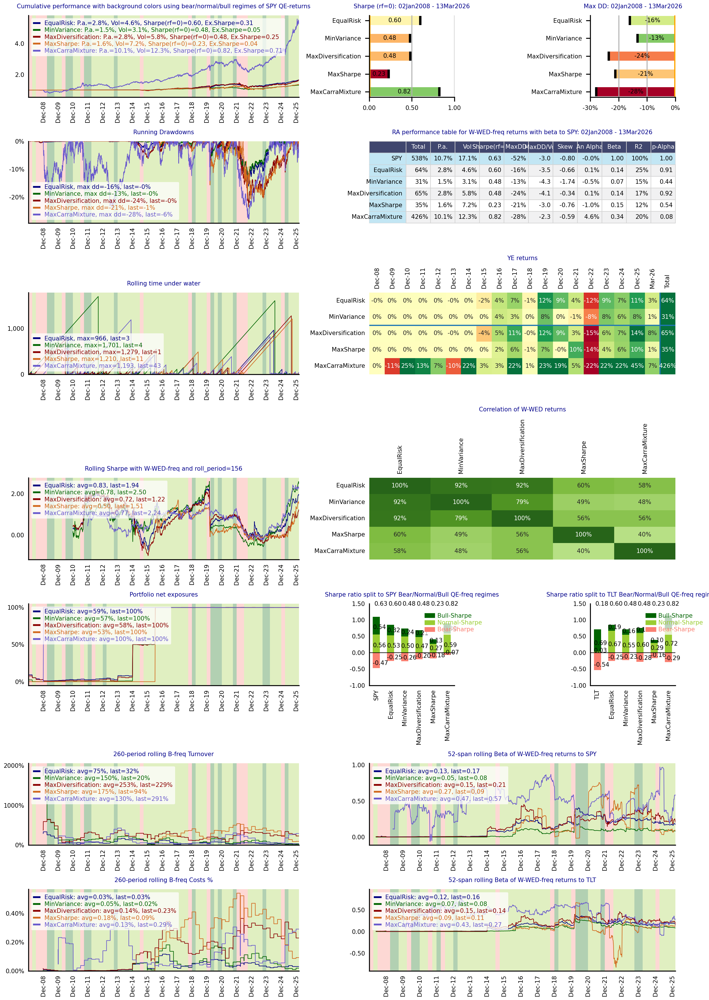
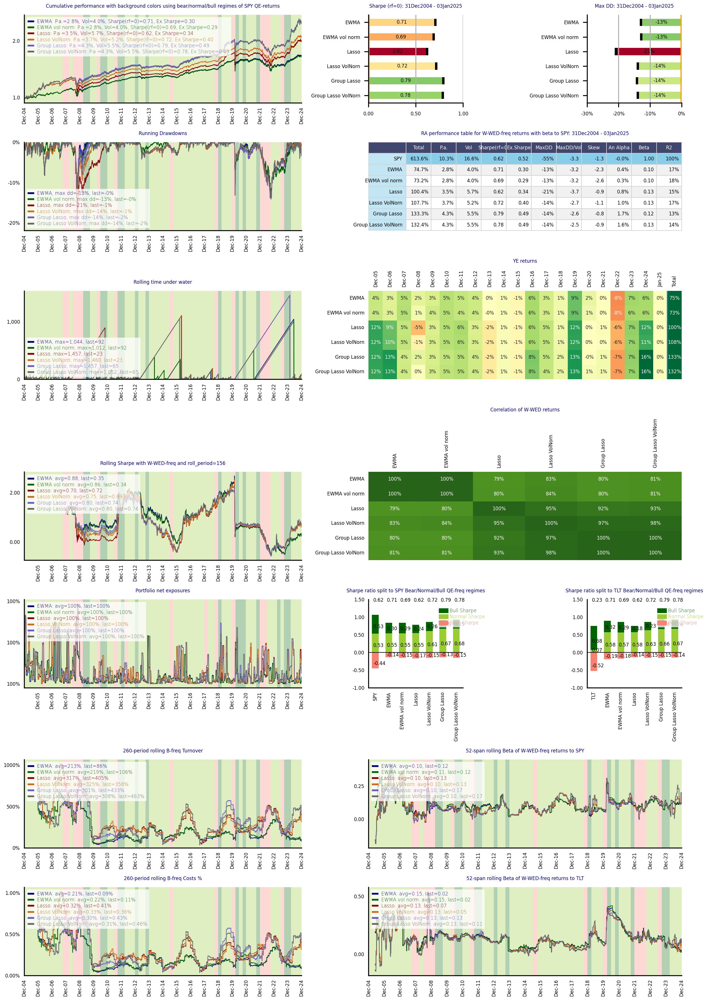

# 🚀 **Optimal Portfolios Construction and Backtesting: optimalportfolios**

> Production-grade multi-asset portfolio construction and backtesting in Python — from covariance estimation to rolling optimisation to factsheet reporting, in a single pipeline that handles real-world data

---

| 📊 Metric | 🔢 Value |
|-----------|----------|
| PyPI Version |  |
| Python Versions |  |
| License | |


### 📈 Package Statistics

| 📊 Metric | 🔢 Value |
|-----------|----------|
| Total Downloads | [](https://pepy.tech/project/optimalportfolios) |
| Monthly |  |
| Weekly |  |
| GitHub Stars |  |
| GitHub Forks |  |


## **Why optimalportfolios** <a name="analytics"></a>

Most Python portfolio optimisation packages (PyPortfolioOpt, Riskfolio-Lib, skfolio)
solve single-period allocation problems: given a covariance matrix and expected
returns, find the optimal weights. This is useful for textbook exercises but
insufficient for running a real multi-asset portfolio.

**optimalportfolios solves the production problem end-to-end:**
estimate covariance → compute alpha signals → optimise with constraints →
rebalance on schedule → backtest with transaction costs — all in a single
roll-forward pipeline that handles incomplete data, mixed-frequency assets,
and illiquid positions.

### Key differentiators

**Production multi-asset portfolio construction.**
The package implements the full pipeline from the ROSAA framework: factor model
covariance estimation → risk-budgeted SAA → alpha signal computation →
TE-constrained TAA → rolling backtest. No other open-source package handles
universes where equities rebalance monthly, alternatives rebalance quarterly,
and private equity enters the allocation set only when sufficient return history
is available. The constraint system (weight bounds, group allocation limits,
tracking error budgets, turnover controls, rebalancing indicators for frozen
positions) matches what real institutional PM teams need.

**HCGL factor covariance estimation.**
The Hierarchical Clustering Group LASSO factor model (published in JPM, 2026)
produces sparse, structured covariance matrices for heterogeneous multi-asset
universes. Unlike sample EWMA (unstable for 20+ assets) or Ledoit-Wolf
shrinkage (no factor structure), HCGL estimates a factor model where asset
betas are regularised via Group LASSO with hierarchical clustering. This yields
covariance matrices that are stable across rebalancing periods, respect the
underlying factor structure, and handle mixed return frequencies natively.

**NaN-aware rolling backtesting.**
The three-layer architecture (solver / wrapper / rolling) automatically handles
real-world data: assets with missing prices receive zero weight, assets entering
the universe mid-sample are included when sufficient history is available, and
the rebalancing indicator system freezes illiquid positions at their current
weight while re-optimising the liquid portion. No data cleaning or pre-filtering
required.

**Research-backed methodology.**
The package is the reference implementation for the ROSAA framework published in
*The Journal of Portfolio Management* (Sepp, Ossa, Kastenholz, 2026). The
optimisation solvers, covariance estimators, and alpha signals are battle-tested
on live multi-asset portfolios.

### Quick-start: rolling backtest in 10 lines

```python
import qis as qis
from optimalportfolios import (EwmaCovarEstimator, Constraints,
                               PortfolioObjective, compute_rolling_optimal_weights)

prices = ...  # pd.DataFrame of asset prices (may have NaNs, different start dates)
time_period = qis.TimePeriod('31Dec2004', '15Mar2026')

# estimate covariance → optimise → get rolling weights
estimator = EwmaCovarEstimator(returns_freq='W-WED', span=52, rebalancing_freq='QE')
covar_dict = estimator.fit_rolling_covars(prices=prices, time_period=time_period)
weights = compute_rolling_optimal_weights(prices=prices,
                                          portfolio_objective=PortfolioObjective.MAX_DIVERSIFICATION,
                                          constraints=Constraints(is_long_only=True),
                                          time_period=time_period,
                                          covar_dict=covar_dict)

# backtest with transaction costs
portfolio = qis.backtest_model_portfolio(prices=prices, weights=weights,
                                         rebalancing_costs=0.001, ticker='MaxDiv')
```

That's it — from prices to backtested portfolio in 10 lines, with automatic NaN
handling, roll-forward estimation (no hindsight bias), and any optimisation
objective. Try doing this with PyPortfolioOpt or skfolio — you'll need to write
the rolling loop, covariance estimation, NaN filtering, and backtesting yourself.

### Design scope

The optimisation solvers use quadratic and conic objective functions (variance,
tracking error, Sharpe ratio, diversification ratio, CARA utility). The package
does not implement non-quadratic risk measures (CVaR, MAD, drawdown constraints).
For these, use Riskfolio-Lib or skfolio. The solver architecture (three-layer:
mathematical / wrapper / rolling) makes it straightforward to add new solvers —
each solver lives in its own module in `optimization/solvers/` and plugs into the
rolling backtester via a single dispatch function.


## **Package overview** <a name="overview"></a>

```
optimalportfolios/
├── alphas/                        # Alpha signal computation (NEW in v4.1.1)
│   ├── signals/
│   │   ├── momentum.py            # compute_momentum_alpha()
│   │   ├── low_beta.py            # compute_low_beta_alpha()
│   │   └── managers_alpha.py      # compute_managers_alpha()
│   ├── alpha_data.py              # AlphasData container
│   ├── backtest_alphas.py         # Signal backtesting tool
│   └── tests/
│       └── signals_test.py
├── covar_estimation/              # Covariance matrix estimation
│   ├── covar_estimator.py         # CovarEstimator ABC
│   ├── current_covar.py           # EwmaCovarEstimator, FactorCovarEstimator
│   ├── rolling_covar.py           # RollingFactorCovarData, CurrentFactorCovarData
│   └── covar_reporting.py         # Rolling covariance diagnostics
├── lasso/                         # HCGL factor model
│   └── lasso_model_estimator.py   # LassoModel, solve_group_lasso_cvx_problem
├── optimization/                  # Portfolio optimisation
│   ├── constraints.py             # Constraints, GroupLowerUpperConstraints
│   ├── wrapper_rolling_portfolios.py  # compute_rolling_optimal_weights()
│   └── solvers/
│       ├── quadratic.py           # min variance, max quadratic utility
│       ├── risk_budgeting.py      # constrained risk budgeting (pyrb)
│       ├── max_diversification.py # maximum diversification ratio
│       ├── max_sharpe.py          # maximum Sharpe ratio
│       ├── tracking_error.py      # alpha-over-tracking-error
│       ├── target_return.py       # alpha with target return constraint
│       └── carra_mixure.py        # CARA utility under Gaussian mixture
├── utils/                         # Auxiliary analytics
│   ├── filter_nans.py             # NaN-aware covariance/vector filtering
│   ├── portfolio_funcs.py         # Risk contributions, diversification ratio
│   ├── gaussian_mixture.py        # Gaussian mixture fitting
│   └── returns_unsmoother.py      # AR(1) return unsmoothing for PE/PD
├── reports/                       # Performance reporting
│   └── marginal_backtest.py       # Marginal asset contribution analysis
└── examples/                      # Worked examples and paper reproductions
    ├── solvers/                   # All solver examples
    ├── covar_estimation/          # Covariance estimator examples
    ├── robust_optimisation_saa_taa/  # ROSAA paper examples
    └── crypto_allocation/         # Crypto paper examples
```


## **Alpha signals module** <a name="alphas"></a>

**New in v4.1.1.** The `alphas` module provides standalone alpha signal
computation functions with a consistent interface. Each function handles
single-frequency and mixed-frequency universes, supports within-group
cross-sectional scoring, and returns both a dimensionless score and the
raw signal for diagnostics.

### Naming convention

| Stage | What it is | Example |
|-------|-----------|---------|
| **Raw signal** | Observable quantity with units | Cumulative return, EWMA beta, regression residual |
| **Score** | Cross-sectional z-score, dimensionless | Momentum rank, negated beta rank |
| **Alpha** | Portfolio-ready signal after CDF mapping | Combined score mapped to [-1, 1] |

Pipeline: **raw signal → score → alpha**.

### Available signals

**Momentum** (`compute_momentum_alpha`) — EWMA-filtered risk-adjusted excess returns relative to a benchmark, converted to cross-sectional scores.

```python
from optimalportfolios.alphas import compute_momentum_alpha

score, raw_momentum = compute_momentum_alpha(
    prices=prices, benchmark_price=benchmark, returns_freq='ME',
    group_data=asset_class_groups, long_span=12)
```

**Low Beta** (`compute_low_beta_alpha`) — EWMA regression beta to benchmark, negated and cross-sectionally scored ("betting against beta").

```python
from optimalportfolios.alphas import compute_low_beta_alpha

score, raw_beta = compute_low_beta_alpha(
    prices=prices, benchmark_price=benchmark, returns_freq='ME',
    group_data=asset_class_groups, beta_span=12)
```

**Managers Alpha** (`compute_managers_alpha`) — factor model regression residuals using pre-estimated betas from `FactorCovarEstimator`, EWMA-smoothed and cross-sectionally scored.

```python
from optimalportfolios.alphas import compute_managers_alpha

score, raw_alpha = compute_managers_alpha(
    prices=asset_prices, risk_factor_prices=factor_prices,
    estimated_betas=rolling_data.get_y_betas(),
    returns_freq='ME', alpha_span=12)
```

### Mixed-frequency support

All signal functions accept `returns_freq` as a string (uniform) or a `pd.Series` (per-asset frequency). When mixed, the function groups by frequency, computes per group, and merges.

```python
# equities monthly, alternatives quarterly
returns_freq = pd.Series({'SPY': 'ME', 'EZU': 'ME', 'HF_Macro': 'QE', 'PE': 'QE'})
score, raw = compute_momentum_alpha(prices, returns_freq=returns_freq, ...)
```

### AlphasData container

`AlphasData` holds the combined alpha scores and all intermediate components:

```python
from optimalportfolios.alphas import AlphasData

data = AlphasData(alpha_scores=combined, momentum_score=mom, beta_score=beta, ...)
snapshot = data.get_alphas_snapshot(date=pd.Timestamp('2024-12-31'))
```

See the [alphas module README](optimalportfolios/alphas/README.md) for full documentation.


# Table of contents
1. [Why optimalportfolios](#analytics)
2. [Package overview](#overview)
3. [Alpha signals module](#alphas)
4. [Installation](#installation)
5. [Portfolio Optimisers](#optimisers)
   1. [Implementation structure](#structure)
   2. [Example of implementation for Maximum Diversification Solver](#example_structure)
   3. [Constraints](#constraints)
   4. [Wrapper for implemented rolling portfolios](#wrapper)
   5. [Adding an optimiser](#adding)
   6. [Default parameters](#params)
   7. [Price time series data](#ts)
6. [Examples](#examples)
   1. [Optimal Portfolio Backtest](#optimal)
   2. [Customised reporting](#report)
   3. [Parameters sensitivity backtest](#sensitivity)
   4. [Multi optimisers cross backtest](#cross)
   5. [Backtest of multi covariance estimators](#covars)
   6. [Optimal allocation to cryptocurrencies](#crypto)
   7. [Robust Optimization of Strategic and Tactical Asset Allocation for Multi-Asset Portfolios](#hcgl)
7. [Contributions](#contributions)
8. [Updates](#updates)
9. [Disclaimer](#disclaimer)

## **Installation** <a name="installation"></a>
install using
```python 
pip install optimalportfolios
```
upgrade using
```python 
pip install --upgrade optimalportfolios
```

clone using
```python 
git clone https://github.com/ArturSepp/OptimalPortfolios.git
```


Core dependencies:
    python = ">=3.9",
    numba = ">=0.56.4",
    numpy = ">=1.22.4",
    scipy = ">=1.9.0",
    pandas = ">=2.2.2",
    matplotlib = ">=3.2.2",
    seaborn = ">=0.12.2",
    scikit_learn = ">=1.3.0",
    cvxpy = ">=1.3.2",
    qis = ">=2.1.33",
    quadprog = ">=0.1.13"

Optional dependencies:
    yfinance ">=0.2.3" (for getting test price data),
    pybloqs ">=1.2.13" (for producing html and pdf factsheets)


## **Portfolio optimisers** <a name="optimisers"></a>

### 1. Implementation structure <a name="structure"></a>

The implementation of each solver is split into 3 layers:

1) **Mathematical layer** which takes clean inputs, formulates the optimisation
problem and solves it using Scipy or CVXPY solvers.
The logic of this layer is to solve the problem algorithmically by taking clean inputs.

2) **Wrapper layer** which takes inputs potentially containing NaNs, 
filters them out, and calls the solver in layer 1). The output weights of filtered out
assets are set to zero. Includes rebalancing indicator support for freezing
specific assets at their previous weights.

3) **Rolling layer** which takes price time series as inputs and implements
the estimation of covariance matrix and other inputs on a roll-forward basis. 
For each update date the rolling layer calls the wrapper layer 2) with estimated
inputs as of the update date.

For rolling level function, the estimated covariance matrix can be passed as `Dict[pd.Timestamp, pd.DataFrame]` 
with DataFrames containing covariance matrices for the universe and with keys being rebalancing times.

Covariance can be estimated using `EwmaCovarEstimator` (simple EWMA) or
`FactorCovarEstimator` (HCGL factor model with LASSO betas).

**Important design principle (v4.1.1):** covariance estimation is separated from
portfolio optimisation. The recommended workflow is to estimate covariance
matrices first, then pass them as `covar_dict` to any solver:

```python
from optimalportfolios import EwmaCovarEstimator, FactorCovarEstimator

# estimate once
estimator = EwmaCovarEstimator(returns_freq='W-WED', span=52, rebalancing_freq='QE')
covar_dict = estimator.fit_rolling_covars(prices=prices, time_period=time_period)

# reuse across multiple solvers
weights_rb = rolling_risk_budgeting(prices=prices, covar_dict=covar_dict, ...)
weights_md = rolling_maximise_diversification(prices=prices, covar_dict=covar_dict, ...)
weights_te = rolling_maximise_alpha_over_tre(prices=prices, covar_dict=covar_dict, ...)
```

This separation provides three benefits: (1) the same covariance matrices can be
reused across multiple solvers without re-estimation, (2) covariance diagnostics
and reporting can be inspected independently of the optimiser, and (3) different
covariance estimators can be swapped in without modifying the solver code.
For the HCGL factor model, use `FactorCovarEstimator` with `asset_returns_dict`
for mixed-frequency universes (e.g., monthly equities + quarterly alternatives).


The recommended usage is as follows.

Layer 2) is used for live portfolios or for backtests which are implemented using 
data augmentation.

Layer 3) is applied for roll forward backtests where all available data is processed
using roll forward analysis.


### 2. Example of implementation for Maximum Diversification Solver <a name="example_structure"></a>

Using example of ```optimization.solvers.max_diversification.py```

1. Scipy solver ```opt_maximise_diversification()``` which takes "clean" inputs of the 
covariance matrix of type ```np.ndarray``` without NaNs and
```Constraints``` dataclass which implements constraints for the solver.

The lowest level of each optimisation method is ```opt_...``` or ```cvx_...``` function taking clean inputs and producing the optimal weights. 

The logic of this layer is to implement pure quant logic for the optimiser with cvx solver.

2. Wrapper function ```wrapper_maximise_diversification()``` which takes inputs
covariance matrix of type ```pd.DataFrame``` 
potentially containing NaNs or assets with zero variance (when their time series are missing in the 
estimation period) and filters out non-NaN "clean" inputs and 
updates constraints for OPT/CVX solver in layer 1.

The intermediary level of each optimisation method is ```wrapper_...``` function taking 
"dirty" inputs, filtering inputs, and producing the optimal weights. This wrapper can be called either 
by rolling backtest simulations or by live portfolios for rebalancing.

The logic of this layer is to filter out data and to be an interface for portfolio implementations.

3. Rolling optimiser function ```rolling_maximise_diversification()``` takes the time series of data 
and slices these accordingly and at each rebalancing step calls the wrapper in layer 2.
In the end, the function outputs the time series of optimal weights of assets in the universe.
Price data of assets may have gaps and NaNs which is taken care of in the wrapper level.

The backtesting of each optimisation method is implemented with ```rolling_...``` method which produces the time series of
optimal portfolio weights.

The logic of this layer is to facilitate the backtest of portfolio optimisation method and to produce
time series of portfolio weights using a Markovian setup. These weights are applied for the backtest 
of the optimal portfolio and the underlying strategy.

Each module in ```optimization.solvers``` implements specific optimisers and estimators for their inputs.


### 3. Constraints <a name="constraints"></a>

Dataclass ```Constraints``` in ```optimization.constraints``` implements 
optimisation constraints in solver-independent way.

The following inputs for various constraints are implemented.
```python 
@dataclass
class Constraints:
    is_long_only: bool = True  # for positive allocation weights
    min_weights: pd.Series = None  # instrument min weights  
    max_weights: pd.Series = None  # instrument max weights
    max_exposure: float = 1.0  # for long short portfolios: for long_portfolios = 1
    min_exposure: float = 1.0  # for long short portfolios: for long_portfolios = 1
    benchmark_weights: pd.Series = None  # for minimisation of tracking error 
    tracking_err_vol_constraint: float = None  # annualised sqrt tracking error
    weights_0: pd.Series = None  # for turnover constraints
    turnover_constraint: float = None  # for turnover constraints
    target_return: float = None  # for optimisation with target return
    asset_returns: pd.Series = None  # for optimisation with target return
    max_target_portfolio_vol_an: float = None  # for optimisation with maximum portfolio volatility target
    min_target_portfolio_vol_an: float = None  # for optimisation with maximum portfolio volatility target
    group_lower_upper_constraints: GroupLowerUpperConstraints = None  # for group allocations constraints
```

Dataclass ```GroupLowerUpperConstraints``` implements asset class loading and min and max allocations
```python 
@dataclass
class GroupLowerUpperConstraints:
    """
    add constraints that each asset group is group_min_allocation <= sum group weights <= group_max_allocation
    """
    group_loadings: pd.DataFrame  # columns=instruments, index=groups, data=1 if instrument in indexed group else 0
    group_min_allocation: pd.Series  # index=groups, data=group min allocation 
    group_max_allocation: pd.Series  # index=groups, data=group max allocation 
```

Constraints are updated on the wrapper level to include the valid tickers
```python 
    def update_with_valid_tickers(self,  valid_tickers: List[str]) -> Constraints:
```


On the solver layer, the constants for the solvers are requested as follows.

For Scipy: ```set_scipy_constraints(self, covar: np.ndarray = None) -> List```

For CVXPY: ```set_cvx_constraints(self, w: cvx.Variable, covar: np.ndarray = None) -> List```


### 4. Wrapper for implemented rolling portfolios <a name="wrapper"></a>

Module ```optimisation.wrapper_rolling_portfolios.py``` wraps implementation of 
of the following solvers enumerated in ```config.py```

Using the wrapper function allows for cross-sectional analysis of different
backtest methods and for sensitivity analysis to parameters of
estimation and solver methods.

```python
class PortfolioObjective(Enum):
    """
    implemented portfolios in rolling_engine
    """
    # risk-based:
    MAX_DIVERSIFICATION = 1  # maximum diversification measure
    EQUAL_RISK_CONTRIBUTION = 2  # implementation in risk_parity
    MIN_VARIANCE = 3  # min w^t @ covar @ w
    # return-risk based
    QUADRATIC_UTILITY = 4  # max means^t*w- 0.5*gamma*w^t*covar*w
    MAXIMUM_SHARPE_RATIO = 5  # max means^t*w / sqrt(*w^t*covar*w)
    # return-skeweness based
    MAX_CARA_MIXTURE = 6  # carra for mixture distributions
```

See examples for [Parameters sensitivity backtest](#sensitivity) and 
[Multi optimisers cross backtest](#cross)


### 5. Adding an optimiser <a name="adding"></a>

1. Add analytics for computing rolling weights using a new estimator in
subpackage ```optimization.solvers```. Any third-party packages can be used

2. For cross-sectional analysis, add new optimiser type 
to ```config.py``` and link implemented
optimiser in wrapper function ```compute_rolling_optimal_weights()``` in 
```optimisation.wrapper_rolling_portfolios.py```


### 6. Default parameters <a name="params"></a>

Key parameters include the specification of the estimation sample.

1. ```returns_freq``` defines the frequency of returns for covariance matrix estimation. This parameter affects all methods. 

The default (assuming daily price data) is weekly Wednesday returns ```returns_freq = 'W-WED'```.

For price data with monthly observations 
(such as hedge funds), monthly returns should be used ```returns_freq = 'ME'```.


2. ```span``` defines the estimation span for EWMA covariance matrix. This parameter affects all methods which use 
EWMA covariance matrix:
```
PortfolioObjective in [MAX_DIVERSIFICATION, EQUAL_RISK_CONTRIBUTION, MIN_VARIANCE]
```   
and 
```
PortfolioObjective in [QUADRATIC_UTILITY, MAXIMUM_SHARPE_RATIO]
```   

The span is defined as the number of returns
for the half-life of EWMA filter: ```ewma_lambda = 1 - 2 / (span+1)```. ```span=52``` with weekly returns means that 
last 52 weekly returns (one year of data) contribute 50% of weight to estimated covariance matrix

The default (assuming weekly returns) is 52: ```span=52```.

For monthly returns, I recommend to use ```span=12``` or ```span=24```.


3. ```rebalancing_freq``` defines the frequency of weights update. This parameter affects all methods.

The default value is quarterly rebalancing  ```rebalancing_freq='QE'```.

For the following methods 
```
PortfolioObjective in [QUADRATIC_UTILITY, MAXIMUM_SHARPE_RATIO, MAX_CARA_MIXTURE]
```   
Rebalancing frequency is also the rolling sample update frequency when mean returns and mixture distributions are estimated.


4. ```roll_window``` defines the number of past returns applied for estimation of rolling mean returns and mixture distributions.

This parameter affects the following optimisers 
```
PortfolioObjective in [QUADRATIC_UTILITY, MAXIMUM_SHARPE_RATIO, MAX_CARA_MIXTURE]
```   
and it is linked to ```rebalancing_freq```. 

Default value is ```roll_window=20``` which means that data for past 20 (quarters) are used in the sample
with ```rebalancing_freq='QE'```

For monthly rebalancing, I recommend to use ```roll_window=60``` which corresponds to using past 5 years of data

### 7. Price time series data <a name="ts"></a>

The input to all optimisers is dataframe prices which contains dividend and split adjusted prices.

The price data can include assets with prices starting and ending at different times.

All optimisers will set maximum weight to zero for assets with missing prices in the estimation sample period.  


## **Examples** <a name="examples"></a>

### 1. Optimal Portfolio Backtest <a name="optimal"></a>

See script in ```optimalportfolios.examples.optimal_portfolio_backtest.py```

```python
import pandas as pd
import matplotlib.pyplot as plt
import seaborn as sns
import yfinance as yf
from typing import Tuple
import qis as qis

from optimalportfolios import compute_rolling_optimal_weights, PortfolioObjective, Constraints, EwmaCovarEstimator


def fetch_universe_data() -> Tuple[pd.DataFrame, pd.DataFrame, pd.Series]:
    """
    fetch universe data for the portfolio construction:
    1. dividend and split adjusted end of day prices: price data may start / end at different dates
    2. benchmark prices which is used for portfolio reporting and benchmarking
    3. universe group data for portfolio reporting and risk attribution for large universes
    this function is using yfinance to fetch the price data
    """
    universe_data = dict(SPY='Equities',
                         QQQ='Equities',
                         EEM='Equities',
                         TLT='Bonds',
                         IEF='Bonds',
                         LQD='Credit',
                         HYG='HighYield',
                         GLD='Gold')
    tickers = list(universe_data.keys())
    group_data = pd.Series(universe_data)
    prices = yf.download(tickers, start="2003-12-31", end=None, ignore_tz=True, auto_adjust=True)['Close']
    prices = prices[tickers]  # arrange as given
    prices = prices.asfreq('B', method='ffill')  # refill at B frequency
    benchmark_prices = prices[['SPY', 'TLT']]
    return prices, benchmark_prices, group_data

# 2. get universe data
prices, benchmark_prices, group_data = fetch_universe_data()
time_period = qis.TimePeriod('31Dec2004', '15Mar2026')   # period for computing weights backtest

# 3.a. define optimisation setup
portfolio_objective = PortfolioObjective.MAX_DIVERSIFICATION  # define portfolio objective
returns_freq = 'W-WED'  # use weekly returns
rebalancing_freq = 'QE'  # weights rebalancing frequency: rebalancing is quarterly
span = 52  # span of number of returns_freq-returns for covariance estimation
constraints = Constraints(is_long_only=True,
                           min_weights=pd.Series(0.0, index=prices.columns),
                           max_weights=pd.Series(0.5, index=prices.columns))

# 3.b. estimate covariance matrices upfront, then pass to the optimiser
ewma_estimator = EwmaCovarEstimator(returns_freq=returns_freq, span=span, rebalancing_freq=rebalancing_freq)
covar_dict = ewma_estimator.fit_rolling_covars(prices=prices, time_period=time_period)

weights = compute_rolling_optimal_weights(prices=prices,
                                          portfolio_objective=portfolio_objective,
                                          constraints=constraints,
                                          time_period=time_period,
                                          rebalancing_freq=rebalancing_freq,
                                          covar_dict=covar_dict)

# 4. given portfolio weights, construct the performance of the portfolio
funding_rate = None  # on positive / negative cash balances
rebalancing_costs = 0.0010  # rebalancing costs per volume = 10bp
weight_implementation_lag = 1  # portfolio is implemented next day after weights are computed
portfolio_data = qis.backtest_model_portfolio(prices=prices.loc[weights.index[0]:, :],
                                              weights=weights,
                                              ticker='MaxDiversification',
                                              funding_rate=funding_rate,
                                              weight_implementation_lag=weight_implementation_lag,
                                              rebalancing_costs=rebalancing_costs)

# 5. using portfolio_data run the reporting with strategy factsheet
# for group-based reporting set_group_data
portfolio_data.set_group_data(group_data=group_data, group_order=list(group_data.unique()))
# set time period for portfolio reporting
figs = qis.generate_strategy_factsheet(portfolio_data=portfolio_data,
                                       benchmark_prices=benchmark_prices,
                                       time_period=time_period,
                                       **qis.fetch_default_report_kwargs(time_period=time_period))

# save report to pdf and png
qis.save_figs_to_pdf(figs=figs,
                     file_name=f"{portfolio_data.nav.name}_portfolio_factsheet",
                     orientation='landscape',
                     local_path="output/")
```




### 2. Customised reporting <a name="report"></a>

Portfolio data class ```PortfolioData``` is implemented in [QIS package](https://github.com/ArturSepp/QuantInvestStrats)

```python
# 6. can create customised reporting using portfolio_data custom reporting
def run_customised_reporting(portfolio_data) -> plt.Figure:
    with sns.axes_style("darkgrid"):
        fig, axs = plt.subplots(3, 1, figsize=(12, 12), tight_layout=True)
    perf_params = qis.PerfParams(freq='W-WED', freq_reg='ME')
    kwargs = dict(x_date_freq='YE', framealpha=0.8, perf_params=perf_params)
    portfolio_data.plot_nav(ax=axs[0], **kwargs)
    portfolio_data.plot_weights(ncol=len(prices.columns)//3,
                                legend_stats=qis.LegendStats.AVG_LAST,
                                title='Portfolio weights',
                                freq='QE',
                                ax=axs[1],
                                **kwargs)
    portfolio_data.plot_returns_scatter(benchmark_price=benchmark_prices.iloc[:, 0],
                                        ax=axs[2],
                                        **kwargs)
    return fig


# run customised report
fig = run_customised_reporting(portfolio_data)
# save png
qis.save_fig(fig=fig, file_name=f"example_customised_report", local_path=f"figures/")
```



### 3. Parameters sensitivity backtest <a name="sensitivity"></a>

Cross-sectional backtests are applied to test the sensitivity of
optimisation method to a parameter of estimation or solver methods.

See script in ```optimalportfolios.examples.parameter_sensitivity_backtest.py```




### 4. Multi optimisers cross backtest <a name="cross"></a>

Multiple optimisation methods can be analysed 
using the wrapper function ```compute_rolling_optimal_weights()``` 

See example script in ```optimalportfolios.examples.multi_optimisers_backtest.py```




### 5. Backtest of multi covariance estimators <a name="covars"></a>

Multiple covariance estimators can be backtested for the same optimisation method

See example script in ```optimalportfolios.examples.multi_covar_estimation_backtest.py```




### 6. Optimal allocation to cryptocurrencies <a name="crypto"></a>

Computations and visualisations for 
paper "Optimal Allocation to Cryptocurrencies in Diversified Portfolios" [https://ssrn.com/abstract=4217841](https://ssrn.com/abstract=4217841)
   are implemented in module ```optimalportfolios.examples.crypto_allocation```,
see [README in this module](https://github.com/ArturSepp/OptimalPortfolios/blob/master/optimalportfolios/examples/crypto_allocation/README.md)


### 7. Robust Optimization of Strategic and Tactical Asset Allocation for Multi-Asset Portfolios <a name="hcgl"></a>

Computations and visualisations for 
paper "Robust Optimization of Strategic and Tactical Asset Allocation for Multi-Asset Portfolios"
   are implemented in module ```optimalportfolios.examples.robust_optimisation_saa_taa```,
see [README in this module](https://github.com/ArturSepp/OptimalPortfolios/blob/master/optimalportfolios/examples/robust_optimisation_saa_taa/README.md)

Published reference:
Sepp A., Ossa I., and Kastenholz M. (2026),
"Robust Optimization of Strategic and Tactical Asset Allocation for Multi-Asset Portfolios",
*The Journal of Portfolio Management*, 52(4), 86-120.
Available at https://www.pm-research.com/content/iijpormgmt/52/4/86


## **Updates** <a name="updates"></a>

#### 8 July 2023,  Version 1.0.1 released

Implementation of optimisation methods and data considered in 
"Optimal Allocation to Cryptocurrencies in
Diversified Portfolios"  by A. Sepp published in Risk Magazine, October 2023, 1-6. The draft is available at SSRN: https://ssrn.com/abstract=4217841


#### 2 September 2023,  Version 1.0.8 released
Added subpackage ```optimisation.rolling_engine``` with optimisers grouped by the type of inputs and
data they require.

#### 18 August 2024,  Version 2.1.1 released
Refactor the implementation of solvers with the 3 layers.

Add new solvers for tracking error and target return optimisations.

Add examples of running all solvers.

#### 05 January 2025,  Version 3.1.1 released

Added Lasso estimator and Group Lasso estimator using cvxpy quadratic problems.

Added covariance estimator using factor model with Lasso betas.

Estimated covariance matrices can be passed to rolling solvers, CovarEstimator type is added for different covariance estimators.

Risk budgeting is implemented using pyrb package with pyrb forked for optimalportfolios package.


#### March 2026,  Version 4.1.1 released

**Alpha signals module** (`optimalportfolios.alphas`):
- New `alphas/` package with three standalone signal functions: `compute_momentum_alpha`, `compute_low_beta_alpha`, `compute_managers_alpha`
- Each function handles single-frequency and mixed-frequency universes via `returns_freq` (string or per-asset `pd.Series`)
- Within-group cross-sectional scoring via `group_data` parameter
- `AlphasData` container moved from `utils/manager_alphas.py` to `alphas/alpha_data.py`
- `backtest_alphas.py` moved from `reports/` to `alphas/` with fixed function names (typo corrections: `backtest_alpha_signas` → `backtest_alpha_signals`, etc.)
- Comprehensive test suite in `alphas/tests/signals_test.py`

**Deprecated and removed:**
- `utils/factor_alphas.py` — all functions migrated to `alphas/signals/`. The 9-function variant explosion (3 signal types × 3 frequency variants) is replaced by 3 functions, each handling all dispatch modes internally
- `utils/manager_alphas.py` — `AlphasData` moved to `alphas/alpha_data.py`. `compute_joint_alphas()` is replaced by external aggregation (see migration guide below)
- `reports/backtest_alphas.py` — moved to `alphas/backtest_alphas.py`

**Risk budgeting fixes:**
- Fixed `total_to_good_ratio` computation in `wrapper_risk_budgeting`: previously used `len(pd_covar.columns) / len(clean_covar.columns)` which over-inflated budgets when zero-budget and NaN assets coexisted. Now uses `n_eligible / n_valid` where `n_eligible` counts assets with positive risk budget
- Replaced all `print()` fallback messages with `warnings.warn()` for proper logging
- Removed unused `FactorCovarEstimator` import

**Solver docstrings:**
- Full docstrings added to all optimisation solvers (quadratic, risk_budgeting, max_diversification, max_sharpe, tracking_error, target_return, cara_mixture)
- Full docstrings for the rolling portfolio dispatcher

**Covariance estimation separation:**
- Covariance estimation is now clearly separated from portfolio optimisation. The recommended workflow is to estimate covariance matrices upfront using `EwmaCovarEstimator` or `FactorCovarEstimator`, then pass the resulting `covar_dict` to any solver. This enables reusing the same covariance across multiple solvers, inspecting covariance diagnostics independently, and swapping estimators without modifying solver code.
- Example code updated to reflect this pattern (see [Optimal Portfolio Backtest](#optimal))

**Migration guide (v3.x → v4.1.1):**

```python
# Alpha signal imports
# Old
from optimalportfolios.utils.factor_alphas import compute_low_beta_alphas, compute_momentum_alphas
from optimalportfolios.utils.manager_alphas import compute_joint_alphas, AlphasData

# New
from optimalportfolios.alphas import compute_low_beta_alpha, compute_momentum_alpha, compute_managers_alpha, AlphasData

# Signal computation (old: 3 variants per signal)
# Old
score, beta = compute_low_beta_alphas(prices, returns_freq='ME', beta_span=12)
group_score, global_score, beta = compute_low_beta_alphas_different_freqs(prices, rebalancing_freqs=freqs, ...)
# New (one function handles both)
score, beta = compute_low_beta_alpha(prices, returns_freq='ME', beta_span=12)           # single freq
score, beta = compute_low_beta_alpha(prices, returns_freq=per_asset_freqs, beta_span=12)  # mixed freq

# Backtest alphas (typo fix)
# Old
from optimalportfolios.reports.backtest_alphas import backtest_alpha_signas
# New
from optimalportfolios.alphas.backtest_alphas import backtest_alpha_signals

# Covariance estimation (separate from optimisation)
# Old (covariance estimated internally by solver)
weights = compute_rolling_optimal_weights(prices=prices, portfolio_objective=objective,
                                          constraints=constraints, time_period=time_period,
                                          rebalancing_freq='QE', span=52)
# New (estimate covariance first, then pass to solver)
estimator = EwmaCovarEstimator(returns_freq='W-WED', span=52, rebalancing_freq='QE')
covar_dict = estimator.fit_rolling_covars(prices=prices, time_period=time_period)
weights = compute_rolling_optimal_weights(prices=prices, portfolio_objective=objective,
                                          constraints=constraints, time_period=time_period,
                                          rebalancing_freq='QE', covar_dict=covar_dict)

# Factor covariance estimator (class rename + prices → asset_returns_dict)
# Old
from optimalportfolios import CovarEstimator, CovarEstimatorType
covar_estimator = CovarEstimator(covar_estimator_type=CovarEstimatorType.LASSO,
                                  lasso_model=lasso_model, returns_freqs='ME', span=36, ...)
rolling_data = covar_estimator.fit_rolling_covars(prices=prices,
                                                   risk_factor_prices=risk_factor_prices,
                                                   time_period=time_period)
# New
from optimalportfolios import FactorCovarEstimator
covar_estimator = FactorCovarEstimator(lasso_model=lasso_model,
                                        factor_returns_freq='ME', factor_covar_span=36, ...)
asset_returns_dict = qis.compute_asset_returns_dict(prices=prices, is_log_returns=True, returns_freqs='ME')
rolling_data = covar_estimator.fit_rolling_factor_covars(risk_factor_prices=risk_factor_prices,
                                                          asset_returns_dict=asset_returns_dict,
                                                          time_period=time_period)

# Rolling solvers (covar_dict now required, no internal estimation)
# Old
weights = rolling_risk_budgeting(prices=prices, time_period=time_period,
                                  covar_estimator=CovarEstimator(), risk_budget=budget,
                                  constraints=constraints)
# New
weights = rolling_risk_budgeting(prices=prices, covar_dict=covar_dict,
                                  risk_budget=budget, constraints=constraints)

# Accessing factor betas
# Old
betas = rolling_data.asset_last_betas_t
# New
betas = rolling_data.get_y_betas()
```


## **Disclaimer** <a name="disclaimer"></a>

OptimalPortfolios package is distributed FREE & WITHOUT ANY WARRANTY under the GNU GENERAL PUBLIC LICENSE.

See the [LICENSE.txt](https://github.com/ArturSepp/OptimalPortfolios/blob/master/LICENSE.txt) in the release for details.

Please report any bugs or suggestions by opening an [issue](https://github.com/ArturSepp/OptimalPortfolios/issues).


## **References**

Sepp A. (2023),
"Optimal Allocation to Cryptocurrencies in Diversified Portfolios",
*Risk Magazine*, October 2023, 1-6.
Available at https://ssrn.com/abstract=4217841

Sepp A., Ossa I., and Kastenholz M. (2026),
"Robust Optimization of Strategic and Tactical Asset Allocation for Multi-Asset Portfolios",
*The Journal of Portfolio Management*, 52(4), 86-120.
Available at https://www.pm-research.com/content/iijpormgmt/52/4/86

Sepp A., Hansen E., and Kastenholz M. (2026),
"Capital Market Assumptions and Strategic Asset Allocation Using Multi-Asset Tradable Factors",
*Working Paper*.


## BibTeX Citations for optimalportfolios Package

If you use optimalportfolios in your research, please cite it as:

```bibtex
@software{sepp2024optimalportfolios,
  author={Sepp, Artur},
  title={OptimalPortfolios: Implementation of optimisation analytics for constructing and backtesting optimal portfolios in Python},
  year={2024},
  url={https://github.com/ArturSepp/OptimalPortfolios}
}
```

```bibtex
@article{sepp2023,
  title={Optimal allocation to cryptocurrencies in diversified portfolios},
  author={Sepp, Artur},
  journal={Risk Magazine},
  pages={1--6},
  month={October},
  year={2023},
  url={https://ssrn.com/abstract=4217841}
}
```

```bibtex
@article{sepp2026rosaa,
  author={Sepp, Artur and Ossa, Ivan and Kastenholz, Mika},
  title={Robust Optimization of Strategic and Tactical Asset Allocation for Multi-Asset Portfolios},
  journal={The Journal of Portfolio Management},
  volume={52},
  number={4},
  pages={86--120},
  year={2026}
}
```

```bibtex
@article{sepphansenkastenholz2026,
  title={Capital Market Assumptions and Strategic Asset Allocation Using Multi-Asset Tradable Factors},
  author={Sepp, Artur and Hansen, Emilie H. and Kastenholz, Mika},
  journal={Working Paper},
  year={2026}
}
```