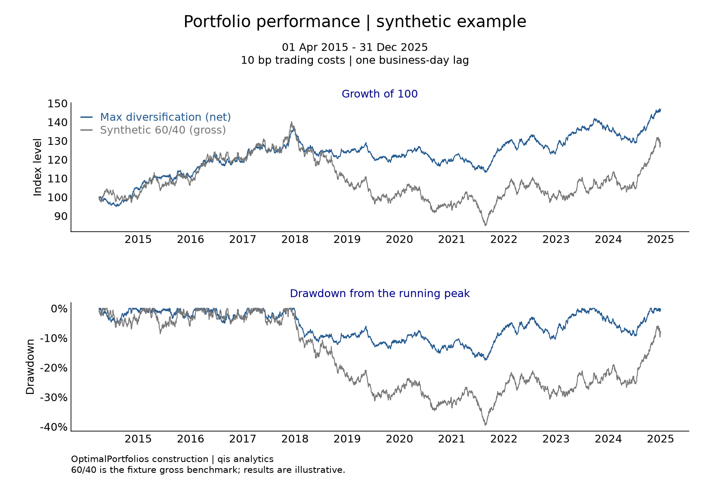
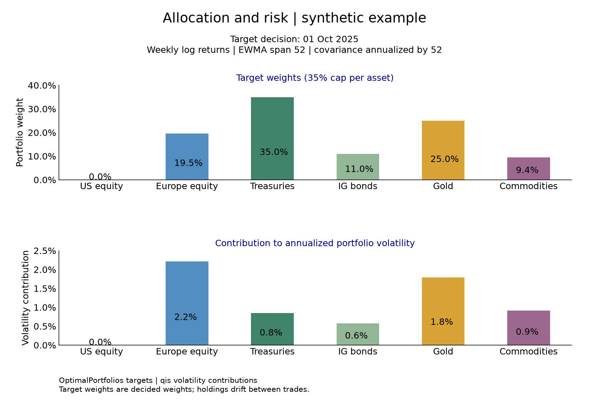
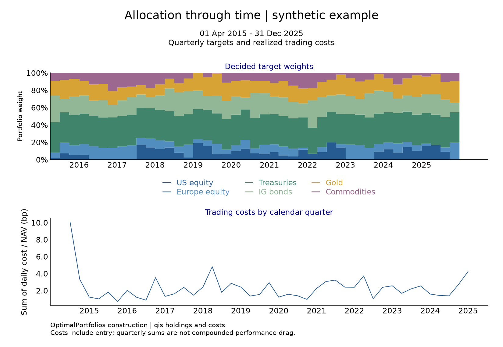
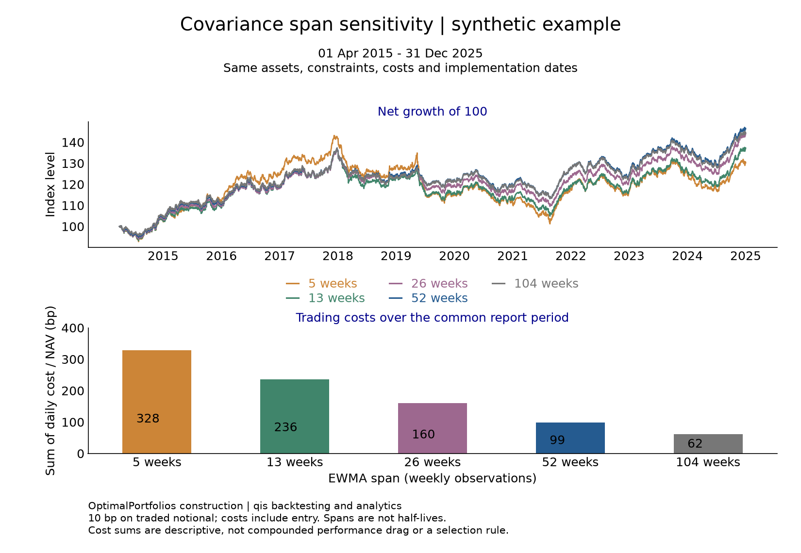
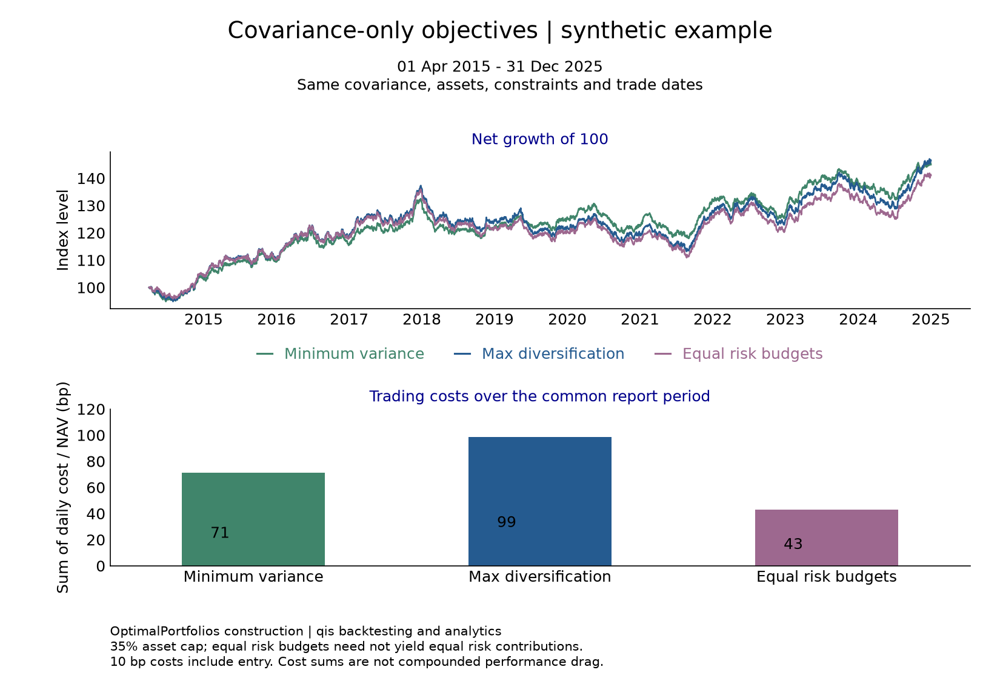
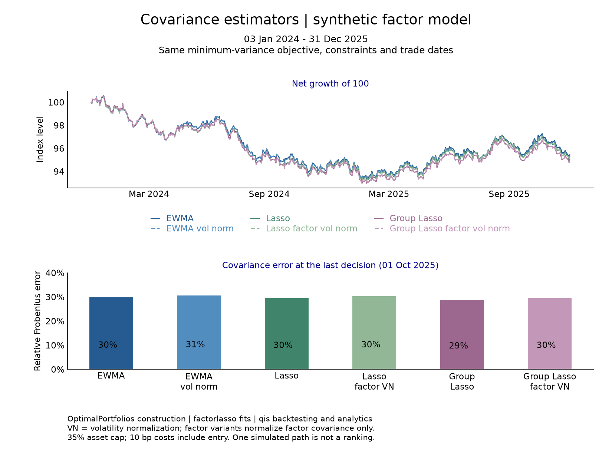

# `optimalportfolios` — production portfolio construction and rolling backtesting

**Production multi-asset portfolio construction and rolling backtesting in Python — from
point-in-time covariance and alpha estimation through constrained optimisation, rebalancing,
transaction costs, and reporting.**

[](https://pypi.org/project/optimalportfolios/)
[](https://pypi.org/project/optimalportfolios/)
[](LICENSE.txt)
[](https://github.com/ArturSepp/OptimalPortfolios/actions)
[](https://optimalportfolios.readthedocs.io/en/latest/)
[](https://colab.research.google.com/github/ArturSepp/OptimalPortfolios/blob/main/examples/getting_started/production_quickstart.ipynb)
[](https://pepy.tech/project/optimalportfolios)
[](https://pepy.tech/project/optimalportfolios)

**Papers:** Sepp, A. (2023), *Optimal Allocation to Cryptocurrencies in Diversified Portfolios*, Risk Magazine — [SSRN 4217841](https://ssrn.com/abstract=4217841) · Sepp, A., Ossa, I. and Kastenholz, M. (2026), *Robust Optimization of Strategic and Tactical Asset Allocation for Multi-Asset Portfolios*, [The Journal of Portfolio Management, 52(4), 86–120](https://www.pm-research.com/content/iijpormgmt/52/4/86) · Sepp, A., Hansen, E. and Kastenholz, M. (2026), *Capital Market Assumptions and Strategic Asset Allocation Using Multi-Asset Tradable Factors* — [SSRN 6785958](https://papers.ssrn.com/sol3/papers.cfm?abstract_id=6785958). See [References](#references).

---

## Why optimalportfolios

Most Python portfolio optimisation packages (PyPortfolioOpt, Riskfolio-Lib, skfolio)
solve single-period allocation problems: given a covariance matrix and expected
returns, find the optimal weights. This is useful for textbook exercises but
insufficient for running a real multi-asset portfolio.

**optimalportfolios solves the production problem end-to-end:**
estimate covariance → compute alpha signals → optimise with constraints →
rebalance on schedule → backtest with transaction costs — all in a single
roll-forward pipeline that handles incomplete data, mixed-frequency assets,
and illiquid positions.

### Key differentiators

**Production multi-asset portfolio construction.**
The package implements the full pipeline from the ROSAA framework: factor model
covariance estimation (via [`factorlasso`](https://github.com/ArturSepp/factorlasso))
→ risk-budgeted SAA → alpha signal computation →
TE-constrained TAA → rolling backtest. No other open-source package handles
universes where equities rebalance monthly, alternatives rebalance quarterly,
and private equity enters the allocation set only when sufficient return history
is available. The constraint system (weight bounds, group allocation limits,
tracking error budgets, turnover controls, rebalancing indicators for frozen
positions) matches what real institutional PM teams need.

**HCGL factor covariance estimation.**
The Hierarchical Clustering Group LASSO factor model (published in JPM, 2026)
produces sparse, structured covariance matrices for heterogeneous multi-asset
universes. The LASSO/Group LASSO/HCGL solver is implemented in the standalone
[`factorlasso`](https://github.com/ArturSepp/factorlasso) package — a
general-purpose sparse factor model estimator with sign constraints,
prior-centered regularisation, and scikit-learn compatible API.
`optimalportfolios` builds on top of `factorlasso` with finance-specific
functionality: `FactorCovarEstimator` handles multi-frequency asset returns,
rolling estimation schedules, factor covariance assembly
(Σ_y = β Σ_x β' + D), and integration with `qis` for performance attribution.
The separation means the LASSO solver can be used independently for any
multi-output regression problem (genomics, macro-econometrics), while the
portfolio-specific rolling pipeline stays in `optimalportfolios`.

**Cluster-aware risk allocation.**
Statistical clusters can be used after covariance estimation as an allocation
structure rather than only as a modelling diagnostic. `compute_group_risk_budgets()`
maps point-in-time clusters, sectors, or asset classes into asset-level risk
budgets; `rolling_risk_budgeting()` accepts either one static budget Series or a
date-by-asset budget panel; and `compute_hierarchical_risk_parity_weights()`
implements canonical HRP from an externally supplied linkage. Cluster formation,
distance transforms, De-PC1 diagnostics, and linkage estimation remain in
[`factorlasso`](https://github.com/ArturSepp/factorlasso); OptimalPortfolios owns
the conversion from that structure into portfolio weights and risk attribution.

**Drift-aware rolling backtests (new in v5.3.1).**
Turnover constraints and transaction-cost penalties act on the realised
current holdings, not the previous target. This eliminates the "phantom
turnover budget" issue where the optimiser thinks it's trading X but the
NAV simulator actually trades X·(1 + drift fraction). Controlled by
`OptimiserConfig.use_drifted_weights_0` (default `True`); set to `False`
to reproduce pre-v5.3.1 behaviour for legacy comparisons.

**NaN-aware rolling backtesting.**
The three-layer architecture (solver / wrapper / rolling) automatically handles
real-world data: assets with missing prices receive zero weight, assets entering
the universe mid-sample are included when sufficient history is available, and
the rebalancing indicator system freezes illiquid positions at their current
weight while re-optimising the liquid portion. When the freeze produces
group-constraint overshoots due to drift, the constraint is relaxed for that
rebalance with a logged warning rather than aborting. No data cleaning or
pre-filtering required.

**Research-backed methodology.**
The package is the reference implementation for the ROSAA framework published in
*The Journal of Portfolio Management* (Sepp, Ossa, Kastenholz, 2026). The
optimisation solvers, covariance estimators, and alpha signals are battle-tested
on live multi-asset portfolios.

### Quick-start: offline rolling backtest

The [production quickstart](examples/getting_started/production_quickstart.py) is the authoritative
source for the first-use workflow. It runs entirely offline on the multi-asset fixture shipped in
the wheel and writes no files:

```bash
pip install optimalportfolios
python examples/getting_started/production_quickstart.py
```

For a zero-setup trial, [open the mechanically checked mirror in
Colab](https://colab.research.google.com/github/ArturSepp/OptimalPortfolios/blob/main/examples/getting_started/production_quickstart.ipynb).
The notebook installs the latest PyPI release, prints its version, and adds no notebook dependency
to the package.

The script uses a documented six-asset slice, a point-in-time 24-month EWMA covariance estimator,
quarterly constrained minimum-variance weights, a one-month implementation lag, and 10 basis
points of transaction costs. It prints the data range, rolling-weight dimensions, final weights,
final NAV, and measured runtime. The
[rendered quickstart documentation](https://optimalportfolios.readthedocs.io/en/latest/quickstart.html)
includes this same file directly, so the example and documentation cannot drift.

#### A minimal executable example

The script above remains the authoritative first-use workflow. The shorter version below exists so
that the README's own code is executed rather than trusted:

```python
import qis
from optimalportfolios import (
    Constraints,
    EwmaCovarEstimator,
    PortfolioObjective,
    compute_rolling_optimal_weights,
)
from optimalportfolios.tests.data.multiasset import load_multiasset_data

prices = load_multiasset_data().prices.iloc[-120:, :4]
time_period = qis.TimePeriod(prices.index[0], prices.index[-1])

# estimate covariance → optimise → get rolling weights
estimator = EwmaCovarEstimator(returns_freq='ME', span=24, rebalancing_freq='QE')
covar_dict = estimator.fit_rolling_covars(prices=prices, time_period=time_period)
weights = compute_rolling_optimal_weights(prices=prices,
                                          portfolio_objective=PortfolioObjective.MAX_DIVERSIFICATION,
                                          constraints=Constraints(is_long_only=True),
                                          time_period=time_period,
                                          covar_dict=covar_dict)

# backtest with transaction costs
portfolio = qis.backtest_model_portfolio(prices=prices.loc[weights.index[0]:], weights=weights,
                                         rebalancing_costs=0.001, ticker='MaxDiv')

print(f"assets: {list(weights.columns)}")
print(f"rebalance dates: {len(weights.index)}")
print(f"long only: {bool((weights >= -1e-6).all().all())}")
print(f"fully invested: {bool(weights.sum(axis=1).round(6).eq(1.0).all())}")
print(f"nav name: {portfolio.nav.name}")
```

```result
assets: ['Global Bonds', 'Global IG Bonds', 'US Treasuries', 'US TIPs']
rebalance dates: 39
long only: True
fully invested: True
nav name: MaxDiv
```

`readme_test.py` executes the block above and diffs its output against that
`result` fence, so this example cannot drift from what the package actually
does. Structural facts are asserted rather than weights: a solver-version change
may move an allocation by 1e-9, but it must not change the rebalance schedule,
break long-only, or stop the book being fully invested.

The committed multi-asset fixture keeps this example offline. The same pipeline
supports price panels with NaNs and different start dates, while preserving
roll-forward estimation (no hindsight bias) and drift-aware turnover accounting.

### Design scope

The optimisation solvers use quadratic and conic objective functions (variance,
tracking error, Sharpe ratio, diversification ratio, CARA utility). The package
does not implement non-quadratic risk measures (CVaR, MAD, drawdown constraints).
For these, use Riskfolio-Lib or skfolio. The solver architecture (three-layer:
mathematical / wrapper / rolling) makes it straightforward to add new solvers —
each solver lives in its own module in `optimization/general`,
`optimization/risk_allocation`, `optimization/saa`, or `optimization/taa` and
plugs into the rolling backtester via a single dispatch function.

## Package overview

```
src/optimalportfolios/
├── config.py                      # PortfolioObjective enum
├── alphas/                        # Alpha signal computation
│   ├── signals/                   # risk-adjusted/classic momentum, carry, low_beta,
│   │                              #   residual momentum/reversal, managers_alpha, rolling_ewma_mean
│   ├── profile/                   # Signal profiling
│   ├── alpha_data.py              # AlphasData container
│   ├── backtest_alphas.py         # Signal backtesting tool
│   └── signal_diagnostics.py      # Signal IC-IR and risk-contribution diagnostics
├── covar_estimation/              # Covariance matrix estimation
│   ├── covar_estimator.py         # CovarEstimator ABC
│   ├── ewma_covar_estimator.py    # EwmaCovarEstimator
│   ├── factor_covar_estimator.py  # FactorCovarEstimator (uses factorlasso)
│   ├── risk_model_adapter.py      # Canonical qis.RiskModel adapter
│   ├── risk_labelling.py          # Cluster and factor risk labelling
│   └── covar_reporting.py         # Rolling covariance diagnostics
├── optimization/                  # Portfolio optimisation
│   ├── constraints.py             # Constraints, GroupLowerUpperConstraints
│   ├── config.py                  # OptimiserConfig (incl. use_drifted_weights_0)
│   ├── covar_factorization.py     # Stabilised covariance and square-root factor
│   ├── solver_diagnostics.py      # Input contracts, outcomes, residuals and run summaries
│   ├── portfolio_result.py        # PortfolioOptimisationResult
│   ├── wrapper_rolling_portfolios.py  # compute_rolling_optimal_weights()
│   ├── general/                   # Objective-driven solvers
│   │   ├── quadratic.py           # min variance, max quadratic utility
│   │   ├── minimum_tracking_error.py  # closest feasible portfolio to benchmark
│   │   ├── max_sharpe.py          # maximum Sharpe ratio
│   │   ├── max_diversification.py # maximum diversification ratio
│   │   └── carra_mixture.py       # CARA utility under Gaussian mixture
│   ├── risk_allocation/           # Risk-based portfolio construction
│   │   ├── risk_budgeting.py      # constrained and rolling risk budgeting
│   │   ├── risk_budgeting_solver.py  # internal CCD/ADMM solver
│   │   ├── group_risk_budgeting.py   # group-to-asset risk budgets
│   │   └── hierarchical_risk_parity.py  # external-linkage HRP
│   ├── saa/                       # Strategic solvers with return/vol targets
│   │   ├── min_variance_target_return.py
│   │   └── max_return_target_vol.py
│   └── taa/                       # Tactical solvers with alpha and TE constraints
│       ├── maximise_alpha_over_tre.py
│       └── maximise_alpha_with_target_yield.py
├── universe/                      # Validated universe data containers and transforms
│   ├── universe_data.py           # UniverseData: prices, metadata and group loadings
│   └── universe_transforms.py     # e.g. copy with unsmoothed prices
├── utils/                         # Auxiliary analytics
│   ├── filter_nans.py             # NaN-aware covariance/vector filtering
│   ├── portfolio_funcs.py         # Risk contributions, diversification ratio
│   ├── weights_drift.py           # apply_drift_to_weights_0
│   └── gaussian_mixture.py        # Gaussian mixture fitting (numpy/scipy EM)
└── reports/                       # Performance reporting
    ├── marginal_backtest.py       # Marginal asset contribution analysis
    ├── portfolio_result_plots.py  # Optimisation result plots
    └── portfolio_result_pybloqs.py  # Optional HTML/PDF result reports
examples/                          # Repository-only worked examples
├── data/                          # Shared universe fixtures
├── solvers/                       # One demo per single-objective solver
├── backtests/                     # End-to-end rolling workflows
├── comparisons/                   # A-vs-B sweeps (incl. drift_policy)
├── covar_estimation/              # Covariance estimator demos
└── alphas/                        # Alpha signal profiling demos
# factorlasso (pip install factorlasso)
#   └── LassoModel, solve_lasso_cvx_problem, solve_group_lasso_cvx_problem
#       Sign-constrained LASSO/Group LASSO/HCGL solver (domain-agnostic)
#       https://github.com/ArturSepp/factorlasso
```

### Analytics at a glance

| Area | Current user-facing analytics |
| --- | --- |
| Alpha construction | Momentum, low beta, risk-adjusted carry, managers alpha, residual momentum, residual reversal and rolling EWMA means; fixed-group and time-varying cluster scoring are supported. |
| Alpha evaluation | Rank-portfolio profiling, cross-backtests, `AlphasData`, IC/IR panels, component diagnostics and comparison tables. |
| Covariance and dependence | Current/rolling EWMA and HCGL sparse factor covariance; Pearson, Spearman and Gerber dependence choices, configurable correlation-distance transforms through `factorlasso`, and current/rolling covariance diagnostic reports. |
| Risk-cluster analytics | Persistent cluster lineage, births/deaths/splits/merges and report tables/figures through `analyze_risk_clusters()` and `run_risk_label_report()`. |
| General optimisation | Minimum variance, quadratic utility, maximum Sharpe, maximum diversification, CARA Gaussian-mixture utility and minimum tracking error. |
| Risk allocation | Constrained risk budgeting, point-in-time group risk budgets, date-varying rolling budgets, group Euler-risk attribution and external-linkage hierarchical risk parity. |
| SAA and TAA optimisation | Minimum variance at target return, maximum return at target volatility, alpha over tracking error and alpha at target portfolio return. |
| Constraints and implementation | Instrument/group bounds, exposure, turnover, tracking error, target return/volatility, benchmark-relative sector/style/beta limits, frozen holdings and current-to-model eligibility corridors. |
| Solver controls and diagnostics | One covariance factorization per compatible CVXPY solve, input-contract validation, structured `OptimizationOutcome`/`ConstraintResidual` output, infeasibility diagnosis and run-level warning summaries. |
| Portfolio and risk results | `PortfolioOptimisationResult` provides weights/trades, volatility, turnover, tracking error, factor/residual risk, group attribution, factor exposures, efficient-frontier data and report tables using `qis.RiskModel`. |
| Universe, backtest and reporting | Validated `UniverseData`, metadata/group-loadings persistence and transforms, drift-aware rolling weights, transaction-cost backtests through `qis`, efficient-frontier plots, marginal portfolio backtests and optional PyBloqs HTML/PDF reports. |

This table groups the analytics by workflow. The exact package-root import inventory and callable
signatures are maintained in the [API reference](docs/api.rst).

**Architecture: factorlasso vs optimalportfolios**

[`factorlasso`](https://github.com/ArturSepp/factorlasso) is the **domain-agnostic
LASSO solver** — it estimates sparse factor loadings β in Y_t = α + β X_t + ε_t with sign
constraints, prior-centered regularisation, and HCGL clustering. It provides
`LassoModel` (scikit-learn compatible estimator), `CurrentFactorCovarData`
(single-date covariance decomposition Σ_y = β Σ_x β' + D), and
`RollingFactorCovarData` (time-indexed collection). It knows nothing about
finance, asset returns, frequencies, or rebalancing schedules.

`optimalportfolios` adds two finance-specific covariance-integration layers on top:

**`estimate_lasso_factor_covar_data()`** — the core estimation function in
`covar_estimation/factor_covar_estimator.py`. It handles everything between
raw market data and the `factorlasso` solver:

* Computes factor returns from prices at the specified frequency
* Estimates annualised factor covariance Σ_x via EWMA
* Calls `factorlasso.LassoModel.fit()` separately per frequency for
  mixed-frequency universes (e.g., monthly equities + quarterly alternatives)
* Annualises residual variances, R², and alphas across frequencies
* Merges multi-frequency betas into a single (N × M) loading matrix
* Returns a `factorlasso.CurrentFactorCovarData` with the full decomposition

**`FactorCovarEstimator`** — a `CovarEstimator` subclass that wraps
`estimate_lasso_factor_covar_data()` in a rolling estimation schedule using
`qis.TimePeriod` and `qis.generate_dates_schedule`. It provides two APIs:

* `fit_rolling_covars()` → `Dict[Timestamp, DataFrame]` (plain covariance
  matrices, plug into any solver)
* `fit_rolling_factor_covars()` → `RollingFactorCovarData` (full
  decomposition with betas, R², clusters, residuals over time)

## Cluster-aware risk allocation

The `optimization.risk_allocation` submodule separates three concepts that are
often mixed together:

1. **Cluster estimation** belongs to `factorlasso` and produces a flat partition
   and hierarchical linkage.
2. **Risk-budget design** converts a partition into asset-level target risk shares.
3. **Portfolio allocation** converts risk budgets or a linkage into capital weights.

This boundary means the same allocation functions work with statistical clusters,
BICS/GICS sectors, asset classes, or any other labelled partition.

### Group risk budgets

For group `g` containing `n_g` classified assets, `compute_group_risk_budgets()`
uses

`B_g = n_g**alpha / sum_h(n_h**alpha)` and `b_i = B_g / n_g`.

The useful settings are:

| `group_size_exponent` | Aggregate group budget | Interpretation |
| ---: | --- | --- |
| `0.0` | Equal across available groups | Equal-cluster risk budgeting |
| `0.5` | Proportional to square-root group size | Intermediate shrinkage |
| `1.0` | Proportional to group size | Equal risk budget per classified asset |

Unclassified assets receive zero budget. A membership DataFrame is evaluated
independently by row, so only the point-in-time partition enters each rebalance.

```python +SKIP
import optimalportfolios as op

# rows are rebalance dates; columns are assets; values are group labels
risk_budget_panel = op.compute_group_risk_budgets(
    groups=cluster_membership_panel,
    group_size_exponent=0.0,
)
weights = op.rolling_risk_budgeting(
    prices=prices,
    constraints=constraints,
    risk_budget=risk_budget_panel,
    covar_dict=covar_dict,
)

# The same diagnostic also works for sectors or asset classes.
group_risk = op.compute_group_risk_contributions(
    weights=weights.loc[rebalance_date],
    covar=covar_dict[rebalance_date],
    groups=cluster_membership_panel.loc[rebalance_date],
)
```

### Hierarchical risk parity

`compute_hierarchical_risk_parity_weights()` takes a labelled covariance matrix
and a SciPy-compatible linkage. It quasi-diagonalises the covariance using the
linkage leaf order and applies inverse-variance recursive bisection. It does not
estimate a tree, silently choose a distance transform, or impose additional
portfolio constraints.

```python +SKIP
import factorlasso as fl
import optimalportfolios as op

clusters, linkage, cutoff = fl.compute_clusters_from_corr_matrix(corr)
hrp_weights = op.compute_hierarchical_risk_parity_weights(
    covar=covar,
    linkage=linkage,
)
```

This makes linkage sensitivity explicit: Ward, single, complete, average, and
other supported linkage choices are configured in FactorLasso, while the HRP
capital-allocation rule in OptimalPortfolios remains unchanged.

## Alpha signals module

Introduced in v4.1.1 and expanded through the 6.x releases, the `alphas` module
provides standalone signal constructors with a consistent interface. The current
set covers risk-adjusted and classic momentum, low beta, carry, managers alpha,
residual momentum and residual reversal, plus rolling EWMA expected returns. Signal constructors handle
single- and mixed-frequency universes, support fixed-group or time-varying-cluster
cross-sectional scoring, and normally return both a dimensionless score and the
raw signal for diagnostics.

### Naming convention

| Stage | What it is | Example |
| --- | --- | --- |
| **Raw signal** | Observable quantity with units | Cumulative return, EWMA beta, regression residual |
| **Score** | Cross-sectional z-score, dimensionless | Momentum rank, negated beta rank |
| **Alpha** | Portfolio-ready signal after CDF mapping | Combined score mapped to [-1, 1] |

Pipeline: **raw signal → score → alpha**.

### Available signals

**Risk-adjusted Momentum** (`compute_momentum_alpha`) — EWMA-filtered risk-adjusted excess returns relative to a benchmark, converted to cross-sectional scores.

```python +SKIP
from optimalportfolios.alphas import compute_momentum_alpha

score, raw_momentum = compute_momentum_alpha(
    prices=prices, benchmark_price=benchmark, returns_freq='ME',
    group_data=asset_class_groups, long_span=12)
```

**Classic Momentum** (`compute_classic_momentum_alpha`) — a fixed-window sum of log returns
after a hard skip, with no benchmark subtraction, volatility scaling, mean adjustment, or EWMA
filtering. The defaults implement monthly 12m-ex-1m momentum.

```python
from optimalportfolios.alphas import compute_classic_momentum_alpha

score, raw_momentum = compute_classic_momentum_alpha(
    prices=prices, returns_freq='ME', lookback_periods=12, skip_periods=1)
```

**Low Beta** (`compute_low_beta_alpha`) — EWMA regression beta to benchmark, negated and cross-sectionally scored ("betting against beta").

```python +SKIP
from optimalportfolios.alphas import compute_low_beta_alpha

score, raw_beta = compute_low_beta_alpha(
    prices=prices, benchmark_price=benchmark, returns_freq='ME',
    group_data=asset_class_groups, beta_span=12)
```

**Managers Alpha** (`compute_managers_alpha`) — factor model regression residuals using pre-estimated betas from `FactorCovarEstimator`, EWMA-smoothed and cross-sectionally scored.

```python +SKIP
from optimalportfolios.alphas import compute_managers_alpha

score, raw_alpha = compute_managers_alpha(
    prices=asset_prices, risk_factor_prices=factor_prices,
    estimated_betas=rolling_data.get_y_betas(),
    returns_freq='ME', alpha_span=12)
```

**Risk-adjusted Carry** (`optimalportfolios.alphas.signals.compute_ra_carry_alpha`) — instrument
yield divided by trailing EWMA volatility, then cross-sectionally scored. The root-level,
backward-compatible `compute_ra_carry_alphas` entry point returns the global score only.

**Residual Momentum** (`compute_residual_momentum_alpha`) — EWMA momentum applied to returns after
removing lagged benchmark-beta exposure.

**Residual Reversal** (`compute_residual_reversal_alpha`) — the negated short-horizon residual
signal, so recent benchmark-adjusted losers receive positive scores.

**Rolling EWMA Means** (`estimate_rolling_ewma_means`) — point-in-time expected-return panels for
mean-dependent rolling optimisers.

Risk-adjusted momentum, classic momentum, low-beta, carry, residual-momentum and
residual-reversal constructors also provide
`*_cluster_alpha` variants that score within time-varying statistical clusters rather than fixed
groups. `align_rolling_clusters()` removes arbitrary cluster-label renumbering through time.

### Mixed-frequency support

All signal functions accept `returns_freq` as a string (uniform) or a `pd.Series` (per-asset frequency). When mixed, the function groups by frequency, computes per group, and merges.

```python +SKIP
# equities monthly, alternatives quarterly
returns_freq = pd.Series({'SPY': 'ME', 'EZU': 'ME', 'HF_Macro': 'QE', 'PE': 'QE'})
long_span = {'ME': 12, 'QE': 4}  # one calendar year at both cadences
score, raw = compute_momentum_alpha(
    prices=prices, returns_freq=returns_freq, long_span=long_span)
```

Signal spans accept either one integer for every cadence or a mapping keyed by cadence. A missing
mapping key raises instead of silently applying another frequency's horizon.

### AlphasData container

`AlphasData` holds the combined alpha scores and all intermediate components:

```python +SKIP
from optimalportfolios.alphas import AlphasData

data = AlphasData(alpha_scores=combined, momentum_score=mom, beta_score=beta)
snapshot = data.get_alphas_snapshot(date=pd.Timestamp('2024-12-31'))
```

The same layer includes rank-portfolio profiling (`profile_*`, `backtest_alpha_rank_portfolio`,
`generate_alpha_profile_report`), standalone signal backtests, and IC/IR and risk-contribution
diagnostics (`signal_diagnostics_panel`, `run_signal_diagnostics_per_component`,
`compare_signal_diagnostics`).

See the [alphas module README](src/optimalportfolios/docs/alphas_module_readme.md) for full documentation.

# Table of contents

1. [Why optimalportfolios](#why-optimalportfolios)
2. [Package overview](#package-overview)
3. [Cluster-aware risk allocation](#cluster-aware-risk-allocation)
4. [Alpha signals module](#alpha-signals-module)
5. [Installation](#installation)
6. [Portfolio Optimisers](#portfolio-optimisers)
   1. [Implementation structure](#1-implementation-structure)
   2. [Example of implementation for Maximum Diversification Solver](#2-example-of-implementation-for-maximum-diversification-solver)
   3. [Constraints](#3-constraints)
   4. [Wrapper for implemented rolling portfolios](#4-wrapper-for-implemented-rolling-portfolios)
   5. [Adding an optimiser](#5-adding-an-optimiser)
   6. [Default parameters](#6-default-parameters)
   7. [Price time series data](#7-price-time-series-data)
   8. [Drift-aware rolling backtests (v5.3.1)](#8-drift-aware-rolling-backtests-v531)
7. [Examples](#examples)
8. [Updates](#updates)
9. [Disclaimer](#disclaimer)

## Installation

Install from PyPI:

```
pip install optimalportfolios
```

After installing `pytest`, verify the installed wheel with `python -m pytest --pyargs optimalportfolios`.

Upgrade with:

```
pip install --upgrade optimalportfolios
```

Clone the repository with:

```
git clone https://github.com/ArturSepp/OptimalPortfolios.git
```

The core package supports Python >=3.10. Its current dependency floors are NumPy >=2.0,
SciPy >=1.12, pandas >=2.2, Matplotlib >=3.8, seaborn >=0.13, openpyxl >=3.1,
PyYAML >=6.0, CVXPY >=1.3, quadprog >=0.1.11, `qis` >=5.7 and
`factorlasso` >=0.14.0. `pyproject.toml` is the source of truth.

Optional extras keep network-data and reporting integrations out of the core
installation. The default risk-lineage matcher is implemented with core NumPy/SciPy code.

| Extra | Adds |
| --- | --- |
| `data` | `yfinance` for free-data example loaders. |
| `reports` | `pybloqs` for HTML/PDF report backends. |
| `docs` | Sphinx, Furo and MyST for documentation builds. |
| `dev` | Pytest and pytest-cov — the test suite and nothing else. |
| `all` | All runtime integrations: `data` and `reports`. |

The runtime integration extras, `data` and `reports`, correspond to features that import their
dependencies. There is no `jupyter` extra: the package imports none of the Jupyter stack, and the
repository-only Colab quickstart uses Google's hosted runtime. Install notebook tooling separately
for local notebooks. The `dev` and `docs` extras remain contributor toolchains.

`dev` is deliberately minimal: the suite collects the same 1336 tests with or without the
optional extras, so nothing else belongs in it. The lint tools are not an extra at all — they
live in the `lint` dependency-group, which never ships to a user. To run the repository-root
`examples/`, which do use `yfinance`, install `[dev,data]` or `[all]`.

For example:

```
pip install optimalportfolios
pip install "optimalportfolios[all]"
```

## Portfolio optimisers

### 1. Implementation structure

The implementation of each solver is split into 3 layers:

1. **Mathematical layer** which takes clean inputs, formulates the optimisation
   problem and solves it using Scipy or CVXPY solvers.
   The logic of this layer is to solve the problem algorithmically by taking clean inputs.
2. **Wrapper layer** which takes inputs potentially containing NaNs,
   filters them out, and calls the solver in layer 1). The output weights of filtered out
   assets are set to zero. Includes rebalancing indicator support for freezing
   specific assets at their previous weights, and (as of v5.3.1) automatic
   relaxation of group bounds when frozen-position drift causes overshoot.
3. **Rolling layer** which takes price time series as inputs and implements
   the estimation of covariance matrix and other inputs on a roll-forward basis.
   For each update date the rolling layer calls the wrapper layer 2) with estimated
   inputs as of the update date. As of v5.3.1, the rolling layer also drifts
   `weights_0` between rebalances using realised price returns, so that turnover
   constraints and transaction-cost penalties measure actual trades rather than
   notional trades against a stale baseline.

For rolling level function, the estimated covariance matrix can be passed as `Dict[pd.Timestamp, pd.DataFrame]`
with DataFrames containing covariance matrices for the universe and with keys being rebalancing times.

Covariance can be estimated using `EwmaCovarEstimator` (simple EWMA) or
`FactorCovarEstimator` (HCGL factor model using
[`factorlasso.LassoModel`](https://github.com/ArturSepp/factorlasso) for sparse
beta estimation, with finance-specific annualisation, multi-frequency returns,
and rolling schedule management).

**Important design principle (v4.1.1):** covariance estimation is separated from
portfolio optimisation. The recommended workflow is to estimate covariance
matrices first, then pass them as `covar_dict` to any solver:

```python +SKIP
from optimalportfolios import (
    EwmaCovarEstimator,
    FactorCovarEstimator,
    rolling_maximise_alpha_over_tre,
    rolling_maximise_diversification,
    rolling_risk_budgeting,
)

# estimate once
estimator = EwmaCovarEstimator(returns_freq='W-WED', span=52, rebalancing_freq='QE')
covar_dict = estimator.fit_rolling_covars(prices=prices, time_period=time_period)

# reuse across multiple solvers
weights_rb = rolling_risk_budgeting(
    prices=prices, constraints=constraints, risk_budget=risk_budget, covar_dict=covar_dict)
weights_md = rolling_maximise_diversification(
    prices=prices, constraints=constraints, covar_dict=covar_dict)
weights_te = rolling_maximise_alpha_over_tre(
    prices=prices, alphas=alphas, constraints=taa_constraints,
    benchmark_weights=benchmark_weights, covar_dict=covar_dict)
```

This separation provides three benefits: (1) the same covariance matrices can be
reused across multiple solvers without re-estimation, (2) covariance diagnostics
and reporting can be inspected independently of the optimiser, and (3) different
covariance estimators can be swapped in without modifying the solver code.
For the HCGL factor model, use `FactorCovarEstimator` with `asset_returns_dict`
for mixed-frequency universes (e.g., monthly equities + quarterly alternatives).

The recommended usage is as follows.

Layer 2) is used for live portfolios or for backtests which are implemented using
data augmentation.

Layer 3) is applied for roll forward backtests where all available data is processed
using roll forward analysis.

### 2. Example of implementation for Maximum Diversification Solver

Using `optimization/general/max_diversification.py` as an example:

1. Scipy solver `opt_maximise_diversification()` which takes "clean" inputs of the
   covariance matrix of type `np.ndarray` without NaNs and
   `Constraints` dataclass which implements constraints for the solver.

The lowest level of each optimisation method is `opt_...` or `cvx_...` function taking clean inputs and producing the optimal weights.

The logic of this layer is to implement the numerical optimiser with its supported CVXPY or
SciPy backend.

2. Wrapper function `wrapper_maximise_diversification()` which takes inputs
   covariance matrix of type `pd.DataFrame`
   potentially containing NaNs or assets with zero variance (when their time series are missing in the
   estimation period) and filters out non-NaN "clean" inputs and
   updates constraints for OPT/CVX solver in layer 1.

The intermediary level of each optimisation method is `wrapper_...` function taking
"dirty" inputs, filtering inputs, and producing the optimal weights. This wrapper can be called either
by rolling backtest simulations or by live portfolios for rebalancing.

The logic of this layer is to filter out data and to be an interface for portfolio implementations.

3. Rolling optimiser function `rolling_maximise_diversification()` takes the time series of data
   and slices these accordingly and at each rebalancing step calls the wrapper in layer 2.
   In the end, the function outputs the time series of optimal weights of assets in the universe.
   Price data of assets may have gaps and NaNs which is taken care of in the wrapper level.

The backtesting of each optimisation method is implemented with `rolling_...` method which produces the time series of
optimal portfolio weights.

The logic of this layer is to facilitate the backtest of portfolio optimisation method and to produce
time series of portfolio weights using a Markovian setup. These weights are applied for the backtest
of the optimal portfolio and the underlying strategy.

Solver modules live in `optimization/general`, `optimization/risk_allocation`,
`optimization/saa` or `optimization/taa`, according to whether their inputs are objective-driven,
risk-allocation structures, strategic return/risk targets or tactical alpha and benchmark inputs.

### 3. Constraints

Dataclass `Constraints` in `optimization.constraints` implements
optimisation constraints in solver-independent way.

The following inputs for various constraints are implemented.

```python +SKIP
@dataclass(frozen=True)
class Constraints:
    is_long_only: bool = True
    min_weights: pd.Series = None
    max_weights: pd.Series = None
    max_exposure: float = 1.0
    min_exposure: float = 1.0
    benchmark_weights: pd.Series = None
    tracking_err_vol_constraint: float = None
    weights_0: Optional[pd.Series] = None
    turnover_constraint: Optional[float] = None
    turnover_costs: pd.Series = None
    target_return: float = None
    asset_returns: pd.Series = None
    max_target_portfolio_vol_an: float = None
    constraint_enforcement_type: ConstraintEnforcementType = (
        ConstraintEnforcementType.FORCED_CONSTRAINTS
    )
    tre_utility_weight: Optional[float] = 1.0
    turnover_utility_weight: Optional[float] = 0.40
    group_lower_upper_constraints: Optional[GroupLowerUpperConstraints] = None
    group_tracking_error_constraint: Optional[GroupTrackingErrorConstraint] = None
    group_turnover_constraint: Optional[GroupTurnoverConstraint] = None
    # Sector: |L_g.T @ (w - b)| <= d_g; L is normally binary membership.
    sector_deviation_constraints: Optional[BenchmarkDeviationConstraints] = None
    # Style: |L_g.T @ (w - b)| <= d_g; L is normally a continuous exposure.
    style_deviation_constraints: Optional[BenchmarkDeviationConstraints] = None
    benchmark_beta_constraint: Optional[BenchmarkBetaConstraint] = None
```

Both deviation fields use `BenchmarkDeviationConstraints`. For every loading column `g`, they
enforce `|L_g.T @ (w - b)| <= d_g`, where `w - b` is the active portfolio. Sector loadings are
normally binary membership indicators, so `d_g` is an active portfolio-weight limit for a sector.
Style loadings are normally continuous factor exposures, so the units of `d_g` follow the scaling
of the supplied style scores. Sector and style constraints can be applied simultaneously.

Dataclass `GroupLowerUpperConstraints` implements asset class loading and min and max allocations

```python +SKIP
@dataclass
class GroupLowerUpperConstraints:
    """
    add constraints that each asset group is group_min_allocation <= sum group weights <= group_max_allocation
    """
    group_loadings: pd.DataFrame  # columns=instruments, index=groups, data=1 if instrument in indexed group else 0
    group_min_allocation: pd.Series  # index=groups, data=group min allocation
    group_max_allocation: pd.Series  # index=groups, data=group max allocation
```

Constraints are updated on the wrapper level to include the valid tickers

```python +SKIP
aligned_constraints = constraints.update_with_valid_tickers(valid_tickers=valid_tickers)
```

On the solver layer, the constants for the solvers are requested as follows.

For SciPy: `set_scipy_constraints(self, covar: np.ndarray) -> Tuple[List, np.ndarray]`

For CVXPY: `set_cvx_all_constraints(self, w: cvx.Variable, covar=...) -> List`

**Frozen-position relaxation (new in v5.3.1).** When `rebalancing_indicators`
freeze illiquid positions for a given rebalance date, `update_with_valid_tickers`
pins their `min_weights` and `max_weights` to the current (drifted) `weights_0`.
If the resulting group-loading sum exceeds `group_max_allocation` (or falls below
`group_min_allocation`), the group bound is automatically relaxed for that
rebalance and a `UserWarning` is emitted. This prevents `ValueError: Infeasible
constraints detected` errors that would otherwise occur when illiquid sleeves
drift over their group cap between low-frequency rebalances. The relaxation is
audit-trailable: each event surfaces in logs with the group name, the original
bound, and the relaxed bound.

### 4. Wrapper for implemented rolling portfolios

Module `optimization/wrapper_rolling_portfolios.py` dispatches the objectives enumerated in
`config.py`:

Using the wrapper function allows for cross-sectional analysis of different
backtest methods and for sensitivity analysis to parameters of
estimation and solver methods.

| `PortfolioObjective` | Dispatcher route | Objective/backend |
| --- | --- | --- |
| `MAX_DIVERSIFICATION` | `rolling_maximise_diversification` | Maximum diversification ratio; SciPy SLSQP. |
| `EQUAL_RISK_CONTRIBUTION` | `rolling_risk_budgeting` | Static or date-varying risk budgets; internal CCD/ADMM. |
| `MIN_VARIANCE` | `rolling_quadratic_optimisation` | Minimum variance; CVXPY QP. |
| `QUADRATIC_UTILITY` | `rolling_quadratic_optimisation` | Expected return minus quadratic risk penalty; CVXPY QP. |
| `MAXIMUM_SHARPE_RATIO` | `rolling_maximize_portfolio_sharpe` | Maximum Sharpe via Charnes-Cooper; CVXPY SOCP. |
| `MAX_CARA_MIXTURE` | `rolling_maximize_cara_mixture` | Expected CARA utility under a Gaussian mixture; SciPy SLSQP. |

Additional rolling analytics have dedicated entry points because they require benchmark, alpha,
target-return or target-volatility inputs not represented by `PortfolioObjective`:

| Solver family | Rolling entry point |
| --- | --- |
| Minimum tracking error | `rolling_minimise_tracking_error` |
| Minimum variance at target return | `rolling_min_variance_target_return` |
| Maximum return at target volatility | `rolling_max_return_target_vol` |
| Maximum alpha over tracking error | `rolling_maximise_alpha_over_tre` |
| Maximum alpha at target portfolio return | `rolling_maximise_alpha_with_target_return` |

HRP is intentionally not a `PortfolioObjective`: it is a direct single-date allocator driven by
an external linkage rather than a constrained optimiser.

`OptimiserConfig` centralises the current production controls: CVXPY solver selection,
verbosity, drift-aware prior weights, pre-solve input validation, failed-solve infeasibility
diagnosis, a maximum frozen-position constraint relaxation and covariance factorization. The
validation, diagnosis, drift and factorization controls are enabled by default; SciPy and the
dedicated risk-budgeting backend ignore CVXPY-only settings.

See examples in the [examples folder](#examples) and the
[examples guide](src/optimalportfolios/docs/examples_readme.md) for the full
demo index.

### 5. Adding an optimiser

1. Add the mathematical, wrapper and rolling entry points in the appropriate
   `optimization/general`, `optimization/risk_allocation`, `optimization/saa` or
   `optimization/taa` module, using the existing CVXPY, SciPy or internal risk-budgeting backend.
2. For cross-sectional analysis, add new optimiser type
   to `config.py` and link implemented
   optimiser in wrapper function `compute_rolling_optimal_weights()` in
   `optimization/wrapper_rolling_portfolios.py`.

### 6. Default parameters

The covariance estimator and the optimisation dispatcher expose similarly named parameters, but
they control different estimations.

1. On `EwmaCovarEstimator`, `returns_freq` defines the sampling frequency used for covariance
   estimation. The default for daily prices is weekly Wednesday returns,
   `returns_freq='W-WED'`. For inherently monthly series such as many hedge-fund indices, use
   `returns_freq='ME'`.

2. On `EwmaCovarEstimator`, `span` controls the EWMA decay in observations at `returns_freq`.
   It uses the pandas/QIS span convention

   ```text
   lambda = 1 - 2 / (span + 1)
   half_life = log(0.5) / log(lambda)
   ```

   Thus `span` is not itself the half-life. With weekly returns, `span=52` gives
   `lambda=51/53`, a half-life of about 18 weekly observations and, asymptotically, about 86.5%
   of the EWMA weight in the most recent 52 observations. The estimator default is `span=52`;
   for monthly returns, `span=12` or `span=24` are common choices.

3. `EwmaCovarEstimator.fit_rolling_covars(..., rebalancing_freq=...)` defines when covariance
   snapshots are extracted. The estimator's inherited default is quarterly,
   `rebalancing_freq='QE'`. Any optimiser can consume the resulting `covar_dict`; its objective
   does not change the covariance decay.

4. On `compute_rolling_optimal_weights`, `span` has a separate role: it is the EWMA span for
   expected-return estimation used only by `QUADRATIC_UTILITY` and `MAXIMUM_SHARPE_RATIO`.
   `returns_freq` supplies the corresponding return cadence.

5. On `compute_rolling_optimal_weights`, `rebalancing_freq` and `roll_window` apply only to
   `MAX_CARA_MIXTURE`. `rebalancing_freq='QE'` determines the mixture-refit dates and
   `roll_window=20` uses the latest 20 returns sampled at `returns_freq`; the window is counted in
   return observations, not rebalancing periods. For example, five years of monthly returns use
   `returns_freq='ME'` and `roll_window=60`.

### 7. Price time series data

The input to all optimisers is dataframe prices which contains dividend and split adjusted prices.

The price data can include assets with prices starting and ending at different times.

All optimisers will set maximum weight to zero for assets with missing prices in the estimation sample period.

### 8. Drift-aware rolling backtests (v5.3.1)

Every rolling optimiser carries `weights_0` forward from one rebalance date to
the next so that turnover constraints (`Constraints.turnover_constraint`,
`turnover_costs`, `turnover_utility_weight`, `group_turnover_constraint`) act
on a sensible baseline. The choice of baseline matters.

**Legacy behaviour (pre-v5.3.1, also `use_drifted_weights_0=False`).** `weights_0`
at each rebalance equals the previous-period *target* weights, with no adjustment
for realised drift over the holding period. The optimiser's L1 turnover budget
constrains `||w_new − w_prev_target||_1`, but the simulator actually trades
`||w_new − w_drift||_1`. The two differ by the realised one-period drift, which
is typically 1–3% of NAV for diversified portfolios at quarterly frequency.
Cumulative effect: realised turnover exceeds the optimiser's budget by
roughly the same fraction.

**New default (v5.3.1, `use_drifted_weights_0=True`).** Before each rebalance,
the helper `apply_drift_to_weights_0` (in `utils/weights_drift.py`) drifts
the previous-period target weights to the current date using realised price
returns under the self-financing identity

```
w_drift_i = w_i · (1 + r_i) / (1 + Σ_j w_j · r_j)
```

The denominator is portfolio NAV growth. For long-only fully-invested portfolios
this reduces to the conventional `gross / sum(gross)` form, but the formula
remains correct for long-short and variable-exposure mandates. The helper is
constraint-agnostic and silently falls back to passing `weights_0` unchanged
whenever any input is missing or pathological (NaN prices, NAV collapse, zero
weights_0, first rebalance, etc.).

**Empirical comparison.** On a min-variance rolling backtest of the
15-ETF benchmark universe with a binding L1 turnover budget of 0.08/quarter:

| | Policy A (legacy, drift off) | Policy B (new default, drift on) |
| --- | --- | --- |
| Apparent turnover (ann.) | 0.2767 | 0.2766 |
| **Realised turnover (ann.)** | **0.3403** | **0.2814** |
| Realised / apparent | 1.23 | 1.02 |
| Cumulative TC drag (bps) | 19.4 | 16.0 |

Under (A), the optimiser believes it's hitting the 0.08/quarter cap but is
actually trading 0.085/quarter — the budget is **leaky**. Under (B), realised
trading sits at 0.070/quarter, comfortably under the cap. Cost drag drops by
17.5% relative for the same nominal constraint. See
[`examples/comparisons/drift_policy.py`](examples/comparisons/drift_policy.py)
for the reproducible demonstration.

**Toggling for legacy comparisons.** To reproduce pre-v5.3.1 behaviour
exactly (e.g. to validate against published backtest numbers from earlier
papers or reports), set:

```python +SKIP
from optimalportfolios import OptimiserConfig

cfg = OptimiserConfig(use_drifted_weights_0=False)
weights = rolling_quadratic_optimisation(prices=prices, covar_dict=covar_dict,
                                          constraints=constraints,
                                          optimiser_config=cfg)
```

## Examples

The `examples/` folder is organised into six purpose-folders. The
[examples README](src/optimalportfolios/docs/examples_readme.md) maps every demo to its
role; the headlines are:

```
examples/
├── data/                  Universe fixtures (fetch_benchmark_universe_data, fetch_minimal_universe_data)
├── solvers/               One demo per single-objective solver
├── backtests/             End-to-end rolling backtest workflows
├── comparisons/           A-vs-B sweeps (covar / optimiser / parameter / drift policy)
├── covar_estimation/      Covariance estimator demos
└── alphas/                Alpha signal profiling demos (rank-based profiler)
```

### Recommended reading order for newcomers

1. [`examples/data/universe.py`](examples/data/universe.py) — understand the shared fixture.
2. [`examples/backtests/minimal_backtest.py`](examples/backtests/minimal_backtest.py) — see one full workflow end-to-end.
3. [`examples/solvers/min_variance.py`](examples/solvers/min_variance.py) — minimal solver demo with both single-date and rolling forms.
4. [`examples/solvers/minimum_tracking_error.py`](examples/solvers/minimum_tracking_error.py) — covariance-closest feasible portfolio relative to a benchmark.
5. [`examples/solvers/tracking_error.py`](examples/solvers/tracking_error.py) — the production TAA pattern (alpha + benchmark + TE constraint).
6. [`examples/comparisons/optimisers.py`](examples/comparisons/optimisers.py) — see how objectives differ on the same universe.

### Highlighted demos

#### Optimal portfolio backtest

See script [`examples/backtests/minimal_backtest.py`](examples/backtests/minimal_backtest.py).

```python +SKIP
import pandas as pd
import matplotlib.pyplot as plt
import seaborn as sns
import qis as qis

from optimalportfolios import (compute_rolling_optimal_weights, PortfolioObjective,
                               Constraints, EwmaCovarEstimator)
from examples.data.universe import fetch_minimal_universe_data


# 1. fetch universe (8 ETFs across 6 asset-class groups)
prices, benchmark_prices, group_data = fetch_minimal_universe_data()
time_period = qis.TimePeriod('31Dec2004', '15Mar2026')

# 2. define optimisation setup
portfolio_objective = PortfolioObjective.MAX_DIVERSIFICATION
returns_freq = 'W-WED'
rebalancing_freq = 'QE'
span = 52
constraints = Constraints(is_long_only=True,
                          min_weights=pd.Series(0.0, index=prices.columns),
                          max_weights=pd.Series(0.5, index=prices.columns))

# 3. estimate covariance, then optimise
ewma_estimator = EwmaCovarEstimator(returns_freq=returns_freq, span=span,
                                     rebalancing_freq=rebalancing_freq)
covar_dict = ewma_estimator.fit_rolling_covars(prices=prices, time_period=time_period)
weights = compute_rolling_optimal_weights(prices=prices,
                                          portfolio_objective=portfolio_objective,
                                          constraints=constraints,
                                          time_period=time_period,
                                          rebalancing_freq=rebalancing_freq,
                                          covar_dict=covar_dict)

# 4. backtest with transaction costs (drift-aware under v5.3.1 defaults)
portfolio_data = qis.backtest_model_portfolio(prices=prices.loc[weights.index[0]:, :],
                                              weights=weights,
                                              ticker='MaxDiversification',
                                              weight_implementation_lag=1,
                                              rebalancing_costs=0.0010)

# 5. generate factsheet
portfolio_data.set_group_data(group_data=group_data,
                              group_order=list(group_data.unique()))
figs = qis.generate_strategy_factsheet(portfolio_data=portfolio_data,
                                       benchmark_prices=benchmark_prices,
                                       time_period=time_period,
                                       **qis.fetch_default_report_kwargs(time_period=time_period))
qis.save_figs_to_pdf(figs=figs, file_name=f"{portfolio_data.nav.name}_portfolio_factsheet",
                     orientation='landscape', local_path="output/")
```

[](examples/figures/example_portfolio_factsheet1.PNG)
[](examples/figures/example_portfolio_factsheet2.PNG)

#### Customised reporting

Portfolio data class `PortfolioData` is implemented in
[QIS package](https://github.com/ArturSepp/QuantInvestStrats).

```python +SKIP
def run_customised_reporting(portfolio_data) -> plt.Figure:
    with sns.axes_style("darkgrid"):
        fig, axs = plt.subplots(3, 1, figsize=(12, 12), tight_layout=True)
    perf_params = qis.PerfParams(freq='W-WED', freq_reg='ME')
    kwargs = dict(x_date_freq='YE', framealpha=0.8, perf_params=perf_params)
    portfolio_data.plot_nav(ax=axs[0], **kwargs)
    portfolio_data.plot_weights(ncol=len(prices.columns)//3,
                                legend_stats=qis.LegendStats.AVG_LAST,
                                title='Portfolio weights',
                                freq='QE', ax=axs[1], **kwargs)
    portfolio_data.plot_returns_scatter(benchmark_price=benchmark_prices.iloc[:, 0],
                                        ax=axs[2], **kwargs)
    return fig
```

[](examples/figures/example_customised_report.PNG)

#### Parameter sensitivity backtest

Cross-sectional backtests test the sensitivity of an optimisation method to
estimation or solver parameters.

See [`examples/comparisons/parameter_sensitivity.py`](examples/comparisons/parameter_sensitivity.py).

[](examples/figures/max_diversification_span.PNG)

#### Multi-optimiser cross-backtest

Multiple optimisation methods can be analysed using
`compute_rolling_optimal_weights()`.

See [`examples/comparisons/optimisers.py`](examples/comparisons/optimisers.py).

[](examples/figures/multi_optimisers_backtest.PNG)

#### Multi-covariance-estimator backtest

Multiple covariance estimators can be backtested for the same optimisation method.

See [`examples/comparisons/covar_estimators.py`](examples/comparisons/covar_estimators.py).

[](examples/figures/MinVariance_multi_covar_estimator_backtest.PNG)

#### Drift-policy comparison (new in v5.3.1)

Compares `OptimiserConfig.use_drifted_weights_0 = True` (production default)
vs `False` (legacy) using `rolling_quadratic_optimisation` with a binding L1
turnover budget. Shows that under the legacy convention the realised turnover
exceeds the optimiser's apparent turnover by ~23%; under the new default the
two agree.

See [`examples/comparisons/drift_policy.py`](examples/comparisons/drift_policy.py).

#### Optimal allocation to cryptocurrencies

Computations and visualisations for the paper "Optimal Allocation to
Cryptocurrencies in Diversified Portfolios" are maintained as replication code under
[`papers/crypto_allocation_risk_2023`](papers/crypto_allocation_risk_2023/README.md).

Published reference: Sepp A. (2023), "Optimal Allocation to Cryptocurrencies in
Diversified Portfolios", *Risk Magazine*, October 2023, 1-6. Available at
[SSRN](https://ssrn.com/abstract=4217841).

#### Robust optimisation of strategic and tactical asset allocation

Computations and visualisations for the paper "Robust Optimization of Strategic
and Tactical Asset Allocation for Multi-Asset Portfolios" are maintained under
[`papers/robust_optimisation_jpm_2026`](papers/robust_optimisation_jpm_2026/README.md).

The paper presents the ROSAA framework — a unified approach to strategic and
tactical asset allocation for multi-asset portfolios. Key contributions: the
HCGL (Hierarchical Clustering Group LASSO) factor covariance estimator for
heterogeneous multi-asset universes, constrained risk budgeting for SAA with
group allocation limits, and alpha-over-tracking-error optimisation for TAA.
The framework handles real-world challenges including mixed-frequency assets,
incomplete return histories, and illiquid positions requiring rebalancing
indicators. The `optimalportfolios` package is the reference implementation of
the full ROSAA pipeline.

Published reference: Sepp A., Ossa I., and Kastenholz M. (2026), "Robust
Optimization of Strategic and Tactical Asset Allocation for Multi-Asset
Portfolios", *The Journal of Portfolio Management*, 52(4), 86-120.
[Paper link](https://eprints.pm-research.com/17511/143431/index.html).

## Updates

#### August 2026, Versions 6.8.0–6.21.0 released

The recent 6.x series through 6.21.0 added several production analytics that are now part of the current API:

| Release | Analytics and behavior added |
| --- | --- |
| 6.21.0 | Added cluster-aware risk allocation, date-varying risk budgets, group Euler-risk attribution, external-linkage HRP, and verified inverse risk-budget calibration. |
| 6.20.0 | Added classic fixed-window momentum with a hard skip as standard, fixed-group and rolling-cluster constructors, while preserving the existing risk-adjusted momentum path. |
| 6.19.0 | Added practitioner workflow documentation, a neutral package comparison, an authoritative offline production quickstart, and a drift-checked Colab entry point; no numerical or public-API behavior changed. |
| 6.18.0 | Adopted the standard `src/` package layout without changing installed imports or the public API; strengthened built-wheel, static, dependency-audit and examples gates; and raised measured line coverage to 99%. |
| 6.17.0 | Remediated the JOSS dry-run audit with portable paths, substantive generated API pages and importable version metadata; repaired flat factorlasso covariance plots; and refreshed the MATF-CMA custom eleven-factor replication snapshot. |
| 6.16.0 | Replaced the default risk-lineage matcher's NetworkX runtime dependency with a deterministic sparse SciPy assignment, then moved canonical lineage analytics to factorlasso 0.14; the former OptimalPortfolios module is a deprecated compatibility shim. |
| 6.15.0 | Added declarative causal cluster smoothing, preserved FCGL/HCGL semantics for externally supplied partitions, and raised the factorlasso floor to 0.13.0. |
| 6.14.0 | Calibrated the offline risk-lineage matcher for more consolidated labels, corrected five lineage edge cases, and removed the unusable non-convex minimum-volatility field; the supported maximum-volatility constraint is unchanged. |
| 6.12.0–6.13.0 | Standardised factorization-capable wrappers on `(weights, outcome)`, fixed residual-signal dispatch, expanded offline/CI coverage and corrected the constrained risk-budgeting demo. |
| 6.11.0 | Added the guarded `clustering` extra for minimum-cost-flow risk-cluster matching, with dependency-free Hungarian matching as an alternative. |
| 6.10.0 | Added minimum-tracking-error rolling optimisation, `build_risk_model()`, current-to-model eligibility corridors and `qis.RiskModel`-backed result attribution. |
| 6.9.0 | Added controlled covariance factorization, structured `OptimizationOutcome` and `ConstraintResidual` diagnostics, input validation and detailed infeasibility/conditioning reports. |
| 6.8.0 | Added per-cadence signal spans such as `{'ME': 12, 'QE': 4}` for mixed-frequency universes. |

See [CHANGELOG.md](CHANGELOG.md) for the complete compatibility notes and numerical contracts.

#### May 2026, Version 5.3.1 released

**Drift-aware `weights_0` in rolling backtests (default behaviour change).**

Every rolling optimiser now drifts the previous-period weights to the current
rebalance date using realised price returns before passing them as `weights_0`
to the next single-date optimisation. The new helper
`apply_drift_to_weights_0` in `utils/weights_drift.py` implements the
self-financing identity `w_drift_i = w_i · (1 + r_i) / (1 + Σ_j w_j · r_j)`,
which is correct for long-only, long-short, and variable-exposure mandates.

Controlled by `OptimiserConfig.use_drifted_weights_0` — default `True`.
Set to `False` to reproduce pre-v5.3.1 behaviour for legacy comparisons.
The change affects all nine rolling optimisers: `rolling_risk_budgeting`,
`rolling_maximize_portfolio_sharpe`, `rolling_maximize_cara_mixture`,
`rolling_maximise_diversification`, `rolling_quadratic_optimisation`,
`rolling_max_return_target_vol`, `rolling_min_variance_target_return`,
`rolling_maximise_alpha_with_target_return`, `rolling_maximise_alpha_over_tre`.

**Impact:** for backtests with a binding turnover constraint or non-zero
transaction-cost penalty, realised turnover and TC drag will differ from
pre-v5.3.1 numbers. The optimiser now constrains `||w_new − w_drift||_1`
rather than `||w_new − w_prev_target||_1`, which matches what the NAV
simulator actually trades. On a min-variance / L1 0.08-per-quarter
backtest: legacy realised/apparent turnover ratio 1.23, new default 1.02;
cumulative TC drag drops from 19.4 bps to 16.0 bps (17.5% relative reduction).

For backtests without a turnover-related constraint or penalty, `weights_0`
only affects the CVXPY warm-start and the SciPy convergence path. Numerical
differences may exist but are typically below 1 bp/year on Sharpe.

**Frozen-position overshoot relaxation in `Constraints.update_with_valid_tickers`.**

When `rebalancing_indicators` freeze illiquid positions (PE, HF, CAT bonds,
private credit) over multiple TAA rebalance dates, the frozen positions can
drift above their group's `group_max_allocation`. Previously
`Constraints.__post_init__` raised `ValueError: Infeasible constraints
detected`. The new behaviour automatically relaxes the offending bound by
the overshoot amount with an audit-trail `UserWarning`, treating the
rebalance as a one-period compliance waiver — the optimiser can no longer
trade frozen assets, and the relaxed cap prevents tradable members from
adding more on top of the inherited overhang.

This change is independent of the drift policy: it also helps when
`weights_0` comes from a live PMS that is slightly out of compliance due to
intra-period flows, corporate actions, or settlement gaps. Each relaxation
event surfaces in logs with the group name, original bound, and relaxed
bound.

**Examples folder reorganised.**

The flat `examples/` layout has been replaced with six purpose-folders:

| Old path | New path |
| --- | --- |
| `examples.universe` | `examples.data.universe` |
| `examples.optimal_portfolio_backtest` | `examples.backtests.minimal_backtest` |
| `examples.solve_risk_budgets_balanced_portfolio` | `examples.backtests.balanced_risk_budgets` |
| `examples.computation_of_tracking_error` | `examples.backtests.tracking_error_decomposition_local` |
| `examples.multi_optimisers_backtest` | `examples.comparisons.optimisers` |
| `examples.multi_covar_estimation_backtest` | `examples.comparisons.covar_estimators` |
| `examples.parameter_sensitivity_backtest` | `examples.comparisons.parameter_sensitivity` |
| `examples.risk_budgeting_pyrb_vs_scipy` | `examples.comparisons.risk_budgeting_ccd_vs_scipy` |
| `examples.sp500_minvar` | `examples.comparisons.sp500_minvar_spans_local` |
| `examples.long_short_optimisation` | `examples.solvers.long_short` |
| `examples.sp500_universe` | `examples.data.sp500_universe_local` |

The new layout adds an [examples guide](src/optimalportfolios/docs/examples_readme.md)
indexing every demo. Six wrong docstrings in `solvers/` corrected
(carra_mixture, max_diversification, max_sharpe, min_variance, risk_budgeting,
tracking_error — all were boilerplate copies of "example of minimization of
tracking error" regardless of the file's contents). Two helpers in
`data/universe.py`: `fetch_benchmark_universe_data()` (15-ETF universe,
6-tuple return) and `fetch_minimal_universe_data()` (8-ETF universe, 3-tuple
return) replace the inline loaders previously duplicated across
`minimal_backtest.py` and `long_short.py`.

**Migration from v5.0.x:**

* If you have notebooks or scripts referencing the old `examples.*` paths,
  see the table above. The package public API (everything under
  `from optimalportfolios import ...`) is unchanged.
* If your backtests rely on the legacy weights_0 behaviour for reproducibility
  (e.g. validating against published numbers), pass
  `OptimiserConfig(use_drifted_weights_0=False)`.
* If you previously caught `ValueError: Infeasible constraints detected`
  from a long-running backtest of illiquid universes, those backtests will
  now run to completion with `UserWarning` messages instead. Consider
  capturing the warnings at the runner level and emitting a summary line
  rather than per-event logs.

#### March 2026, Version 5.0.4 released

**Removed `scikit-learn` dependency.**
The Gaussian mixture model in `utils/gaussian_mixture.py` previously used
`sklearn.mixture.GaussianMixture`. This has been replaced with a pure
numpy/scipy EM implementation (`fit_gmm`) using `scipy.stats.multivariate_normal`
for the E-step and `scipy.cluster.vq.kmeans2` for K-means initialisation.
The public API (`fit_gaussian_mixture`, `Params`, `plot_mixure1`, `plot_mixure2`,
`estimate_rolling_mixture`) is unchanged.

This removes the last `scikit-learn` import from `optimalportfolios`, eliminating
the transitive dependency on `joblib`, `threadpoolctl`, and the scikit-learn
binary itself — a meaningful reduction in install footprint.

#### March 2026, Version 5.0.0 released

**LASSO estimator extracted to [`factorlasso`](https://github.com/ArturSepp/factorlasso) package.**
The `lasso/` module has been removed from `optimalportfolios`. The LASSO/Group
LASSO/HCGL solver is now in the standalone `factorlasso` package — a
domain-agnostic sparse factor model estimator with sign constraints,
prior-centered regularisation, NaN-aware estimation, and scikit-learn
compatible API (`fit` / `predict` / `score` / `coef_` / `intercept_`).
`factorlasso` is a required dependency of `optimalportfolios` v5.0.0.
All existing imports (`from optimalportfolios import LassoModel`) continue
to work via re-exports.

**License changed from GPL-3.0 to MIT.**

**Dependencies cleaned:**

* Removed `easydev`, `pyarrow`, `fsspec`, `statsmodels`, `ecos` (unused)
* `yfinance`, `pandas-datareader` moved to `[data]` optional
* `numpy` unpinned from `==2.2.6` to `>=2.0`
* Build system simplified (removed unused `poetry-core`, `hatchling`)
* Dev tooling: `black`/`flake8`/`isort`/`mypy` replaced with `ruff`

**CI added:** GitHub Actions test pipeline across Python 3.10–3.12.

**Migration from v4.x:** No code changes required. All existing imports
(`from optimalportfolios import LassoModel, LassoModelType`) continue to work
via re-exports from `factorlasso`. The only exception: if your code imports
directly from the deleted module path
(`from optimalportfolios.lasso.lasso_estimator import ...`), change to
`from optimalportfolios import ...`.

#### March 2026, Version 4.1.1 released

**Alpha signals module** (`optimalportfolios.alphas`):

* New `alphas/` package with three standalone signal functions: `compute_momentum_alpha`, `compute_low_beta_alpha`, `compute_managers_alpha`
* Each function handles single-frequency and mixed-frequency universes via `returns_freq` (string or per-asset `pd.Series`)
* Within-group cross-sectional scoring via `group_data` parameter
* `AlphasData` container moved from `utils/manager_alphas.py` to `alphas/alpha_data.py`
* `backtest_alphas.py` moved from `reports/` to `alphas/` with fixed function names (typo corrections: `backtest_alpha_signas` → `backtest_alpha_signals`, etc.)
* Comprehensive test suite in `alphas/tests/signals_local.py`

**Deprecated and removed:**

* `utils/factor_alphas.py` — all functions migrated to `alphas/signals/`. The 9-function variant explosion (3 signal types × 3 frequency variants) is replaced by 3 functions, each handling all dispatch modes internally
* `utils/manager_alphas.py` — `AlphasData` moved to `alphas/alpha_data.py`. `compute_joint_alphas()` is replaced by external aggregation (see migration guide below)
* `reports/backtest_alphas.py` — moved to `alphas/backtest_alphas.py`

**Risk budgeting fixes:**

* Fixed `total_to_good_ratio` computation in `wrapper_risk_budgeting`: previously used `len(pd_covar.columns) / len(clean_covar.columns)` which over-inflated budgets when zero-budget and NaN assets coexisted. Now uses `n_eligible / n_valid` where `n_eligible` counts assets with positive risk budget
* Replaced all `print()` fallback messages with `warnings.warn()` for proper logging
* Removed unused `FactorCovarEstimator` import

**Solver docstrings:**

* Full docstrings added to all optimisation solvers (quadratic, risk_budgeting, max_diversification, max_sharpe, tracking_error, target_return, cara_mixture)
* Full docstrings for the rolling portfolio dispatcher

**Covariance estimation separation:**

* Covariance estimation is now clearly separated from portfolio optimisation. The recommended workflow is to estimate covariance matrices upfront using `EwmaCovarEstimator` or `FactorCovarEstimator`, then pass the resulting `covar_dict` to any solver. This enables reusing the same covariance across multiple solvers, inspecting covariance diagnostics independently, and swapping estimators without modifying solver code.

#### 05 January 2025, Version 3.1.1 released

Added Lasso estimator and Group Lasso estimator using cvxpy quadratic problems.

Added covariance estimator using factor model with Lasso betas.

Estimated covariance matrices can be passed to rolling solvers, CovarEstimator type is added for different covariance estimators.

Risk budgeting is implemented using pyrb package with pyrb forked for optimalportfolios package.

#### 18 August 2024, Version 2.1.1 released

Refactor the implementation of solvers with the 3 layers.

Add new solvers for tracking error and target return optimisations.

Add examples of running all solvers.

#### 2 September 2023, Version 1.0.8 released

Added subpackage `optimisation.rolling_engine` with optimisers grouped by the type of inputs and
data they require.

#### 8 July 2023, Version 1.0.1 released

Implementation of optimisation methods and data considered in
"Optimal Allocation to Cryptocurrencies in
Diversified Portfolios" by A. Sepp published in Risk Magazine, October 2023, 1-6. The draft is available at SSRN: <https://ssrn.com/abstract=4217841>

## Ecosystem

This package is part of an open-source Python stack for quantitative finance — full catalogue at [github.com/ArturSepp](https://github.com/ArturSepp):

| Package | Purpose |
|---|---|
| [`qis`](https://github.com/ArturSepp/QuantInvestStrats) | Performance analytics, factsheets, and visualisation |
| [`optimalportfolios`](https://github.com/ArturSepp/OptimalPortfolios) *(this package)* | Portfolio construction and backtesting |
| [`factorlasso`](https://github.com/ArturSepp/factorlasso) | Sparse factor models and factor covariance estimation |
| [`bbg-fetch`](https://github.com/ArturSepp/BloombergFetch) | Bloomberg data fetching |
| [`trendfollowing`](https://github.com/ArturSepp/TrendFollowingSystems) | Trend-following systems: closed-form theory and replication |
| [`goal-based-allocation`](https://github.com/ArturSepp/GoalBasedAllocation) | Dynamic MV allocation under regime-switching jump-diffusions |
| [`stochvolmodels`](https://github.com/ArturSepp/StochVolModels) | Stochastic volatility pricing analytics |
| [`vanilla-option-pricers`](https://github.com/ArturSepp/VanillaOptionPricers) | Vectorised vanilla option pricers and implied volatility fitters |

Dependency links within the stack: `optimalportfolios` builds on `qis` and `factorlasso`; `trendfollowing` builds on `qis`.

## Acknowledgments

- [Thomas Schmelzer](https://github.com/tschm), creator of
  [Jebel-Quant/rhiza](https://github.com/Jebel-Quant/rhiza), for substantial contributions to test
  coverage, cross-platform CI/CD, dependency auditing, example validation, packaging, and
  built-wheel verification.

## License

MIT — see [LICENSE.txt](LICENSE.txt).

## Disclaimer

OptimalPortfolios package is distributed FREE & WITHOUT ANY WARRANTY under the MIT License.

See the [LICENSE.txt](LICENSE.txt) in the release for details.

Please report any bugs or suggestions by opening an [issue](https://github.com/ArturSepp/OptimalPortfolios/issues).

## References

Sepp A. (2023),
"Optimal Allocation to Cryptocurrencies in Diversified Portfolios",
*Risk Magazine*, October 2023, 1-6.
Available at <https://ssrn.com/abstract=4217841>

Sepp A., Ossa I., and Kastenholz M. (2026),
"Robust Optimization of Strategic and Tactical Asset Allocation for Multi-Asset Portfolios",
*The Journal of Portfolio Management*, 52(4), 86-120.
[Paper link](https://eprints.pm-research.com/17511/143431/index.html)

Sepp A., Hansen E., and Kastenholz M. (2026),
"Capital Market Assumptions and Strategic Asset Allocation Using Multi-Asset Tradable Factors",
*Under revision at the Journal of Portfolio Management*.
Available at <https://papers.ssrn.com/sol3/papers.cfm?abstract_id=6785958>

## Citation

If you use optimalportfolios in your research, please cite it as:

```
@software{sepp2024optimalportfolios,
  author={Sepp, Artur},
  title={OptimalPortfolios: Implementation of optimisation analytics for constructing and backtesting optimal portfolios in Python},
  year={2026},
  version={6.21.0},
  url={https://github.com/ArturSepp/OptimalPortfolios}
}
```

```
@article{sepp2023,
  title={Optimal allocation to cryptocurrencies in diversified portfolios},
  author={Sepp, Artur},
  journal={Risk Magazine},
  pages={1--6},
  month={October},
  year={2023},
  url={https://ssrn.com/abstract=4217841}
}
```

```
@article{sepp2026rosaa,
  author={Sepp, Artur and Ossa, Ivan and Kastenholz, Mika},
  title={Robust Optimization of Strategic and Tactical Asset Allocation for Multi-Asset Portfolios},
  journal={The Journal of Portfolio Management},
  volume={52},
  number={4},
  pages={86--120},
  year={2026}
}
```

```
@article{sepphansenkastenholz2026,
  title={Capital Market Assumptions and Strategic Asset Allocation Using Multi-Asset Tradable Factors},
  author={Sepp, Artur and Hansen, Emilie H. and Kastenholz, Mika},
  journal={Working Paper},
  year={2026}
}
```
