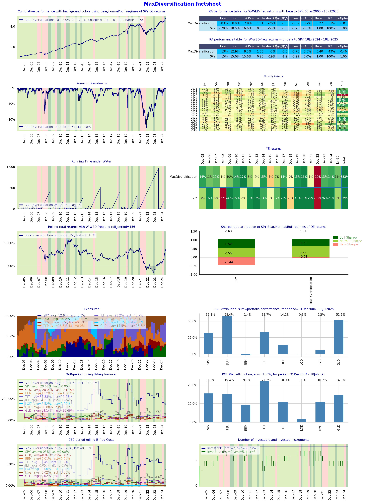
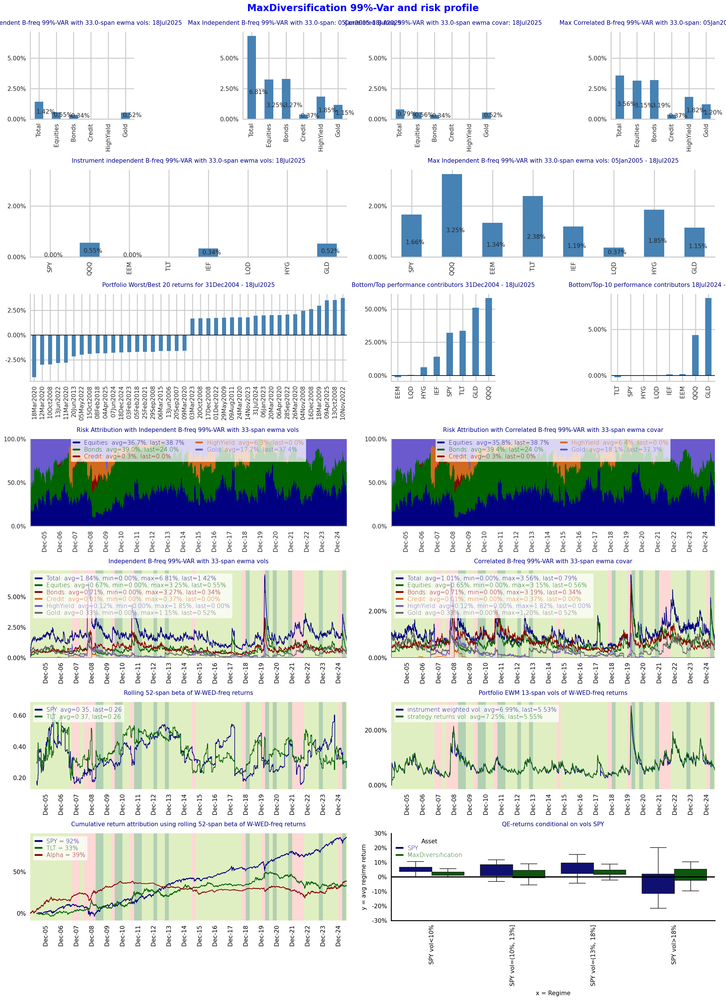
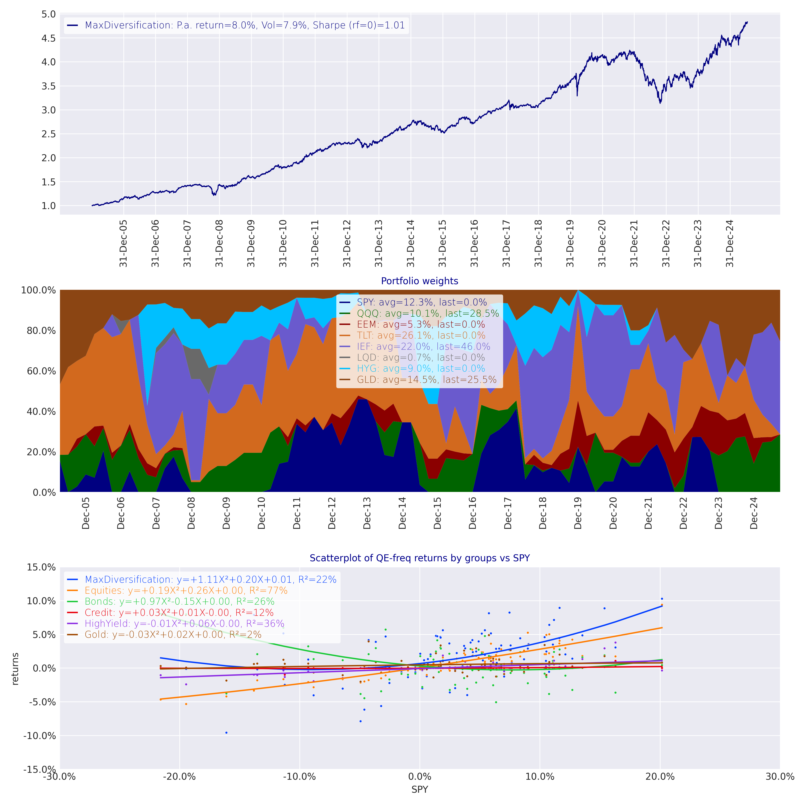
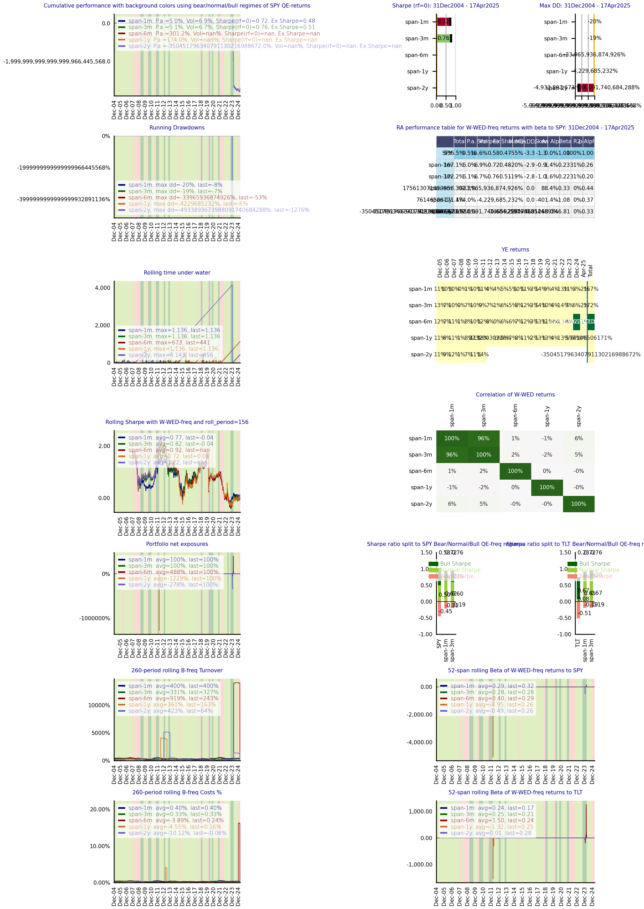
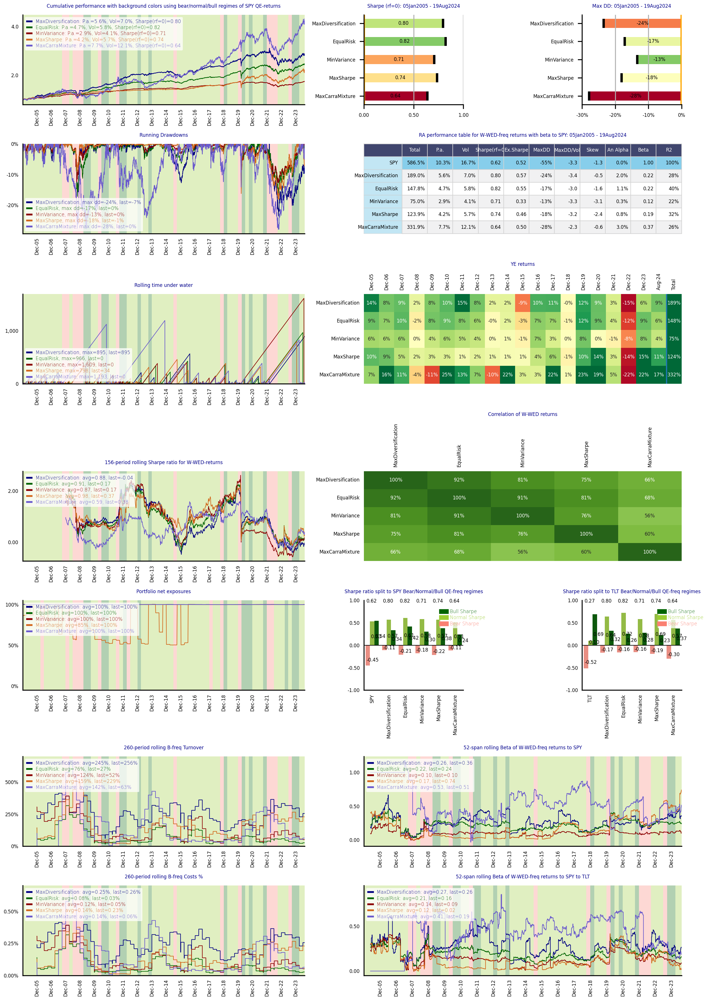

## **Optimal Portfolios Backtester** <a name="analytics"></a>

optimalportfolios package implements analytics for backtesting of optimal portfolios including:
1. Computing of inputs (covariance matrices, returns) for roll forward
computations (to avoid hindsight bias) and for generation of rolling optimal portfolios
2. Implementation of core optimisation solvers:
   1. Minimum variance
   2. Maximum quadratic utility
   3. Budgeted risk contribution (risk parity for equal budgets)
   4. Maximum diversification
   5. Maximum Sharpe ratio
   6. Maximum Cara utility under Gaussian mixture model
   7. Tracking error minimisation 
3. Rolling portfolio optimisation methods are compatible with incomplete time series
for roll forward analysis so that the portfolio universe can include instruments with different price histories

No pre-filtering of universe prices is necessary as rolling optimisers will detect 
eligeble assets when their variances and covariances are available for 
inclusion into time-t allocation set

4. Computing performances of simulated portfolios
5. Reporting of backtested portfolios and cross-sectional analysis


OptimalPortfolios package is split into 5 main modules with the 
dependecy path increasing sequentially as follows.

1. ```optimisation``` with sub-package ```solvers``` contains implementation of
various quadratic and nonlinear solvers. Each solver is implemented 
in a module independently of other solvers.

2. ```covar_estimation``` contains implementation of rolling methods for estimating
covariance matrices using EWMA and Lasso methods.

3. ```lasso``` with sub-package ```laasso_model_estimator``` contains implementation of
lasso based estimator of covariance matrix using the methodology developed in 
paper: Sepp A., Ossa I., and Kastenholz M. (2025),
"Robust Optimization of Strategic and Tactical Asset Allocation for Multi-Asset Portfolios"
(https://papers.ssrn.com/sol3/papers.cfm?abstract_id=5250221)

   
4. ```utils``` is module for auxiliary analytics, in particular

5. ```reports``` is module for computing performance statistics and performance attribution including returns, volatilities, etc.

6. ```examples.solvers``` provides example of running all implemented solvers.

### **Illustrations and examples of publicated papers** <a name="analytics"></a>

1. ```examples.crypto_allocation``` is module for computations and visualisations for  
Sepp A. (2023) "Optimal Allocation to Cryptocurrencies in Diversified Portfolios",
Risk, October 2023, 1-6, https://ssrn.com/abstract=4217841

2. ```examples.robust_optimisation_saa_taa``` is module for example of using
Hierarchical Clustering Group Lasso (HCGL) method for rolling estimation of covariance matrix and for solving Strategic Asset Allocation
using risk-budgeted optimisation as introduced in paper  
Sepp A., Ossa I., and Kastenholz M. (2025),
"Robust Optimization of Strategic and Tactical Asset Allocation for Multi-Asset Portfolios",
https://papers.ssrn.com/sol3/papers.cfm?abstract_id=5250221


# Table of contents
1. [Analytics](#analytics)
2. [Installation](#installation)
3. [Portfolio Optimisers](#optimisers)
   1. [Implementation structure](#structure)
   2. [Example of implementation for Maximum Diversification Solver](#example_structure)
   3. [Constraints](#constraints)
   4. [Wrapper for implemented rolling portfolios](#wrapper)
   5. [Adding an optimiser](#adding)
   6. [Default parameters](#params)
   7. [Price time series data](#ts)
4. [Examples](#examples)
   1. [Optimal Portfolio Backtest](#optimal)
   2. [Customised reporting](#report)
   3. [Parameters sensitivity backtest](#sensitivity)
   4. [Multi optimisers cross backtest](#cross)
   5. [Backtest of multi covariance estimators](#covars)
   6. [Optimal allocation to cryptocurrencies](#crypto)
   7. [Robust Optimization of Strategic and Tactical Asset Allocation for Multi-Asset Portfolios](#hcgl)
5. [Contributions](#contributions)
6. [Updates](#updates)
7. [Disclaimer](#disclaimer)

## **Installation** <a name="installation"></a>
install using
```python 
pip install optimalportfolios
```
upgrade using
```python 
pip install --upgrade optimalportfolios
```

close using
```python 
git clone https://github.com/ArturSepp/OptimalPortfolios.git
```


Core dependencies:
    python = ">=3.8,<3.11",
    numba = ">=0.56.4",
    numpy = ">=1.22.4",
    scipy = ">=1.9.0",
    pandas = ">=2.2.2",
    matplotlib = ">=3.2.2",
    seaborn = ">=0.12.2",
    scikit_learn = ">=1.3.0",
    cvxpy = ">=1.3.2",
    qis = ">=2.1.33",
    quadprog = ">=0.1.13"

Optional dependencies:
    yfinance ">=0.2.3" (for getting test price data),
    pybloqs ">=1.2.13" (for producing html and pdf factsheets)


## **Portfolio optimisers** <a name="optimisers"></a>

### 1. Implementation structure <a name="structure"></a>

The implementation of each solver is split into the 3 layers:

1) Mathematical layer which takes clean inputs, formulates the optimisation
problem and solves the 
optimisation problem using Scipy or CVXPY solvers.
The logic of this layer is to solve the problem algorithmically by taking clean inputs.

2) Wrapper level which takes inputs potentially containing nans, 
filters them out and calls the solver in layer 1). The output weights of filtered out
assets are set to zero.

3) Rolling level function with takes price time series as inputs and implements
the estimation of covariance matrix and other inputs on roll-forward basis. 
For each update date the rolling layer call the wrapper layer 2) with estimated
inputs as of the update date.

For rolling level function, the estimated covariance matrix can be passed as dictionary of type Dict[pd.Timestamp, pd.DataFrame] 
with dataframes containing covariance matrices for the universe and with keys being rebalancing times 

The default covariance is estimated using EWMA function with
covar_estimator = CovarEstimator(returns_freq=returns_freq, rebalancing_freq=rebalancing_freq, span=span)


The recommended usage is as follows.

Layer 2) is used for live portfolios or for backtests which are implemented using 
data augmentation

Layer 3) is applied for roll forward backtests where all available data is processed
using roll forward analysis

For implementation of different estimation methods for covariance matrices
and other inputs, we recommend to implement specific layers 2) or 3) with the 
implementation of the estimation logic. 

Layer 1 works with provided covariance matrices and inputs.


### 2. Example of implementation for Maximum Diversification Solver <a name="example_structure"></a>

Using example of ```optimization.solvers.max_diversification.py```

1. Scipy solver ```opt_maximise_diversification()``` which takes "clean" inputs of the 
covariance matrix of type ```np.ndarray``` without nans and
```Constraints``` dataclass which implements constraints for the solver.

The lowest level of each optimisation method is ```opt_...``` or ```cvx_...``` function taking clean inputs and producing the optimal weights. 

The logic of this layer is to implement pure quant logic for the optimiser with cvx solver.

2. Wrapper function ```wrapper_maximise_diversification()``` which takes inputs
covariance matrix of type ```pd.Dataframe``` 
potentially containing nans or assets with zero variance (when their time series are missing in the 
estimation period) and filters out non-nan "clean" inputs and 
updated constraints for OPT/CVX solver in layer 1.

The intermediary level of each optimisation method is ```wrapper_...``` function taking 
"dirty" inputs, filtering inputs,  and producing the optimal weights. This wrapper can be called either 
by rolling backtest simulations or by live portfolios for rebalancing.

The logic of this layer is to filter out data and to be an interface for portfolio implementations.

3. Rolling optimiser function ```rolling_maximise_diversification()``` takes the time series of data 
and sliced these accordingly and at each rebalancing step call the wrapper in layer 2.
In the end, the function outputs the time series of optiomal weight of assets in the universe.
Price data of assets may have gaps and nans which is taken care of in the wrapper level.

The backtesting of each optimisation method is implemented with ```rolling_...``` method with produces the time series of
optimal portfolio weights.

The logic of this layer is to faciliate the backtest of portfolio optimisation method and to produce
time series of portfolio weights using a Markovian setup. These weights are applied for the backtest 
of the optimal portfolio and the underlying strategy

Each module in ```optimization.solver``` implements specific optimisers and estimators for their inputs.


### 3. Constraints <a name="constraints"></a>

Dataclass ```Constraints``` in ```optimization.constraints``` implements 
optimisation constraints in solver independent way.

The following inputs for various constraints are implemented.
```python 
@dataclass
class Constraints:
    is_long_only: bool = True  # for positive allocation weights
    min_weights: pd.Series = None  # instrument min weights  
    max_weights: pd.Series = None  # instrument max weights
    max_exposure: float = 1.0  # for long short portfolios: for long_portfolios = 1
    min_exposure: float = 1.0  # for long short portfolios: for long_portfolios = 1
    benchmark_weights: pd.Series = None  # for minimisation of tracking error 
    tracking_err_vol_constraint: float = None  # annualised sqrt tracking error
    weights_0: pd.Series = None  # for turnover constraints
    turnover_constraint: float = None  # for turnover constraints
    target_return: float = None  # for optimisation with target return
    asset_returns: pd.Series = None  # for optimisation with target return
    max_target_portfolio_vol_an: float = None  # for optimisation with maximum portfolio volatility target
    min_target_portfolio_vol_an: float = None  # for optimisation with maximum portfolio volatility target
    group_lower_upper_constraints: GroupLowerUpperConstraints = None  # for group allocations constraints
```

Dataclass ```GroupLowerUpperConstraints``` implements asset class loading and min and max allocations
```python 
@dataclass
class GroupLowerUpperConstraints:
    """
    add constraints that each asset group is group_min_allocation <= sum group weights <= group_max_allocation
    """
    group_loadings: pd.DataFrame  # columns=instruments, index=groups, data=1 if instrument in indexed group else 0
    group_min_allocation: pd.Series  # index=groups, data=group min allocation 
    group_max_allocation: pd.Series  # index=groups, data=group max allocation 
```

Constraints are updated on the wrapper level to include the valid tickers
```python 
    def update_with_valid_tickers(self,  valid_tickers: List[str]) -> Constraints:
```


On the solver layer, the constants for the solvers are requested as follows.

For Scipy: ```set_scipy_constraints(self, covar: np.ndarray = None) -> List```

For CVXPY: ```set_cvx_constraints(self, w: cvx.Variable, covar: np.ndarray = None) -> List```


### 4. Wrapper for implemented rolling portfolios <a name="wrapper"></a>

Module ```optimisation.wrapper_rolling_portfolios.py``` wraps implementation of 
of the following solvers enumerated in ```config.py```

Using the wrapper function allows for cross-sectional analysis of different
backtest methods and for sensitivity analysis to parameters of
estimation and solver methods.

```python
class PortfolioObjective(Enum):
    """
    implemented portfolios in rolling_engine
    """
    # risk-based:
    MAX_DIVERSIFICATION = 1  # maximum diversification measure
    EQUAL_RISK_CONTRIBUTION = 2  # implementation in risk_parity
    MIN_VARIANCE = 3  # min w^t @ covar @ w
    # return-risk based
    QUADRATIC_UTILITY = 4  # max means^t*w- 0.5*gamma*w^t*covar*w
    MAXIMUM_SHARPE_RATIO = 5  # max means^t*w / sqrt(*w^t*covar*w)
    # return-skeweness based
    MAX_CARA_MIXTURE = 6  # carra for mixture distributions
```

See examples for [Parameters sensitivity backtest](#sensitivity) and 
[Multi optimisers cross backtest](#cross)


### 5. Adding an optimiser <a name="adding"></a>

1. Add analytics for computing rolling weights using a new estimator in
subpackage ```optimization.solvers```. Any third-party packages can be used

2. For cross-sectional analysis, add new optimiser type 
to ```config.py``` and link implemented
optimiser in wrapper function ```compute_rolling_optimal_weights()``` in 
```optimisation.wrapper_rolling_portfolios.py```


### 6. Default parameters <a name="params"></a>

Key parameters include the specification of the estimation sample.

1. ```returns_freq``` defines the frequency of returns for covariance matrix estimation. This parameter affects all methods. 

The default (assuming daily price data) is weekly Wednesday returns ```returns_freq = 'W-WED'```.

For price data with monthly observations 
(such us hedged funds), monthly returns should be used ```returns_freq = 'ME'```.


2. ```span``` defines the estimation span for ewma covariance matrix. This parameter affects all methods which use 
EWMA covariance matrix:
```
PortfolioObjective in [MAX_DIVERSIFICATION, EQUAL_RISK_CONTRIBUTION, MIN_VARIANCE]
```   
and 
```
PortfolioObjective in [QUADRATIC_UTILITY, MAXIMUM_SHARPE_RATIO]
```   

The span is defined as the number of returns
for the half-life of EWMA filter: ```ewma_lambda = 1 - 2 / (span+1)```. ```span=52``` with weekly returns means that 
last 52 weekly returns (one year of data) contribute 50% of weight to estimated covariance matrix

The default (assuming weekly returns) is 52: ```span=52```.

For monthly returns, I recommend to use ```span=12``` or ```span=24```.


3. ```rebalancing_freq``` defines the frequency of weights update. This parameter affects all methods.

The default value is quarterly rebalancing  ```rebalancing_freq='QE'```.

For the following methods 
```
PortfolioObjective in [QUADRATIC_UTILITY, MAXIMUM_SHARPE_RATIO, MAX_CARA_MIXTURE]
```   
Rebalancing frequency is also the rolling sample update frequency when mean returns and mixture distributions are estimated.


4. ```roll_window``` defines the number of past returns applied for estimation of rolling mean returns and mixture distributions.

This parameter affects the following optimisers 
```
PortfolioObjective in [QUADRATIC_UTILITY, MAXIMUM_SHARPE_RATIO, MAX_CARA_MIXTURE]
```   
and it is linked to ```rebalancing_freq```. 

Default value is ```roll_window=20``` which means that data for past 20 (quarters) are used in the sample
with ```rebalancing_freq='QE'```

For monthly rebalancing, I recomend to use ```roll_window=60``` which corresponds to using past 5 years of data

### 7. Price time series data <a name="ts"></a>

The input to all optimisers is dataframe prices which contains dividend and split adjusted prices.

The price data can include assets with prices starting an ending at different times.

All optimisers will set maximum weight to zero for assets with missing prices in the estimation sample period.  


## **Examples** <a name="examples"></a>

### 1. Optimal Portfolio Backtest <a name="optimal"></a>

See script in ```optimalportfolios.examples.optimal_portfolio_backtest.py```

```pythong
import os
import pickle
from pathlib import Path

import pandas as pd
import yfinance as yf
from typing import Tuple
import qis as qis

from optimalportfolios import compute_rolling_optimal_weights, PortfolioObjective, Constraints

#: Cache YFinance price data for subsequent runs here
PRICES_CACHE_PATH = Path("/tmp/prices.pickle")

#: Where to store the results figures and such
OUTPUT_PATH = Path("./output")


def fetch_universe_data() -> Tuple[pd.DataFrame, pd.DataFrame, pd.Series]:
    """
    fetch universe data for the portfolio construction:
    1. dividend and split adjusted end of day prices: price data may start / end at different dates
    2. benchmark prices which is used for portfolio reporting and benchmarking
    3. universe group data for portfolio reporting and risk attribution for large universes
    this function is using yfinance to fetch the price data
    """
    universe_data = dict(SPY='Equities',
                         QQQ='Equities',
                         EEM='Equities',
                         TLT='Bonds',
                         IEF='Bonds',
                         LQD='Credit',
                         HYG='HighYield',
                         GLD='Gold')
    tickers = list(universe_data.keys())
    group_data = pd.Series(universe_data)
    if PRICES_CACHE_PATH.exists():
        print("Using cached prcies")
        prices = pickle.load(PRICES_CACHE_PATH.open("rb"))
    else:
        print("Starting prices download from YFinance")
        prices = yf.download(tickers, start="2003-12-31", end=None, ignore_tz=True, auto_adjust=True)['Close']
        pickle.dump(prices, PRICES_CACHE_PATH.open("wb"))

    prices = prices[tickers]  # arrange as given
    prices = prices.asfreq('B', method='ffill')  # refill at B frequency
    benchmark_prices = prices[['SPY', 'TLT']]
    return prices, benchmark_prices, group_data

# 2. get universe data
prices, benchmark_prices, group_data = fetch_universe_data()
time_period = qis.TimePeriod('31Dec2004', '16Aug2024')   # period for computing weights backtest

# 3.a. define optimisation setup
print("Define optimisation")
portfolio_objective = PortfolioObjective.MAX_DIVERSIFICATION  # define portfolio objective
returns_freq = 'W-WED'  # use weekly returns
rebalancing_freq = 'QE'  # weights rebalancing frequency: rebalancing is quarterly on WED
span = 52  # span of number of returns_freq-returns for covariance estimation = 12y
constraints0 = Constraints(is_long_only=True,
                           min_weights=pd.Series(0.0, index=prices.columns),
                           max_weights=pd.Series(0.5, index=prices.columns))

# 3.b. compute solvers portfolio weights rebalanced every quarter
weights = compute_rolling_optimal_weights(prices=prices,
                                          portfolio_objective=portfolio_objective,
                                          constraints0=constraints0,
                                          time_period=time_period,
                                          rebalancing_freq=rebalancing_freq,
                                          span=span)

# 4. given portfolio weights, construct the performance of the portfolio
print("Assigning weights")
funding_rate = None  # on positive / negative cash balances
rebalancing_costs = 0.0010  # rebalancing costs per volume = 10bp
weight_implementation_lag = 1  # portfolio is implemented next day after weights are computed
portfolio_data = qis.backtest_model_portfolio(prices=prices.loc[weights.index[0]:, :],
                                              weights=weights,
                                              ticker='MaxDiversification',
                                              funding_rate=funding_rate,
                                              weight_implementation_lag=weight_implementation_lag,
                                              rebalancing_costs=rebalancing_costs)

# 5. using portfolio_data run the reporting with strategy factsheet
# for group-based reporting set_group_data
print("Generating reports")
portfolio_data.set_group_data(group_data=group_data, group_order=list(group_data.unique()))
# set time period for portfolio reporting
figs = qis.generate_strategy_factsheet(portfolio_data=portfolio_data,
                                       benchmark_prices=benchmark_prices,
                                       time_period=time_period,
                                       **qis.fetch_default_report_kwargs(time_period=time_period))


if not OUTPUT_PATH.exists():
    os.makedirs(OUTPUT_PATH, exist_ok=True)

# save report to pdf and png
qis.save_figs_to_pdf(figs=figs,
                     file_name=f"{portfolio_data.nav.name}_portfolio_factsheet",
                     orientation='landscape',
                     local_path=str(OUTPUT_PATH))

qis.save_fig(fig=figs[0], file_name=f"example_portfolio_factsheet1", local_path=str(OUTPUT_PATH))
if len(figs) > 1:
    qis.save_fig(fig=figs[1], file_name=f"example_portfolio_factsheet2", local_path=str(OUTPUT_PATH))


```




### 2. Customised reporting <a name="report"></a>

Portfolio data class ```PortfolioData``` is implemented in [QIS package](https://github.com/ArturSepp/QuantInvestStrats)

```python
# 6. can create customised reporting using portfolio_data custom reporting
def run_customised_reporting(portfolio_data) -> plt.Figure:
    with sns.axes_style("darkgrid"):
        fig, axs = plt.subplots(3, 1, figsize=(12, 12), tight_layout=True)
    perf_params = qis.PerfParams(freq='W-WED', freq_reg='ME')
    kwargs = dict(x_date_freq='YE', framealpha=0.8, perf_params=perf_params)
    portfolio_data.plot_nav(ax=axs[0], **kwargs)
    portfolio_data.plot_weights(ncol=len(prices.columns)//3,
                                legend_stats=qis.LegendStats.AVG_LAST,
                                title='Portfolio weights',
                                freq='QE',
                                ax=axs[1],
                                **kwargs)
    portfolio_data.plot_returns_scatter(benchmark_price=benchmark_prices.iloc[:, 0],
                                        ax=axs[2],
                                        **kwargs)
    return fig


# run customised report
fig = run_customised_reporting(portfolio_data)
# save png
qis.save_fig(fig=fig, file_name=f"example_customised_report", local_path=f"figures/")
```



### 3. Parameters sensitivity backtest <a name="sensitivity"></a>

Cross-sectional backtests are applied to test the sensitivity of
optimisation method to a parameter of estimation or solver methods.

See script in ```optimalportfolios.examples.parameter_sensitivity_backtest.py```




### 4. Multi optimisers cross backtest <a name="cross"></a>

Multiple optimisation methods can be analysed 
using the wrapper function ```compute_rolling_optimal_weights()``` 

See example script in ```optimalportfolios.examples.multi_optimisers_backtest.py```




### 5. Backtest of multi covariance estimators <a name="covars"></a>

Multiple covariance estimators can be backtested for the same optimisation method

See example script in ```optimalportfolios.examples.multi_covar_estimation_backtest.py```


### 6. Optimal allocation to cryptocurrencies <a name="crypto"></a>

Computations and visualisations for 
paper "Optimal Allocation to Cryptocurrencies in Diversified Portfolios" [https://ssrn.com/abstract=4217841](https://ssrn.com/abstract=4217841)
   are implemented in module ```optimalportfolios.examples.crypto_allocation```,
see [README in this module](https://github.com/ArturSepp/OptimalPortfolios/blob/master/optimalportfolios/examples/crypto_allocation/README.md)


### 7. Robust Optimization of Strategic and Tactical Asset Allocation for Multi-Asset Portfolios <a name="hcgl"></a>

Computations and visualisations for 
paper "Robust Optimization of Strategic and Tactical Asset Allocation for Multi-Asset Portfolios" [https://ssrn.com/abstract=5250221](https://ssrn.com/abstract=5250221)
   are implemented in module ```optimalportfolios.examples.robust_optimisation_saa_taa```,
see [README in this module](https://github.com/ArturSepp/OptimalPortfolios/blob/master/optimalportfolios/examples/robust_optimisation_saa_taa/README.md)


## **Updates** <a name="updates"></a>

#### 8 July 2023,  Version 1.0.1 released

Implementation of optimisation methods and data considered in 
"Optimal Allocation to Cryptocurrencies in
Diversified Portfolios"  by A. Sepp published in Risk Magazine, October 2023, 1-6. The draft is available at SSRN: https://ssrn.com/abstract=4217841


#### 2 September 2023,  Version 1.0.8 released
Added subpackage ```optimisation.rolling_engine``` with optimisers grouped by the type of inputs and
data they require.

#### 18 August 2024,  Version 2.1.1 released
Refactor the implementation of solvers with the 3 layers.

Add new solvers for tracking error and target return optimisations.

Add exmples of running all solvers

#### 05 January 2025,  Version 3.1.1 released

Added Lasso estimator and Group lasso estimator using cvxpy quadratic problems

Added covariance estimator using factor model with Lasso betas

Estimated covariance matrices can be passed to rolling solvers, CovarEstimator type is added for different covariance estimators 

Risk budgeting is implemented using pyrb package with pyrb forked for optimalportfolio package


## **Disclaimer** <a name="disclaimer"></a>

OptimalPortfolios package is distributed FREE & WITHOUT ANY WARRANTY under the GNU GENERAL PUBLIC LICENSE.

See the [LICENSE.txt](https://github.com/ArturSepp/OptimalPortfolios/blob/master/LICENSE.txt) in the release for details.

Please report any bugs or suggestions by opening an [issue](https://github.com/ArturSepp/OptimalPortfolios/issues).
