---
myst:
  html_meta:
    description: >-
      Reproducible OptimalPortfolios analytics: synthetic portfolio performance,
      allocation, trading costs, covariance spans, objectives and factor estimators.
---

# Analytics gallery

*Author: [Artur Sepp](https://github.com/ArturSepp) / First recorded: [2026-09-14](https://github.com/ArturSepp/OptimalPortfolios/commit/19cae02086d4fbfcf4377796bfef2c576d989134)*

Examples from [OptimalPortfolios](https://github.com/ArturSepp/OptimalPortfolios).
Software citation: [CITATION.cff](https://github.com/ArturSepp/OptimalPortfolios/blob/main/CITATION.cff).

These six teaching exhibits connect portfolio construction to risk and performance analytics.
OptimalPortfolios estimates risk and constructs targets,
[qis](https://github.com/ArturSepp/QuantInvestStrats) simulates holdings and computes analytics,
and [factorlasso](https://github.com/ArturSepp/FactorLasso) fits the sparse factor models.

All inputs are synthetic. The figures illustrate calculations and implementation conventions;
they do not establish historical performance or recommend an allocation or estimator.
The [shared provenance record](../examples/figures/analytics_manifest.json) identifies the
effective source, inputs, parameters, actual software environment, generation time and visual
review. A fixed sample ending in 2025 is separate from the date the image was generated.

## Choose an exhibit

| Question | Exhibit |
|---|---|
| How do growth and drawdowns compare with a synthetic benchmark? | [Performance](#portfolio-performance) |
| What are the final targets and their estimated risk contributions? | [Allocation and risk](#allocation-and-risk) |
| How do decided allocations and realized trading costs evolve? | [Allocation through time](#allocation-through-time) |
| How does covariance smoothing affect this example? | [Span sensitivity](#covariance-span-sensitivity) |
| How do three objectives behave with common risk inputs? | [Objective comparison](#portfolio-objectives) |
| How do estimates compare with a known simulated covariance? | [Covariance estimators](#covariance-estimators) |
| Why does the maximum diversification portfolio hold what it holds? | [Maximum diversification](#maximum-diversification) |
| How do the strategic and tactical layers of ROSAA divide the work? | [ROSAA layers](#rosaa-layers) |

Select a preview to open its full-resolution image. The
[offline quickstart](quickstart.md) provides a smaller executable introduction, and the
[examples guide](examples_readme.md) maps broader workflows and their data requirements.

## Samples and conventions

The first five exhibits use six assets from the fixed
[qis synthetic-universe generator](https://github.com/ArturSepp/QuantInvestStrats/blob/main/src/qis/datasets/synthetic.py):
US and European equity, Treasuries, investment-grade bonds, gold and commodities.
Seed 20260725 and clean mode (`apply_quirks=False`) select complete business-day observations
from 4 January 2010 to 31 December 2025. Early history supplies estimation warmup;
the displayed performance window is 1 April 2015 to 31 December 2025.

The final exhibit uses the repository's
[known-factor simulator](../examples/covar_estimation/simulate_factor_returns.py), seed 42:
four factors, eight assets and 783 business-day observations from 2 January 2023 to
31 December 2025. Its displayed backtest starts on 3 January 2024 after weekly estimation warmup.

| Convention | Applied in these exhibits |
|---|---|
| Estimation returns | Weekly Wednesday log returns, with trailing EWMA demeaning |
| Covariance units | Annualized using 52 weekly observations per year |
| Construction | Fully invested, long-only target weights; 35% cap per asset |
| Decision and execution | Quarterly schedules mapped to observed Wednesdays; targets trade one business-day observation later |
| Holdings | qis holds units between trades, so realized weights drift |
| Trading costs | 10 basis points of gross traded notional, including entry |
| Other costs | No funding or management fees |
| Displayed growth | Portfolio NAV after costs; the 60/40 reference in the first panel is explicitly gross |

The last target decision is 1 October 2025. That target snapshot differs from holdings at the
sample end. Cost bars sum daily cash cost divided by that day's NAV, expressed in basis points;
they measure cost incidence rather than compounded performance drag.
The [refresh specification](documentation_standard.md#analytical-conventions-and-figures)
records detailed conventions, solver acceptance and independent numerical checks.

## Portfolio performance

The maximum-diversification portfolio is compared with the fixture's daily-rebalanced gross
60/40 benchmark. Both series are displayed as growth of 100; drawdown measures the fall from
each series' running peak over the report window.

[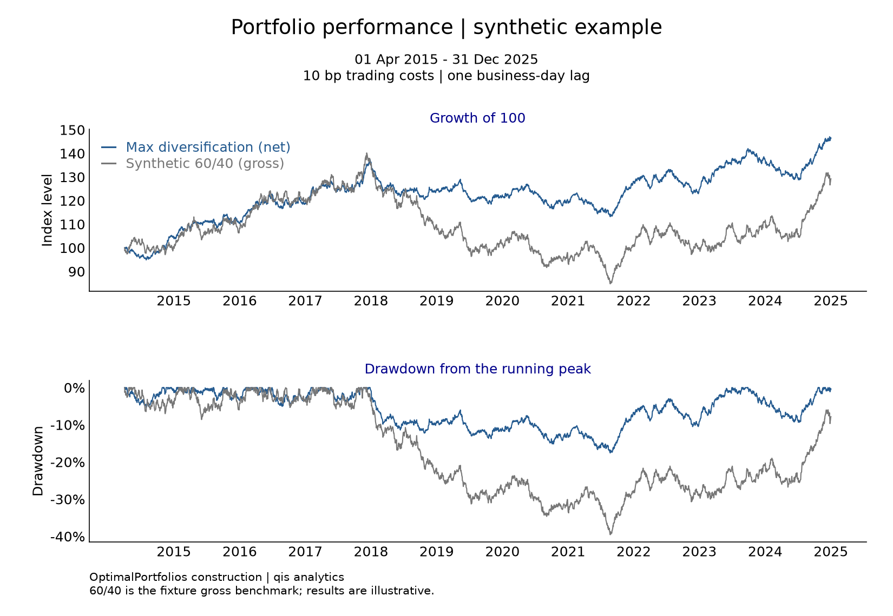](../examples/figures/example_portfolio_factsheet1.PNG)

**Sample:** 1 April 2015–31 December 2025. The portfolio is net of 10 bp trading costs;
the benchmark is gross. This illustrative comparison does not isolate an allocation advantage.
**Producer:** [portfolio reports](../tools/docs_analytics/portfolio_reports.py).
**Related methodology:** [rolling backtests](rolling_backtests.md).

## Allocation and risk

The upper panel shows decided maximum-diversification weights. The lower panel shows each
asset's contribution to estimated annualized portfolio volatility using the same decision's
covariance. Contributions are measured in volatility percentage points, not portfolio weights.

[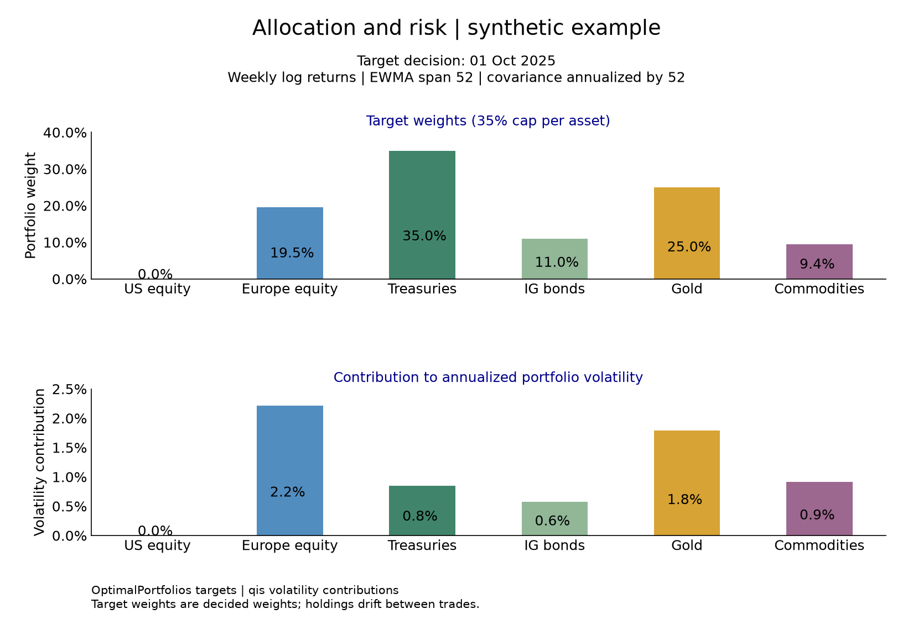](../examples/figures/example_portfolio_factsheet2.PNG)

**Decision:** 1 October 2025. Weekly log returns, EWMA span 52, annualization factor 52.
The 35% asset cap can bind. The estimate describes targets and ex-ante risk, rather than
end-of-sample holdings or realized future volatility.
**Producer:** [portfolio reports](../tools/docs_analytics/portfolio_reports.py).
**Related methodology:** [covariance estimators](covariance_estimators.md).

## Allocation through time

The stacked panel extends each decided target until the following decision for display.
It does not plot drifted holdings. The lower panel aggregates realized trading costs by
calendar quarter, including the initial allocation.

[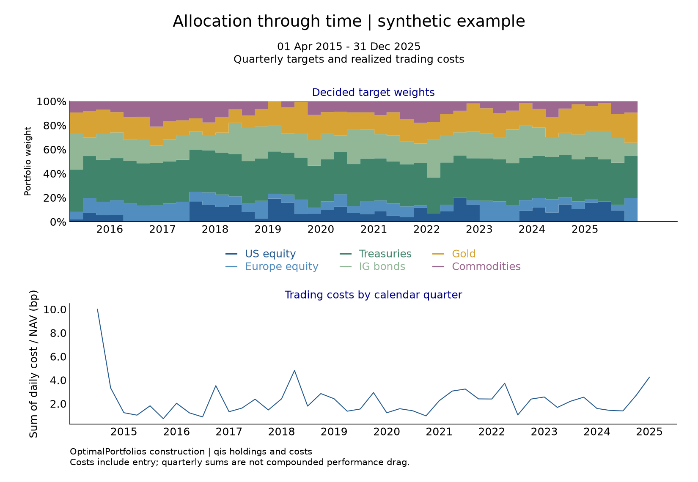](../examples/figures/example_customised_report.PNG)

**Sample:** 1 April 2015–31 December 2025. Extending the last target to the report end adds
neither a new decision nor a trade. Quarterly cost sums use each day's NAV denominator.
**Producer:** [portfolio reports](../tools/docs_analytics/portfolio_reports.py).
**Related methodology:** [turnover and transaction costs](turnover_and_transaction_costs.md).

## Covariance span sensitivity

Five maximum-diversification backtests vary the EWMA span across **5, 13, 26, 52 and 104**
weekly observations. Each span affects both trailing demeaning and covariance smoothing.
A span is an EWMA parameter, not a half-life or a finite estimation window.

[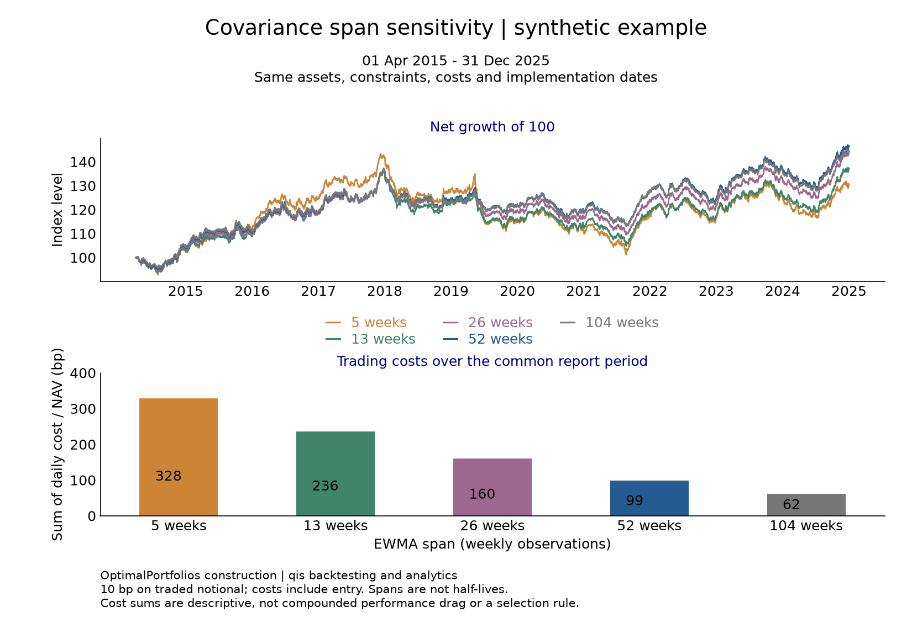](../examples/figures/max_diversification_span.PNG)

**Sample:** 1 April 2015–31 December 2025. Assets, constraints, costs and implementation dates
are shared. The lower panel sums daily cost/NAV over that common report period. This fixed
path illustrates parameter sensitivity; it does not select a preferred span.
**Producer:** [span sensitivity](../tools/docs_analytics/span_sensitivity.py).

## Portfolio objectives

Minimum variance, maximum diversification and equal risk budgets use the same covariance,
assets, weight constraints and trade dates. Expected-return estimation is outside this
comparison; it covers three objectives driven by covariance.

[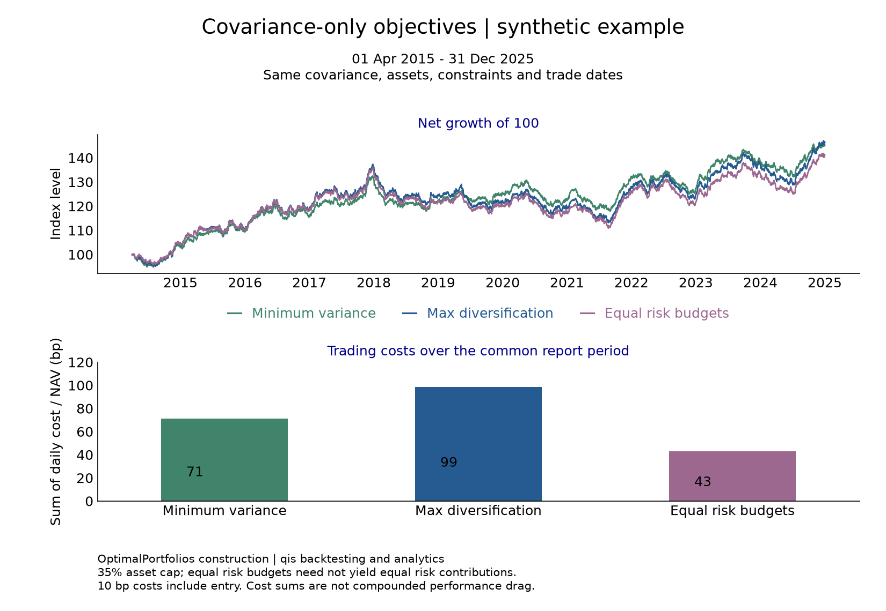](../examples/figures/multi_optimisers_backtest.PNG)

**Sample:** 1 April 2015–31 December 2025. The 35% cap can prevent equal target risk budgets
from producing equal risk contributions at the decision date. Cost sums include entry. This single
synthetic path is not evidence of an objective's expected market performance.
**Producer:** [optimiser comparison](../tools/docs_analytics/optimiser_comparison.py).
**Related methodology:** [optimization guide](optimization_module_readme.md) and
[risk budgeting](risk_budgeting.md).

## Covariance estimators

Six estimates feed a common minimum-variance construction: EWMA, Lasso and Group Lasso,
each with its specified volatility-normalized variant. EWMA normalization acts on asset-return
covariance; factor variants normalize factor covariance only. Group Lasso uses four fixed
asset pairs, not clusters inferred from the known loadings.

[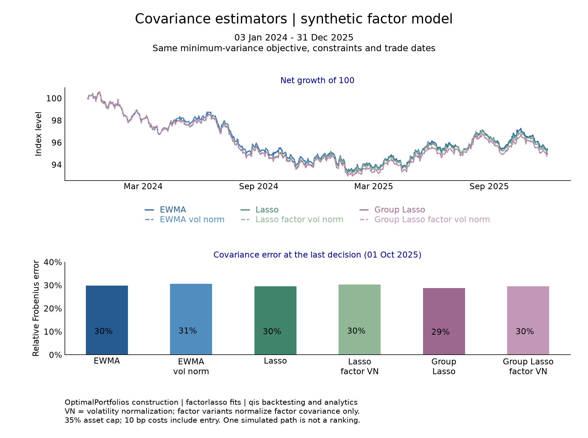](../examples/figures/MinVariance_multi_covar_estimator_backtest.PNG)

**Backtest:** 3 January 2024–31 December 2025. **Error snapshot:** 1 October 2025.
The lower panel measures relative Frobenius error against the known simulated covariance:
the Euclidean size of all estimation errors divided by the size of the true matrix.
Estimated weekly covariance is annualized by 52; simulated daily truth by 260.
Known truth is used for descriptive evaluation and never supplied to portfolio estimation.

All cases fit only data available at their shared decision dates. The simulation has constant
loadings/covariance, no return premium and one fixed path. Closely overlapping performance
curves and one-date covariance errors do not establish an estimator ranking.
**Producer:** [covariance comparison](../tools/docs_analytics/covariance_comparison.py).
**Configuration:** [analytics registry](../tools/docs_analytics/registry.json).

## Mixed-frequency data

A teaching exhibit of the [mixed-frequency data](mixed_frequency_data.md) page. At one
formation date, the monthly assets' classic momentum uses 12 monthly returns ending one month
earlier, and the quarterly asset uses 4 quarterly returns ending one quarter earlier; the
quarterly signal is carried unchanged between quarter ends.

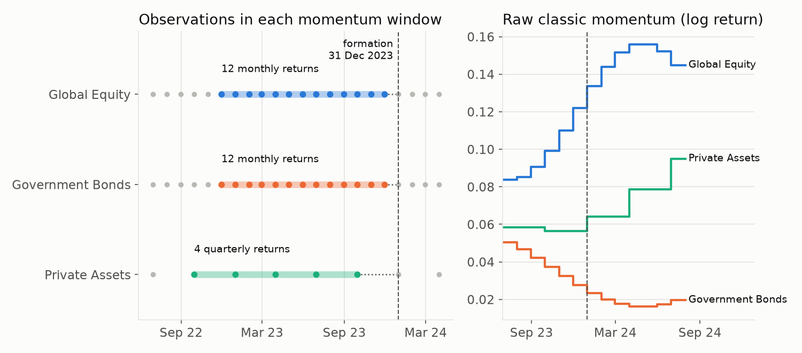

**Sample:** deterministic synthetic panel of two monthly series and quarter-end NAVs, December
2018 to December 2024; no simulation. **Producer:** the `exhibit` function of
[`examples/docs/mixed_frequency_data.py`](../examples/docs/mixed_frequency_data.py).
**Configuration:** [teaching registry](../tools/docs_analytics/teaching.json).

## Incomplete histories

A teaching exhibit of the [incomplete histories](incomplete_histories.md) page. A price missing
between rebalancings lowers NAV only until the price returns; the same gap on a rebalance date
clears the held units without proceeds; a missing opening price leaves that allocation in cash.

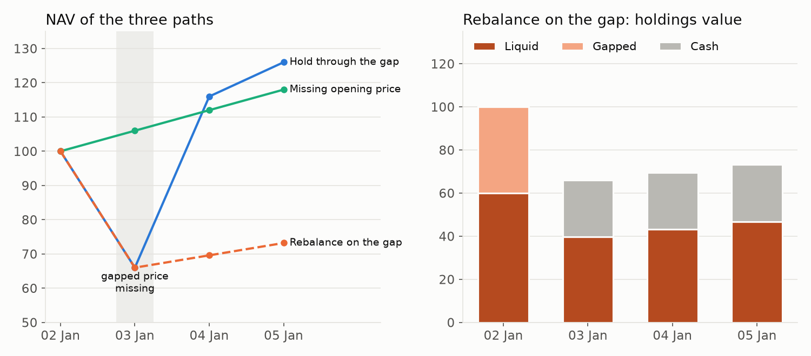

**Sample:** two synthetic assets over four business days in January 2024, with one missing
price; no simulation. **Producer:** the `exhibit` function of
[`examples/docs/incomplete_histories.py`](../examples/docs/incomplete_histories.py).
**Configuration:** [teaching registry](../tools/docs_analytics/teaching.json).

## Universe data and unsmoothing

A teaching exhibit of the [universe data and unsmoothing](universe_data_and_unsmoothing.md) page.
Appraisal smoothing with a weight of 0.6 on the previous reported return halves the reported
volatility of private equity and makes its returns autocorrelated. Unsmoothing lowers the lag-1
autocorrelation from 0.61 to -0.04, against -0.02 for the true returns, and raises the annualised
volatility from 10.2% to 20.5%, against 20.4%.

**Sample:** a seeded synthetic quarterly panel of four assets from December 1989 to December 2024,
seed 19, whose private-equity column is appraisal-smoothed; the simulated true returns are known.
**Producer:** the `exhibit` function of
[`examples/docs/universe_data_and_unsmoothing.py`](../examples/docs/universe_data_and_unsmoothing.py).
**Configuration:** [teaching registry](../tools/docs_analytics/teaching.json).

## Factor covariance with HCGL

A teaching exhibit of the [factor covariance with HCGL](factor_covariance_hcgl.md) page. Orthogonal
and empirical residuals give every asset the same systematic and residual variance; they differ
in the residual covariances. Three private assets share a shock that the factors do not span, and
an equal-weight portfolio of them has a residual variance of 0.00019 with orthogonal residuals
and 0.00040 when the empirical residual correlations enter with full weight.

**Sample:** synthetic month ends from December 2004 to December 2024, seed 5: four factors, five
monthly and three quarterly assets with known loadings and a shock common to the private assets;
HCGL fit at 31 December 2023. **Producer:** the `exhibit` function of
[`examples/docs/factor_covariance_hcgl.py`](../examples/docs/factor_covariance_hcgl.py).
**Configuration:** [teaching registry](../tools/docs_analytics/teaching.json).

## Ex-ante risk contributions

A teaching exhibit of the [ex-ante risk contributions](portfolio_risk_analytics.md) page. On one
covariance, equal weights put 42% of the risk in emerging-market equity; minimum variance has
risk shares equal to its weights; equal risk contribution gives each asset 20% of the risk with
45% of the capital in government bonds; maximum diversification holds 67% of the capital in
government bonds and 41% of the risk.

**Sample:** the page's fixed five-asset, three-factor covariance snapshot; no simulation.
**Producer:** the `exhibit` function of
[`examples/docs/portfolio_risk_analytics.py`](../examples/docs/portfolio_risk_analytics.py).
**Configuration:** [teaching registry](../tools/docs_analytics/teaching.json).

## Alpha signals

A teaching exhibit of the [alpha signals](alphas_module_readme.md) page. Scored across all nine
assets, twelve-month momentum ranks the equity-like assets first; scored within each cluster,
each group is centred on its own mean, so the strongest bond-like asset rises from fifth to
second and the weakest equity-like asset falls to last.

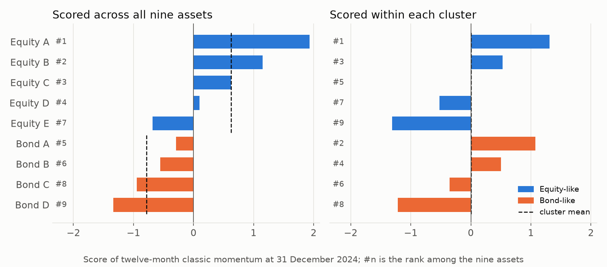

**Sample:** nine synthetic month-end price paths with constant log drifts, five equity-like and
four bond-like, October 2023 to December 2024; no simulation. **Producer:** the `exhibit`
function of [`examples/docs/alphas_module_readme.py`](../examples/docs/alphas_module_readme.py).
**Configuration:** [teaching registry](../tools/docs_analytics/teaching.json).

## Risk budgeting

A teaching exhibit of the [risk budgeting](risk_budgeting.md) page. With slack caps, each
asset's share of portfolio risk equals its budget of 50%, 30% or 20%; capping Equity at 25%
leaves no asset at its budget, and the released risk goes to the free assets in proportion to
their capital weights, not their budgets.

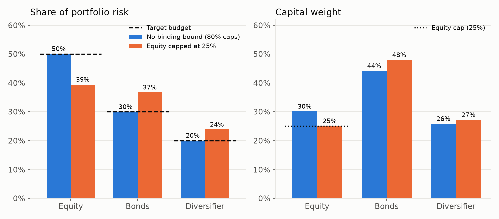

**Sample:** the page's fixed three-asset covariance, solved with slack 80% caps and with Equity
capped at 25%; no simulation. **Producer:** the `exhibit` function of
[`examples/docs/risk_budgeting.py`](../examples/docs/risk_budgeting.py).
**Configuration:** [teaching registry](../tools/docs_analytics/teaching.json).

## Implied risk budgets

A teaching exhibit of the [implied risk budgets](implied_risk_budgets.md) page. As the stock-bond
correlation drifts from -0.7 to 0.4 over twelve quarter ends, the implied risk budget of Bonds in
a 40/45/15 target rises from -8% to 25%; on the first two dates Bonds hedge the portfolio and no
non-negative budget reproduces the target. One static budget vector of about 70.6%, 14.5% and
14.9% reproduces the target only on average: its forward weight in Bonds moves from 59% to 32%.

**Sample:** three assets with fixed volatilities and a stock-bond correlation drifting from -0.7
to 0.4 over twelve quarter ends from 31 March 2023; no simulation. **Producer:** the `exhibit`
function of [`examples/docs/implied_risk_budgets.py`](../examples/docs/implied_risk_budgets.py).
**Configuration:** [teaching registry](../tools/docs_analytics/teaching.json).

## Hierarchical risk parity

A teaching exhibit of the
[hierarchical risk parity and cluster risk budgets](hierarchical_risk_parity_and_cluster_budgets.md)
page. On a universe of four government bonds, two equity markets and two real assets, HRP puts
91% of the capital and 90% of the risk in the bonds; equal risk contribution puts 76% of the
capital there for 50% of the risk, and equal cluster budgets 69% of the capital for a third.

**Sample:** a fixed eight-asset universe of four government bonds, two equity markets and two real
assets with block correlations; no simulation. **Producer:** the `exhibit` function of
[`examples/docs/hierarchical_risk_parity_and_cluster_budgets.py`](../examples/docs/hierarchical_risk_parity_and_cluster_budgets.py).
**Configuration:** [teaching registry](../tools/docs_analytics/teaching.json).

## Maximum diversification

A teaching exhibit of the [maximum diversification](maximum_diversification.md) page. The
SLSQP weights of the package and the minimum-variance weights of the correlation matrix,
rescaled by inverse volatility and computed by CVXPY, agree for a stylised six-asset universe;
every held asset has correlation 0.570 with the portfolio, the inverse of its diversification
ratio, and the excluded credit asset has 0.70.

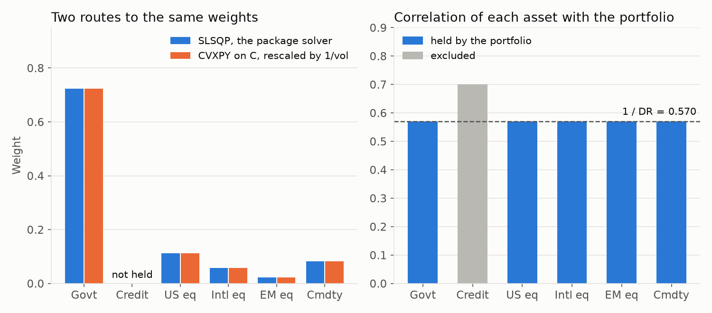

**Sample:** fixed volatilities and correlations; no simulation. **Producer:** the `exhibit`
function of [`examples/docs/maximum_diversification.py`](../examples/docs/maximum_diversification.py),
run by [the teaching-exhibit tool](../tools/docs_analytics/teaching.py). **Configuration:**
[teaching registry](../tools/docs_analytics/teaching.json).

## Minimum tracking error

A teaching exhibit of the [minimum tracking error](minimum_tracking_error.md) page. Starting
from the benchmark itself, excluding one asset, capping another, limiting a group and limiting
turnover each add ex-ante tracking error, from 0% to 2.06% a year; the right panel shows where
the covariance sends the displaced weight at two of the steps.

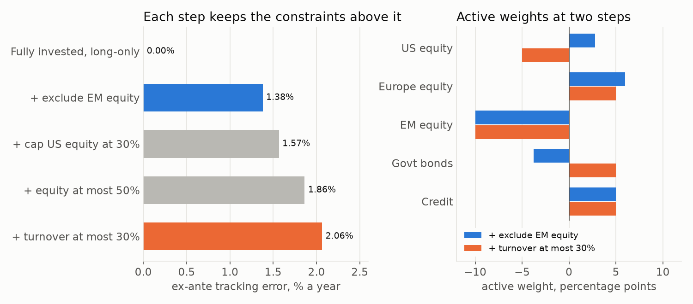

**Sample:** fixed volatilities and correlations of a stylised five-asset universe with a 60/40
benchmark and fixed current holdings; no simulation. **Producer:** the `exhibit` function of
[`examples/docs/minimum_tracking_error.py`](../examples/docs/minimum_tracking_error.py).
**Configuration:** [teaching registry](../tools/docs_analytics/teaching.json).

## Overlay tail floor

A teaching exhibit of the [overlay tail floor](overlay_tail_floor.md) page. A floor changes
nothing until it exceeds the unconstrained sleeve's floor exposure; tighter floors bind at
equality, move the sleeve from the carry overlays to the defensive ones, and near the reachable
maximum leave it all in one defensive overlay, at a lower model return.

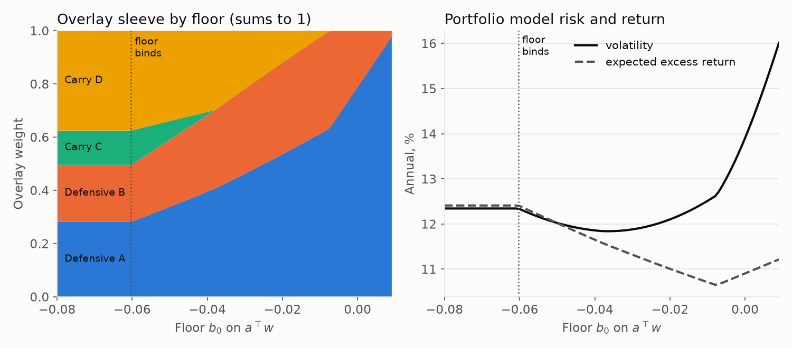

**Sample:** the page's synthetic core and four overlays, solved at 90 floors from -0.08 to
0.009; no simulation. **Producer:** the `exhibit` function of
[`examples/docs/overlay_tail_floor.py`](../examples/docs/overlay_tail_floor.py).
**Configuration:** [teaching registry](../tools/docs_analytics/teaching.json).

## Portfolio constraints

A teaching exhibit of the [portfolio constraints](constraints.md) page. A hard 2% tracking-error
row holds the solve at the limit; the same limit as a penalty lets tracking error exceed it by an
amount that shrinks as the penalty weight grows, and only the row's shadow price, 3.33 here,
reproduces the forced solve.

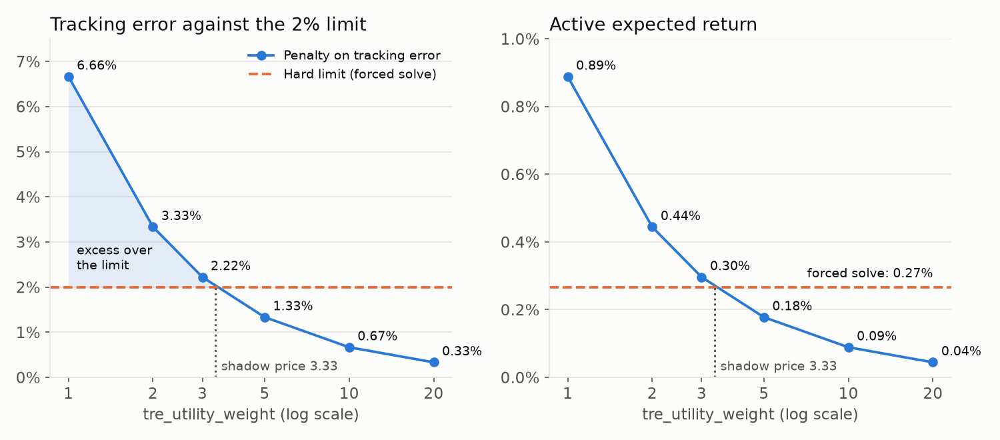

**Sample:** the page's synthetic three-asset example with a 45/40/15 benchmark, solved with a
hard tracking-error row and at six penalty weights; no simulation. **Producer:** the `exhibit`
function of [`examples/docs/constraints.py`](../examples/docs/constraints.py).
**Configuration:** [teaching registry](../tools/docs_analytics/teaching.json).

## Solver numerics and outcomes

A teaching exhibit of the [solver numerics and outcomes](solver_numerics_and_outcomes.md) page.
As two private proxies approach collinearity, the smallest eigenvalue of the covariance falls
toward zero and the condition number grows as the inverse of the correlation gap. The eigenvalue
floor raises only the smallest eigenvalue, to 1e-10, and caps the condition number at the
largest eigenvalue over the floor; the other five eigenvalues are unchanged.

**Sample:** fixed volatilities and correlations of a six-asset universe whose private pair
approaches a duplicate proxy; no simulation. **Producer:** the `exhibit` function of
[`examples/docs/solver_numerics_and_outcomes.py`](../examples/docs/solver_numerics_and_outcomes.py).
**Configuration:** [teaching registry](../tools/docs_analytics/teaching.json).

## Rolling backtests

A teaching exhibit of the [rolling backtests](rolling_backtests.md) page. Between quarterly
trades, held weights drift with prices away from the targets in force; each trade, one
observation after its decision date, resets them, and the gap peaks the day before a trade.

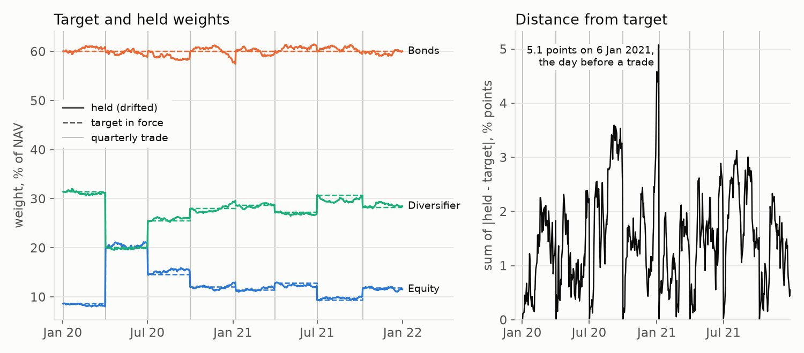

**Sample:** a seeded synthetic business-day panel of three assets with weekly EWMA covariances,
minimum-variance targets capped at 60% and eight quarterly trades. **Producer:** the `exhibit`
function of [`examples/docs/rolling_backtests.py`](../examples/docs/rolling_backtests.py).
**Configuration:** [teaching registry](../tools/docs_analytics/teaching.json).

## Turnover and transaction costs

A teaching exhibit of the [turnover and transaction costs](turnover_and_transaction_costs.md)
page. Raising `turnover_utility_weight` moves the solution along a frontier from the benchmark,
with 30% turnover, to the current holdings, with none; trading stops at a finite weight, 0.3851
in this example, given by the spread of the marginal active risks.

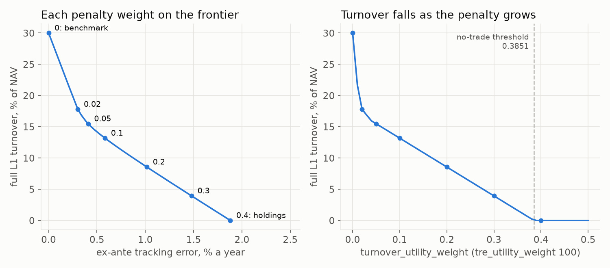

**Sample:** a synthetic four-asset problem with a 50/20/25/5 benchmark and 40/25/20/15
holdings, solved at 51 penalty weights; no simulation. **Producer:** the `exhibit` function of
[`examples/docs/turnover_and_transaction_costs.py`](../examples/docs/turnover_and_transaction_costs.py).
**Configuration:** [teaching registry](../tools/docs_analytics/teaching.json).

## ROSAA layers

A teaching exhibit of the [ROSAA case study](app_rosaa_multi_asset_allocation.md). On a
synthetic panel with known factor loadings, the strategic allocation meets its risk budgets
with capital weights that differ from them, and the tactical tilts against it follow the
alphas at a 3% ex-ante tracking error at every quarter end.

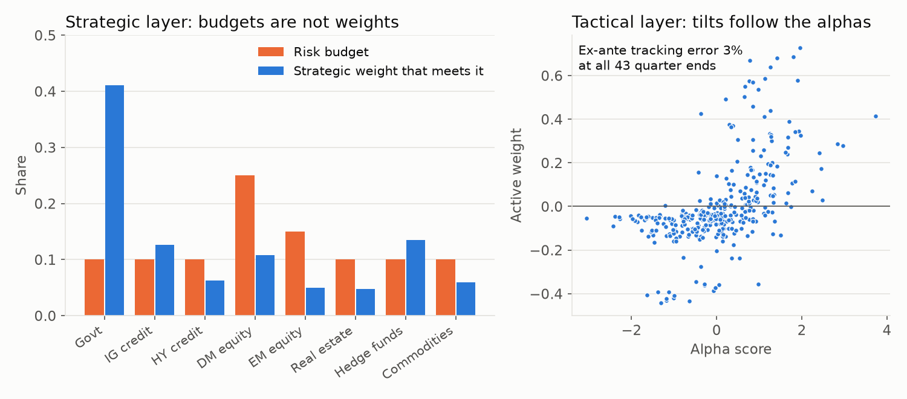

**Sample:** synthetic monthly panel of three factors and eight asset classes, December 2004 to
June 2025, seed 11; quarter ends from December 2014. **Producer:** the `exhibit` function of
[`examples/docs/app_rosaa_multi_asset_allocation.py`](../examples/docs/app_rosaa_multi_asset_allocation.py).
**Configuration:** [teaching registry](../tools/docs_analytics/teaching.json).

## Stress testing with options

A teaching exhibit of the [stress testing with options](stress_testing_with_options.md) page.
For a book of stocks with short calls and puts, each Equity scenario's P&L splits into a delta
part, linear in the moves, and a gamma part from full option repricing; the short options lose
against their delta line in both directions.

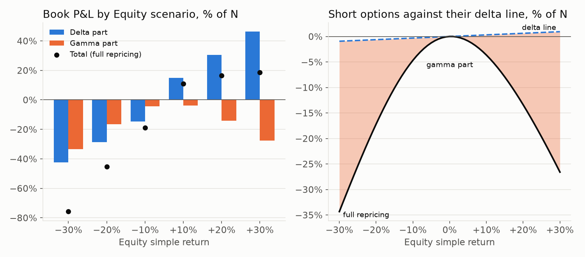

**Sample:** an offline three-stock book with a fixed three-factor model and conditionally
completed Equity moves; no simulation. **Producer:** the `exhibit` function of
[`examples/docs/stress_testing_with_options.py`](../examples/docs/stress_testing_with_options.py).
**Configuration:** [teaching registry](../tools/docs_analytics/teaching.json).

## Reproduce and update

From a source checkout with the documented contributor environment and C-local setup, one
command regenerates all six previews and their supporting tables:

~~~console
python -m tools.docs_analytics.run --all --output-root <new-C-local-bundle>
~~~

Use a new directory below `AGENT_LOCAL_ROOT`, outside OneDrive and the source tree.
The runner executes offline and records the imported environment and effective source bytes.
Regeneration retains the fixed sample and seed; it does not fetch current market prices.
Distribution versions alone cannot identify uncommitted source edits.

Follow the [generation and publication workflow](documentation_standard.md#analytical-conventions-and-figures)
to compare repeated runs, validate the bundle, review each preview at full resolution and
article width, and publish the six images with their shared provenance record. Full tables
and intermediate output remain C-local. Preview paths are stable; the
[provenance file](../examples/figures/analytics_manifest.json) identifies their reviewed generation.

Teaching exhibits are drawn by the canonical scripts of their pages and have their own
[manifest](images/analytics_manifest.json), which records the script, parameters, checks and
software versions of each image:

~~~console
python -m tools.docs_analytics.teaching --all --output-root <new-C-local-bundle>
python -m tools.docs_analytics.teaching --verify
~~~

## See also

- [Documentation standard](documentation_standard.md): conventions, producer details and refresh workflow.
- [Constraints](constraints.md): units, alignment and backend support.
- [Software design](software_design.md): construction, estimation and analytics ownership.

## References

- [OptimalPortfolios software citation](https://github.com/ArturSepp/OptimalPortfolios/blob/main/CITATION.cff).
- [qis software citation](https://github.com/ArturSepp/QuantInvestStrats/blob/main/CITATION.cff),
  for simulation, performance and risk analytics.
- [factorlasso software citation](https://github.com/ArturSepp/FactorLasso/blob/main/CITATION.cff),
  for sparse factor-model fitting.
