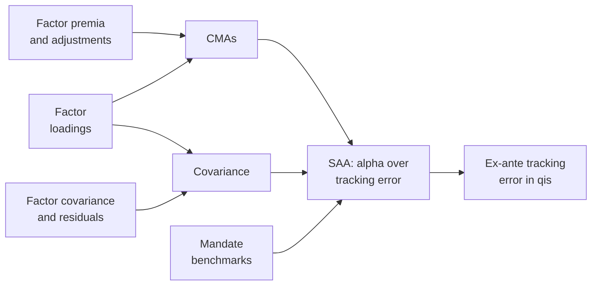

---
myst:
  html_meta:
    description: >-
      Case study of the MATF-CMA workflow, from capital market assumptions on multi-asset
      tradable factors to a strategic allocation: one loading matrix gives the expected returns
      and the covariance, and the allocation maximises active return against mandate benchmarks
      within a tracking-error budget, built with optimalportfolios on synthetic inputs.
---

# From capital market assumptions to strategic allocation (MATF-CMA)

*Author: [Artur Sepp](https://github.com/ArturSepp)*

A case study of a workflow that
[OptimalPortfolios](https://github.com/ArturSepp/OptimalPortfolios) implements.
Software citation: [CITATION.cff](https://github.com/ArturSepp/OptimalPortfolios/blob/main/CITATION.cff).

## Overview

Sepp, Hansen and Kastenholz (2026) derive capital market assumptions (CMAs) from multi-asset
tradable factors and use them for strategic asset allocation (SAA). The paper is a working paper.
This site cites it only in its public SSRN version, and this page quotes none of its equations,
exhibits or numbers.

The page is a case study of that workflow, built from pieces of the package that other pages
document and run on fixed synthetic inputs:

1. a factor model whose loadings give both the CMAs and the covariance;
2. a strategic allocation that maximises the CMA-weighted active return against a mandate
   benchmark within a tracking-error budget;
3. the ex-ante tracking error of the result, measured with the qis risk model.



In words: one loading matrix turns the factor premia into CMAs and the factor risk into the
covariance, the strategic allocation spends a tracking-error budget, measured with that
covariance, in the direction of the CMAs against each mandate's benchmark, and qis measures the
tracking error of the result.

## Study design and data

The study on this page is synthetic. It uses none of the paper's data and reproduces none of the
paper's results; every input is a fixed constant of the canonical script.

- **Universe.** Eight asset classes and four factors, Equity, Rates, Credit and Commodities, with
  the loadings, residual volatilities and residual adjustments of the table below (the script's
  `LOADINGS`, `RESIDUAL_VOLS` and `ADJUSTMENTS`).
- **Factors.** Annual volatilities of 15%, 6%, 5% and 18% (`FACTOR_VOLS`). Correlations
  (`FACTOR_CORR`) of −0.2 between Equity and Rates, 0.5 between Equity and Credit, 0.3 between
  Equity and Commodities, 0.1 between Rates and Credit, −0.1 between Rates and Commodities and
  0.2 between Credit and Commodities. Premia of 4.5%, 1.0%, 1.5% and 2.0% a year per unit of
  loading (`PREMIA`).
- **Risk-free rate.** 3% a year (`RISK_FREE_RATE`).
- **Mandates.** Three benchmarks (`BENCHMARKS`) hold the same 5% in HY credit, 5% in real
  estate, 10% in hedge funds and 5% in commodities, and split the rest between government bonds,
  IG credit, DM equity and EM equity as 35/20/15/5 (Conservative), 20/15/30/10 (Balanced) and
  10/5/45/15 (Growth).
- **Strategic allocation.** Long-only and fully invested, with an ex-ante tracking-error budget
  of 1% a year against the mandate benchmark (`TE_BUDGET`) and no other constraint, at one
  synthetic decision date, 31 December 2025.
- **Rolling check.** The pitfall below uses the four quarter ends of 2025, the same covariance at
  each, constant prices, and CMA vintages dated 31 December 2024 and 30 June 2025.
- **Units and basis.** No return series is sampled or simulated, so no return basis or estimation
  grid applies. CMAs and premia are annual expected returns in decimals, the covariance is annual
  in fractional return squared, and tracking error is an annual volatility in its square-root
  units.

| Asset | Equity | Rates | Credit | Commodities | Residual volatility | Adjustment |
|---|---|---|---|---|---|---|
| Govt bonds | 0.0 | 1.0 | 0.0 | 0.0 | 2.0% | 0.0% |
| IG credit | 0.1 | 0.7 | 0.6 | 0.0 | 2.0% | 0.0% |
| HY credit | 0.4 | 0.2 | 1.0 | 0.0 | 3.0% | 0.0% |
| DM equity | 1.0 | 0.0 | 0.0 | 0.0 | 3.0% | 0.0% |
| EM equity | 1.2 | 0.0 | 0.2 | 0.2 | 5.0% | 0.0% |
| Real estate | 0.6 | 0.4 | 0.2 | 0.0 | 8.0% | −1.0% |
| Hedge funds | 0.3 | 0.0 | 0.2 | 0.1 | 3.5% | +1.0% |
| Commodities | 0.2 | −0.1 | 0.0 | 1.0 | 6.0% | 0.0% |

**No paper data.** The page uses none of the paper's inputs or estimates: every number on it
comes from the synthetic design above.

## Configuration

**The CMA identity.** The page's modelling assumption is that one loading matrix gives both the
expected returns and the covariance:

$$
\mathrm{CMA}_i = r_f + \beta_i^{\top} \lambda + \mathrm{adj}_i, \qquad \Sigma = \beta \Sigma_F \beta^{\top} + D .
$$

Here $\beta_i$ is row $i$ of the loadings $\beta$, $\lambda$ the vector of factor premia per unit
of loading, $r_f$ the risk-free rate and the last term the residual adjustment of asset $i$;
$\beta$, $\Sigma_F$ and $D$ are as on the [conventions page](conventions.md#notation), with $D$
diagonal here. On this page $\lambda$ denotes the premia, as in FactorLasso's article below, and
not the EWMA decay of the conventions page. The identity is this page's assumption, not a
statement quoted from the paper. Its factor term pays for factor exposure only: the residual
variance of an asset earns nothing unless its adjustment pays for it.

In the package, `FactorCovarEstimator` estimates the loadings with FactorLasso and assembles the
covariance in this form; see [factor covariance with HCGL](factor_covariance_hcgl.md#the-factor-model-and-its-covariance).
FactorLasso's article
[from loadings to portfolio risk and capital market assumptions](https://factorlasso.readthedocs.io/en/latest/app_portfolio_risk_models.html)
starts from fitted loadings, builds the risk model and the CMAs from them, and audits the CMAs
against the loadings. This page starts where that article stops, from given loadings and CMAs,
and builds the allocation. The package itself estimates no factor premia and has no CMA
function: the canonical script,
[`examples/docs/app_cma_strategic_allocation.py`](../examples/docs/app_cma_strategic_allocation.py),
builds both sides from its constants with pandas:

```python
import numpy as np
import pandas as pd
import optimalportfolios as op

beta = pd.DataFrame(LOADINGS, index=ASSETS, columns=FACTORS)
premia = pd.Series(PREMIA, index=FACTORS)
factor_covar = pd.DataFrame(np.outer(FACTOR_VOLS, FACTOR_VOLS) * np.array(FACTOR_CORR),
                            index=FACTORS, columns=FACTORS)
residual_var = pd.Series(np.square(RESIDUAL_VOLS), index=ASSETS)
adjustments = pd.Series(ADJUSTMENTS, index=ASSETS)

cma = RISK_FREE_RATE + beta @ premia + adjustments
covar = beta @ factor_covar @ beta.T + np.diag(residual_var)
```

The script rebuilds both with explicit sums over the factors and checks that they share the
loading matrix. The factor block $\Sigma - D$ has rank 4, and the factor-implied CMAs
$\beta \lambda$ lie in its column space, because $\beta \lambda = (\beta \Sigma_F) \Sigma_F^{-1} \lambda$
and $\beta \Sigma_F$ holds the covariances of the assets with the factors. CMAs built from
another loading matrix fail this test; the script checks one in which government bonds gain a
credit loading.

**The strategic allocation.** For each mandate the allocation solves

$$
\max_{w} \mathrm{CMA}^{\top} (w - w^{\mathrm{bm}}) \quad \text{subject to} \quad \mathrm{TE}(w) \leq \tau, \quad \mathbf{1}^{\top} w = 1, \quad w \geq 0,
$$

with a budget $\tau$ of 1% a year and $\mathbf{1}$ the vector of ones. This is the objective of
[tactical allocation: alpha over tracking error](alpha_over_tracking_error.md), with the CMAs in
place of the alphas and a mandate benchmark in place of the strategic allocation;
[minimum tracking error](minimum_tracking_error.md) minimises the same active risk when there
are no expected returns. `wrapper_maximise_alpha_over_tre` solves it at one date and returns the
weights with an `OptimizationOutcome`; `rolling_maximise_alpha_over_tre` solves it at every date
of a covariance dictionary and takes dated CMA vintages as its `alphas`. `Constraints` is fully
invested by default; its fields `is_long_only` and `tracking_err_vol_constraint` set the
long-only and tracking-error rows, the latter defined under
[total tracking error](constraints.md#total-tracking-error):

```python
constraints = op.Constraints(is_long_only=True, tracking_err_vol_constraint=TE_BUDGET)
saa = {}
for mandate, weights in BENCHMARKS.items():
    benchmark = pd.Series(weights, index=ASSETS)
    saa[mandate], outcome = op.wrapper_maximise_alpha_over_tre(
        pd_covar=covar, alphas=cma, benchmark_weights=benchmark, constraints=constraints)
    if not (outcome.accepted and outcome.compliant):
        raise RuntimeError(f'{mandate}: {outcome.status}; {outcome.reason}')

date = pd.Timestamp('2025-12-31')  # Synthetic decision date, not a data cutoff.
risk_model = op.build_risk_model({date: covar})
tracking_errors = {
    mandate: risk_model.compute_tre_at_date(
        benchmark_weights=pd.Series(BENCHMARKS[mandate], index=ASSETS),
        portfolio_weights=weights, date=date)
    for mandate, weights in saa.items()}
```

[Solver numerics and outcomes](solver_numerics_and_outcomes.md) states what an accepted and
compliant outcome means. `build_risk_model` hands the covariance to `qis.RiskModel`, whose
`compute_tre_at_date` measures the ex-ante tracking error; see
[the qis risk model](portfolio_risk_analytics.md#ex-ante-tracking-error-and-the-qis-risk-model).
The script checks it against the explicit quadratic form $\sqrt{d^{\top} \Sigma d}$.

**The active return and the risk-free rate.** A fully invested portfolio against a benchmark that
sums to one has $\mathbf{1}^{\top} d = 0$ for the active weights $d = w - w^{\mathrm{bm}}$. The
identity then splits the expected active return into two parts, and the risk-free rate drops
out:

$$
\mathrm{CMA}^{\top} d = r_f \mathbf{1}^{\top} d + \lambda^{\top} \beta^{\top} d + \mathrm{adj}^{\top} d = \lambda^{\top} (\beta^{\top} d) + \mathrm{adj}^{\top} d .
$$

The first part is the premia earned on the active factor exposure $\beta^{\top} d$, the second
what the adjustments contribute. Total and excess CMAs therefore give the same allocation, which
the script confirms for each mandate.

> **Pitfall.** A missing CMA is not a neutral CMA. `rolling_maximise_alpha_over_tre`
> forward-fills the CMA vintages onto the covariance dates and then sets any missing value to
> zero, below every CMA of the universe; the previous vintage's value is not carried forward. In
> the script, a vintage dated 30 June 2025 without the EM equity CMA sells the whole 10% EM
> position of the Balanced mandate from that date on and holds 11.9 points more DM equity than
> the benchmark, where the complete vintage adds 7.9 points of EM. `wrapper_maximise_alpha_over_tre`
> instead removes an asset whose CMA is NaN from the solve, which also leaves it at zero weight.
> Fill a gap before the call with the asset's factor-implied CMA $r_f + \beta_i^{\top} \lambda$,
> which every asset with loadings has; for EM equity, which carries no adjustment, that restores
> the allocation.

## Results

All numbers in this section are the canonical script's, on its synthetic inputs; none is a result
of the paper. The CMAs range from 4.0% for government bonds to 9.1% for EM equity:

| Asset | Factor-implied excess return | Adjustment | CMA | Volatility |
|---|---|---|---|---|
| Govt bonds | 1.00% | 0.00% | 4.00% | 6.3% |
| IG credit | 2.05% | 0.00% | 5.05% | 6.1% |
| HY credit | 3.50% | 0.00% | 6.50% | 10.0% |
| DM equity | 4.50% | 0.00% | 7.50% | 15.3% |
| EM equity | 6.10% | 0.00% | 9.10% | 20.5% |
| Real estate | 3.40% | −1.00% | 5.40% | 12.4% |
| Hedge funds | 1.85% | +1.00% | 5.85% | 6.8% |
| Commodities | 2.80% | 0.00% | 5.80% | 20.1% |

For each of the three mandates the solve is accepted and compliant, the budget binds at an
ex-ante tracking error of 1.00% from `qis.RiskModel` and from the explicit quadratic form, and
real estate is the only asset held at zero. The script certifies each allocation without the
solver. With the zero set fixed, the stationarity conditions give the free active weights in
closed form up to one scalar, which the binding budget fixes, and the positive multiplier of the
zero bound shows that no long-only allocation does better. The solver's weights agree with this
closed form to within 0.005 percentage points.

The closed form depends on the benchmark only through the benchmark weights of the assets held
at zero. The three benchmarks hold the same 5% in real estate, so the active weights are the same
for the three mandates: the CMAs set the tilt, and each benchmark sets where it starts. Without a
binding bound the active weights would not depend on the benchmark at all, as the
[closed form of alpha over tracking error](alpha_over_tracking_error.md#the-closed-form) shows.
The active weights of the Balanced mandate, in percentage points, with the factor-implied CMAs
$r_f + \beta_i^{\top} \lambda$ alone and with the adjustments:

| Asset | Balanced benchmark | Active, factor-implied CMAs only | Active, with adjustments |
|---|---|---|---|
| Govt bonds | 20.0 | −3.9 | −6.3 |
| IG credit | 15.0 | +6.5 | +5.5 |
| HY credit | 5.0 | +3.4 | +1.6 |
| DM equity | 30.0 | −1.9 | −4.6 |
| EM equity | 10.0 | +6.1 | +7.9 |
| Real estate | 5.0 | +0.3 | −5.0 |
| Hedge funds | 10.0 | −10.0 | +3.4 |
| Commodities | 5.0 | −0.5 | −2.4 |

With the factor-implied CMAs alone, hedge funds are the asset held at zero, and the budget binds
as well. With the adjustments, the expected active return is 0.29% a year for each mandate, an
information ratio of 0.29 against the 1% budget, of which the adjustments contribute 0.08%, or
29%.

![Left: for eight synthetic asset classes, the factor-implied excess return of each CMA, from 1.0%
for government bonds to 6.1% for EM equity, and the residual adjustments, minus one point for
real estate and plus one point for hedge funds. Right: active weights against the Balanced
benchmark at a 1% tracking-error budget, with the factor-implied CMAs alone, where hedge funds are
sold out at minus 10 points, and with the adjustments, where hedge funds are 3.4 points
overweight and real estate is sold out at minus 5 points.](images/cma_decomposition_saa.png)

*Figure: the two parts of each synthetic CMA and the strategic allocations they imply. The
adjustments are small next to the factor-implied parts but move the allocation by several points.
Drawn by the `exhibit` function of the canonical script; the
[analytics gallery](analytics_gallery.md) lists its provenance.*

> **Insight.** Under the identity, residual risk earns only what an adjustment pays it. With the
> factor-implied CMAs alone, the allocation sells the whole 10% hedge-fund position; the
> one-point adjustment of hedge funds turns that into a 3.4-point overweight. The two
> adjustments average 0.25% in absolute value across the eight assets, against 3.15% for the
> factor-implied parts, yet they supply 29% of the expected active return.

## What the study does and does not show

- No result of the paper is reproduced. The universe, factors, premia, adjustments and
  benchmarks are synthetic, and the CMA numbers are illustrative: they say nothing about the
  paper's estimates or about the expected returns of real assets.
- It shows that the package implements the workflow as configured here: CMAs and covariance from
  one loading matrix, a strategic allocation by alpha over tracking error against three mandate
  benchmarks, and an ex-ante tracking error that meets its budget.
- It shows two properties of that configuration: the risk-free rate does not move the allocation
  of a fully invested mandate, and in the example two one-point adjustments move the allocation
  by several points and supply 29% of its expected active return.
- It estimates nothing. The loadings, premia, factor covariance and residual variances are given,
  so the page shows neither estimation error nor the effect of HCGL or of the premia estimates.
  The identity is a modelling assumption of the page, not a tested property of asset returns.
- It has no backtest, transaction costs, turnover or group limits, and one decision date: the
  allocations are ex-ante targets.

## Reproduce

The canonical script runs offline and asserts every number and property above:

```console
python -m examples.docs.app_cma_strategic_allocation
```

The page reproduces none of the paper's estimates, which rest on licensed index and
factor-history data.

## See also

- [Tactical allocation: alpha over tracking error and yield targets](alpha_over_tracking_error.md)
- [Minimum tracking error](minimum_tracking_error.md)
- [Factor covariance with HCGL](factor_covariance_hcgl.md)
- [Ex-ante risk contributions, betas and the qis risk model](portfolio_risk_analytics.md)
- [Portfolio constraints](constraints.md)
- [Strategic and tactical allocation with HCGL covariance (ROSAA)](app_rosaa_multi_asset_allocation.md)
- [Research papers and replication](research_papers.md)
- [FactorLasso: from loadings to portfolio risk and capital market assumptions](https://factorlasso.readthedocs.io/en/latest/app_portfolio_risk_models.html)

## References

- Sepp, A., Hansen, E. and Kastenholz, M. (2026). *Capital Market Assumptions and Strategic Asset
  Allocation Using Multi-Asset Tradable Factors*. Working paper,
  [SSRN 6785958](https://papers.ssrn.com/sol3/papers.cfm?abstract_id=6785958).
- [OptimalPortfolios software citation](https://github.com/ArturSepp/OptimalPortfolios/blob/main/CITATION.cff).
- [FactorLasso software citation](https://github.com/ArturSepp/FactorLasso/blob/main/CITATION.cff).
- [qis software citation](https://github.com/ArturSepp/QuantInvestStrats/blob/main/CITATION.cff).
