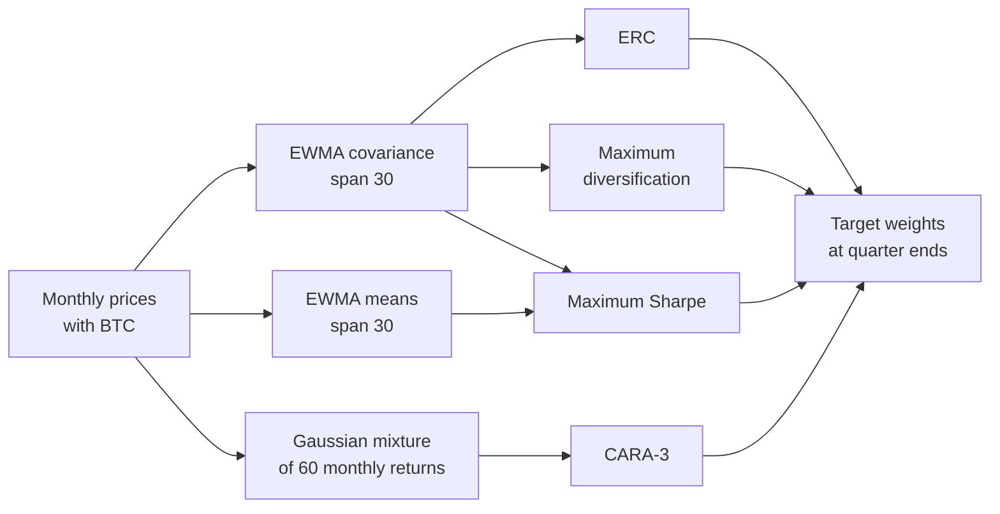

---
myst:
  html_meta:
    description: >-
      Case study of optimal allocation to cryptocurrencies in diversified portfolios (Risk, 2023):
      equal risk contributions, maximum diversification, maximum Sharpe and CARA utility under a
      Gaussian mixture, with the study design, the paper's results, the equivalent
      optimalportfolios configuration and the current API run on the ETF-derived columns of the
      frozen 2023 panel.
---

# Cryptocurrencies in diversified portfolios

*Author: [Artur Sepp](https://github.com/ArturSepp)*

A case study of a paper whose four allocation methods
[OptimalPortfolios](https://github.com/ArturSepp/OptimalPortfolios) implements.
Software citation: [CITATION.cff](https://github.com/ArturSepp/OptimalPortfolios/blob/main/CITATION.cff).

## Overview

Sepp (2023) asks how much of a diversified portfolio a systematic rule should put into Bitcoin
or Ether. The paper compares four allocation methods: two use risk alone, equal risk
contributions (ERC) and maximum diversification, and two use risk and return, the maximum Sharpe
ratio and CARA utility under a Gaussian mixture. It runs them in roll-forward simulations of an
alternatives mandate and a balanced mandate. Its abstract reports that all four methods keep a
positive allocation to the cryptocurrency, with a median of about 2.7%.

This page reports the study as the paper states it and maps each method to one objective of the
package's rolling dispatcher. It then runs that configuration twice, offline: on a synthetic
panel with a fat-tailed crypto asset, to check the mechanism, and with the current API on the
ETF-derived columns of the frozen 2023 panel, the price file kept with the paper. Neither run
reproduces the paper's numbers.



In words: the three covariance-based methods share one EWMA covariance per quarter end, maximum
Sharpe adds EWMA means of the same returns, CARA-3 fits its own three-component mixture to the
latest 60 monthly returns and reads no covariance, and each method gives target weights at every
quarter end.

## Study design and data

Section, equation and table numbers refer to the manuscript tracked in the repository,
[`crypto_allocation_sepp_2023.tex`](../papers/crypto_allocation_risk_2023/paper/crypto_allocation_sepp_2023.tex).

- **Mandates (Section 2).** An alternatives mandate invests only in alternative assets. A
  balanced mandate holds a 60/40 equity/bond portfolio, proxied by the SPY and IEF funds
  rebalanced quarterly, at 75% and alternatives at 25%.
- **Universe (Section 2).** Seven alternatives: hedge funds (HFRX Global Hedge Fund Index),
  private equity (PSP ETF), real estate (REET ETF), discretionary macro (SG Macro Trading
  Index), systematic macro (SG CTA Index), commodities (COMT ETF) and gold (GLD ETF). The
  cryptocurrency is Bitcoin (BTC) or Ether (ETH).
- **Portfolios (Section 4, Table 1).** Six templates: the alternatives mandate and the
  75%/25% balanced/alternatives mandate, each without a cryptocurrency, with BTC or with ETH. The
  four templates with a cryptocurrency and the four methods give 16 portfolios.
- **Sample (Sections 3.1 and 4).** BTC prices start on 19 July 2010 and ETH prices on
  7 August 2015; for estimation, ETH is backfilled with BTC before its start. Performance is
  evaluated from 31 March 2016 to 30 June 2023.
- **Estimation (Section 4 and Equation 1).** Monthly log returns. At each quarter end the paper
  uses a six-year window for means, covariances and the mixture. The covariance of the
  risk-based methods is an EWMA with a span of 30 months, so a decay of $\lambda = 1 - 2/31$,
  with spectral regularisation after Koné (2021).
- **Rebalancing and costs (Section 4).** Quarterly, at quarter-end prices, with volume-based
  costs of 50 basis points; units stay fixed between rebalancing dates.
- **Methods (Sections 4.1 to 4.4).** ERC uses equal risk budgets in the alternatives mandate. In
  the balanced mandate it gives the 60/40 portfolio a risk budget of 75% and splits the other 25%
  equally, because a fixed 75% weight may leave ERC without a solution (Section 4.1). Maximum
  diversification (Equations 5 and 6), maximum Sharpe ratio (Equation 7) and CARA utility with
  risk aversion $\gamma = 0.5$ under a three-component Gaussian mixture (Equations 8 to 10) are
  long-only and fully invested, with the 60/40 weight fixed at 75% in the balanced mandate. The
  number of components was chosen by cross-validation and the mixture fitted with scikit-learn
  (Section 3.4).
- **Units.** Weights are fractions of the portfolio. Returns are annualised, and Sharpe ratios
  use average log returns in excess of the three-month Treasury-bill rate (Section 3.1).

The repository keeps the study's price panel,
`papers/crypto_allocation_risk_2023/replication/data/crypto_allocation_prices.csv`.
This page reads six of its columns: `60/40`, `BTC`, and the four ETF proxies `PE`, `RealEstate`,
`Commodities` and `Gold`; the repository's loader,
[`load_prices.py`](../papers/crypto_allocation_risk_2023/replication/load_prices.py), backfills
REET with IYR and COMT with GSG before their launches. It does not read the hedge-fund and SG
index columns, which come from licensed index data, nor the `ETH` column, which is backfilled
with BTC before August 2015. Every number on this page that comes from the panel therefore
concerns BTC, and the alternatives are the four ETF proxies only. Without dates that miss a
price, the panel starts on BTC's first price, 19 July 2010, which gives the estimators their
history before the first allocation.

On this page, returns are monthly log returns from month-end prices; the allocations are made at
the 30 quarter ends from 31 March 2016 to 30 June 2023; means and covariances are annualised;
weights are fractions of the portfolio. No performance is computed.

## Configuration

### The four methods in the package

Each method of the paper is one member of `PortfolioObjective`, routed by
`compute_rolling_optimal_weights` as the [objective router](optimization_module_readme.md#dispatch-flow)
describes:

| Paper (section) | `PortfolioObjective` member | Method page |
|---|---|---|
| ERC (4.1) | `EQUAL_RISK_CONTRIBUTION` | [Risk budgeting](risk_budgeting.md) |
| Maximum diversification (4.2) | `MAX_DIVERSIFICATION` | [Maximum diversification](maximum_diversification.md) |
| Maximum Sharpe ratio (4.3) | `MAXIMUM_SHARPE_RATIO` | [Minimum variance, quadratic utility and maximum Sharpe](mean_variance_objectives.md) |
| CARA-3 (4.4) | `MAX_CARA_MIXTURE`, value `'MaxCarraMixture'` | [CARA utility under Gaussian mixtures](cara_gaussian_mixture.md) |

The canonical script,
[`examples/docs/app_crypto_allocation.py`](../examples/docs/app_crypto_allocation.py), fixes the
study's settings:

```python
METHODS = {'ERC': 'EQUAL_RISK_CONTRIBUTION', 'MaxDiv': 'MAX_DIVERSIFICATION',
           'MaxSharpe': 'MAXIMUM_SHARPE_RATIO', 'CARA-3': 'MAX_CARA_MIXTURE'}
SPAN = 30
ROLL_WINDOW = 60
CARRA = 0.5
N_MIXTURES = 3
BALANCED_WEIGHT = 0.75
REPORT_START, REPORT_END = '2016-03-31', '2023-06-30'
```

The covariance is an `EwmaCovarEstimator` of monthly log returns (`returns_freq='ME'`) with span
30, keyed by quarter ends (`rebalancing_freq='QE'`) and fitted with `fit_rolling_covars`; the
[covariance estimators page](covariance_estimators.md#ewma-covariance) defines it. One call of
the dispatcher per method then allocates a template. In the balanced template, the first column
is the balanced portfolio: ERC gives it a 75% risk budget through `risk_budget`, as the paper
does, and the other three methods hold it at exactly 75% through equal `min_weights` and
`max_weights` of `Constraints` (see [instrument boxes](constraints.md#exposure-long-only-and-instrument-boxes)).
The mixture argument is spelled `n_mixures`, a spelling the package keeps.

```python
def covariances(prices: pd.DataFrame) -> dict:
    """Return the quarter-end EWMA covariances of monthly log returns in the report window."""
    return op.EwmaCovarEstimator(returns_freq='ME', span=SPAN, rebalancing_freq='QE') \
        .fit_rolling_covars(prices=prices, time_period=qis.TimePeriod(REPORT_START, REPORT_END))


def allocate(prices: pd.DataFrame, balanced: bool) -> dict:
    """Run the four methods on one template; return a date-by-asset weight table per method."""
    covar_dict = covariances(prices)
    budget, pinned = None, op.Constraints()  # ERC: equal risk budgets, long-only
    if balanced:  # the first column is the balanced portfolio: a 75% risk budget or weight
        budget = pd.Series((1 - BALANCED_WEIGHT) / (prices.shape[1] - 1), index=prices.columns)
        budget.iloc[0] = BALANCED_WEIGHT
        lower, upper = pd.Series(0.0, index=prices.columns), pd.Series(1.0, index=prices.columns)
        lower.iloc[0] = upper.iloc[0] = BALANCED_WEIGHT
        pinned = op.Constraints(min_weights=lower, max_weights=upper)
    return {label: op.compute_rolling_optimal_weights(
        prices=prices, constraints=op.Constraints() if label == 'ERC' else pinned,
        covar_dict=covar_dict, portfolio_objective=op.PortfolioObjective[member],
        time_period=qis.TimePeriod(REPORT_START, REPORT_END), risk_budget=budget,
        returns_freq='ME', rebalancing_freq='QE', span=SPAN, roll_window=ROLL_WINDOW,
        carra=CARRA, n_mixures=N_MIXTURES)
        for label, member in METHODS.items()}
```

The manuscript states a six-year window for the mixture (Section 4). The script uses 60 monthly
returns, the value of the repository's article configuration (`OPTIMISATION_PARAMS` in
[`backtest_portfolios_for_article.py`](../papers/crypto_allocation_risk_2023/replication/backtest_portfolios_for_article.py)),
which also lets the first window close before 31 March 2016.

### The configuration on a synthetic panel

The script's synthetic panel has a balanced portfolio, a crypto asset and four alternatives,
monthly from July 2010 to June 2023, drawn with a Cholesky factor of fixed correlations. The
crypto asset has a monthly volatility of 15%, and with probability 5% a month's log return is 40
percentage points higher, which gives it a fat right tail. Both templates give 30 fully
invested, long-only allocations from 31 March 2016 to 30 June 2023:

```python
prices = simulated_prices(SEED)
alts = allocate(prices[ASSETS[1:]], balanced=False)
blend = allocate(prices, balanced=True)
for weights in [*alts.values(), *blend.values()]:
    assert weights.index[[0, -1]].strftime('%Y-%m-%d').tolist() == [REPORT_START, REPORT_END]
    assert len(weights) == 30 and np.allclose(weights.sum(axis=1), 1.0, atol=1e-6)
    assert (weights > -1e-8).all().all()
```

In the balanced template, ERC meets its budgets exactly: the risk shares
$w_i (\Sigma w)_i / \sigma(w)^2$, computed by explicit products, are 75% for the balanced
portfolio and 5% for each other asset at every quarter end. The weight of the balanced portfolio
then moves with the covariance, between 72% and 81%, while the other three methods hold it at
75%:

```python
for date, covar in covariances(prices).items():
    shares = risk_shares(blend['ERC'].loc[date].to_numpy(), covar.to_numpy())
    assert np.allclose(shares, [BALANCED_WEIGHT] + [0.05] * 5, atol=1e-5)
for label in ['MaxDiv', 'MaxSharpe', 'CARA-3']:
    assert np.allclose(blend[label]['Balanced'], BALANCED_WEIGHT, atol=1e-6)
assert abs(blend['ERC']['Balanced'].min() - 0.72) < 0.005
assert abs(blend['ERC']['Balanced'].max() - 0.81) < 0.005
```

The two risk-based methods treat the crypto asset as the paper explains. ERC gives the most
volatile asset the smallest weight at every quarter end. Maximum diversification, which favours
weakly correlated assets, holds more of it than ERC (Section 4.2): at every quarter end in the
balanced template, and in the median in the alternatives template:

```python
assert (alts['ERC'].idxmin(axis=1) == 'Crypto').all()
assert (blend['MaxDiv']['Crypto'] > blend['ERC']['Crypto']).all()
assert alts['MaxDiv']['Crypto'].median() > alts['ERC']['Crypto'].median()
```

### Maximum Sharpe and CARA-3 as the package runs them

`MAXIMUM_SHARPE_RATIO` estimates the expected returns inside the dispatcher. They are EWMA means
of the monthly log returns $r_1, \dots, r_t$ with the span $s = 30$ of the covariance, seeded with
the first return and annualised by $\mathrm{AN} = 12$:

$$
\hat\mu_t = \mathrm{AN} \left( \lambda^{t-1} r_1 + (1 - \lambda) \sum_{k=2}^{t} \lambda^{t-k} r_k \right),
\qquad \lambda = 1 - \frac{2}{s + 1} .
$$

They are not six-year sample means, and they are not in excess of cash. The dispatcher then
maximises $\hat\mu_t^{\top} w / \sigma(w)$ by the Charnes–Cooper transformation with CVXPY. At
every quarter end, its weights reach the ratio of a direct SciPy maximisation under the same
means summed explicitly:

```python
returns = monthly_log_returns(prices[ASSETS[1:]])
for date, covar in covariances(prices[ASSETS[1:]]).items():
    means = 12.0 * ewma_mean(returns.loc[:date].to_numpy(), SPAN)
    weights = alts['MaxSharpe'].loc[date].to_numpy()
    reference = sharpe_reference(means, covar.to_numpy())
    assert sharpe_ratio(weights, means, covar.to_numpy()) > sharpe_ratio(
        reference, means, covar.to_numpy()) - 1e-6
```

`MAX_CARA_MIXTURE` fits a Gaussian mixture with $K$ components of probability $p_j$, mean
$\mu_j$ and covariance $\Sigma_j$ to the last `roll_window` log returns at `returns_freq`. It uses
the package's own EM algorithm, `fit_gaussian_mixture`, started from k-means with a fixed seed,
not scikit-learn, and a fixed number of components. It annualises the fitted moments and
minimises with SLSQP

$$
f(w) = \sum_{j=1}^{K} p_j \exp\left( -\gamma \mu_j^{\top} w + \frac{\gamma^2}{2} w^{\top} \Sigma_j w \right) ,
$$

the expected value of $e^{-\gamma R_w}$ for the portfolio return $R_w = w^{\top} r$ when $r$ is
drawn from the mixture; this is the objective of the manuscript's Equation 10. Each term is the
exponential of a convex quadratic, so $f$ is convex, as Section 4.4 states, and CVXPY accepts it.
At the last quarter end, CVXPY on the refitted mixture gives the dispatcher's weights:

```python
window = returns.loc[:REPORT_END].iloc[-ROLL_WINDOW:].to_numpy()
mixture = op.fit_gaussian_mixture(x=window, n_components=N_MIXTURES, an_factor=12.0)
reference = cvxpy_cara(mixture.means, mixture.covars, mixture.probs)
assert np.abs(alts['CARA-3'].iloc[-1].to_numpy() - reference).max() < 1e-3
```

### Why the tail of the crypto asset matters

The certainty equivalent of CARA utility, $\mathrm{CE}(w) = -\gamma^{-1} \ln E[e^{-\gamma R_w}]$,
has the cumulant expansion

$$
\mathrm{CE}(w) = \kappa_1(R_w) - \frac{\gamma}{2} \kappa_2(R_w) + \frac{\gamma^2}{6} \kappa_3(R_w) - \dots ,
$$

which follows from $\ln E[e^{u R}] = \sum_{n \geq 1} \kappa_n u^n / n!$ at $u = -\gamma$. Here
$\kappa_1$, $\kappa_2$ and $\kappa_3$ are the mean, the variance and the third central moment. A
Gaussian has no cumulant beyond the second, so a mixture and the Gaussian with the same mean and
covariance first differ in the third moment. An upside tail, with a positive third moment, raises
the certainty equivalent of holding the asset, and a downside tail lowers it. This is the
argument of Ang, Morris and Savi (2023) that the paper extends to many assets (Section 4.4).

The script checks it on fixed inputs, with no simulation. A balanced portfolio has an annualised
mean of 6% and a volatility of 10%; a crypto asset has a mean of 14%, a volatility of 60% within
each component and a correlation of 0.3. In a component of probability 3%, the crypto mean is 300
percentage points above its overall mean, and the other component offsets it; the mirrored
mixture moves it down instead. Both mixtures have the same mean vector and covariance matrix,
which define the Gaussian:

```python
up, down = fixed_mixture(1.0), fixed_mixture(-1.0)
mean, covar = matched_gaussian(*up)
assert all(np.allclose(a, b) for a, b in zip((mean, covar), matched_gaussian(*down)))
crypto = {name: op.opt_maximize_cara_mixture(*mix, constraints=op.Constraints(),
                                             carra=CARRA)[1]
          for name, mix in [('upside tail', up), ('Gaussian', ([mean], [covar], [1.0])),
                            ('downside tail', down)]}
assert [round(weight, 2) for weight in crypto.values()] == [0.27, 0.25, 0.23]
```

> **Insight.** With the same mean and covariance, the direction of the tail moves the CARA
> allocation. In the two-asset example, the upside tail holds 27% in crypto, the Gaussian 25% and
> the downside tail 23%. The mixture objective can therefore hold more of an asset than a
> mean-variance rule, or less, for the same volatility.

For a single Gaussian, minimising the objective maximises
$\mu^{\top} w - \frac{\gamma}{2} w^{\top} \Sigma w$, whose maximum over two assets b and c with
$w_{\mathrm{b}} + w_{\mathrm{c}} = 1$ is

$$
w_{\mathrm{c}} = \frac{(\mu_{\mathrm{c}} - \mu_{\mathrm{b}}) / \gamma + \Sigma_{\mathrm{bb}} - \Sigma_{\mathrm{bc}}}
{\Sigma_{\mathrm{bb}} + \Sigma_{\mathrm{cc}} - 2 \Sigma_{\mathrm{bc}}}
$$

when it lies between zero and one. The SLSQP weights match this closed form and CVXPY, and the
third central moment of the crypto return is positive in the upside mixture and negative in the
downside one:

```python
gap = covar[0, 0] + covar[1, 1] - 2.0 * covar[0, 1]
closed_form = ((mean[1] - mean[0]) / CARRA + covar[0, 0] - covar[0, 1]) / gap
assert abs(crypto['Gaussian'] - closed_form) < 1e-4
assert abs(crypto['upside tail'] - cvxpy_cara(*up)[1]) < 1e-3
assert abs(crypto['downside tail'] - cvxpy_cara(*down)[1]) < 1e-3
third = [sum(p * (m[1] - mean[1]) ** 3 for p, m in zip(mix[2], mix[0])) for mix in (up, down)]
assert third[0] > 0.0 > third[1]
```

The CARA route takes its window from its own arguments, not from the covariance:

```python
cara_route = dict(prices=prices[ASSETS[1:]], constraints=op.Constraints(),
                  portfolio_objective=op.PortfolioObjective.MAX_CARA_MIXTURE,
                  time_period=qis.TimePeriod(REPORT_START, REPORT_END), returns_freq='ME')
same = op.compute_rolling_optimal_weights(covar_dict={}, roll_window=ROLL_WINDOW, **cara_route)
assert same.equals(alts['CARA-3'])  # the covariance dictionary is not read
short = op.compute_rolling_optimal_weights(covar_dict={}, **cara_route)
defaults = inspect.signature(op.compute_rolling_optimal_weights).parameters
assert defaults['roll_window'].default == 20 and defaults['returns_freq'].default == 'W-WED'
assert (short - same).abs().to_numpy().max() > 0.2
```

> **Pitfall.** The CARA route of `compute_rolling_optimal_weights` reads neither `covar_dict` nor
> `span`: an empty dictionary gives the same weights. Its window is `roll_window` observations at
> `returns_freq`, and the dispatcher's defaults are 20 and `'W-WED'`, not the study's 60 monthly
> returns. On the synthetic panel, omitting `roll_window` changes some CARA-3 weights by more
> than 20 percentage points.

## Results

### What the paper reports

The paper reports the median weight of the cryptocurrency over the quarterly rebalancing dates
from 31 March 2016 to 30 June 2023 (Sections 4.1 to 4.4):

| Method (section) | Alts with BTC | Alts with ETH | 75%/25% with BTC | 75%/25% with ETH |
|---|---|---|---|---|
| ERC (4.1) | 1.5% | 1.2% | 0.5% | 0.3% |
| Maximum diversification (4.2) | 2.1% | 1.6% | 3.4% | 1.8% |
| Maximum Sharpe ratio (4.3) | 4.8% | 2.8% | 5.7% | 2.2% |
| CARA-3 (4.4) | 26.1% | 12.6% | 24.1% | 12.1% |

and the change in the Sharpe ratio from adding the cryptocurrency to the same template without
it:

| Method (section) | Alts with BTC | Alts with ETH | 75%/25% with BTC | 75%/25% with ETH |
|---|---|---|---|---|
| ERC (4.1) | +0.14 | +0.17 | +0.04 | +0.04 |
| Maximum diversification (4.2) | +0.14 | +0.13 | +0.13 | +0.14 |
| Maximum Sharpe ratio (4.3) | +0.31 | +0.51 | +0.25 | +0.18 |
| CARA-3 (4.4) | +0.46 | +0.41 | +0.26 | +0.27 |

The paper also reports that:

- every method held a positive weight in the cryptocurrency at every quarterly rebalancing of
  every portfolio, except maximum Sharpe for ETH in the balanced mandate at the last date, and
  CARA-3 held the most (Section 5.1);
- maximum diversification held more than ERC because it can cut highly correlated assets
  (Section 4.2);
- in the balanced mandate, the CARA-3 weight sat at its 25% ceiling for most of the period, and
  the CARA-3 portfolios with a cryptocurrency had positively skewed returns (Section 4.4);
- adding the cryptocurrency changed neither the skewness nor the beta to the 60/40 portfolio of
  the ERC portfolios materially (Section 4.1), nor the drawdown and beta of the maximum
  diversification portfolios (Section 4.2);
- BTC and ETH contributed positively to portfolio returns under every method, also from early
  2021 to early 2023, when their own returns were negative, which the paper attributes to
  rebalancing (Section 5.2).

The paper's conclusion (Section 6) favours maximum diversification, and CARA utility under a
mixture for investors who seek positive skewness.

### Current API on the frozen 2023 panel

The same configuration runs on the two BTC templates of the frozen panel, with the four fund
proxies as the only alternatives. These are the current API's numbers, not the paper's:

```python
frozen = frozen_panel()
results = {name: allocate(frozen.iloc[:, 0 if balanced else 1:], balanced)
           for name, balanced in TEMPLATES.items()}
btc = {name: btc_weights(weights) for name, weights in results.items()}
for table in btc.values():
    assert table.index[[0, -1]].strftime('%Y-%m-%d').tolist() == [REPORT_START, REPORT_END]
    assert len(table) == 30 and (table[['ERC', 'MaxDiv']] > HELD).all().all()
    assert table.median().idxmax() == 'CARA-3' and 0.17 < table['CARA-3'].median() < 0.27
alts_btc, blend_btc = btc.values()
assert np.allclose(alts_btc.median().iloc[:3], [0.053, 0.063, 0.109], atol=1e-3)
assert np.allclose(blend_btc.median().iloc[:3], [0.013, 0.045, 0.030], atol=1e-3)
```

On the frozen panel, with the current API:

- the median BTC weight is 5.3% under ERC, 6.3% under maximum diversification and 10.9% under
  maximum Sharpe in the alternatives template, and 1.3%, 4.5% and 3.0% in the balanced template;
- CARA-3 holds the most, a median of about a fifth of the portfolio in both templates, and sits
  at its 25% ceiling at several quarter ends of the balanced template;
- ERC and maximum diversification hold BTC at every quarter end, while maximum Sharpe holds none
  at 5 of the 30 quarter ends in the alternatives template and at 6 in the balanced one, all in
  2020 and 2022;
- the ERC weight of the 60/40 portfolio, set by its 75% risk budget, moves between 68% and 83%.


*Figure: how much each method allocates to BTC, current API on the frozen 2023 panel, ETF-derived
columns only. Within each column, quarters run from March 2016 on the left to June 2023 on the
right; the two panels have their own vertical scales. Drawn by the `exhibit` function of the
canonical script; the [analytics gallery](analytics_gallery.md) lists its provenance.*

## What the study does and does not show

- **An allocation is not a forecast.** Each weight is the output of a rule applied to past
  returns. The study shows that four rules would have held a cryptocurrency throughout 2016 to
  2023; it does not show that the cryptocurrency will earn a premium. Section 3.2 cautions that
  most of BTC's gains came before the end of 2017, when it was little known.
- **One historical path.** The Sharpe-ratio gains are those of one path of index and fund
  proxies, net of 50 basis points of costs, and the paper reports no standard errors for them.
- **Today's maximum Sharpe and CARA-3 differ from the paper's methods.** The package estimates
  the means of maximum Sharpe as EWMA means with span 30, not as six-year sample means, and fits
  the CARA mixture with its own EM algorithm, with three components fixed rather than chosen by
  cross-validation. `EwmaCovarEstimator` also subtracts an EWMA mean before the second moment by
  default (`demean=True`) and applies no spectral regularisation. The numbers of the previous
  section are therefore the current API on the frozen 2023 panel, not the paper's results.
- **A smaller universe.** Without the hedge-fund and SG index columns, each remaining asset,
  BTC included, takes a larger share, so those numbers are not comparable with the paper's
  tables either.
- **Maximum Sharpe needs a positive mean.** On 30 September 2022, no balanced portfolio with the
  60/40 weight at 75% had a positive EWMA mean, so the Charnes–Cooper program, which fixes the
  portfolio mean at a positive value, had no feasible point. The package then returned the
  previous weights drifted to the date, with the 60/40 portfolio at 76.5%, as described in
  [acceptance and fallback](solver_numerics_and_outcomes.md#acceptance-and-fallback): a fallback
  can breach the mandate.
- **The synthetic panel shows the mechanism only.** Its numbers come from a simulation and say
  nothing about cryptocurrencies.

## Reproduce

The canonical script runs offline, in under 30 seconds, and asserts every statement the page
makes about the package, the synthetic panel and the frozen panel. It reads the tracked price
panel, so it runs from a source checkout with the core install:

```console
python -m examples.docs.app_crypto_allocation
```

The test suite runs it through `src/optimalportfolios/tests/documentation_examples_test.py`. The
replication workflow,
[`.github/workflows/replication.yml`](../.github/workflows/replication.yml), runs one offline
suite, for another paper's data layer; it runs no test of the cryptocurrency paper's folder. That folder's historical backtest,
`backtest_portfolios_for_article.py`, downloads the Treasury-bill rate with `yfinance` when it is
imported, so it is not an offline reproduction.

## See also

- [Choosing an objective](optimization_module_readme.md)
- [Risk budgeting](risk_budgeting.md)
- [Maximum diversification](maximum_diversification.md)
- [Minimum variance, quadratic utility and maximum Sharpe](mean_variance_objectives.md)
- [CARA utility under Gaussian mixtures](cara_gaussian_mixture.md)
- [Covariance estimators](covariance_estimators.md)
- [Covariance factorisation, solver outcomes and constraint residuals](solver_numerics_and_outcomes.md)
- [Portfolio constraints](constraints.md)
- [Research papers and replication](research_papers.md)

## References

- Sepp, A. (2023). *Optimal Allocation to Cryptocurrencies in Diversified Portfolios*. Risk,
  October 2023. [Risk](https://www.risk.net/cutting-edge/7957914/optimal-allocation-to-cryptocurrencies-in-diversified-portfolios);
  [SSRN 4217841](https://ssrn.com/abstract=4217841).
- Ang, A., Morris, T. and Savi, R. (2023). *Asset Allocation with Crypto: Application of
  Preferences for Positive Skewness*. The Journal of Alternative Investments, 25(4), 7–28.
  [DOI 10.3905/jai.2023.1.185](https://doi.org/10.3905/jai.2023.1.185). The manuscript cites the
  2022 working paper, [SSRN 4042239](https://ssrn.com/abstract=4042239).
- Charnes, A. and Cooper, W. W. (1962). *Programming with Linear Fractional Functionals*. Naval
  Research Logistics Quarterly, 9(3–4), 181–186.
  [DOI 10.1002/nav.3800090303](https://doi.org/10.1002/nav.3800090303).
- Choueifaty, Y. and Coignard, Y. (2008). *Toward Maximum Diversification*. The Journal of
  Portfolio Management, 35(1), 40–51.
  [DOI 10.3905/jpm.2008.35.1.40](https://doi.org/10.3905/jpm.2008.35.1.40).
- Koné, N. (2021). *Regularized Maximum Diversification Investment Strategy*. Econometrics, 9(1),
  1. [DOI 10.3390/econometrics9010001](https://doi.org/10.3390/econometrics9010001).
- Maillard, S., Roncalli, T. and Teïletche, J. (2010). *The Properties of Equally Weighted Risk
  Contribution Portfolios*. The Journal of Portfolio Management, 36(4), 60–70.
  [DOI 10.3905/jpm.2010.36.4.060](https://doi.org/10.3905/jpm.2010.36.4.060).
- [OptimalPortfolios software citation](https://github.com/ArturSepp/OptimalPortfolios/blob/main/CITATION.cff).
- [qis software citation](https://github.com/ArturSepp/QuantInvestStrats/blob/main/CITATION.cff).
