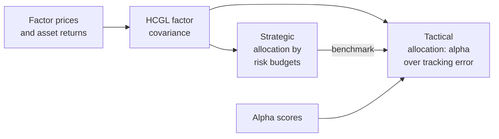

---
myst:
  html_meta:
    description: >-
      Case study of the ROSAA framework in The Journal of Portfolio Management: a hierarchical
      clustering group LASSO factor covariance, strategic allocation by risk budgets and tactical
      allocation as alpha over tracking error, with the study design, results, the equivalent
      optimalportfolios configuration and an offline reproduction of the mechanism.
---

# Strategic and tactical allocation with HCGL covariance (ROSAA)

*Author: [Artur Sepp](https://github.com/ArturSepp)*

A case study of the framework that
[OptimalPortfolios](https://github.com/ArturSepp/OptimalPortfolios) implements.
Software citation: [CITATION.cff](https://github.com/ArturSepp/OptimalPortfolios/blob/main/CITATION.cff).

## Overview

Sepp, Ossa and Kastenholz (2026) describe a framework for the robust optimisation of strategic
and active asset allocation (ROSAA) of multi-asset portfolios. It has three layers:

1. a covariance matrix from a factor model whose loadings are estimated by a hierarchical
   clustering group LASSO (HCGL) on multi-asset tradable factors;
2. a strategic allocation (SAA) by risk budgets under that covariance;
3. a tactical allocation (TAA) that maximises alpha against the strategic allocation under a
   tracking-error budget.

This page reports the study as the article states it, maps each layer to the package, and runs
the same configuration offline on a synthetic panel with known factor loadings. The script
reproduces the mechanism, not the article's numbers.



In words: one covariance, refitted each quarter, feeds both layers; the strategic allocation meets its risk budgets, and
the tactical allocation tilts away from it in the direction of the alphas, within a
tracking-error budget measured with the same covariance.

## Study design and data

The article's empirical application covers:

- **Strategic universe.** Eleven sub-asset classes proxied by indexes: five fixed-income classes,
  equity and five alternatives, under a top-level target of 25% fixed income, 35% equity and 40%
  alternatives (Exhibits 1 and 2).
- **Tactical universe.** 28 index-proxied instruments, 13 in fixed income, 5 in equity and 10 in
  alternatives, each with bounds, a turnover group and a monthly or quarterly rebalancing
  frequency (Exhibit 5).
- **Sample.** Data from 31 December 1999; the backtest runs from 31 December 2004 to 30 June 2025.
- **Factors.** Seven multi-asset tradable factors built from futures and investable trackers,
  each targeted to 10% volatility: equity, rates, credit, carry, inflation, commodities and a
  private-equity premium factor.
- **Covariance.** EWMA spans of 36 months for liquid and 12 quarters for illiquid instruments,
  and a group-LASSO penalty of $10^{-5}$ chosen on a grid. Clusters come from Ward linkage on
  EWMA correlations, and private-asset returns are unsmoothed before estimation.
- **Strategic layer.** Constrained risk budgeting, rebalanced quarterly, with budgets per
  sub-asset class set so that the backtest's average weights match the target allocation
  (Exhibit 3).
- **Tactical layer.** Rebalanced monthly against the strategic allocation, with a 3%
  tracking-error limit per core asset class, group turnover limits and 20 basis points of
  transaction costs per traded volume.
- **Reference.** A static benchmark rebalanced quarterly to fixed weights.

## Configuration

Each layer of the article maps to one call of the package. The configuration below is that of the
canonical script,
[`examples/docs/app_rosaa_multi_asset_allocation.py`](../examples/docs/app_rosaa_multi_asset_allocation.py),
on a synthetic panel of three factors and eight asset classes, monthly from December 2004 to
June 2025.

The covariance is refitted at every quarter end with the hierarchical-clustering group LASSO of
[FactorLasso](https://github.com/ArturSepp/FactorLasso), with the article's span of 36 months and
penalty of $10^{-5}$:

```python
estimator = op.FactorCovarEstimator(
    lasso_model=LassoModel(model_type=LassoModelType.HIERARCHICAL_CLUSTER_GROUP_LASSO,
                           reg_lambda=1e-5, span=36, warmup_period=24),
    factor_returns_freq='ME', factor_covar_span=36, rebalancing_freq='QE')
covar_dict = estimator.fit_rolling_covars(
    risk_factor_prices=factor_prices, asset_returns_dict={'ME': asset_returns},
    time_period=qis.TimePeriod('2014-12-31', '2025-06-30'))
```

The strategic allocation solves the risk-budgeting problem at each date:

```python
budgets = pd.Series(RISK_BUDGETS, index=ASSETS)
saa = op.rolling_risk_budgeting(prices=asset_prices, constraints=op.Constraints(),
                                risk_budget=budgets, covar_dict=covar_dict)
```

> **Insight.** A risk budget is a share of risk, not of capital. In the script, government bonds
> take 41% of capital for a 10% risk budget, because each unit of capital in them adds little risk
> to the portfolio.

The tactical allocation maximises alpha against the strategic allocation under a 3% ex-ante
tracking error. The article sets the limit per asset class, which the package expresses with
`GroupTrackingErrorConstraint`; the script uses one total limit:

```python
alphas = alpha_scores(list(covar_dict), rng)
taa = op.rolling_maximise_alpha_over_tre(
    prices=asset_prices, alphas=alphas, benchmark_weights=saa, covar_dict=covar_dict,
    constraints=op.Constraints(tracking_err_vol_constraint=TRACKING_ERROR))
```

The script then asserts the mechanism at all 43 quarter ends:

- every strategic allocation meets its risk budgets;
- every tactical allocation has an ex-ante tracking error of 3% against it;
- the active weights follow the alphas.


*Figure: the two allocation layers on the synthetic panel of the canonical script. The strategic
weights meet the risk budgets, not the capital shares, and the tactical tilts spend the
tracking-error budget in the direction of the alphas. The
[analytics gallery](analytics_gallery.md) lists the exhibit's provenance.*

> **Pitfall.** `FactorCovarEstimator.fit_rolling_covars` accepts `residual_var_weight`, which
> scales the residual variance of the assembled covariance. It is an option of the package, not
> part of the article's method: the article measures tracking error with the full covariance,
> residual variance included. A weight below one understates the tracking error of a given tilt,
> so the tactical layer takes larger tilts than its budget intends.

## Results

The article's Exhibit 14 reports, for the backtest from 31 December 2004 to 30 June 2025:

| Portfolio | Return p.a. | Volatility | Sharpe ratio | Maximum drawdown | Alpha against the static benchmark | Turnover |
|---|---|---|---|---|---|---|
| Static benchmark | 6.7% | 11.0% | 0.61 | −38% | – | – |
| Strategic allocation | 6.9% | 8.6% | 0.80 | −30% | 1.2% | 28% |
| Tactical allocation | 8.3% | 8.8% | 0.95 | −24% | 2.5% | 202% |

Both allocations have a beta of about 0.79 to the static benchmark. In the text of the Empirical
Application, the strategic allocation adds about 0.2% a year and roughly 30% in Sharpe ratio over
the static benchmark, and the tactical allocation adds about 1.4% a year and roughly 20% in Sharpe
ratio over the strategic allocation; both alphas are significant at the 1% level.

The Brinson attribution of Exhibit 16 places most of the active return in selection rather than
in allocation across asset classes. Exhibits 18 and 19 show the ex-ante tracking error by asset
class and the turnover by group, with the equity tracking error often at its 3% limit.

## What the study does and does not show

- It shows one historical path of index proxies, net of 20 basis points of costs, on which the
  risk-budgeted strategic allocation had lower volatility and drawdown than a static benchmark,
  and the tactical allocation added return at a turnover of about 200% a year.
- It does not compare covariance estimators in a backtest. Exhibit 12 compares the loadings of a
  regression, an independent LASSO and HCGL qualitatively; the article makes no claim that one
  estimator gives more stable weights than another.
- The universe uses indexes rather than investable funds, residuals are assumed uncorrelated, and
  the article lists regimes, liquidity risk and transaction-cost models as future work.
- The synthetic reproduction on this page shows only that the package implements the three
  layers as described. Its numbers are those of a simulation and say nothing about performance.

## Reproduce

The canonical script runs offline and asserts the mechanism above:

```console
python -m examples.docs.app_rosaa_multi_asset_allocation
```

The paper folder
[`papers/robust_optimisation_jpm_2026`](https://github.com/ArturSepp/OptimalPortfolios/tree/main/papers/robust_optimisation_jpm_2026)
holds a methodological example of the covariance and strategic layers. It downloads ETF prices
with `yfinance` and differs from the article: it uses two price factors, equal risk budgets and
10 basis points of costs, and has no tactical layer. As written, it fails at the model
configuration, because it uses an enum member that FactorLasso has since renamed to
`LassoModelType.HIERARCHICAL_CLUSTER_GROUP_LASSO`. The article's own inputs are licensed index
histories that the repository does not hold.

## See also

- [Risk budgeting](risk_budgeting.md)
- [Covariance estimators](covariance_estimators.md)
- [Portfolio constraints](constraints.md)
- [Choosing an objective](optimization_module_readme.md)
- [Research papers and replication](research_papers.md)
- [FactorLasso: group penalties, HCGL and FCGL](https://factorlasso.readthedocs.io/en/latest/group_penalties_hcgl_fcgl.html)

## References

- Sepp, A., Ossa, I. and Kastenholz, M. (2026). *Robust Optimization of Strategic and Tactical
  Asset Allocation for Multi-Asset Portfolios*. The Journal of Portfolio Management, 52(4),
  86–120. [DOI 10.3905/jpm.2025.1.806](https://doi.org/10.3905/jpm.2025.1.806);
  [author-shared copy](https://eprints.pm-research.com/17511/143431/index.html).
- Richard, J.-C., and Roncalli, T. (2019).
  [Constrained Risk Budgeting Portfolios: Theory, Algorithms, Applications & Puzzles](https://arxiv.org/abs/1902.05710).
  arXiv:1902.05710.
- [OptimalPortfolios software citation](https://github.com/ArturSepp/OptimalPortfolios/blob/main/CITATION.cff).
- [FactorLasso software citation](https://github.com/ArturSepp/FactorLasso/blob/main/CITATION.cff).
- [qis software citation](https://github.com/ArturSepp/QuantInvestStrats/blob/main/CITATION.cff).
