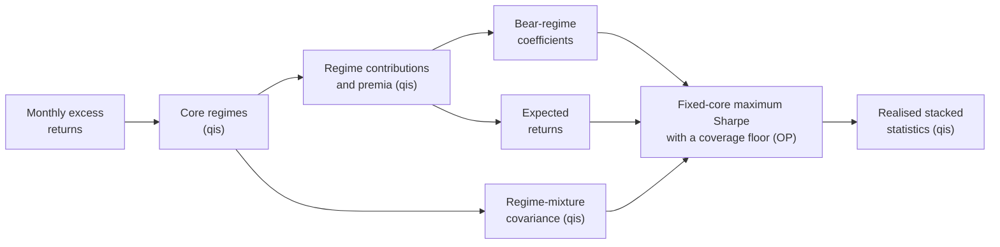

---
myst:
  html_meta:
    description: >-
      Case study of the overlay allocation of Sepp and Kastenholz (2026): regime Sharpe
      contributions and convexity premia in qis, and a fixed-core maximum Sharpe ratio with a
      coverage floor on the Bear-regime loss in optimalportfolios, on a simulated 60/40 core
      and four overlays.
---

# Smart diversification with portfolio overlays

*Author: [Artur Sepp](https://github.com/ArturSepp)*

A case study of a workflow that
[OptimalPortfolios](https://github.com/ArturSepp/OptimalPortfolios) implements.
Software citation: [CITATION.cff](https://github.com/ArturSepp/OptimalPortfolios/blob/main/CITATION.cff).

## Overview

Sepp and Kastenholz (2026) assess a diversifying overlay by what it adds when the investor's core
portfolio loses money. They decompose the overlay's Sharpe ratio into contributions from the
core's Bear, Normal and Bull regimes, define its convexity premium as the Bear contribution
beyond a Gaussian null with the same Sharpe ratio and correlation, and allocate a sleeve of
overlays on top of a fixed core by maximising the Sharpe ratio of the stacked portfolio subject to
a floor on its Bear-regime loss. The paper is accepted by the *Journal of Investment Management*
and forthcoming. This page cites its sections, definitions and equations for the method, and
quotes none of its data, exhibits or numbers.

The page builds that workflow on a simulated panel:

1. qis classifies the months by the core's own return quantiles and decomposes every Sharpe
   ratio into regime contributions, with the null and the premium (the paper's Section I);
2. qis estimates the regime betas and the regime-mixture covariance of equation (10);
3. optimalportfolios solves program (11), the fixed-core maximum Sharpe ratio with a coverage
   floor, with the floor as one named linear row;
4. qis measures the realised statistics of each stacked portfolio on the same panel.



In words: qis splits the months into regimes by the core's return and turns the panel into
regime contributions, expected returns and a covariance; the Bear contributions, in return units,
become the coefficients of the floor; optimalportfolios allocates the overlay sleeve; and qis
measures the stacked portfolios that result.

## Study design and data

The study on this page is synthetic. It uses none of the paper's data and reproduces none of its
results. Its design is that of the paper's public
[synthetic companion](https://github.com/ArturSepp/OptimalPortfolios/tree/main/papers/smart_diversification_joim_2026),
and every input is a constant of the canonical script,
[`examples/docs/app_smart_diversification_overlays.py`](../examples/docs/app_smart_diversification_overlays.py).

- **Sample.** 360 months of simulated simple returns in excess of cash (`MONTHS`), drawn with
  seed 17 (`SEED`) and dated January 1996 to December 2025 for display only.
- **Core.** 60% equities and 40% bonds, rebalanced monthly (`CORE_WEIGHTS`), with annual excess
  returns of 6.5% and 2.0%, volatilities of 18% and 7%, and a correlation of −0.15 between the two
  generating shocks (`CORE_MEANS`, `CORE_VOLS`, `CORE_CORR`). In this sample the core earns 3.5%
  a year at a volatility of 10.3%.
- **Overlays.** Four stylised payoffs of the standardised core return $z$, each rescaled so that
  its sample mean and volatility are exactly the values below (`FUND_MEANS`, `FUND_VOLS`). They
  illustrate exposures, not trading strategies or actual funds.
- **Allocation.** The core is held at 100% of capital and long-only overlays sum to a budget of
  100% on top of it (`OVERLAY_BUDGET`), with no other limit. Coverage floors of 0% to 100% in steps
  of 20%, and none (`COVERAGES`).
- **Conventions.** Arithmetic excess Sharpe ratios with sample volatilities, annualised with
  $\mathrm{af} = 12$ (`AF`). The regimes are the months below the core's 16% quantile, between
  its 16% and 84% quantiles, and above its 84% quantile (`QUANTILES`). Every estimate and every
  realised statistic uses the whole sample: the study is descriptive and in sample.

| Overlay | Excess return | Volatility | Payoff before rescaling |
|---|---|---|---|
| Trend | 4.5% | 10% | $0.65 \lvert z \rvert$ plus independent noise: convex in large core moves |
| Equity L/S | 5.5% | 12% | $0.70 z$ plus independent noise: linear in the core |
| Market neutral | 3.5% | 7% | $0.08 z$ plus independent noise |
| Tail hedge | −4.0% | 12% | $-0.75 z + 0.40 \max(-z, 0)$ plus small noise: short the core, more so in losses |

```python
from dataclasses import replace
import numpy as np
import pandas as pd
import qis.regimes as rg
import optimalportfolios as op

rng = np.random.default_rng(SEED)
shocks = rng.standard_normal((MONTHS, 6))
equity = CORE_MEANS[0] / AF + CORE_VOLS[0] / np.sqrt(AF) * shocks[:, 0]
bonds = CORE_MEANS[1] / AF + CORE_VOLS[1] / np.sqrt(AF) * (
    CORE_CORR * shocks[:, 0] + np.sqrt(1.0 - CORE_CORR ** 2) * shocks[:, 1])
core = CORE_WEIGHTS[0] * equity + CORE_WEIGHTS[1] * bonds
z = (core - core.mean()) / core.std(ddof=1)
shapes = np.column_stack([
    0.65 * np.abs(z) + 0.65 * shocks[:, 2],  # Trend: convex in large core moves
    0.70 * z + 0.70 * shocks[:, 3],  # Equity L/S: linear in the core
    0.08 * z + shocks[:, 4],  # Market neutral: mostly independent
    -0.75 * z + 0.40 * np.maximum(-z, 0.0) + 0.25 * shocks[:, 5],  # Tail hedge
])
shapes = (shapes - shapes.mean(axis=0)) / shapes.std(axis=0, ddof=1)
funds = shapes * np.array(FUND_VOLS) / np.sqrt(AF) + np.array(FUND_MEANS) / AF
dates = pd.date_range("1996-01-31", periods=MONTHS, freq="ME")
panel = pd.DataFrame(np.column_stack([core, funds]), index=dates, columns=[CORE, *FUNDS])
```

**No paper data.** The paper's own results use licensed fund and bank-index returns, which this
repository does not distribute. Every number on this page comes from the simulated panel above.

## Configuration

**Regimes and the decomposition.** A month belongs to the Bear regime when the core's return is
below its 16% quantile, to the Bull regime when it is above its 84% quantile, and to the Normal
regime otherwise (the paper's Definition 1); here that gives 58, 244 and 58 months. For an asset
with mean return $\bar r_s$ in regime $s$, regime frequency $p_s$ and volatility $\sigma$, the
regime contribution and the convexity premium are

$$
\mathrm{SR}_s = \sqrt{\mathrm{af}} \frac{p_s \bar r_s}{\sigma}, \qquad
\mathrm{CP} = \mathrm{SR}_{\mathrm{Bear}} - \left( 0.16 \mathrm{SR} - \kappa \rho \right), \qquad
\kappa = \sqrt{\mathrm{af}} \phi\left( \Phi^{-1}(0.84) \right) = 0.843,
$$

where the three contributions add up to the Sharpe ratio $\mathrm{SR}$ for any distribution
(Proposition 1 and equation (1)), $\rho$ is the asset's correlation with the core, and $\phi$ and
$\Phi$ are the standard normal density and distribution function. The term in brackets is the Bear
contribution under the Gaussian null (Proposition 2), so the premium is what the overlay earns in
Bear months beyond its Sharpe ratio and correlation (Definition 2, equation (4)). In return units
the Bear contribution of asset $i$ is $a_i = \sigma_i \mathrm{SR}^i_{\mathrm{Bear}}$, the annual
return earned in Bear months; for the core, $a_c \lt 0$ is its Bear-regime loss.

**Expected returns and covariance.** The expected returns are the sample means, the Sharpe ratio
times the volatility. The covariance is the regime-mixture covariance of equation (10), derived in
the paper's Appendix B:

$$
\Sigma = \mathrm{af} \left[ \sum_g p_g \eta_g \eta_g^{\top} S_g - \left( \sum_g p_g \eta_g m_g \right) \left( \sum_g p_g \eta_g m_g \right)^{\top} \right] + \mathrm{diag}\left( \sigma_{\varepsilon}^2 \right),
$$

with $\eta_g$ the vector of betas in regime $g$ from per-regime regressions whose intercepts are
discarded (one for the core), $p_g$, $m_g$ and $S_g$ the core's regime frequency, mean and second
moment, and $\sigma_{\varepsilon}$ the annual residual volatilities, uncorrelated across assets.
qis computes all of it:

```python
sampled = rg.create_sampled_returns_with_regime_id(panel, benchmark=CORE, q=QUANTILES)
statistics = rg.compute_regime_premium_table(sampled, benchmark=CORE, af=AF, q=QUANTILES)
betas = rg.compute_regime_betas(sampled, benchmark=CORE, af=AF)
covar = rg.compute_regime_mixture_covar_from_sample(sampled, benchmark=CORE, af=AF,
                                                    betas=betas)
names = covar.index
means = (statistics["sharpe"] * statistics["ann_vol"]).reindex(names)
bear_contributions = statistics["bear_return_pa"].reindex(names)
```

The script checks every column against a different computation: the regime months against raw
quantile masks of the core, the contributions against masked means, the premium against the
normal density, and the covariance against per-regime least squares and the core's regime moments,
to within $10^{-10}$. qis's
[convexity premium page](https://quantinveststrats.readthedocs.io/en/latest/convexity_premium.html)
documents these functions.

**The allocation.** Program (11) of Section II holds the core at one and chooses long-only
overlay weights $w$ that sum to the budget $W$:

$$
\max_{w} \frac{\mu_c + \mu^{\top} w}{\sqrt{(1, w^{\top}) \Sigma (1, w^{\top})^{\top}}}
\quad \text{subject to} \quad a_c + \sum_{i \ne c} a_i w_i \geq (1 - \theta) a_c ,
$$

where $\theta$ is the coverage floor, the fraction of the core's Bear-regime loss that the
overlays must offset. Because the regimes are fixed by the core, the Bear contributions add
across overlays (Proposition 4), and the floor is linear in the weights. In optimalportfolios it
is one named row of [`LinearConstraints`](constraints.md#named-signed-linear-rows) with the Bear
contributions as loadings and $(1 - \theta) a_c$ as its lower bound; the fixed total exposure sends
the solve to the Charnes–Cooper path, which scales that bound, as the
[overlay page](overlay_tail_floor.md#the-coverage-floor) explains:

```python
min_weights = pd.Series(0.0, index=names)
max_weights = pd.Series(OVERLAY_BUDGET, index=names)
min_weights[CORE] = max_weights[CORE] = 1.0
base = op.Constraints(
    is_long_only=True, min_weights=min_weights, max_weights=max_weights,
    min_exposure=1.0 + OVERLAY_BUDGET, max_exposure=1.0 + OVERLAY_BUDGET,
)
allocations = {}
for label, coverage in COVERAGES.items():
    floor = None if coverage is None else op.LinearConstraints(
        loadings=bear_contributions.to_frame("bear_coverage"),
        lower=pd.Series({"bear_coverage": (1.0 - coverage) * bear_contributions[CORE]}),
    )
    outcome = op.cvx_maximize_portfolio_sharpe(
        covar=covar.to_numpy(), means=means.to_numpy(),
        constraints=replace(base, linear_constraints=floor),
    )
    if not (outcome.accepted and outcome.compliant):
        raise RuntimeError(f"{label}: {outcome.status}; {outcome.reason}")
    allocations[label] = pd.Series(outcome.weights, index=names)
weights = pd.DataFrame(allocations)
```

The script certifies every allocation without the solver, from its first-order conditions, and
checks each binding floor against the homogeneous encoding of the overlay page, a different
formulation of the same row. qis then measures the core, the core plus each overlay at the full
budget, and each allocation on the simulated months, with the regimes of the core:

```python
stacked = panel @ weights
single = panel[FUNDS].mul(OVERLAY_BUDGET).add(panel[CORE], axis=0)
portfolios = pd.concat([panel[CORE], single, stacked], axis=1)
realised = rg.compute_regime_premium_table(
    rg.create_sampled_returns_with_regime_id(portfolios, benchmark=CORE, q=QUANTILES),
    benchmark=CORE, af=AF, q=QUANTILES,
)
realised["coverage"] = 1.0 - realised["bear_return_pa"] / bear_contributions[CORE]
```

## Results

All numbers in this section are the canonical script's, on its simulated panel; none is a result
of the paper.

**The decomposition.** Sharpe-ratio quantities are annualised; the Bear contribution is in return
units, percent a year:

| Asset | Sharpe | Volatility | Correlation | Bear contribution | Gaussian null | Convexity premium | Bear contribution, % a year |
|---|---|---|---|---|---|---|---|
| 60/40 core | 0.342 | 10.3% | 1.000 | −0.772 | −0.788 | 0.017 | −7.96 |
| Trend | 0.450 | 10.0% | 0.024 | 0.452 | 0.052 | 0.400 | +4.52 |
| Equity L/S | 0.458 | 12.0% | 0.717 | −0.496 | −0.531 | 0.035 | −5.95 |
| Market neutral | 0.500 | 7.0% | 0.107 | −0.005 | −0.010 | 0.005 | −0.03 |
| Tail hedge | −0.333 | 12.0% | −0.954 | 0.817 | 0.751 | 0.066 | +9.80 |

The payoffs show the mechanism the premium measures. The Trend overlay is almost uncorrelated
with the core, so its null is close to 16% of its Sharpe ratio, but its convex payoff earns 0.400
more than that in Bear months. The linear Equity L/S and the nearly independent Market neutral sit
close to their nulls. The Tail hedge's large Bear contribution comes mostly from its negative
correlation, and its extra downside convexity adds a premium of 0.066. The core, simulated as a
Gaussian mix, has a premium against itself of 0.017.

**The allocations.** Weights in percent of the overlay budget, and the realised statistics of
each stacked portfolio:

| | Core alone | No floor | 20% floor | 40% floor | 60% floor | 80% floor | 100% floor |
|---|---|---|---|---|---|---|---|
| Trend | | 39.4 | 39.4 | 35.2 | 29.9 | 29.8 | 34.9 |
| Equity L/S | | 0.0 | 0.0 | 0.0 | 0.0 | 0.0 | 0.0 |
| Market neutral | | 60.6 | 60.6 | 48.4 | 35.1 | 18.9 | 0.0 |
| Tail hedge | | 0.0 | 0.0 | 16.4 | 35.1 | 51.3 | 65.1 |
| Sharpe | 0.342 | 0.602 | 0.602 | 0.602 | 0.594 | 0.561 | 0.452 |
| Bear contribution | −0.772 | −0.503 | −0.503 | −0.467 | −0.403 | −0.257 | 0.000 |
| Volatility | 10.3% | 12.3% | 12.3% | 10.2% | 7.9% | 6.2% | 5.5% |
| Bear contribution, % a year | −8.0 | −6.2 | −6.2 | −4.8 | −3.2 | −1.6 | 0.0 |
| Realised coverage | 0.0% | 22.1% | 22.1% | 40.0% | 60.0% | 80.0% | 100.0% |

Without a floor the sleeve already covers 22.1% of the core's Bear-regime loss, so the 0% and 20%
floors are slack and return the same allocation (the 0% column is omitted). From 40% on every
floor binds, and the realised coverage equals the floor exactly: the coefficients are the sample's
own Bear contributions, and the Bear contribution of a stack is their weighted sum. The Tail hedge
enters at the 40% floor and holds 65.1% of the sleeve at 100%, while Market neutral leaves;
Equity L/S is never held. The model Sharpe ratio of the mixture covariance falls from 0.62
without a floor to 0.42 at 100% and never rises as the floor tightens. The largest attainable
coverage, $-W \max_i a_i / a_c$, is 123.2%, the whole budget in the Tail hedge; the solver
reports a 130% floor as infeasible, and the outcome is rejected.

![Left: the stacked portfolios in the coordinates of the paper, Bear-Sharpe contribution against
the arithmetic excess Sharpe ratio. The 60/40 core sits at minus 0.77 and 0.34; the core plus
each overlay at the full budget plots Trend at minus 0.24 and 0.55, Market neutral at minus 0.61
and 0.54, Equity L/S at minus 0.67 and 0.44, and the Tail hedge at plus 0.49 and minus 0.13. The
coverage floors trace a curve from the no-floor optimum at minus 0.50 and 0.60, unchanged up to
the 40% floor, down to 0.00 and 0.45 at full coverage. Right: stacked overlay weights by coverage
floor, from Trend and Market neutral at the low floors to Trend and the Tail hedge at
100%.](images/smart_diversification_overlays.png)

*Figure: the stacked portfolios of the simulated panel and the overlay weights along the coverage
floor. Drawn by the `exhibit` function of the canonical script with
`qis.plot_overlay_allocation_frontier` and `qis.plot_bars`; the
[analytics gallery](analytics_gallery.md) lists its provenance.*

**Smart diversifiers.** The paper calls an overlay a smart diversifier when adding it raises both
the Sharpe ratio and the Bear-Sharpe contribution of the stacked portfolio (Definition 4). With
the whole budget in one overlay, Trend (0.552 and −0.237), Equity L/S (0.436 and −0.672) and
Market neutral (0.538 and −0.611) qualify against the core's 0.342 and −0.772. The Tail hedge
raises the Bear-Sharpe contribution to +0.490 but lowers the Sharpe ratio to −0.126.

> **Pitfall.** A higher Bear-Sharpe contribution is not a smaller Bear-regime loss. Equity L/S
> qualifies as a smart diversifier only because it doubles the stacked portfolio's volatility,
> from 10.3% to 20.7%, and the Bear contribution is divided by that volatility; in return units it
> adds 6.0% a year to the Bear-regime loss, which grows from 8.0% to 13.9%. The coverage floor of
> program (11) is stated in return units, so it counts that loss, and no floor at or above 0%
> holds Equity L/S.

> **Insight.** On this panel the floor is free up to about 40%. The 40% floor keeps the realised
> Sharpe ratio of the no-floor allocation, 0.602, while it lowers volatility from 12.3% to 10.2%
> and the Bear-regime loss from 6.2% to 4.8% a year. Beyond it each step of coverage costs Sharpe
> ratio, slowly to 60% and quickly towards 100%.

## What the study does and does not show

- No result of the paper is reproduced. The panel is simulated, the payoffs are stylised and the
  numbers say nothing about the paper's fund universe or about investable strategies.
- It shows that the package implements the workflow as configured here: the regime
  decomposition, the Gaussian null and the mixture covariance in qis, and program (11) as a
  fixed-core maximum Sharpe ratio with a named linear floor in optimalportfolios.
- It shows three properties of that configuration: the Bear contributions add linearly across
  overlays, so a binding floor delivers its coverage exactly on the estimation sample; a floor
  below the no-floor coverage changes nothing; and the model Sharpe ratio never rises as the
  floor tightens.
- It is in sample. The same 360 months estimate the inputs and measure the results, so the
  realised coverage is exact by construction and says nothing about coverage out of sample. The
  page runs no backtest and uses none of the exponentially weighted estimators that the paper's
  Appendix C proposes for live use.
- The mixture covariance assumes residuals uncorrelated across overlays. The simulated noise is
  independent, so the assumption holds here by construction; the paper's Section II discusses
  what it costs on real funds.
- The floor constrains the average return of the Bear months, not the outcome of any single
  crisis. Funding spreads, transaction costs and margin are not modelled: the returns are already
  in excess of cash, and the stacked exposures are not normalised.

## Reproduce

The canonical script runs offline with a fixed seed and asserts every number and property above:

```console
python -m examples.docs.app_smart_diversification_overlays
```

The paper's [synthetic companion](https://github.com/ArturSepp/OptimalPortfolios/tree/main/papers/smart_diversification_joim_2026)
runs the same design end to end in a source checkout, with the qis smart-diversification report,
the paper's exhibit layouts and CSV exports. The paper's empirical results rest on licensed fund
and bank-index data, which the repository does not distribute.

## See also

- [Overlay optimisation with a fixed core and linear side constraints](overlay_tail_floor.md)
- [Portfolio constraints: named signed linear rows](constraints.md#named-signed-linear-rows)
- [Mean-variance objectives](mean_variance_objectives.md)
- [Research papers and replication](research_papers.md)
- [From capital market assumptions to strategic allocation (MATF-CMA)](app_cma_strategic_allocation.md)
- [qis: the convexity premium and smart diversification](https://quantinveststrats.readthedocs.io/en/latest/convexity_premium.html)
- [qis: regime-conditional performance](https://quantinveststrats.readthedocs.io/en/latest/regime_conditional_performance.html)

## References

- Sepp, A. and Kastenholz, M. (2026). *The Convexity Premium of Portfolio Overlays*. Journal of
  Investment Management, forthcoming. Definitions 1, 2 and 4, Propositions 1, 2 and 4, equations
  (1), (4) and (10), program (11), and Appendices B and C.
- [OptimalPortfolios software citation](https://github.com/ArturSepp/OptimalPortfolios/blob/main/CITATION.cff).
- [qis software citation](https://github.com/ArturSepp/QuantInvestStrats/blob/main/CITATION.cff).
