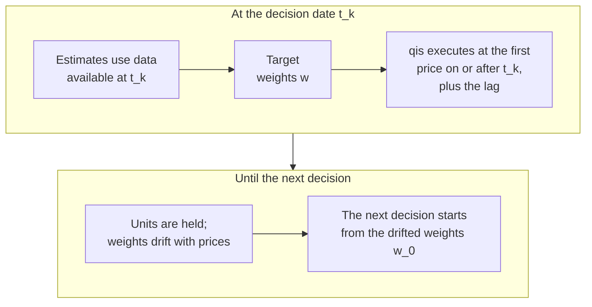

---
myst:
  html_meta:
    description: >-
      Conventions of optimalportfolios in one place: notation, return basis, estimation and
      rebalancing grids, EWMA spans, covariance and constraint units, decision and execution
      timing, missing data, solver backends and fallbacks, objective inputs, and a glossary.
---

# Conventions, notation and glossary

*Author: [Artur Sepp](https://github.com/ArturSepp)*

This page defines, once, the conventions that every page of the
[OptimalPortfolios](https://github.com/ArturSepp/OptimalPortfolios) documentation relies on.
Articles link here instead of restating them, and each methodology article summarises the ones
it uses in a convention card at the start of its inputs section. The conventions of the qis
analytics and of FactorLasso estimation are linked, not repeated.

Software citation: [CITATION.cff](https://github.com/ArturSepp/OptimalPortfolios/blob/main/CITATION.cff).

## Notation

The symbols below keep one meaning on every page. A page declares any further symbol in its own
notation table and does not reuse a reserved one. Pages revised from 27 September 2026 onwards
use this notation; some earlier pages still write the benchmark as $w_b$ or $b$ and the
annualisation factor as $a$, and they are brought in line when they are revised.

| Symbol | Meaning |
|---|---|
| $N$, $M$ | Number of assets and of factors |
| $t$, $t_k$ | A date; the $k$-th rebalancing (decision) date |
| $r$ | Returns; each page states whether they are simple or log returns |
| $w$ | Target weights, as fractions of net asset value |
| $w_0$ | Pre-trade weights: the previous targets drifted to the decision date |
| $w^{\mathrm{bm}}$ | Benchmark weights |
| $d = w - w^{\mathrm{bm}}$ | Active weights |
| $\mu$ | Expected returns |
| $\alpha$ | Alphas or signal scores used as expected active returns |
| $\Sigma$, $\sigma_i$ | Asset covariance matrix; asset volatility $\sigma_i = \sqrt{\Sigma_{ii}}$ |
| $\beta$, $\Sigma_F$, $D$ | Factor loadings ($N \times M$), factor covariance and residual covariance |
| $\sigma(w)$ | Portfolio volatility $\sqrt{w^{\top} \Sigma w}$ |
| $\mathrm{RC}_i$ | Risk contribution $w_i (\Sigma w)_i / \sigma(w)$ of asset $i$ |
| $b$ | Risk budgets, non-negative and summing to one |
| $\mathrm{TE}(w)$ | Ex-ante tracking error $\sqrt{d^{\top} \Sigma d}$ |
| $s$, $\lambda$ | EWMA span and the decay it implies |
| $\mathrm{AN}$ | Annualisation factor, set upright as one symbol |
| $\gamma$ | Risk aversion |

The transpose is written $x^{\top}$. Covariance matrices are $N \times N$ and indexed by asset
labels; loadings are indexed by asset and then by factor, as in
[FactorLasso's conventions](https://factorlasso.readthedocs.io/en/latest/conventions.html).

## Returns, grids and estimation dates

Estimation samples prices on a return grid and produces estimates on a rebalancing grid. The
defaults are:

| Setting | Default | Used by |
|---|---|---|
| `returns_freq` | `'W-WED'` (weekly, Wednesday close) | `EwmaCovarEstimator`, and the dispatcher's expected returns and CARA mixture |
| `factor_returns_freq` | `'W-WED'` | `FactorCovarEstimator` |
| `rebalancing_freq` | `'QE'` (quarter ends) | Both estimators, which key their estimates by these dates |
| `span`, `factor_covar_span` | `52` observations | EWMA covariance and EWMA means |

The rebalancing frequency only selects which dates carry an estimate; it does not change the
return frequency. Assets observed at different cadences are handled as in
[mixed-frequency data](mixed_frequency_data.md).

**Return basis.** Estimation uses log returns: `compute_returns_from_prices` defaults to
`is_log_returns=True`, subtracts an EWMA mean and drops the first row, and the factor model and
the dispatcher's expected returns also use log returns. Weight drift and the qis backtest use
simple price ratios, and qis's own `to_returns` defaults to simple returns. Each page states the
basis of every return it shows.

**Estimation date.** An estimate dated $t$ uses information available at $t$: the EWMA estimate
keyed by $t$ includes the sampled return ending at $t$, and factor-model inputs are sliced
through $t$ inclusive. The weights decided at $t$ are executed afterwards, as described under
[timing](#decision-execution-and-drift). Nothing in a rolling path looks ahead.

## EWMA spans

A span $s$ sets the decay

$$
\lambda = 1 - \frac{2}{s + 1},
$$

and the half-life $h$ with $\lambda^{h} = 1/2$ is $h = \ln(1/2) / \ln(\lambda)$. The default span
of 52 weekly observations gives $\lambda = 51/53 \approx 0.962$ and a half-life of about 18
weeks. This is the convention of
[qis](https://quantinveststrats.readthedocs.io/en/stable/ewm_estimators.html) and FactorLasso.

> **Pitfall.** A span is neither a half-life nor a hard look-back window. `span=52` weights
> the most recent 18 weeks as heavily as all earlier observations together. Some example scripts
> and the ROSAA replication folder still call the span a half-life; they are wrong on this point.

## Units

**Covariance.** The estimators return annualised covariance. `EwmaCovarEstimator` multiplies the
per-observation estimate by the annualisation factor $\mathrm{AN}$ inferred from the sampled
index: 52 for weekly, 12 for monthly and 4 for quarterly returns, with a fallback of 252 and a
warning when the frequency cannot be inferred. `estimate_current_ewma_covar` with
`apply_an_factor=False` keeps per-observation units. `FactorCovarEstimator` annualises the
factor covariance and the residual variances; loadings are not scaled. The optimisers never
annualise or resample: they use the covariance in the units they receive.

**Limits.** Tracking-error and volatility limits are in the units of the square root of the
supplied covariance, so they are annual when the covariance is annual.

> **Pitfall.** Despite its suffix, `Constraints.max_target_portfolio_vol_an` applies no
> annualisation to either the covariance or the limit. Supply both in the same units.

**Returns and targets.** `target_return` and `asset_returns` must share one horizon and scaling.
The dispatcher's expected returns are annualised EWMA means of log returns.

**Weights.** Weights, exposures and turnover are fractions of net asset value. Exposure is the
signed net sum of the weights; the defaults `min_exposure = max_exposure = 1.0` make a portfolio
fully invested. Turnover is the full L1 change $\sum_i \lvert w_i - w_{0,i} \rvert$, without a
factor of one half, measured per decision and not annualised. Risk budgets are positive and
normalised over the assets that survive filtering; no budget means equal budgets.

The detailed contract, including every field of `Constraints`, is in
[portfolio constraints](constraints.md).

## Decision, execution and drift

A target weight is a decision; an executed holding is its result in the backtest. The two are
different states, and a page always says which one it shows.

In words: estimates and weights are dated at the decision date; qis executes each decision at
the first price observation on or after it, moved forward by `weight_implementation_lag`
observations (none by default); the previous units earn the return into the execution
observation; and the next solve starts from the drifted weights $w_0$.

- **Pre-trade weights.** With `OptimiserConfig.use_drifted_weights_0=True`, the default, the
  rolling solvers set $w_0$ to the previous returned weights, including any fallback, drifted
  with simple returns between the two decision dates:
  $w_{0,i} = w_i (1 + r_i) / (1 + \sum_j w_j r_j)$. The drift is anchored at decision dates, not
  at qis executions.
- **Costs.** qis charges proportional costs on the traded notional, sized on the pre-cost net
  asset value. `backtest_rolling_optimal_portfolio` defaults to 10 basis points
  (`rebalancing_costs=0.0010`). Turnover limits and penalties shape the targets; costs are paid
  on executed trades. See [turnover and transaction costs](turnover_and_transaction_costs.md).

The full timing model, with examples, is in [rolling backtests](rolling_backtests.md).

## Missing data and eligibility

Eligibility decides whether an asset may enter a solve; freezing restricts the change of an
existing position. A frozen asset has its weight pinned by setting both box bounds to its
pre-trade weight.

- `filter_covar_and_vectors_for_nans` drops assets whose variance is zero, negative or missing,
  and applies no variance floor unless one is given. The risk-budgeting wrapper floors variances
  at $0.001^2$ before solving.
- The EWMA estimator imposes no minimum history; the caller checks warmup. The factor estimator
  raises when a return bucket has fewer rows than its warmup period, and gives assets without a
  fit zero loadings and zero residual variance.
- The backtest layer is NaN-aware; how qis treats a missing price on a rebalancing date is
  described with its limitations on the page below.

The rules for each solver family are in
[incomplete histories and frozen positions](incomplete_histories.md).

## Solvers and outcomes

| Objective | Backend |
|---|---|
| Minimum variance, quadratic utility, minimum tracking error, strategic and tactical solvers | CVXPY, default solver `'CLARABEL'` |
| Maximum Sharpe ratio | CVXPY through the Charnes–Cooper transformation when `min_exposure == max_exposure`; SciPy SLSQP otherwise |
| Maximum diversification, CARA utility under Gaussian mixtures | SciPy SLSQP |
| Risk budgeting | Cyclical coordinate descent or ADMM with a quadprog projection |
| Hierarchical risk parity | Recursive bisection over a supplied linkage |

The single-date CVXPY-family wrappers, maximum Sharpe included, return an
`OptimizationOutcome`; the SciPy wrappers (maximum diversification, CARA utility) and risk
budgeting return a weight Series. An outcome is `accepted` when the solver's own weights are
used; a solution reported as `optimal_inaccurate` is accepted if it is feasible. A rejected solve
falls back to the drifted pre-trade weights $w_0$, then to the benchmark weights, then to zeros.
The fallback is not equal weights, and it is not projected onto the constraints.
[Solver numerics and outcomes](solver_numerics_and_outcomes.md) states the acceptance rules, the
covariance factorisation and the numerical fields of `OptimiserConfig`; the others are described
in [choosing an objective](optimization_module_readme.md).

> **Pitfall.** `OptimiserConfig.apply_total_to_good_ratio`, which rescales the turnover limit
> and per-asset maxima when assets are excluded, is `False` on the dataclass. The dispatcher, the
> backtest adapter and the quadratic, maximum-Sharpe, maximum-diversification, CARA,
> risk-budgeting and alpha-with-target-return wrappers default it to `True`; the
> minimum-tracking-error, strategic and alpha-over-tracking-error wrappers default it to `False`.

## Objectives and their inputs

| Objective | Needs |
|---|---|
| Minimum variance, maximum diversification | Covariance |
| Risk budgeting, including equal risk contributions | Covariance and optional risk budgets |
| Hierarchical risk parity | Covariance and a linkage; no `Constraints` |
| [Quadratic utility, maximum Sharpe ratio](mean_variance_objectives.md) | Covariance and expected returns, which the dispatcher estimates from prices |
| [CARA utility under Gaussian mixtures](cara_gaussian_mixture.md) | Prices only; it fits its own mixture and ignores the covariance |
| [Strategic target return or target volatility](strategic_allocation_targets.md) | Covariance, expected returns and targets; optional benchmark |
| Minimum tracking error | Covariance and a benchmark |
| Tactical alpha over tracking error | Covariance, alphas, a benchmark and a tracking-error limit |
| Tactical alpha with a target return | Covariance, alphas, yields and targets; optional benchmark |
| Overlay with a tail floor | Covariance, excess means, a fixed core and a linear floor, through the maximum-Sharpe solver |

[Choosing an objective](optimization_module_readme.md) maps each objective to its rolling,
single-date and numerical entry points.

## What belongs to qis and FactorLasso

- **qis** computes returns, realised performance statistics, including its labelled Sharpe
  conventions, drawdowns, the holdings simulation, factsheets, the ex-ante risk model
  (`qis.RiskModel`) and the unsmoothing of appraisal-based prices. See its
  [performance and Sharpe conventions](https://quantinveststrats.readthedocs.io/en/stable/performance_analytics_and_sharpe.html).
  A Sharpe ratio inside an objective is a model quantity, not a realised statistic.
- **FactorLasso** estimates sparse factor loadings, discovers and smooths clusters, and holds the
  factor-covariance containers. See its
  [conventions](https://factorlasso.readthedocs.io/en/latest/conventions.html).

## Glossary

- **Active weights.** $d = w - w^{\mathrm{bm}}$, the difference from the benchmark.
- **CARA utility.** Constant absolute risk aversion, $-\exp(-\gamma W)$ for wealth $W$; its
  expectation has a closed form under a Gaussian mixture.
- **CMA.** Capital market assumption: a forward-looking expected return, volatility or
  correlation used as a strategic input.
- **Diversification ratio.** $\sum_i w_i \sigma_i / \sigma(w)$, the weighted average asset
  volatility over the portfolio volatility.
- **Drift.** The change of weights between decisions caused by relative price moves.
- **Eligibility.** Whether an asset may enter a solve at a date.
- **ERC.** Equal risk contributions: risk budgeting with equal budgets.
- **Fallback.** The weights used when a solve is rejected; see
  [solvers and outcomes](#solvers-and-outcomes).
- **FCGL, HCGL.** Factor-cluster and hierarchical-cluster group LASSO, the sparse factor models
  that FactorLasso estimates for the factor covariance.
- **Freezing.** Pinning an existing position so that a solve cannot change it.
- **GMM.** Gaussian mixture model, fitted to returns for the CARA objective.
- **HRP.** [Hierarchical risk parity](hierarchical_risk_parity_and_cluster_budgets.md): recursive bisection of a cluster tree with
  inverse-variance splits.
- **MDP.** Maximum diversification portfolio: the weights that maximise the diversification
  ratio.
- **Overlay.** A sleeve optimised on top of a fixed core exposure.
- **Risk budget.** A target share $b_i$ of total risk for asset or group $i$; it does not fix a
  capital weight.
- **Risk contribution.** $\mathrm{RC}_i$; the contributions sum to $\sigma(w)$.
- **SAA, TAA.** Strategic and tactical asset allocation. SAA maps expected returns and return
  or volatility targets to a long-run allocation; TAA takes alpha-driven active positions
  against a benchmark under a tracking-error budget.
- **Tail floor.** A minimum on a supplied linear characteristic of the overlay, used as a proxy
  for downside protection; it is not an expected shortfall.
- **TE, TRE.** Ex-ante tracking error $\mathrm{TE}(w)$; function names write it `tre`.
- **Turnover.** The full L1 change of weights between the pre-trade and the target weights.

## See also

- [Choosing an objective](optimization_module_readme.md)
- [Portfolio constraints](constraints.md)
- [Rolling backtests](rolling_backtests.md)
- [Covariance estimators](covariance_estimators.md) and [factor covariance with HCGL](factor_covariance_hcgl.md)
- [Ex-ante risk contributions and betas](portfolio_risk_analytics.md)
- [Solver numerics and outcomes](solver_numerics_and_outcomes.md)
- [Universe data and appraisal unsmoothing](universe_data_and_unsmoothing.md)
- [Implied risk budgets](implied_risk_budgets.md) and [hierarchical risk parity and cluster risk budgets](hierarchical_risk_parity_and_cluster_budgets.md)
- [qis notation and conventions](https://quantinveststrats.readthedocs.io/en/stable/notation_and_conventions.html)
