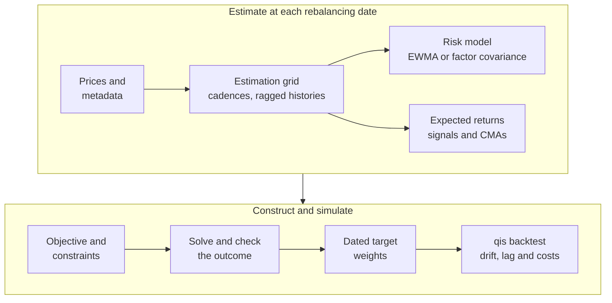

---
myst:
  html_meta:
    description: >-
      optimalportfolios documentation: multi-asset portfolio construction in Python, from
      covariance estimates and signals through risk budgeting, maximum diversification,
      mean-variance, tracking-error and overlay objectives to constrained rolling backtests,
      with the methods, runnable offline examples and reproducible exhibits.
---

<a id="optimalportfolios-production-portfolio-construction-and-rolling-backtesting"></a>

# optimalportfolios

*Author: [Artur Sepp](https://github.com/ArturSepp) / First recorded: [2026-08-09](https://github.com/ArturSepp/OptimalPortfolios/commit/254505981ed43e0dbc12a19c98c034d351b8d059)*

[OptimalPortfolios](https://github.com/ArturSepp/OptimalPortfolios) is a Python library for
multi-asset portfolio construction and rolling backtesting. At each rebalancing date it turns
dated risk estimates, expected returns and constraints into target weights under a chosen
objective: risk budgets, maximum diversification, minimum variance, maximum Sharpe, tracking
error against a benchmark, or expected utility under fat-tailed returns. Holdings simulation,
transaction costs and reporting belong to
[qis](https://github.com/ArturSepp/QuantInvestStrats), and sparse factor estimation to
[FactorLasso](https://github.com/ArturSepp/FactorLasso); optimalportfolios is the reference
implementation of the ROSAA framework of Sepp, Ossa and Kastenholz (2026).

Software citation: [CITATION.cff](https://github.com/ArturSepp/OptimalPortfolios/blob/main/CITATION.cff).

## Start here

1. [Install optimalportfolios](installation.md) and choose its optional features. The core
   installation command is `python -m pip install optimalportfolios`.
2. Run the [offline quickstart](quickstart.md): EWMA covariance, constrained minimum-variance
   weights and a qis backtest with explicit trade timing and costs, on a fixture shipped in the
   wheel.
3. Keep the [conventions and glossary](conventions.md) at hand. Return basis, estimation and
   rebalancing grids, covariance units, weight states, notation and solver defaults are defined
   there once for every page.
4. Browse the [analytics gallery](analytics_gallery.md) for reproducible exhibits, or the
   [examples guide](examples_readme.md) for complete workflows and their data requirements.

<a id="overview"></a>

## The portfolio in one picture

At each rebalancing date $t$, optimalportfolios chooses the target weights

$$
w_t^{\star} = \arg\max_{w \in \mathcal{C}_t} U(w; \hat{\mu}_t, \hat{\Sigma}_t, w^{\mathrm{bm}}, w_{t^-}),
\qquad
\hat{\Sigma}_t = \beta_t \Sigma_{F,t} \beta_t^{\top} + D_t .
$$

Here $U$ is the objective, $\mathcal C_t$ the set of admissible weights, $\hat\mu_t$ the
expected returns or alphas where the objective uses them, $w^{\mathrm{bm}}$ a benchmark and
$w_{t^-}$ the current holdings drifted to $t$. The covariance $\hat\Sigma_t$ is either an EWMA
estimate or the factor model on the right, with loadings $\beta_t$, factor covariance
$\Sigma_{F,t}$ and residual covariance $D_t$. The construction runs through the steps below.



In words: prices are sampled on an estimation grid that respects each asset's cadence and
history; a risk model and, for the objectives that need them, expected returns are estimated
from information available at the rebalancing date; the objective is solved under the
constraints and its outcome checked; and the dated target weights are passed to qis, which
simulates the holdings with price drift, implementation lag and transaction costs.

| Step of the diagram | Pages |
|---|---|
| Estimation grid | [Mixed-frequency data](mixed_frequency_data.md), [incomplete histories](incomplete_histories.md), [universe data and unsmoothing](universe_data_and_unsmoothing.md) |
| Risk model | [Covariance estimators](covariance_estimators.md), [factor covariance with HCGL](factor_covariance_hcgl.md), [rolling factor risk model from CSV](rolling_factor_covar_from_csv.md), [ex-ante risk contributions and betas](portfolio_risk_analytics.md) |
| Expected returns | [Alpha signals](alphas_module_readme.md) |
| Objective and constraints | [Choosing an objective](optimization_module_readme.md), [risk budgeting](risk_budgeting.md), [implied risk budgets](implied_risk_budgets.md), [hierarchical risk parity and cluster budgets](hierarchical_risk_parity_and_cluster_budgets.md), [maximum diversification](maximum_diversification.md), [minimum tracking error](minimum_tracking_error.md), [overlay tail floor](overlay_tail_floor.md), [constraints](constraints.md) |
| Solve and check the outcome | [Choosing an objective](optimization_module_readme.md), [constraints](constraints.md), [solver numerics and outcomes](solver_numerics_and_outcomes.md) |
| Dated target weights and qis backtest | [Rolling backtests](rolling_backtests.md), [turnover and transaction costs](turnover_and_transaction_costs.md) |

<a id="signals-and-risk-estimates"></a>

## Data and estimation grids

- [Mixed-frequency data](mixed_frequency_data.md): assets observed at different cadences, their
  EWMA spans and signal horizons, and when each observation becomes available.
- [Incomplete histories and frozen positions](incomplete_histories.md): eligibility, warmup,
  frozen target weights and missing prices in rolling workflows and in the qis backtester.
- [Universe data and appraisal unsmoothing](universe_data_and_unsmoothing.md): the
  `UniverseData` container, its group loadings and identifiers, and unsmoothing an
  appraisal-smoothed private-asset series before estimation.

## Risk models

- [Covariance estimators](covariance_estimators.md): EWMA covariance and the estimator contract
  shared with the factor model: return conventions, spans against half-lives, annualisation and
  point-in-time inputs.
- [Factor covariance with HCGL](factor_covariance_hcgl.md): the factor covariance with sparse
  HCGL loadings, orthogonal and empirical residuals, cadence penalties and the point-in-time
  contract.
- [Rolling factor risk model from CSV](rolling_factor_covar_from_csv.md): rebuild a rolling
  factor risk model from six CSV inputs and connect it to the qis risk model.
- [Ex-ante risk contributions, betas and the qis risk model](portfolio_risk_analytics.md):
  Euler risk contributions, benchmark betas and the hand-off to `qis.RiskModel`.

## Expected returns and signals

- [Alpha signals](alphas_module_readme.md): momentum, low beta, residual momentum and reversal,
  carry and managers' alpha, with cross-sectional and within-cluster scoring.

<a id="construction-and-constraints"></a>

## Portfolio objectives

- [Choosing an objective](optimization_module_readme.md): which objective fits which inputs,
  the rolling dispatcher, solver configuration, return types and solver outcomes.
- [Risk budgeting](risk_budgeting.md): Euler risk contributions, target budgets and the
  allocation when a weight bound binds.
- [Implied risk budgets from target weights](implied_risk_budgets.md): the budgets that
  reproduce a target allocation, the hold rule for hedging assets, and one budget vector
  fitted to a rolling path.
- [Hierarchical risk parity and cluster risk budgets](hierarchical_risk_parity_and_cluster_budgets.md):
  recursive bisection over a linkage, group budgets split within groups, and how both
  compare with equal risk contribution.
- [Maximum diversification](maximum_diversification.md): the diversification ratio, why the
  solution is the minimum-variance portfolio of the correlation matrix, and the equal-correlation
  property of the assets it holds.
- [Minimum tracking error](minimum_tracking_error.md): the allocation closest in risk to a
  supplied benchmark under the constraints.
- [Overlay optimisation with a fixed core](overlay_tail_floor.md): a fixed core exposure and an
  optimised sleeve under a linear downside floor.

## Constraints and solving

- [Portfolio constraints](constraints.md): exposure, box, tracking-error, turnover, group and
  beta limits, hard against utility enforcement, units and backend coverage.
- [Covariance factorisation, solver outcomes and constraint residuals](solver_numerics_and_outcomes.md):
  the eigenvalue floor, outcome acceptance, fallbacks and residuals.

<a id="backtests-and-applied-examples"></a>

## Backtesting and costs

- [Rolling portfolio backtests](rolling_backtests.md): estimation and decision dates, drifted
  holdings, implementation lag and the qis holdings simulation.
- [Turnover and transaction costs](turnover_and_transaction_costs.md): turnover limits and
  penalties at construction, executed notional and cash costs in the backtest.

## Applications

Case studies report the evidence of the research papers in context: the study design, the
configuration in package terms, the paper's results, and what the study does and does not
show.

- [Strategic and tactical allocation with HCGL covariance (ROSAA)](app_rosaa_multi_asset_allocation.md):
  the three layers of the framework in The Journal of Portfolio Management, its study design
  and results, and the same configuration run offline.
- [Stress testing with options and FCGL clusters](stress_testing_with_options.md): factor
  scenarios and option repricing for a stock-and-option portfolio. It needs network data and
  local prerequisites, and it does not optimise the positions.

<a id="reference-and-project-guidance"></a>

## Implementation and reference

- [Software design and boundaries](software_design.md): component responsibilities, solver
  backends, result contracts, and the division of work with qis and FactorLasso.
- [Choosing a portfolio optimisation library](package_comparison.md): a dated comparison of
  portfolio-library capabilities.
- [Research papers and replication](research_papers.md): the papers behind the methods, the pages
  that use each one, and what a public checkout can reproduce.
- [API reference](api.rst): every public object, grouped by the page that explains it, and the
  configuration fields of the main dataclasses with their defaults.
- [Documentation standard](documentation_standard.md): page forms, notation, citations,
  executable examples and exhibit provenance.

<a id="papers"></a>

## Research papers

The methods are described in the following papers. The
[research papers page](research_papers.md) lists which page uses which paper and how to
reproduce each one.

- Sepp, A., Ossa, I. and Kastenholz, M. (2026). *Robust Optimization of Strategic and Tactical
  Asset Allocation for Multi-Asset Portfolios*.
  [The Journal of Portfolio Management, 52(4), 86–120](https://www.pm-research.com/content/iijpormgmt/52/4/86).
- Sepp, A. (2023). *Optimal Allocation to Cryptocurrencies in Diversified Portfolios*.
  [Risk, October 2023](https://www.risk.net/cutting-edge/7957914/optimal-allocation-to-cryptocurrencies-in-diversified-portfolios);
  [SSRN 4217841](https://ssrn.com/abstract=4217841).
- Sepp, A., Hansen, E. and Kastenholz, M. (2026). *Capital Market Assumptions and Strategic
  Asset Allocation Using Multi-Asset Tradable Factors*. Working paper,
  [SSRN 6785958](https://papers.ssrn.com/sol3/papers.cfm?abstract_id=6785958).

Cite a paper for its method, and the software records for the packages an implementation uses:
[optimalportfolios](https://github.com/ArturSepp/OptimalPortfolios/blob/main/CITATION.cff),
[qis](https://github.com/ArturSepp/QuantInvestStrats/blob/main/CITATION.cff) and
[FactorLasso](https://github.com/ArturSepp/FactorLasso/blob/main/CITATION.cff).

<a id="project-links"></a>

## Project resources

- [PyPI](https://pypi.org/project/optimalportfolios/) and the
  [rendered documentation](https://optimalportfolios.readthedocs.io/en/latest/).
- [Source repository](https://github.com/ArturSepp/OptimalPortfolios) and
  [issue tracker](https://github.com/ArturSepp/OptimalPortfolios/issues).
- [Governance, maintenance and support](https://github.com/ArturSepp/OptimalPortfolios/blob/main/GOVERNANCE.md).
- [Changelog](https://github.com/ArturSepp/OptimalPortfolios/blob/main/CHANGELOG.md).
- The [author's research catalogue](https://artursepp.com/research/).

<!-- The sidebar mirrors the groups above. Keep each document in exactly one tree. -->

```{toctree}
:hidden:
:maxdepth: 2
:caption: Start here

installation
quickstart
conventions
analytics_gallery
examples_readme
```

```{toctree}
:hidden:
:maxdepth: 2
:caption: Data and estimation grids

mixed_frequency_data
incomplete_histories
universe_data_and_unsmoothing
```

```{toctree}
:hidden:
:maxdepth: 2
:caption: Risk models

covariance_estimators
factor_covariance_hcgl
rolling_factor_covar_from_csv
portfolio_risk_analytics
```

```{toctree}
:hidden:
:maxdepth: 2
:caption: Expected returns and signals

alphas_module_readme
```

```{toctree}
:hidden:
:maxdepth: 2
:caption: Portfolio objectives

optimization_module_readme
risk_budgeting
implied_risk_budgets
hierarchical_risk_parity_and_cluster_budgets
maximum_diversification
minimum_tracking_error
overlay_tail_floor
```

```{toctree}
:hidden:
:maxdepth: 2
:caption: Constraints and solving

constraints
solver_numerics_and_outcomes
```

```{toctree}
:hidden:
:maxdepth: 2
:caption: Backtesting and costs

rolling_backtests
turnover_and_transaction_costs
```

```{toctree}
:hidden:
:maxdepth: 2
:caption: Applications

app_rosaa_multi_asset_allocation
stress_testing_with_options
```

```{toctree}
:hidden:
:maxdepth: 2
:caption: Implementation and reference

software_design
package_comparison
research_papers
api
documentation_standard
```
