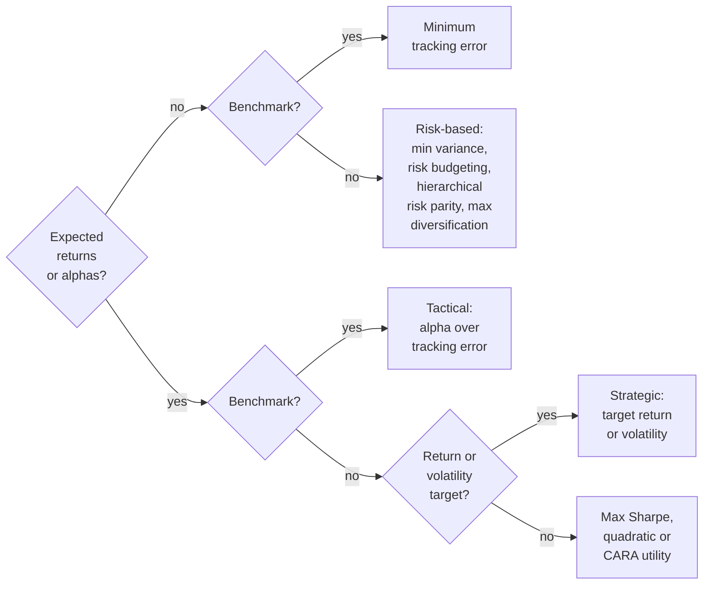

---
myst:
  html_meta:
    description: >-
      Choose a portfolio objective in OptimalPortfolios by the inputs you have, then call it:
      objective dispatch, solver configuration, labelled and numerical interfaces, return
      types, constraints and offline examples, with links to solver outcomes.
---

<a id="optimization-module"></a>

# Choosing an objective: dispatch, configuration and results

*Author: [Artur Sepp](https://github.com/ArturSepp) / First recorded: [2026-03-15](https://github.com/ArturSepp/OptimalPortfolios/commit/ce4d4c3469216d807079af2c52f5a85775d9c572)*

Implemented in [OptimalPortfolios](https://github.com/ArturSepp/OptimalPortfolios).
Software citation: [CITATION.cff](https://github.com/ArturSepp/OptimalPortfolios/blob/main/CITATION.cff).

Portfolio optimisation chooses asset weights under an objective and a feasible set.
This guide maps those choices to the current `optimalportfolios.optimization` interfaces.
Covariance and forecasting inputs retain the caller's units; portfolio weights are dimensionless.
Analytics and holdings backtests use [QIS](https://github.com/ArturSepp/QuantInvestStrats), and
factor estimation uses [FactorLasso](https://github.com/ArturSepp/FactorLasso).

Use this page to select and call a solver. The [constraint guide](constraints.md) is authoritative
for constraint formulas, alignment and backend semantics; the [examples guide](examples_readme.md)
covers larger workflows. Units, timing and notation follow the
[conventions page](conventions.md).

## Choose an objective by its inputs

The objectives differ first in what they need: a covariance only, expected returns or alphas as
well, a benchmark to measure against, or a return or volatility target.



In words: without expected returns, choose minimum tracking error when a benchmark is given and
otherwise a risk-based objective: minimum variance, [risk budgeting](risk_budgeting.md),
[hierarchical risk parity](hierarchical_risk_parity_and_cluster_budgets.md) or
[maximum diversification](maximum_diversification.md); with expected returns or alphas, choose the
tactical solver against a benchmark, the [strategic solvers](strategic_allocation_targets.md) for a return or
volatility target, and otherwise [maximum Sharpe or quadratic utility](mean_variance_objectives.md) or, when
returns are fat-tailed, [CARA utility under a Gaussian mixture](cara_gaussian_mixture.md). The [conventions page](conventions.md#objectives-and-their-inputs) lists the
exact inputs of each, and the [dispatch flow](#dispatch-flow) below maps them to functions. A
fixed core with an optimised sleeve is the [overlay tail floor](overlay_tail_floor.md).

## Start with an auditable allocation

The nine Python blocks on this page run in order and need no download, data file or random
seed. They are excerpts of the canonical script
[`examples/docs/optimization_module_readme.py`](../examples/docs/optimization_module_readme.py),
which runs them and asserts every number and property on this page against a reference computed
a different way:

```console
python -m examples.docs.optimization_module_readme
```

This fixed, synthetic five-asset example supplies annual-decimal expected returns and a diagonal
annual covariance matrix, with full investment, long-only positions and unit per-asset caps. It
does not estimate market forecasts or download data.

```python
import numpy as np
import pandas as pd
import cvxpy as cvx
from dataclasses import asdict, replace
import qis
import optimalportfolios as opt
from optimalportfolios.optimization.constraints import (
    GroupLowerUpperConstraints, BenchmarkDeviationConstraints,
)

tickers = ["Equity A", "Equity B", "Bond A", "Bond B", "Gold"]
annual_vols = pd.Series([0.20, 0.25, 0.10, 0.15, 0.30], index=tickers)
pd_covar = pd.DataFrame(np.diag(annual_vols ** 2), index=tickers, columns=tickers)
expected_returns = pd.Series([0.07, 0.08, 0.03, 0.04, 0.05], index=tickers)
benchmark = pd.Series(0.20, index=tickers)
alphas = pd.Series([-0.3, 0.6, 0.1, -0.2, 0.4], index=tickers)
constraints = opt.Constraints(
    is_long_only=True, min_exposure=1.0, max_exposure=1.0,
    min_weights=pd.Series(0.0, index=tickers),
    max_weights=pd.Series(1.0, index=tickers),
)
config = opt.OptimiserConfig(apply_total_to_good_ratio=False)
weights, outcome = opt.wrapper_quadratic_optimisation(
    pd_covar, constraints, optimiser_config=config, context="guide: minimum variance",
)
assert outcome.accepted and outcome.compliant
allocation = pd.DataFrame({"Annual volatility": annual_vols, "Weight": weights})
print(allocation.round(6))
```

| Asset | Annual volatility | Weight |
|---|---|---|
| Equity A | 0.20 | 0.127191 |
| Equity B | 0.25 | 0.081402 |
| Bond A | 0.10 | 0.508762 |
| Bond B | 0.15 | 0.226116 |
| Gold | 0.30 | 0.056529 |

For this diagonal, fully invested minimum-variance example, weights are proportional to inverse
**variance**, not inverse volatility. The displayed values are rounded from the computed result.
The tuple contains labelled weights and an `OptimizationOutcome`; checking only that weights
exist does not establish that the solver succeeded.
[Solver outcomes](solver_numerics_and_outcomes.md#acceptance-and-fallback) explains what
`accepted` and `compliant` mean.

## Architecture

```text
src/optimalportfolios/optimization/
  config.py                       shared configuration
  wrapper_rolling_portfolios.py   six-objective dispatcher and QIS backtest adapter
  solver_diagnostics.py           acceptance, fallback and structured outcomes
  covar_factorization.py          controlled covariance factorization
  portfolio_result.py             reporting container using qis.RiskModel
  constraints/                    public facade and policy/backend owners
  general/                        quadratic, Sharpe, diversification, CARA and minimum TE
  risk_allocation/                risk budgeting and its solver, group budgets, HRP
  saa/                            return-floor and volatility-budget solvers
  taa/                            alpha/TE and alpha/yield solvers
  <component>/tests/              automated offline contracts
  <component>/run_local/          manual development scenarios
```

### Submodule roles

The [constraints facade](../src/optimalportfolios/optimization/constraints/__init__.py) exports
the aggregate specification and its component classes. Core specifications, alignment,
analytics, backend compilation, benchmark constraints, shared expressions and group constraints
have separate owners. Pure benchmark-beta analytics live in `optimalportfolios.utils.benchmark_beta`.

[General solvers](../src/optimalportfolios/optimization/general/__init__.py) include both
standalone objectives and minimum tracking error relative to a benchmark.
[Risk allocation](../src/optimalportfolios/optimization/risk_allocation/__init__.py) owns
constrained risk budgeting, group risk budgets and hierarchical risk parity; there is no
`general/risk_budgeting.py` implementation.

[SAA](../src/optimalportfolios/optimization/saa/__init__.py) maps expected returns and return/volatility
targets into strategic allocations. Supplying a benchmark to its risk-minimising formulation
changes the risk objective from absolute variance to tracking-error variance.
[TAA](../src/optimalportfolios/optimization/taa/__init__.py) uses alpha characteristics and
benchmark-relative budgets. These calls return complete portfolio weights; active tilts are
the difference from the benchmark.

### Dispatch flow

`compute_rolling_optimal_weights` requires `prices`, `constraints` and `covar_dict`.
Its [dispatcher source](../src/optimalportfolios/optimization/wrapper_rolling_portfolios.py) routes
the six members of `PortfolioObjective` as follows:

| Enum member | Rolling target |
|---|---|
| `EQUAL_RISK_CONTRIBUTION` | `rolling_risk_budgeting` |
| `MAX_DIVERSIFICATION` | `rolling_maximise_diversification` |
| `MIN_VARIANCE` | `rolling_quadratic_optimisation` |
| `QUADRATIC_UTILITY` | `rolling_quadratic_optimisation`, with estimated means |
| `MAXIMUM_SHARPE_RATIO` | `rolling_maximize_portfolio_sharpe`, with estimated means |
| `MAX_CARA_MIXTURE` | `rolling_maximize_cara_mixture` |

The default objective is `MAX_DIVERSIFICATION`. Minimum tracking error, SAA and TAA have direct
entry points and no enum route. An unsupported objective raises `NotImplementedError`.

For the first five routes, the supplied covariance keys determine the solve schedule.
Supply chronologically ordered keys and point-in-time estimates. The dispatcher does not
rebuild covariance or reorder those dictionaries for you. Its `time_period` and
`rebalancing_freq` arguments do not trim or resample those five routes.

The CARA route is different: it **does not consume `covar_dict`**. It fits Gaussian mixtures
to rolling log-return windows from `prices`, constructs its schedule using `rebalancing_freq`,
annualises fitted moments and applies `time_period` to the result. The dispatcher argument is
spelled `n_mixures`; it forwards that value as `n_components`. Keep the existing spelling in calls.

Quadratic utility and maximum Sharpe estimate annualised EWMA log-return means through
`estimate_rolling_ewma_means` (`returns_freq="W-WED"`, `span=52` by default).
They do not accept a separate forecast panel through this dispatcher. Use their direct rolling
functions for supplied CMAs. The dispatcher uses `carra=0.5`; direct quadratic functions default
to `carra=1.0`. The dispatcher's CARA `roll_window` default is 20 observations, while the backtest
adapter and direct CARA rolling function default to 312. State those choices explicitly.

## Three-layer solver pattern

The layers describe responsibilities, not one universal signature.

| Layer | Responsibility | Current return contract |
|---|---|---|
| `rolling_*` | Iterate dates, align forecasts and carry prior allocation state. | Weight `DataFrame`. |
| CVXPY-family `wrapper_*` | Filter and align one date, construct constraints, restore full asset labels. | `(Series, OptimizationOutcome)`. |
| CVXPY-family `cvx_*` | Build and validate a numerical problem. | `OptimizationOutcome` containing an array. |
| Diversification/CARA `wrapper_*` | Label the dedicated SciPy backend's output. | Weight `Series`. |
| Risk-budgeting wrapper | Filter, solve and reintegrate frozen allocations. | `Series`, or a diagnostic `DataFrame` with `detailed_output=True`. |
| Dedicated `opt_*` | Run the SciPy or CCD/ADMM numerical backend. | Weight array; inspect that function's contract. |

The Sharpe wrapper retains its outcome tuple even when variable net exposure selects SciPy.
What an `OptimizationOutcome` holds, when a solve is accepted, the fallback order, the
constraint residuals and the per-date outcome log of one rolling function are described in
[covariance factorisation, solver outcomes and constraint residuals](solver_numerics_and_outcomes.md#acceptance-and-fallback).
`PortfolioOptimisationResult` is a separate reporting container with risk-model context;
it is not returned automatically by the dispatcher.

A new solver should follow the appropriate owning module's pattern and declare its supported
constraint subset and return type. Export additions are public API changes and follow
[AGENTS.md](https://github.com/ArturSepp/OptimalPortfolios/blob/main/AGENTS.md).

## OptimiserConfig

The [configuration source](../src/optimalportfolios/optimization/config.py) defines eight fields.
The dataclass is frozen; create a replacement to change a setting. Six of them act on the
numerical layer and are specified on the
[solver-outcomes page](solver_numerics_and_outcomes.md#implementation-in-optimalportfolios);
`apply_total_to_good_ratio` is described below and `use_drifted_weights_0` in
[rolling backtests](rolling_backtests.md).

| Field | Dataclass default | Scope |
|---|---|---|
| `solver` | `"CLARABEL"` | CVXPY backend selection; ignored by fixed SciPy and risk-budgeting paths. [Details](solver_numerics_and_outcomes.md#implementation-in-optimalportfolios). |
| `verbose` | `False` | Backend verbosity where consumed. [Details](solver_numerics_and_outcomes.md#implementation-in-optimalportfolios). |
| `apply_total_to_good_ratio` | `False` | Allow supported wrappers to rescale selected bounds/budgets after exclusion. |
| `use_drifted_weights_0` | `True` | Supported rolling paths drift prior targets using observed prices. |
| `diagnose_infeasibility` | `True` | Additional diagnosis in the alpha-over-TE wrapper. [Details](solver_numerics_and_outcomes.md#diagnostics-around-the-solve). |
| `validate_inputs` | `True` | Additional pre-solve input checks in the alpha-over-TE wrapper. [Details](solver_numerics_and_outcomes.md#diagnostics-around-the-solve). |
| `max_constraint_relaxation` | `None` | Logging escalation threshold for frozen-bound relaxation where forwarded. [Details](solver_numerics_and_outcomes.md#diagnostics-around-the-solve). |
| `factorize_covar` | `True` | Reuse covariance factorization in compatible CVXPY risk expressions. [Details](solver_numerics_and_outcomes.md#how-a-solve-uses-the-factor). |

```python
default_config = opt.OptimiserConfig()
configuration = asdict(default_config)
legacy_drift_config = replace(default_config, use_drifted_weights_0=False)
assert default_config.use_drifted_weights_0
assert not legacy_drift_config.use_drifted_weights_0
```

Constructing the dataclass alone gives `apply_total_to_good_ratio=False`, but many entry points
default to `OptimiserConfig(apply_total_to_good_ratio=True)`. The defaults of the public entry
points that take `optimiser_config` split as follows:

| Default | Entry points |
|---|---|
| `OptimiserConfig(apply_total_to_good_ratio=True)` | `compute_rolling_optimal_weights` and `backtest_rolling_optimal_portfolio`; the rolling and single-date functions of quadratic optimisation, maximum Sharpe, maximum diversification, CARA mixture, risk budgeting and alpha with target return (`rolling_maximise_alpha_with_target_return`, `wrapper_maximise_alpha_with_target_return`) |
| `OptimiserConfig()`, so `False` | The rolling and single-date functions of minimum tracking error, the two SAA solvers and alpha over tracking error (`rolling_maximise_alpha_over_tre`, `wrapper_maximise_alpha_over_tre`) |

Pass an explicit config when comparing calls. CARA rolling currently computes its universe ratio
directly; the config flag does not disable that calculation.

> **Pitfall.** Passing `OptimiserConfig()` is not the same as passing no configuration. When a
> sixth, zero-variance asset is excluded, `wrapper_quadratic_optimisation` without a
> configuration uses its own default and raises the 0.25 caps of the five remaining assets to
> 0.30, that is 0.25 × 6/5; with `OptimiserConfig()` the caps stay at 0.25.

`max_constraint_relaxation` is a logging threshold, **not a hard limit that prevents relaxation**,
and the two diagnostic flags add checks without turning off ordinary post-solve validation; the
[solver-outcomes page](solver_numerics_and_outcomes.md#diagnostics-around-the-solve) specifies
all three. SciPy tolerance/iteration options remain solver-specific rather than universal config
fields.

Drifting a previous target is distinct from executing trades. Price gaps can make the drift
helper retain its input. See [rolling backtests](rolling_backtests.md) for timing and
[turnover and costs](turnover_and_transaction_costs.md) for the difference between optimisation
penalties, target turnover and realised transaction charges.

## Solver reference

Let $w$ be portfolio weights, $\Sigma$ covariance, $\mu$ expected returns and $\gamma$ risk
aversion. Minimum variance minimises $w^\top\Sigma w$. Quadratic utility uses

$$
\max_w \mu^\top w-\frac{\gamma}{2}w^\top\Sigma w.
$$

The one-half factor is part of the implemented `carra` convention. Direct solvers do not
convert covariance frequencies or subtract a cash rate. The Sharpe objective uses supplied
$\mu^\top w/\sqrt{w^\top\Sigma w}$; supply excess means explicitly if that is the intended
definition. The dispatcher's log-return means are a modelling input, not a reported realised Sharpe.

| Family | Owning file | Backend and important qualification |
|---|---|---|
| [Minimum variance / quadratic utility](mean_variance_objectives.md) | [quadratic.py](../src/optimalportfolios/optimization/general/quadratic.py) | CVXPY with consistent return/covariance units. |
| [Maximum Sharpe](mean_variance_objectives.md) | [max_sharpe.py](../src/optimalportfolios/optimization/general/max_sharpe.py) | Fixed net exposure uses a convex transformed problem; variable net exposure uses SLSQP. |
| Maximum diversification | [max_diversification.py](../src/optimalportfolios/optimization/general/max_diversification.py) | SLSQP ratio optimisation; a weight vector is not proof of a global optimum. |
| Risk budgeting | [risk_budgeting.py](../src/optimalportfolios/optimization/risk_allocation/risk_budgeting.py) | Internal CCD/ADMM; constrained risk contributions can miss requested budgets. |
| [CARA mixture](cara_gaussian_mixture.md) | [carra_mixture.py](../src/optimalportfolios/optimization/general/carra_mixture.py) | SLSQP on the fixed mixture's exponential utility; rolling also estimates the mixture. |
| Minimum tracking error | [minimum_tracking_error.py](../src/optimalportfolios/optimization/general/minimum_tracking_error.py) | Direct CVXPY entry point; not in the dispatcher enum. |
| [SAA return floor](strategic_allocation_targets.md) | [min_variance_target_return.py](../src/optimalportfolios/optimization/saa/min_variance_target_return.py) | Minimise variance or benchmark-relative variance with a return floor. |
| [SAA volatility budget](strategic_allocation_targets.md) | [max_return_target_vol.py](../src/optimalportfolios/optimization/saa/max_return_target_vol.py) | Maximise expected return; hard budget and utility formulations differ. |
| [TAA alpha/TE](alpha_over_tracking_error.md) | [maximise_alpha_over_tre.py](../src/optimalportfolios/optimization/taa/maximise_alpha_over_tre.py) | Hard mode maximises active alpha under a TE cap; it does not maximise an alpha/TE ratio. |
| [TAA alpha/yield](alpha_over_tracking_error.md#the-yield-target-variant) | [maximise_alpha_with_target_yield.py](../src/optimalportfolios/optimization/taa/maximise_alpha_with_target_yield.py) | Public function suffix is `with_target_return`; `yields` supplies the return-floor vector. |

### General portfolio examples

These calls use the same complete, positive-definite covariance and explicit configuration.
The CARA example supplies two fixed component means/covariances/probabilities, so it requires
no mixture fitting or random seed.

```python
utility_weights, utility_outcome = opt.wrapper_quadratic_optimisation(
    pd_covar, constraints, portfolio_objective=opt.PortfolioObjective.QUADRATIC_UTILITY,
    means=expected_returns, carra=5.0, optimiser_config=config,
)
sharpe_weights, sharpe_outcome = opt.wrapper_maximize_portfolio_sharpe(
    pd_covar, expected_returns, constraints, optimiser_config=config,
)
tracking_weights, tracking_outcome = opt.wrapper_minimise_tracking_error(
    pd_covar, benchmark, constraints, optimiser_config=config,
)
risk_weights = opt.wrapper_risk_budgeting(
    pd_covar, constraints, risk_budget=pd.Series(0.2, index=tickers),
    optimiser_config=config,
)
diversification_weights = opt.wrapper_maximise_diversification(
    pd_covar, constraints, optimiser_config=config,
)
mixture_weights = opt.wrapper_maximize_cara_mixture(
    means=[expected_returns.to_numpy(), 0.5 * expected_returns.to_numpy()],
    covars=[pd_covar.to_numpy(), 1.5 * pd_covar.to_numpy()],
    probs=np.array([0.75, 0.25]), constraints=constraints, tickers=tickers,
    carra=5.0, optimiser_config=config,
)
raw_outcome = opt.cvx_quadratic_optimisation(
    opt.PortfolioObjective.MIN_VARIANCE, pd_covar.to_numpy(), constraints,
    solver=config.solver, factorize_covar=config.factorize_covar,
)
```

The three CVXPY wrapper examples produce outcome tuples; risk budgeting, diversification and
CARA produce Series. Equal risk budgets and diversification both give inverse-volatility weights
on this particular diagonal, unconstrained-interior fixture. They need not agree when covariance
or constraints change. See [risk budgeting](risk_budgeting.md),
[minimum tracking error](minimum_tracking_error.md) and [alpha over tracking error](alpha_over_tracking_error.md)
for the full methodologies.

> **Insight.** The objective alone moves the allocation, even with identical inputs. Minimum
> variance weights by inverse variance and holds 50.9% in Bond A and 5.7% in Gold; equal risk
> budgets and maximum diversification weight by inverse volatility and hold 34.5% and 11.5%.

### Strategic and tactical examples

Expected returns and the yield floor are annual decimals here. The volatility budget 0.12 and
TE budget 0.03 mean annual volatility of 12% and 3%, because the supplied covariance is annual.
Alpha scores are separate, dimensionless inputs. The utility penalty's coefficient has to be
interpreted with their scale and the risk measure; [signal diagnostics](signal_diagnostics_and_profiling.md) relates the
scale an alpha needs to its information coefficient.

```python
return_weights, return_outcome = opt.wrapper_min_variance_target_return(
    pd_covar, expected_returns, target_return=0.055,
    constraints=constraints, optimiser_config=config,
)
vol_weights, vol_outcome = opt.wrapper_max_return_target_vol(
    pd_covar, expected_returns, target_vol=0.12,
    constraints=constraints, optimiser_config=config,
)
tactical_constraints = replace(
    constraints, benchmark_weights=benchmark, tracking_err_vol_constraint=0.03,
)
tactical_weights, tactical_outcome = opt.wrapper_maximise_alpha_over_tre(
    pd_covar, alphas, benchmark, tactical_constraints, optimiser_config=config,
)
yield_weights, yield_outcome = opt.wrapper_maximise_alpha_with_target_return(
    pd_covar, alphas, yields=expected_returns, target_return=0.05,
    constraints=tactical_constraints, benchmark_weights=benchmark,
    optimiser_config=config,
)
utility_constraints = replace(
    tactical_constraints,
    constraint_enforcement_type=opt.ConstraintEnforcementType.UTILITY_CONSTRAINTS,
    tre_utility_weight=5.0,
)
soft_weights, soft_outcome = opt.wrapper_maximise_alpha_over_tre(
    pd_covar, alphas, benchmark, utility_constraints, optimiser_config=config,
)
```

All five calls return complete portfolio weights and an outcome. The utility alpha/TE example
may exceed the hard-mode TE cap: switching to a penalty does not retain that cap. The yield
example uses a hard annual-decimal return floor and the supplied benchmark.

### Rolling schedule and execution

The following deterministic monthly levels extend through January 2025 so all eight quarterly
decisions have a subsequent observation for execution. Covariance and forecasts are fixed
teaching inputs assumed known before the first decision; they are not full-sample estimates.

```python
dates = pd.date_range("2020-12-31", "2025-01-31", freq="ME")
step = np.arange(len(dates), dtype=float)
monthly_changes = (
    expected_returns.to_numpy()[None, :] / 12
    + 0.008 * np.sin(step[:, None] * np.arange(1, 6)[None, :])
)
prices = pd.DataFrame(
    100 * np.exp(np.cumsum(monthly_changes, axis=0)), index=dates, columns=tickers,
)
decision_dates = pd.date_range("2023-03-31", "2024-12-31", freq="QE")
covar_dict = {date: pd_covar.copy() for date in decision_dates}
rolling_weights = opt.compute_rolling_optimal_weights(
    prices, constraints, covar_dict,
    portfolio_objective=opt.PortfolioObjective.MIN_VARIANCE, optimiser_config=config,
)
return_forecasts = pd.DataFrame(
    np.broadcast_to(expected_returns, (len(decision_dates), len(tickers))),
    index=decision_dates, columns=tickers,
)
rolling_utility = opt.rolling_quadratic_optimisation(
    prices, constraints, covar_dict,
    portfolio_objective=opt.PortfolioObjective.QUADRATIC_UTILITY,
    expected_returns=return_forecasts, carra=5.0, optimiser_config=config,
)
portfolio = opt.backtest_rolling_optimal_portfolio(
    prices, constraints, covar_dict,
    portfolio_objective=opt.PortfolioObjective.MIN_VARIANCE,
    optimiser_config=config, rebalancing_costs=0.0,
    weight_implementation_lag=1, ticker="Synthetic minimum variance",
)
```

Both rolling tables have eight rows and five asset columns. The direct quadratic call uses
the supplied forecast panel; the generic dispatcher would estimate its own means for that objective.
The backtest adapter returns `qis.PortfolioData`, applies an explicit one-observation execution
lag and zero transaction costs in this example. Its **default** proportional transaction cost
is `0.0010` per unit traded, and its default implementation lag is `None`.
`perf_time_period` filters computed weights before backtesting; it does not shorten prior estimation.
An empty decision schedule is not handled uniformly across these entry points.

## Constraint system

### Why constraints are shared but objectives are not

A constraint object expresses permitted allocations and trades. A solver separately chooses
which feasible point to prefer. Reusing the object does not mean every backend compiles every
field: unsupported fields can be ignored rather than rejected.

The canonical formulas, numerical examples and capability matrix live in
[Portfolio constraints](constraints.md). The summaries below preserve the established entry
points and highlight what a caller must check.

### Solver backends

The historical `pyrb` compiler name remains part of the API; the current risk-budgeting engine
is internal. With the complete fixture above, the three compiler calls are executable:

```python
covar = pd_covar.to_numpy()
w = cvx.Variable(len(tickers))
constraints.set_cvx_all_constraints(w, covar)  # → list of cvxpy constraints
constraints.set_scipy_constraints(covar)       # → (list of dicts, bounds) for scipy
constraints.set_pyrb_constraints(covar)        # → (bounds, C, d) for the risk-budgeting solver

cvx_rows = constraints.set_cvx_all_constraints(w, covar)
scipy_rows, scipy_bounds = constraints.set_scipy_constraints(covar)
pyrb_bounds, pyrb_c, pyrb_d = constraints.set_pyrb_constraints(covar)
```

CVXPY returns a list of expressions. SciPy returns constraint dictionaries and bounds.
The risk-budgeting compiler returns bounds and the group matrices. Compiler output alone
is not a solved portfolio.

### `Constraints` — the main container

The aggregate is a frozen dataclass with copy/update methods. Its pandas members are mutable
objects; do not interpret `frozen=True` as deep immutability. Supply aligned ticker labels.
Every field of `Constraints` is explained, with its units and backend support, in
[portfolio constraints](constraints.md); the
[API reference](api.rst) lists the fields with their defaults.

`turnover_constraint` uses the L1 trade amount, not half-L1 one-way turnover.
`turnover_costs` scales its expression; it is not automatically the QIS backtest charge.
The historical `_an` volatility field name does not annualise inputs.

### Constraint enforcement types

For SAA and alpha-over-TE, `FORCED_CONSTRAINTS` compiles the configured risk/trading budgets
as hard rows. `UTILITY_CONSTRAINTS` uses objective penalties for supported TE and turnover terms;
allocation/exposure/box, return, deviation and beta mandate rows remain hard.
The generic utility builder does not impose a configured maximum-volatility cap. SAA risk
objectives can supply a variance penalty instead.

Alpha/yield uses its separate `soft_tracking_error` switch. With a benchmark, its soft-TE path
keeps the yield floor and any configured total or group turnover cap hard, keeps the turnover
penalty when no cap is set (since 7.8.0), and drops the scalar hard TE cap; see
[the yield-target variant](alpha_over_tracking_error.md#the-yield-target-variant).
Do not infer its behaviour from the generic utility mode or from its filename alone.

### Backend and enforcement capabilities

| Family | CVXPY forced | Generic CVXPY utility | SciPy | Risk budgeting |
|---|---|---|---|---|
| Exposure and asset bounds | Hard | Hard | Hard | Boxes; full investment is solver policy |
| Return floor | Hard | Hard | Not compiled | Not compiled |
| Portfolio volatility | Hard cap | No generic cap | Not compiled | Not compiled |
| Total/group TE | Both hard | Penalties; group takes precedence | Not compiled | Not compiled |
| Total/group turnover | Both hard | Penalties; group takes precedence | Not compiled | Not compiled |
| Group allocation | Hard | Hard | Hard | Hard matrix rows |
| Deviation and beta | Hard | Hard | Not compiled | Not compiled |

This is the compiler-level summary, not permission to use every row with every objective.
The variable-exposure Sharpe path uses SciPy's subset; alpha/yield's soft path is qualified above.
Constraint residuals also have backend-specific scope.

### Constraint classes

#### `GroupLowerUpperConstraints`

For a group loading vector $g$, absolute allocation bounds are

$$
\ell_g\leq g^\top w\leq u_g.
$$

Binary memberships define simple asset classes; signed/fractional loadings require the
operation-specific interpretation in the constraint guide. The original five-asset example is:

```python
gluc = GroupLowerUpperConstraints(
    group_loadings=pd.DataFrame({
        "Equities":  [1, 1, 0, 0, 0],
        "Bonds":     [0, 0, 1, 1, 0],
        "Gold":      [0, 0, 0, 0, 1],
    }, index=tickers, dtype=float),
    group_min_allocation=pd.Series({"Equities": 0.30, "Bonds": 0.20, "Gold": 0.05}),
    group_max_allocation=pd.Series({"Equities": 0.60, "Bonds": 0.50, "Gold": 0.20}),
)
```

Construction removes all-zero/all-missing loading columns and aligns the supplied group bounds.
Solver compilation recognises signed nonzero loadings. Frozen-position bound relaxation uses
positive loadings as membership, which is a different rule.
`merge_group_lower_upper_constraints` combines specifications and disambiguates overlapping names.

#### `BenchmarkDeviationConstraints`

For loading vector $f$ and benchmark $w_b$, the active deviation limit is

$$
\left|f^\top(w-w_b)\right|\leq\delta_f.
$$

```python
bdc = BenchmarkDeviationConstraints(
    factor_loading_mat=pd.DataFrame({
        "Tech":    [1, 1, 0, 0, 0],
        "Finance": [0, 0, 1, 1, 0],
        "Energy":  [0, 0, 0, 0, 1],
    }, index=tickers, dtype=float),
    factor_max_deviation=pd.Series({"Tech": 0.05, "Finance": 0.05, "Energy": 0.03}),
)
```

The labels in this synthetic example are illustrative. Deviation constraints are benchmark-relative;
group allocation bounds are absolute. Both can be attached to the same specification:

```python
group_constraints = replace(
    constraints, group_lower_upper_constraints=gluc,
    sector_deviation_constraints=bdc, benchmark_weights=benchmark,
)
group_weights, group_outcome = opt.wrapper_quadratic_optimisation(
    pd_covar, group_constraints, optimiser_config=config,
)
assert group_outcome.accepted and group_outcome.compliant
```

#### `GroupTrackingErrorConstraint`

For group loading vector $g$ and active weights $d=w-w_b$, a hard group TE limit is

$$
(g\odot d)^\top\Sigma(g\odot d)\leq \sigma_g^2.
$$

The group object has separate hard-limit and utility-weight Series. The generic utility builder
uses its utility weights instead of interpreting hard limits as penalties.

#### `GroupTurnoverConstraint`

For prior weights $w_0$, the unweighted group L1 constraint is

$$
\left\lVert g\odot(w-w_0)\right\rVert_1\leq T_g.
$$

Configured costs change the scaling as described in [turnover and costs](turnover_and_transaction_costs.md).
Different groups may have different trading budgets.

### Feasibility validation

Construction-time checks detect some unreachable group bounds and single-asset dominance
conflicts. They do not prove the complete feasible set is nonempty. Signed loadings, overlapping
groups, return/risk targets and trading limits need the canonical constraints and solver checks.
The deliberately infeasible example on the
[solver-outcomes page](solver_numerics_and_outcomes.md#worked-example) passes construction and
is rejected by the solver.

### NaN handling and universe filtering

Wrappers that take a labelled covariance call `filter_covar_and_vectors_for_nans` before the
solve. Which assets it removes, what its optional variance floor does and how the filtered
covariance is then factorised are described in
[covariance factorisation, solver outcomes and constraint residuals](solver_numerics_and_outcomes.md#filtering-the-universe).

`update_with_valid_tickers` aligns flat vectors and nested loading blocks and injects current
weights/benchmarks. Supported ratio scaling changes selected per-asset bounds, total turnover
and risk budgets; it does not rescale group allocation bounds. Frozen-state paths can retain
or reintegrate positions. Inspect the aligned constraints in the outcome, not just the input
specification. See [incomplete histories](incomplete_histories.md).

### Structured constraint inspection

An `OptimizationOutcome` records acceptance, status, fallback source, aligned constraints,
covariance factorization and residuals.
[Covariance factorisation, solver outcomes and constraint residuals](solver_numerics_and_outcomes.md#constraint-residuals)
states the acceptance checks and tolerances, reads `residuals_frame()`, audits other weights
with `evaluate_constraint_residuals`, and runs a deliberately infeasible solve through the
fallback order.

## Test pattern

Automated tests are ordinary `*_test.py` modules in the owning `tests/` directory.
Use the repository's external interpreter and C-local setup described in
[AGENTS.md](https://github.com/ArturSepp/OptimalPortfolios/blob/main/AGENTS.md).
From a C-local source export, the focused commands for this page and the constraint tests are:

```text
python tools/check_docs.py --files docs/optimization_module_readme.md
python -m examples.docs.optimization_module_readme
python -m pytest src/optimalportfolios/optimization/constraints/tests/constraints_test.py -v
python -m pytest src/optimalportfolios/optimization/constraints/tests/constraints_test.py -k group -v
```

Development diagnostics use the owning `run_local/<solver>_run.py`, with `Locals` and
`run_local()`; they are excluded from pytest and distributions. For example,
`python -m optimalportfolios.optimization.general.run_local.quadratic_run` is a manual
diagnostic that may plot or use local data.

### Constraint test files

| File | Purpose |
|---|---|
| `constraints_test.py` | Core feasibility and translation contracts. |
| `constraints_branches_test.py` | Validation, warnings, updates and branches. |
| `specialised_constraints_test.py` | Group TE, turnover and deviation. |
| `constraints/run_local/constraints_run.py` | Manual formatting and inspection; not a test. |

### Verification context and limits

The [canonical script](../examples/docs/optimization_module_readme.py) runs the nine blocks
with network connections refused. It checks each displayed allocation against the closed-form
optimum of the diagonal fixture (inverse variance, inverse volatility, the half-gamma utility,
the tangency portfolio, the two-equality return floor and the tracking-error ellipsoid) and the
CARA weights against simple alternatives under the stated mixture utility. It also checks the
group and deviation limits from the published loadings, the configuration table and the
`apply_total_to_good_ratio` default of every public entry point, each dispatcher route with its
parameter scope and mean estimation, the Sharpe backend choice, the rolling schedule and
execution lag, and the absence of look-ahead. The test suite runs it, and
so does the offline examples lane of CI. No alpha estimation is used in these fixed-input
examples.

## References

- Sepp, A., Ossa, I. and Kastenholz, M. (2026).
  [Robust Optimization of Strategic and Tactical Asset Allocation for Multi-Asset Portfolios](https://www.pm-research.com/content/iijpormgmt/52/4/86).
  *The Journal of Portfolio Management*, 52(4), 86–120.
- Sepp, A., Hansen, E. and Kastenholz, M. (2026).
  [Capital Market Assumptions and Strategic Asset Allocation Using Multi-Asset Tradable Factors](https://ssrn.com/abstract=6785958).
  Working paper.
- Sepp, A. (2023).
  [Optimal Allocation to Cryptocurrencies in Diversified Portfolios](https://www.risk.net/cutting-edge/7957914/optimal-allocation-to-cryptocurrencies-in-diversified-portfolios).
  *Risk Magazine*, October, 1–6.
  [Working-paper record](https://ssrn.com/abstract=4217841).
- CVXPY: [solver statuses and errors](https://www.cvxpy.org/tutorial/intro/) and
  [solver features](https://www.cvxpy.org/tutorial/solvers/index.html).
- [OptimalPortfolios software citation](https://github.com/ArturSepp/OptimalPortfolios/blob/main/CITATION.cff).
- [QIS software citation](https://github.com/ArturSepp/QuantInvestStrats/blob/main/CITATION.cff).
- [FactorLasso software citation](https://github.com/ArturSepp/FactorLasso/blob/main/CITATION.cff).
