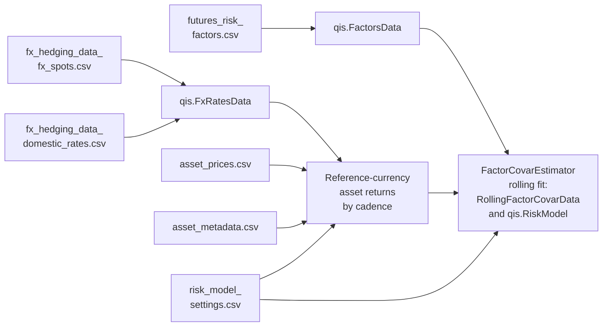

---
myst:
  html_meta:
    description: >-
      Reconstruct a rolling factor risk model from six CSV inputs: schemas, FX conventions,
      an offline worked example, covariance checks, and reproducibility limits.
---

# Rolling factor risk model from CSV

*Author: [Artur Sepp](https://github.com/ArturSepp) / First recorded: [2026-09-06](https://github.com/ArturSepp/OptimalPortfolios/commit/d8628f883d87bcb7e7006319bab8a804d899d949)*

Implemented in [OptimalPortfolios](https://github.com/ArturSepp/OptimalPortfolios).
Software citation: [CITATION.cff](https://github.com/ArturSepp/OptimalPortfolios/blob/main/CITATION.cff).

A CSV factor-risk-model bundle is a set of source data and calibration files from which
dated factor loadings and asset covariance matrices can be estimated again. This guide
defines the repository example's six-file contract and follows it from prices to a
`qis.RiskModel`. The CSV files persist the inputs; they do not serialize a fitted model.

## Overview

### Pipeline at a glance

The [complete executable example](../examples/covar_estimation/rolling_factor_covar_from_csv.py)
separates `fetch`, which acquires Yahoo teaching proxies, from `load`, which estimates
entirely from saved inputs. Neither stage requires ROSAA or a private package.



In words: the factor NAV file becomes `qis.FactorsData`; the spot and rate files become
`qis.FxRatesData`, which converts the native asset prices into reference-currency returns
according to the currency, hedge ratio and return frequency of each asset in the metadata file;
the settings file fixes that conversion and the estimator's calibration; and the rolling fit of
`FactorCovarEstimator` returns the dated snapshots in `RollingFactorCovarData`, which
`opt.build_risk_model` wraps as a `qis.RiskModel`.

Factor NAVs and FX rates alone are insufficient: the asset universe, native currencies,
hedge ratios, return cadences, reference currency and estimation settings also matter.
The default uses monthly returns and annual snapshots. Snapshot cadence does not
determine the observation frequency or the annualisation multiplier.

## Inputs, notation, and assumptions

| Convention | This article |
|---|---|
| Return basis | Log returns, which the loader requires (`is_log_returns=True`): factor returns from the factor NAVs, asset returns converted to the reference currency. Total returns by default; `is_excess_returns=True` subtracts starting reference cash from asset returns only |
| Estimation grid | Factor returns at `factor_returns_freq`; asset returns in one bucket per metadata `return_frequency`. Both bundles here are monthly (`ME`) |
| Rebalancing grid | Snapshot dates at `rebalancing_freq` from `estimation_start` to `estimation_end`: year ends (`YE`), 2019 to 2022 in the worked example. Each fit uses all inputs up to its date |
| Covariance units | Annual, in squared log returns: the EWMA factor covariance times 12 for monthly factor returns, each residual variance times its bucket's annualisation factor |
| Expected returns | None; the page builds a risk model only |
| Weight state | None; the equal-weight factor exposures that the `load` stage prints are a report, not a portfolio |
| Solver | CVXPY with CLARABEL (the `solver` setting) for the HCGL LASSO regressions, with `reg_lambda=1e-05` |

The notation follows the [conventions page](conventions.md#notation).

### The six-file CSV contract

Each time-series CSV has a date index in its first column. Deliver sorted, unique dates
and finite numeric observations; the validation qualifications below describe what the
current loader actually checks. Metadata and settings use text indexes.

| File | Contents and required convention |
|---|---|
| `futures_risk_factors.csv` | Positive factor price or NAV **levels**, not returns. Headers equal the ordered `factor_names` setting. Loaded as `qis.FactorsData`. |
| `fx_hedging_data_fx_spots.csv` | Positive spots: USD per one unit of each currency. Supply `USD=1` and every asset/reference currency. |
| `fx_hedging_data_domestic_rates.csv` | Annual decimal short rates for the required currencies: `0.05` means 5%. Rates can be negative. Loaded with spots as `qis.FxRatesData`. |
| `asset_prices.csv` | Positive adjusted price levels in each asset's native currency; columns identify assets. |
| `asset_metadata.csv` | Asset-indexed `currency`, `hedge_ratio` and `return_frequency`. Ratios in `[0, 1]`; 1 hedges opening principal. Cadences use pandas aliases such as `ME`. |
| `risk_model_settings.csv` | `setting,value` pairs. All 15 settings below are required; factor names are pipe-delimited, with no surrounding spaces. |

The Yahoo defaults, including the settings header, are:

```text
setting,value
reference_ccy,CHF
is_log_returns,True
is_excess_returns,False
factor_returns_freq,ME
factor_names,Equity|Rates|Credit|Commodities|Fx
factor_covar_span,36
rebalancing_freq,YE
lasso_model_type,HIERARCHICAL_CLUSTER_GROUP_LASSO
reg_lambda,1e-05
beta_span,36
warmup_period,36
demean,True
solver,CLARABEL
estimation_start,2019-12-31
estimation_end,2025-12-31
```

`factor_covar_span` measures factor observations. `beta_span` and `warmup_period`
apply to the regression observations at each asset bucket's cadence. The monthly-only
demo uses 36 observations for each. `rebalancing_freq=YE` selects snapshot dates.
`estimation_start` is the first requested snapshot boundary, not an instruction to discard
earlier training history. Keep enough history before it for warm-up.

Let $N$ be the asset count and $M$ the factor count. At snapshot $t$, $\beta_t$ is the
$N \times M$ loading matrix, $\Sigma_{F,t}$ the annualised $M \times M$ factor covariance,
and $D_t$ the diagonal matrix of annualised residual variances. Betas and R-squared are
dimensionless. Covariance entries have squared-return units per year.

Factor NAVs must already represent the intended reference-currency and total-versus-excess
basis. The estimator takes log changes of those NAVs; it does not apply the asset FX
metadata to factors. The loader requires `is_log_returns=True` for consistency.
A matching header cannot prove that the economic basis is correct.

### Yahoo demonstration basis

The optional fetcher requests adjusted closes from 2007-12-31 to 2026-01-01
(exclusive end), forward-fills a business-day grid, and drops rows missing any requested
series. These are fixed teaching sample bounds, not a current-market as-of date.

| Factor | Yahoo proxy | Construction for the CHF investor |
|---|---|---|
| Equity | `SPY` | Monthly hedge of opening USD principal. |
| Rates | `TLT` | Monthly hedge of opening USD principal. |
| Credit | `LQD` | Monthly hedge of opening USD principal. |
| Commodities | `GLD` | Gold proxy with a monthly USD principal hedge. |
| Fx | `CHF=X` | USD spot-and-carry NAV; the input panel inverts Yahoo's CHF-per-USD quote to USD per CHF. |

A principal hedge leaves the local investment gain exposed to terminal FX; these proxies
are not entirely free of currency effects. A separate `Fx` factor provides an explicit
currency regressor, but estimated loadings need not equal the metadata hedge ratios.

The seven USD assets are `QQQ`, `EFA`, `EEM`, `VNQ` and `GSG` (unhedged), and
`IEF` and `HYG` (principal hedged). The USD rate is `^IRX / 100`. The CHF rate is
illustratively USD minus one percentage point; it is not an observed CHF cash curve.
The ETF labels are pedagogical proxies rather than a replication of delivered MATF factors.

## Methodology

### Currency conversion and observation timing

For a local asset, let $G_P=P_t/P_{t-1}$ and $G_S=S_t/S_{t-1}$, where $S$ is
reference currency per unit of local currency. A fraction $h$ of opening principal
is sold forward. Let $K=F_{t-1}/S_{t-1}$ be the contracted forward-to-spot ratio.
The terminal-wealth identity is

$$
1+R_t=G_PG_S+h(K-G_S).
$$

QIS obtains $S$ by dividing the local USD-per-currency column by the reference column.
With $y_{\mathrm{loc}}$ and $y_{\mathrm{ref}}$ the annual short rates of the two currencies,
its forward ratio for monthly returns is
$K=(1+y_{\mathrm{ref},t-1}/12)/(1+y_{\mathrm{loc},t-1}/12)$.
Other supported cadences use their frequency-based year fraction. This is a fixed
frequency accrual convention, not an actual-day-count interest calculation.
The hedge and interest rates are taken from the start of the return period.

For total log returns and log returns relative to reference cash, respectively,

$$
\ell_t=\log(1+R_t), \qquad
\ell_t^{\mathrm{excess}}=\log(1+R_t)-\log(1+c_{\mathrm{ref},t-1}).
$$

Here $c_{\mathrm{ref},t-1}$ is the starting reference rate times the period's year
fraction. Arithmetic excess would instead subtract that cash return in simple space.
Changing `is_excess_returns` on assets does not transform the factor NAVs.

The FX wrapper groups assets by native return cadence. The initial synthetic return of each
asset is missing. Forward-filled source prices do not establish when a valuation became
available.

> **Pitfall.** By default (`zero_return_to_nan=True`) the FX wrapper replaces **every exact
> zero return with NaN**, including a genuine flat period: if the `Domestic` price of the
> worked example repeats for one month, that month's return leaves the estimation sample. The
> example's `load` stage keeps the default; a direct call to `compute_fx_adjusted_returns` with
> `zero_return_to_nan=False` keeps the zero. Assess the policy for stale or infrequently marked
> assets.

### Numerical reconstruction check

The default covariance includes one unit of residual variance:

$$
\Sigma_t=\beta_t\Sigma_{F,t}\beta_t^{\top}+D_t.
$$

The rolling wrapper truncates factor prices and each return bucket through each
snapshot date before fitting. This verifies a timestamp cutoff; it does not supply
publication lags or restore the historical vintage of revised source data.
Covariance and residual risk are annualised using their estimation cadences.

> **Insight.** With fewer factors than assets, $\beta_t\Sigma_{F,t}\beta_t^{\top}$ is
> singular: its rank is at most $M$, two for the three assets of the worked example. The
> residual diagonal $D_t$ is what makes the asset covariance positive definite; in every
> snapshot of the worked example, its smallest eigenvalue is at least the smallest residual
> variance.

The example's `load` stage checks every snapshot's aligned reconstruction with
`rtol=1e-12` and `atol=1e-14`, rejects non-finite entries, and rejects a minimum
eigenvalue below `-1e-10`. These checks establish internal consistency, not forecast
accuracy or an independent certification of solver optimality.

## Worked example

The Python blocks below, and the two under
[Implementation in optimalportfolios](#implementation-in-optimalportfolios), run in order. They
are excerpts of the canonical script
[`examples/docs/rolling_factor_covar_from_csv.py`](../examples/docs/rolling_factor_covar_from_csv.py),
which runs them with every socket connection blocked, replaces the Yahoo download of the fetch
block with synthetic closes, and asserts every number and property on this page against a
reference computed a different way:

```console
python -m examples.docs.rolling_factor_covar_from_csv
```

Run the script, or the blocks, from a source checkout with core dependencies: they import the
repository example, which is not part of the wheel.

### Create an offline six-file bundle

This deterministic teaching sample uses 73 monthly price dates, two synthetic CHF factor
NAVs and three assets. There is no network call, vendor data or random seed. The simulated
native prices deliberately exercise unhedged USD, hedged USD and same-currency CHF paths;
they are not designed to recover particular economic betas.

The block creates a fresh bundle with `tempfile.mkdtemp` and prints its directory. The
canonical script keeps that directory inside a temporary directory that it removes; run by
hand, the block leaves the six files in place, so keep them if you want to repeat the same
calculation. On the maintainer's Windows host, first run the C-local setup under
[Install and run](#install-and-run), which routes temporary files outside OneDrive.

```python
from dataclasses import replace
from pathlib import Path
from tempfile import mkdtemp

import numpy as np
import pandas as pd
import qis

from examples.covar_estimation.rolling_factor_covar_from_csv import RiskModelSettings

data_dir = Path(mkdtemp(prefix="op-factor-csv-"))
dates = pd.date_range("2016-12-31", "2022-12-31", freq="ME")
step = np.arange(len(dates), dtype=float)
factor_steps = np.column_stack((
    0.004 + 0.025 * np.sin(0.7 * step),
    0.002 + 0.012 * np.cos(0.4 * step),
))
native_steps = np.column_stack((
    factor_steps[:, 0] + 0.004 * np.cos(1.3 * step),
    factor_steps[:, 1] + 0.003 * np.sin(1.1 * step),
    0.5 * factor_steps.sum(axis=1) + 0.002 * np.cos(1.7 * step),
))
factor_prices = pd.DataFrame(
    100 * np.exp(np.cumsum(factor_steps, axis=0)),
    index=dates, columns=["Equity", "Rates"],
)
asset_prices = pd.DataFrame(
    100 * np.exp(np.cumsum(native_steps, axis=0)),
    index=dates, columns=["Growth", "Income", "Domestic"],
)
fx_spots = pd.DataFrame(
    {"USD": 1.0, "CHF": np.exp(0.03 * np.sin(0.3 * step))}, index=dates,
)
domestic_rates = pd.DataFrame(
    {"USD": 0.03 + 0.005 * np.sin(0.2 * step), "CHF": 0.01}, index=dates,
)
metadata = pd.DataFrame(
    {"currency": ["USD", "USD", "CHF"], "hedge_ratio": [0.0, 1.0, 0.0],
     "return_frequency": ["ME", "ME", "ME"]},
    index=pd.Index(asset_prices.columns, name="asset"),
)
settings = replace(
    RiskModelSettings.yahoo_demo(), factor_names=tuple(factor_prices.columns),
    estimation_end=pd.Timestamp("2022-12-31"),
)
qis.save_df_to_csv(factor_prices, file_name="futures_risk_factors", local_path=str(data_dir))
qis.save_df_dict_to_csv(
    {"fx_spots": fx_spots, "domestic_rates": domestic_rates},
    file_name="fx_hedging_data", local_path=str(data_dir),
)
qis.save_df_to_csv(asset_prices, file_name="asset_prices", local_path=str(data_dir))
qis.save_df_to_csv(metadata, file_name="asset_metadata", local_path=str(data_dir))
qis.save_df_to_csv(
    settings.to_frame(), file_name="risk_model_settings", local_path=str(data_dir),
)
print(data_dir)
```

This changes only factor names and the ending snapshot date from the Yahoo calibration.
The 36-observation spans, HCGL penalty, solver and yearly rebalance frequency are retained.

### Reload every input

The metadata loader uses `parse_dates=False` and reorders metadata to match asset columns.
All subsequent calculations use the freshly loaded objects.

```python
from pathlib import Path
import qis

from examples.covar_estimation.rolling_factor_covar_from_csv import (
    load_inputs_from_csv,
)

inputs = load_inputs_from_csv(data_dir)

assert isinstance(inputs.factors_data, qis.FactorsData)
assert isinstance(inputs.fx_rates_data, qis.FxRatesData)
factor_prices = inputs.factors_data.get_prices()
asset_prices = inputs.asset_prices
metadata = inputs.asset_metadata
settings = inputs.settings
```

### Convert asset returns

```python
asset_returns_dict = inputs.fx_rates_data.compute_fx_adjusted_returns(
    prices=inputs.asset_prices,
    hedge_ratios=metadata["hedge_ratio"],
    local_ccys=metadata["currency"].astype(str),
    reference_ccy=settings.reference_ccy,
    freq=metadata["return_frequency"].astype(str),
    is_log_returns=settings.is_log_returns,
    is_excess_returns=settings.is_excess_returns,
)
```

The synthetic bundle produces a single `ME` bucket of CHF total log returns.
The same call accepts mixed metadata cadences; see
[mixed-frequency data](mixed_frequency_data.md) for their estimation and scoring implications.

### Fit the rolling decomposition

```python
import optimalportfolios as opt
import qis

model_type = opt.LassoModelType[settings.lasso_model_type]
lasso_model = opt.LassoModel(
    model_type=model_type,
    reg_lambda=settings.reg_lambda,
    span=settings.beta_span,
    warmup_period=settings.warmup_period,
    demean=settings.demean,
    solver=settings.solver,
)
estimator = opt.FactorCovarEstimator(
    rebalancing_freq=settings.rebalancing_freq,
    lasso_model=lasso_model,
    factor_returns_freq=settings.factor_returns_freq,
    factor_covar_span=settings.factor_covar_span,
    demean=settings.demean,
)

rolling = estimator.fit_rolling_factor_covars(
    risk_factor_prices=inputs.factors_data.get_prices(),
    asset_returns_dict=asset_returns_dict,
    assets=inputs.asset_prices.columns,
    time_period=qis.TimePeriod(
        start=settings.estimation_start,
        end=settings.estimation_end,
    ),
)
risk_model = opt.build_risk_model(rolling)
```

Each dated `CurrentFactorCovarData` contains factor covariance, betas, variance and
regression diagnostics, residual history, and HCGL cluster/linkage metadata.

```python
latest_date = rolling.dates[-1]
latest = rolling.get_latest()

betas = latest.y_betas
factor_covar = latest.x_covar
asset_covars = rolling.get_y_covars()
r_squared = rolling.get_r2()
residual_variances = rolling.get_residual_vars()
```

The NumPy verification below checks the matrix assembly independently:

```python
import numpy as np
import optimalportfolios as opt

snapshot = rolling.get_latest()
betas = snapshot.y_betas
factor_covar = snapshot.x_covar.reindex(
    index=betas.columns,
    columns=betas.columns,
)
residual_vars = snapshot.y_variances[
    opt.VarianceColumns.RESIDUAL_VARS.value
].reindex(betas.index)
expected = (
    betas.to_numpy()
    @ factor_covar.to_numpy()
    @ betas.to_numpy().T
    + np.diag(residual_vars.to_numpy())
)
actual = snapshot.get_y_covar().reindex(
    index=betas.index,
    columns=betas.index,
)
np.testing.assert_allclose(
    actual.to_numpy(), expected, rtol=1.0e-12, atol=1.0e-14
)
```

The expected structural result is:

| Quantity | Offline result |
|---|---|
| CSV files | 6 |
| Price observations per time series | 73 month ends |
| Factor / asset count | 2 / 3 |
| Snapshot dates | 2019-12-31, 2020-12-31, 2021-12-31, 2022-12-31 |
| Betas / factor covariance / asset covariance | 3 × 2 / 2 × 2 / 3 × 3 |
| Return / covariance convention | Monthly CHF total log returns / annualised covariance |

No solver-specific beta or volatility is presented as a universal baseline. The canonical
script derives the converted returns independently from endpoint wealth and starting cash
rates, reconstructs every covariance term by term, and perturbs future inputs to check
earlier snapshots.

## Implementation in optimalportfolios

### Install and run

The CSV example lives in the repository-only `examples/` tree, which is absent from the wheel.
Run module commands from a checkout. The core installation suffices for `load`; the
optional `data` extra adds the Yahoo fetch dependency.

On the maintainer's Windows host, use the repository's external environment and C-local
setup. The path below names a **new** folder for the optional fetch:

```powershell
. "$env:USERPROFILE\OneDrive\analytics\my_github\ArturSepp\scripts\repo_governance\Enter-AgentRepo.ps1" -RepoPath (Get-Location).Path
$opPython = 'C:\Python\OptimalPortfolios312\Scripts\python.exe'
$bundle = Join-Path $env:AGENT_LOCAL_ROOT ("runs\factor-csv-" + (Get-Date -Format 'yyyyMMdd-HHmmss'))
& $opPython -m examples.covar_estimation.rolling_factor_covar_from_csv fetch --data-dir $bundle
& $opPython -m examples.covar_estimation.rolling_factor_covar_from_csv load --data-dir $bundle
```

For an existing delivered or offline bundle, assign its directory to `$bundle` and run
only the final `load` command. On another host, use its configured interpreter and an
explicit local output directory. A copied standalone script accepts
`python rolling_factor_covar_from_csv.py load --data-dir /absolute/local/bundle`.

The CSV example's default directory is `<checkout>/tmp/yahoo_factor_risk_model`,
and its default mode is `all` (fetch followed by load). **Always supply `--data-dir`**;
the default is unsuitable for this repository's OneDrive output policy.
`fetch` replaces the six named files and is not transactional. Choose a fresh directory,
then preserve the complete successful bundle before sharing it.

### Fetch and persist

This optional block downloads live data when run by hand. It needs the `data` extra and a
fresh destination: replace the relative path placeholder with an absolute local directory.
The canonical script runs it in a temporary working directory with the download replaced by
synthetic closes. That checks the request, the business-day grid, the inverted CHF quote, the
two rates, the metadata and the construction of the factor NAVs, not Yahoo's data.

```python
from pathlib import Path

from examples.covar_estimation.rolling_factor_covar_from_csv import (
    fetch_and_save_yahoo_csvs,
)

fetch_and_save_yahoo_csvs(Path("path/to/risk_model_inputs"))
```

The downloader imports `yfinance` only inside its fetch helper, builds the FX-adjusted
factor NAVs, and writes all inputs using `qis.save_df_to_csv` and
`qis.save_df_dict_to_csv`. Nothing held in memory by fetch is required by load.

### Persistence boundary

`RollingFactorCovarData` has no native CSV loader. The convenience function estimates
from source CSVs and returns the rolling collection and its QIS adapter:

```python
from pathlib import Path

from examples.covar_estimation.rolling_factor_covar_from_csv import (
    fit_rolling_risk_model_from_csv,
)

rolling, risk_model = fit_rolling_risk_model_from_csv(
    data_dir
)
```

It writes no fitted-model artifact. It prints the snapshot count/date, reconstruction
error, betas, factor covariance, annualised residual volatilities and equal-weight
factor exposures. `opt.build_risk_model` carries the same dated factor and asset risk
components into QIS; `rolling.get_y_covars()` supplies the default covariance input
for OP rolling optimizers.

| Snapshot field | Meaning and units |
|---|---|
| `x_covar` | Annualised factor covariance. |
| `y_betas` | Dimensionless asset-by-factor loadings. |
| `y_variances` | Annualised total and residual variances; annual-scaled alpha; dimensionless R-squared. |
| `residuals` | The annualisation factor times (asset log return minus fitted factor contribution), without subtracting alpha. It is not the raw residual series whose sample variance can be substituted for `D`. |

The public adapter is in [risk_model_adapter.py](../src/optimalportfolios/covar_estimation/risk_model_adapter.py);
estimation is in [factor_covar_estimator.py](../src/optimalportfolios/covar_estimation/factor_covar_estimator.py).
[QIS](https://github.com/ArturSepp/QuantInvestStrats) owns FX conversion and risk reporting.
[FactorLasso](https://github.com/ArturSepp/FactorLasso) owns LASSO fitting and the covariance containers.

The [canonical script](../examples/docs/rolling_factor_covar_from_csv.py) runs the worked
example and checks the round trip of every file, the converted, excess and zero returns, each
snapshot's reconstruction and units, the `load` command in a fresh process without `yfinance`
or sockets, the loader's rejections and repairs, and historical input cutoffs. The test suite
runs it. The examples workflow runs it in its scheduled network lane, because the repository
example it imports also contains the Yahoo fetcher; the script itself opens no connection.

## Interpretation and limitations

### Replace Yahoo with delivered MATF data

1. Copy the six-file schema into a new bundle and supply delivered factor **NAV levels**.
2. Set `factor_names` to the exact ordered headers; no Python enum or ROSAA import is needed.
3. Establish the factor/reference currency, hedge construction and total-versus-excess
   convention in the delivery specification. Update factors and asset-side inputs coherently.
4. Supply native asset prices and matching currency, hedge and reliable observation metadata.
5. Supply point-in-time FX spots and domestic rates with the stated quote and rate conventions.
6. Set calibration and snapshot dates, retaining sufficient prior observations for warm-up.
7. Run only `load` and review the diagnostics before using the resulting risk model.

### Validation boundary

The loader checks required files/settings, supported boolean spellings, ordered factor
headers, finite numeric loaded panels, positive prices/NAVs/spots, matching asset metadata,
asset return-frequency aliases, hedge bounds, required asset/reference currencies, and
the requested date range. The ending date cannot exceed the earliest last date of the
four **loaded** time-series panels.

Validation is not a complete audit of the delivered bytes:

- Asset prices are sorted before checking. `qis.FxRatesData` sorts the FX spots and rates,
  forward-fills the spots and forward-fills the rates onto the spot dates before checking.
  Thus unsorted FX files, repaired gaps or an extended rate grid can pass; source freshness
  must be audited separately.
- Factor dates must still be sorted and unique, and spot dates unique. The loader does not
  enforce the USD anchor's value, a common first date, or enough effective observations for
  every fit.
- Extra files and extra settings are accepted. Count settings are parsed with
  `int(float(value))`, so fractional counts are truncated. Deliver integer counts explicitly.
- Asset-frequency validity is checked on loading; unknown LASSO model names are rejected
  when constructing the estimator. Do not treat a successful load as validation of all
  solver, penalty, span or factor/rebalance-frequency choices.
- The factor-covariance path currently demeans factor returns independently of the top-level
  `demean` field; the LASSO model does use that setting. See
  [covariance estimators](covariance_estimators.md#interpretation-and-limitations).

Archive source-file hashes, package/solver versions, calibration and data-vintage information
with the bundle when reproducibility matters. The example does not generate this provenance
manifest itself. A fixed Yahoo date range does not freeze revisions, and a six-file bundle
does not certify publication-time availability. Re-fitting requires compatible numerical
dependencies; saving the inputs is not a guarantee of bitwise solver output across versions.

## See also

- [Covariance estimators](covariance_estimators.md): model selection, units and demeaning limits.
- [Mixed-frequency data](mixed_frequency_data.md): observation, estimation and rebalance clocks.
- [Rolling backtests](rolling_backtests.md): use dated covariances at portfolio formation time.
- [API reference](api.rst): exported estimators, containers and adapters.
- [Examples](examples_readme.md): other reproducible workflows.

## References

- [Repository CSV example](../examples/covar_estimation/rolling_factor_covar_from_csv.py),
  source for filenames, defaults, loading and reconstruction checks.
- [Canonical script of this page](../examples/docs/rolling_factor_covar_from_csv.py), which
  asserts its statements.
- [QIS FX conversion source](https://github.com/ArturSepp/QuantInvestStrats/blob/main/src/qis/market_data/fx_rates_data.py)
  and [QIS software citation](https://github.com/ArturSepp/QuantInvestStrats/blob/main/CITATION.cff).
- [FactorLasso source](https://github.com/ArturSepp/FactorLasso)
  and [FactorLasso software citation](https://github.com/ArturSepp/FactorLasso/blob/main/CITATION.cff).
- [OptimalPortfolios software citation](https://github.com/ArturSepp/OptimalPortfolios/blob/main/CITATION.cff).

