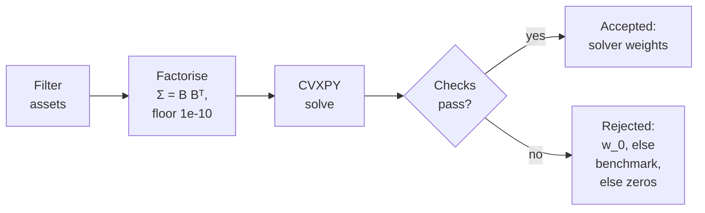

---
myst:
  html_meta:
    description: >-
      How optimalportfolios keeps every CVXPY solve numerically safe and auditable: the
      eigen-factorisation of the covariance with an eigenvalue floor, NaN filtering, the
      acceptance checks and fallbacks of OptimizationOutcome, constraint residuals and their
      tolerances, relaxation records and per-date outcomes, with a verified offline example.
---

# Covariance factorisation, solver outcomes and constraint residuals

*Author: [Artur Sepp](https://github.com/ArturSepp)*

The numerical layer described here is implemented in
[OptimalPortfolios](https://github.com/ArturSepp/OptimalPortfolios).
Software citation: [CITATION.cff](https://github.com/ArturSepp/OptimalPortfolios/blob/main/CITATION.cff).

## Overview

Every CVXPY solve of the package passes through one numerical layer. Before the solve,
`filter_covar_and_vectors_for_nans` removes the assets with a missing or non-positive variance,
and `factorize_covariance` turns the covariance into a stabilised matrix $\tilde\Sigma$ with an
explicit factor $B$, $\tilde\Sigma = B B^{\top}$, whose eigenvalues are floored at $10^{-10}$.
After the solve, the weights are checked against the solver status and the hard constraints. The
result is an `OptimizationOutcome`: the solver's weights when they pass, otherwise a documented
fallback, together with one `ConstraintResidual` record for every constraint row it evaluates.

This page proves what the floor changes. It reproduces the covariance exactly when no eigenvalue
lies below the floor; otherwise it moves the matrix, in spectral norm, by at most the floor plus
the negative-eigenvalue tolerance, $2 \times 10^{-10}$ when every eigenvalue is below one, and
caps the condition number at the largest eigenvalue divided by the floor. When a proxy
duplicates an asset, the floored minimum-variance solve returns the pseudo-inverse portfolio and
keeps the minimum variance. The page then states the acceptance rules, their tolerances, the fallback order
and the records that make a run auditable: relaxed group bounds, dropped groups and a per-date
outcome log. The worked example checks each statement against an independent computation.

## Inputs, notation, and assumptions

| Convention | This article |
|---|---|
| Return basis | None inside the layer, which takes a covariance as given; the rolling example drifts weights with simple price ratios |
| Estimation grid | None: covariances are supplied; the examples use fixed annual matrices |
| Rebalancing grid | One solve per call; rolling functions solve at the keys of `covar_dict`, quarter ends in the rolling example |
| Covariance units | The caller's units, unchanged; the floor $10^{-10}$ is absolute in those units, and the negative-eigenvalue tolerance is relative only when the largest eigenvalue exceeds one |
| Expected returns | None for the numerics; the rolling example uses fixed yields and alpha scores |
| Weight state | Target weights: the accepted solver weights, or the fallback, which in rolling paths is the drifted pre-trade weights $w_0$ |
| Solver | CVXPY with CLARABEL by default (`OptimiserConfig.solver`); the SciPy SLSQP and risk-budgeting backends apply the same budget and box checks and the same fallback |

The notation follows the [conventions page](conventions.md#notation). In addition:

| Symbol | Meaning |
|---|---|
| $S$ | Symmetrised input covariance $(\Sigma + \Sigma^{\top})/2$ |
| $V$, $\nu_k$ | Orthonormal eigenvectors $v_k$ (the columns of $V$) and eigenvalues of $S$ |
| $\varepsilon$ | Eigenvalue floor, $10^{-10}$ in the units of the covariance |
| $\tau$ | Negative-eigenvalue tolerance, $10^{-10} \max(1, \max_k \lvert \nu_k \rvert)$ |
| $\tilde\nu_k$, $\tilde\Sigma$ | Floored eigenvalues $\max(\nu_k, \varepsilon)$ and the stabilised covariance |
| $B$ | Covariance factor, the field `factor`, with $B B^{\top} = \tilde\Sigma$ |
| $\kappa$, $\tilde\kappa$ | Condition numbers of $S$ and of $\tilde\Sigma$: largest over smallest eigenvalue |
| $\mathbf{1}$, $\Sigma^{+}$ | Vector of ones; Moore–Penrose pseudo-inverse of $\Sigma$ |

Weights are fractions of net asset value and the covariance is square and finite. The
propositions hold in exact arithmetic; the code checks the factor to a relative Frobenius error of
$10^{-10}$, and the worked example states the rounding it observes.

## Methodology

A single-date CVXPY solve runs the following steps.



In words: the wrapper removes the assets with a missing or non-positive variance, factorises the
remaining covariance with an eigenvalue floor of $10^{-10}$, and solves with CVXPY; when the
status, the weights and the hard constraints pass their checks, the solver's weights are returned
as accepted, and otherwise the solve is rejected and returns the pre-trade weights $w_0$, else the
benchmark weights, else zeros.

### Filtering the universe

`filter_covar_and_vectors_for_nans(pd_covar, vectors=None, inclusion_indicators=None,
variance_floor=None, drop_non_finite_vectors=False)` returns the filtered covariance and the
supplied vectors, such as means or alphas, restricted to the same assets. It drops an asset when:

- its variance is zero, negative or missing;
- `drop_non_finite_vectors=True` and its value in any supplied vector is not finite, as the
  quadratic, maximum-Sharpe and both tactical wrappers request for their means or alphas;
- its inclusion indicator is not close to one.

After the exclusions, `variance_floor` raises every remaining variance below it to the floor and
leaves the off-diagonal entries as they are, so that asset's correlations fall. No floor is
applied by default; only the risk-budgeting wrapper passes one, $0.001^2$. Filtering reads the
diagonal only: an asset with a missing off-diagonal entry is kept, and the factorisation then
refuses the matrix.

**Remark (a diagonal floor keeps the matrix positive semi-definite).** Raising the variances by
$d \geq 0$ adds $\mathrm{diag}(d)$, and
$w^{\top} (\Sigma + \mathrm{diag}(d)) w = w^{\top} \Sigma w + \sum_i d_i w_i^2 \geq w^{\top} \Sigma w$
for every $w$. By the Courant–Fischer theorem no eigenvalue falls. A zero eigenvalue whose
eigenvector has no weight on the raised assets stays zero: a diagonal floor is not an eigenvalue
floor.

### Eigen-factorisation with a floor

`factorize_covariance(covar, eigenvalue_floor=1e-10, negative_eigenvalue_tolerance=1e-10)`
symmetrises the input to $S$, decomposes $S = V \mathrm{diag}(\nu) V^{\top}$ with
`numpy.linalg.eigh`, refuses the matrix with `ValueError` when an eigenvalue lies below $-\tau$,
and otherwise returns

$$
\tilde\Sigma = V \mathrm{diag}(\tilde\nu) V^{\top}, \qquad B = V \mathrm{diag}(\tilde\nu)^{1/2}, \qquad \tilde\nu_k = \max(\nu_k, \varepsilon) .
$$

It also refuses an empty, non-square or non-finite input, and a factor whose reconstruction
misses $\tilde\Sigma$ by more than $10^{-10}$ in relative Frobenius norm.

**Proposition 1 (floored factorisation).** Let every $\nu_k \geq -\tau$. Then:

1. $B B^{\top} = \tilde\Sigma$ and $B^{\top} B = \mathrm{diag}(\tilde\nu)$.
2. $\tilde\Sigma$ has the eigenvectors of $S$ and the eigenvalues $\tilde\nu_k$. None is below
   $\varepsilon$, every eigenvalue at or above $\varepsilon$ is unchanged, and
   $\tilde\Sigma = S$ when no eigenvalue is below $\varepsilon$.
3. With $\delta = \max_k (\tilde\nu_k - \nu_k)$, for every $w$,
   $0 \leq w^{\top} \tilde\Sigma w - w^{\top} S w \leq \delta \lVert w \rVert^2$, the spectral
   norm of $\tilde\Sigma - S$ is $\delta$, and $\delta \leq \varepsilon + \tau$.
4. $\tilde\kappa = \max(\nu_{\max}, \varepsilon) / \max(\nu_{\min}, \varepsilon)$, which is at
   most $\nu_{\max} / \varepsilon$ when $\nu_{\max} \geq \varepsilon$.

**Proof.** Because $V^{\top} V = I$,
$B B^{\top} = V \mathrm{diag}(\tilde\nu) V^{\top} = \tilde\Sigma$ and
$B^{\top} B = \mathrm{diag}(\tilde\nu)$, which is item 1. Item 2 follows from
$\tilde\Sigma V = V \mathrm{diag}(\tilde\nu)$. For item 3,
$\tilde\Sigma - S = V \mathrm{diag}(\tilde\nu - \nu) V^{\top}$ has the non-negative eigenvalues
$\tilde\nu_k - \nu_k$, so $w^{\top} (\tilde\Sigma - S) w = \sum_k (\tilde\nu_k - \nu_k) (v_k^{\top} w)^2$
lies between zero and $\delta \sum_k (v_k^{\top} w)^2 = \delta \lVert w \rVert^2$, and the
largest eigenvalue $\delta$ is the spectral norm. A raised eigenvalue satisfies
$-\tau \leq \nu_k \lt \varepsilon$, so it moves by at most $\varepsilon + \tau$. Item 4 reads the
extreme eigenvalues off item 2. $\square$

`CovarianceFactorization` stores $\tilde\Sigma$ as `covar`, $B$ as `factor`, the smallest
eigenvalue and the condition number before and after the floor as `raw_min_eigenvalue`,
`raw_condition_number`, `stabilized_min_eigenvalue` and `stabilized_condition_number`, the number
of eigenvalues below the floor as `n_eigenvalues_floored`, and $\delta$ as
`max_eigenvalue_adjustment`. The raw condition number is infinite unless every eigenvalue is
positive.

Both thresholds are in the units of the covariance. The floor is absolute. The tolerance is
absolute while the largest eigenvalue is at most one, as for an annual covariance in decimals, and
proportional to it above one. The same residue can therefore be floored in one unit and refused
in another, as the worked example shows.

### How a solve uses the factor

With `OptimiserConfig.factorize_covar=True`, the default, each CVXPY solver calls
`factorize_covariance` once on the filtered covariance. These are the quadratic, maximum-Sharpe,
minimum-tracking-error, both strategic and both tactical solvers. The variance becomes
$\lVert B^{\top} w \rVert_2^2 = w^{\top} \tilde\Sigma w$, a sum of squares, and the volatility,
tracking-error and group tracking-error limits become second-order cones such as
$\lVert B^{\top} d \rVert_2 \leq \mathrm{TE}_{\max}$ for active weights $d$. The residuals use the
same $\tilde\Sigma$, so the audit measures the geometry the solver saw. With
`factorize_covar=False`, the legacy path passes the raw matrix to CVXPY's `quad_form` through
`psd_wrap`, which asserts positive semi-definiteness instead of checking it. The SciPy and
risk-budgeting backends ignore the field.

**Proposition 2 (a duplicated asset).** Let every eigenvector of $\Sigma$ with eigenvalue zero
have zero net exposure, $\mathbf{1}^{\top} v = 0$, as the difference of an asset and its duplicate
has, and let every other eigenvalue be at least $\varepsilon$. Then the fully invested
minimum-variance portfolio under $\tilde\Sigma$ is

$$
w^{\star} = \frac{\Sigma^{+} \mathbf{1}}{\mathbf{1}^{\top} \Sigma^{+} \mathbf{1}} .
$$

It has no weight along the null space, so it splits a duplicate pair equally, and its variance
under $\Sigma$ is the minimum variance of $\Sigma$. When $w^{\star}$ is positive, it is also the
long-only solution.

**Proof.** Let $P$ project onto the null space $N$ of $\Sigma$. The floor raises exactly the zero
eigenvalues, so $\tilde\Sigma = \Sigma + \varepsilon P$ and
$\tilde\Sigma^{-1} = \Sigma^{+} + \varepsilon^{-1} P$. As $P \mathbf{1} = 0$,
$\tilde\Sigma^{-1} \mathbf{1} = \Sigma^{+} \mathbf{1}$, and the minimiser of
$w^{\top} \tilde\Sigma w$ subject to $\mathbf{1}^{\top} w = 1$ is
$\tilde\Sigma^{-1} \mathbf{1} / \mathbf{1}^{\top} \tilde\Sigma^{-1} \mathbf{1} = w^{\star}$. It lies
in the range of $\Sigma^{+}$, so $P w^{\star} = 0$. Any fully invested $w$ splits as $u + n$ with
$n$ in $N$ and $u$ orthogonal to it; $\mathbf{1}^{\top} n = 0$ gives $\mathbf{1}^{\top} u = 1$, and
$w^{\top} \Sigma w = u^{\top} \tilde\Sigma u$, which is at least the variance of $w^{\star}$ under
$\tilde\Sigma$, equal to its variance under $\Sigma$. $\square$

> **Insight.** Flooring an exact duplicate does not change the minimum variance. The floored
> solve returns the pseudo-inverse portfolio of Proposition 2, which splits the duplicate pair
> equally: in the example both private proxies hold 4.79%.

### Acceptance and fallback

After every CVXPY solve, `validate_solution` checks the result in this order and rejects it at the
first failure:

| Check | Rejected when | Tolerance | Log level |
|---|---|---|---|
| Solution | the solver returned no weights | — | WARNING |
| Status | not `optimal` or `optimal_inaccurate`, for example `infeasible`, `unbounded`, `user_limit` or `solver_error` | — | WARNING |
| Weights | non-finite or of the wrong length | — | ERROR |
| Budget | the net exposure $\mathbf{1}^{\top} w$ misses the band from `min_exposure` to `max_exposure` | $10^{-4}$ | ERROR |
| Long-only and boxes | a weight below zero in a long-only book, or outside its `min_weights` or `max_weights` | $10^{-6}$ | ERROR |
| Hard residuals | any other hard `ConstraintResidual` fails | its own, $10^{-4}$ for aggregate rows | ERROR |
| Inaccurate | `optimal_inaccurate` with `accept_inaccurate=False` | — | WARNING |

An `optimal_inaccurate` result that passes is accepted and logged at WARNING; a clean acceptance
is logged at DEBUG. CVXPY maps CLARABEL's terminations onto these statuses: an almost-solved
problem becomes `optimal_inaccurate`, an almost-infeasible one `infeasible_inaccurate`, and a
numerical error raises `SolverError`, which the solvers catch and record as `solver_error`.

A rejected solve returns the first finite candidate among the pre-trade weights `weights_0`, which
in rolling paths are by default the previous weights drifted to the date, the
`benchmark_weights`, and zeros.
The fallback is neither projected onto the constraints nor solved again; its residuals are
evaluated like any other weights, so a fallback can breach the mandate.

`OptimizationOutcome` records the result: `weights` (the returned vector on the filtered
universe), `accepted`, `solver`, `status`, `context`, `reason`, `fallback_source`,
`constraint_residuals`, `covar_factorization` and `constraints`, the aligned constraints of the
solve. Its property `compliant` is true when every hard residual passes, and `residuals_frame()`
returns the residuals as a table. The single-date wrappers of the CVXPY solvers return a pair: a
weight Series on the original universe, with zeros for removed assets, and the outcome, whose
arrays refer to the filtered universe. `accepted` says that the solver's weights were used; `compliant` says that
the returned weights, solver or fallback, meet every hard row.

### Constraint residuals

`evaluate_constraint_residuals(weights, constraints, covar=None, covar_factorization=None,
tolerance=1e-4)` evaluates any weights against aligned constraints and returns a tuple of
`ConstraintResidual(constraint_type, name, actual, lower, upper, violation, tolerance, hard,
passed)`. For a row with value $a$ and bounds $\ell$ and $u$,

$$
\mathrm{violation} = \max(0, \ell - a, a - u), \qquad \mathrm{passed} = \mathrm{violation} \leq \mathrm{tolerance} \quad \text{for a hard row} .
$$

The tolerance is $10^{-6}$ for the long-only and per-asset rows and `tolerance` for the
exposure, return, volatility, turnover, tracking-error, group, deviation and beta rows. Risk rows
need a covariance or a factorisation, and the factorisation takes precedence. In the utility form
of a solver, the volatility, turnover and tracking-error rows are soft, `hard=False`: they report
their violation and always pass. The [constraints page](constraints.md#after-solving) defines each
row.

### Diagnostics around the solve

Three configuration fields act only in `wrapper_maximise_alpha_over_tre`; the other wrappers
ignore them.

- `validate_inputs`, default `True`, runs a pre-solve input contract: covariance integrity and
  conditioning, box caps against the budget, group reachability and the benchmark against its
  box. It only logs; the solve runs whatever it finds.
- `diagnose_infeasibility`, default `True`, runs a second analysis after a rejected solve. A
  status containing `infeasible` starts an elastic program, and any other status a
  covariance-conditioning report.
- `max_constraint_relaxation`, default `None`, sets the log level of relaxed group bounds.

The elastic program keeps full investment and the long-only bounds hard and gives each box and
group bound its own non-negative slack $s_j$:

$$
\min_{w, s} \sum_j s_j \quad \text{subject to} \quad \mathbf{1}^{\top} w = 1, \quad w \geq 0, \quad \text{each box or group bound relaxed by } s_j \geq 0 .
$$

**Proposition 3 (caps below the budget).** With per-asset caps $u_i$ only and
$\sum_i u_i \lt 1$, the smallest total slack is $1 - \sum_i u_i$.

**Proof.** At a feasible point, $\sum_i s_i \geq \sum_i (w_i - u_i) = 1 - \sum_i u_i$. Any
$w \geq u$ with $\mathbf{1}^{\top} w = 1$ and $s_i = w_i - u_i$ attains the bound. $\square$

The reported slacks therefore size the shortfall; their split across the caps is one of many
optima.

A frozen position, one whose rebalancing indicator is not one, is pinned at its pre-trade weight.
When the freeze pushes a group over its cap or under its floor,
`Constraints.update_with_valid_tickers` moves that bound for this solve to the frozen sum, with a
cushion of $10^{-8}$, and records a `RelaxationRecord(context, items, total_relaxation,
max_relaxation, breached_budget, breached_tol)` on the `optimalportfolios.optimization.constraints`
logger. The record is logged at ERROR when the largest relaxation exceeds
`max_constraint_relaxation` or a widened cap exceeds `max_exposure`, otherwise at INFO when the
mismatch is at least $10^{-4}$; a smaller mismatch is logged at DEBUG without a record. The field
never caps, rejects or undoes a relaxation. The
[constraints page](constraints.md#frozen-group-bound-waivers) gives the rule in full. A group whose
loadings are all zero, for example because filtering removed every member, is dropped and
recorded as a `DroppedGroupRecord(groups, no_groups_remain)` at DEBUG on the same logger.

`configure_run_logging(attach_summary=True)` in `optimalportfolios.optimization.solver_diagnostics`
attaches handlers that tally these records over a run: `SolverRejectionSummary`,
`RelaxationSummary`, `DroppedGroupSummary`, `InputContractSummary` and `WarningSummary`. It
returns a `RunDiagnostics` with `summary()`, `to_frame()` and `check_fallback_gate`, whose default
`max_fraction` is 5%.

A rolling result keeps the outcomes only in `rolling_maximise_alpha_with_target_return`: its
weight table carries `attrs['optimization_outcomes']`, a list with one dictionary per rebalance
holding `date`, `accepted`, `status`, `solver`, `reason`, `fallback_source` and `compliant`. The
other rolling functions and the dispatcher return plain weight tables; keep outcomes through the
single-date wrappers or the logging handlers.

## Worked example

The canonical script of this page,
[`examples/docs/solver_numerics_and_outcomes.py`](../examples/docs/solver_numerics_and_outcomes.py),
runs offline and asserts every number and property quoted here against an independent
computation. Several steps deliberately log rejections:

```console
python -m examples.docs.solver_numerics_and_outcomes
```

The six assets have annual volatilities from 6% to 16%: government bonds, credit, equity, two
private-market proxies and gold. The two proxies are one series: both have a volatility of 12%,
correlation one with each other, and the same correlation with every other asset. Without the
second proxy the covariance is well conditioned, nothing is floored and the factor reproduces the
matrix:

```python
covar = covariance(VOLS, CORR, TICKERS)
distinct = covar.drop(index='Private B', columns='Private B')
factorization = op.factorize_covariance(distinct.to_numpy())
factor = factorization.factor
print(factorization.n_eigenvalues_floored, round(factorization.raw_condition_number, 1))
```

It prints `0 12.2`. The script checks $B B^{\top} = \Sigma$ and $B^{\top} B = \mathrm{diag}(\nu)$
to $10^{-16}$, the variance $\lVert B^{\top} w \rVert^2$ against a Cholesky factor for several
portfolios, and the condition number 12.2 against the singular values.

With both proxies, one eigenvalue is zero up to a rounding error of either sign. The floor raises
it to exactly $10^{-10}$, and the condition number becomes the largest eigenvalue divided by the
floor:

```python
floored = op.factorize_covariance(covar.to_numpy())
print(floored.n_eigenvalues_floored, floored.stabilized_min_eigenvalue,
      f'{floored.stabilized_condition_number:.3e}')
```

It prints `1 1e-10 3.885e+08`. The raw condition number is infinite when the rounding error is
negative and above $10^{14}$ when it is positive. As Proposition 1 predicts, the other five
eigenvalues are unchanged to a relative $10^{-12}$, and the whole change is $10^{-10} v v^{\top}$
along the null direction $v$, Private A minus Private B divided by $\sqrt{2}$. The equal-weighted portfolio keeps its variance,
and a position in Private A alone gains $5 \times 10^{-11}$.

Floating-point residue can leave that eigenvalue slightly negative. A residue of
$-5 \times 10^{-12}$ is within the tolerance and floored to the same matrix, while $-10^{-6}$ is
refused:

```python
null = np.zeros(len(TICKERS))
null[[TICKERS.index('Private A'), TICKERS.index('Private B')]] = [2 ** -0.5, -(2 ** -0.5)]
residue = op.factorize_covariance(covar.to_numpy() - 5e-12 * np.outer(null, null))
try:
    op.factorize_covariance(covar.to_numpy() - 1e-6 * np.outer(null, null))
    refused = ''
except ValueError as error:
    refused = str(error)
print(f'{residue.raw_min_eigenvalue:.1e}', residue.stabilized_min_eigenvalue)
print(refused)
```

It prints `-5.0e-12 1e-10` and
`covar is materially indefinite: minimum eigenvalue -1e-06 is below -1e-10`. The largest
eigenvalue here is 0.039, below one, so the tolerance is $10^{-10}$ itself. Expressed in basis
points squared, the same matrix has a largest eigenvalue of about 3.9 million and a tolerance of
$3.9 \times 10^{-4}$, and the residue, now $-5 \times 10^{-4}$, is refused.

![Left: the six eigenvalues of the covariance with the private pair at correlation one minus
1e-12, on a log scale; five lie between 0.002 and 0.04 and are unchanged by the floor, and the
sixth, 1e-14, is raised to the floor of 1e-10. Right: the condition number against one minus the
correlation of the pair, from 0.1 to 1e-13; before the floor it grows as the inverse of the gap
to 3e13, and after the floor it follows the same line until the smallest eigenvalue reaches
1e-10, then stays at the largest eigenvalue over the floor,
3.9e8.](images/covariance_conditioning.png)

*Figure: what the eigenvalue floor changes as the two private proxies approach collinearity. The
five eigenvalues above the floor are unchanged, and so is the condition number until the floor
binds; the smallest eigenvalue is raised to 1e-10 and the condition number is capped. Drawn by the `exhibit` function of the
canonical script; the [analytics gallery](analytics_gallery.md) lists its provenance.*

Filtering comes before the factorisation. Here it removes Cash, whose variance is zero, New fund,
whose variance is missing, and Gold, whose alpha is missing, and a variance floor of $0.07^2$
raises the volatility of government bonds from 6% to 7%:

```python
panel = covar.reindex(index=TICKERS + ['Cash', 'New fund'],
                      columns=TICKERS + ['Cash', 'New fund'], fill_value=0.0)
panel.loc['New fund', 'New fund'] = np.nan
alphas = pd.Series([0.1, 0.2, 0.3, 0.2, 0.2, np.nan, 0.0, 0.4], index=panel.index)
kept, vectors = op.filter_covar_and_vectors_for_nans(
    panel, vectors={'alphas': alphas}, variance_floor=0.07 ** 2, drop_non_finite_vectors=True)
print(kept.index.tolist())
print(np.sqrt(np.diag(kept)).round(2).tolist())
```

It prints `['Govt', 'Credit', 'Equity', 'Private A', 'Private B']` and
`[0.07, 0.08, 0.16, 0.12, 0.12]`, and the alphas follow the same assets. The off-diagonal entries
are unchanged. No eigenvalue falls, and the zero eigenvalue of the duplicate survives, because its
direction has no weight on government bonds. Without the floor and the vector check, the default
drops only Cash and New fund and returns the six original assets unchanged.

The minimum-variance wrapper then solves on the floored matrix:

```python
config = op.OptimiserConfig(apply_total_to_good_ratio=False)
weights, outcome = op.wrapper_quadratic_optimisation(
    covar, op.Constraints(is_long_only=True), optimiser_config=config, context='duplicate')
print(weights.round(4).tolist())
print(outcome.accepted, outcome.status, outcome.covar_factorization.n_eigenvalues_floored)
```

It prints `[0.6193, 0.1251, 0.0889, 0.0479, 0.0479, 0.0709]` and `True optimal 1`. The weights
equal the pseudo-inverse portfolio of Proposition 2 to $2 \times 10^{-6}$, with the proxies split
equally, and their variance under the raw matrix equals its minimum variance
$1 / \mathbf{1}^{\top} \Sigma^{+} \mathbf{1}$. The outcome keeps the floored matrix as
`covar_factorization`. With `factorize_covar=False` the outcome stores no factorisation, and in
this example the weights agree to $2 \times 10^{-6}$.

The outcome's residuals cover the rows its constraints define, here the budget and the long-only
bound. `evaluate_constraint_residuals` audits the same weights against a different policy, caps
of 50%:

```python
print(outcome.residuals_frame()[['constraint_type', 'actual', 'violation', 'tolerance',
                                 'passed']].round(6))
capped = op.Constraints(is_long_only=True, max_weights=pd.Series(0.5, index=TICKERS))
audit = op.evaluate_constraint_residuals(weights.to_numpy(), capped, covar=covar.to_numpy())
breaches = [(r.name, round(r.violation, 4)) for r in audit if r.hard and not r.passed]
print(outcome.compliant, breaches)
```

| constraint_type | actual | violation | tolerance | passed |
|---|---|---|---|---|
| exposure | 1.000000 | 0.0 | 0.000100 | True |
| long_only | 0.047914 | 0.0 | 0.000001 | True |

The outcome is compliant, and the audit finds one breach, `('Govt', 0.1193)`: government bonds
hold 61.93% against a cap of 50%.

Validation does not trust the status. A vector that the solver calls `optimal` but that sums to
1.5 million, the failure this check was written for, is rejected; the same minimum-variance
weights labelled `optimal_inaccurate` are accepted:

```python
from optimalportfolios.optimization.solver_diagnostics import validate_solution
blown_up = validate_solution(1.5e6 * weights.to_numpy(), 'optimal', outcome.constraints,
                             n=len(TICKERS), covar_factorization=outcome.covar_factorization)
imprecise = validate_solution(weights.to_numpy(), 'optimal_inaccurate', outcome.constraints,
                              n=len(TICKERS), covar_factorization=outcome.covar_factorization)
print(blown_up.accepted, blown_up.fallback_source, blown_up.reason)
print(imprecise.accepted, imprecise.status)
```

It prints `False zeros budget violated: sum(w)=1.5e+06 vs target 1 (atol=0.0001)` and
`True optimal_inaccurate`. Without `weights_0` or a benchmark the fallback is zeros, which fail
the budget row, so that outcome is not compliant either. The script also checks each row of the
acceptance table at its tolerance and log level.

A deliberately infeasible mandate shows the fallback. Five caps of 10% cannot hold a fully
invested portfolio:

```python
caps = pd.Series(0.10, index=distinct.index)
impossible = op.Constraints(is_long_only=True, max_weights=caps)
prior = pd.Series(0.20, index=distinct.index)
fallback, rejected = op.wrapper_quadratic_optimisation(
    distinct, impossible, weights_0=prior, optimiser_config=config, context='caps sum to 0.5')
print(rejected.accepted, rejected.status, rejected.reason, rejected.fallback_source)
print(rejected.compliant, rejected.residuals_frame().query('not passed')['violation'].tolist())
sources = []
for prior_weights, benchmark in ((prior, prior), (None, prior), (None, None)):
    _, attempt = op.wrapper_quadratic_optimisation(
        distinct, replace(impossible, benchmark_weights=benchmark), weights_0=prior_weights,
        optimiser_config=config)
    sources.append(attempt.fallback_source)
print(sources)
```

It prints `False infeasible w.value is None weights_0`, `False [0.1, 0.1, 0.1, 0.1, 0.1]` and
`['weights_0', 'benchmark_weights', 'zeros']`. CLARABEL reports `infeasible` without a solution,
so the first check rejects it. The prior equal weights come back unprojected and break each cap
by 0.10, so the outcome is neither accepted nor compliant. The loop removes the candidates one at
a time and shows their order. Run through `diagnose_infeasibility`, the elastic program reports
that the caps must give 0.5 in total, the shortfall of Proposition 3, which SciPy's `linprog`
confirms on the same program.

A frozen private-equity position shows the relaxation and dropped-group records. It is held at
25% against a 20% cap on illiquid assets, and gold has no variance estimate:

```python
from optimalportfolios.optimization.solver_diagnostics import (
    DroppedGroupSummary, RelaxationSummary)
book = ['Private equity', 'Equity', 'Bonds', 'Gold']
book_covar = pd.DataFrame(np.diag([0.20, 0.16, 0.06, np.nan]) ** 2, index=book, columns=book)
groups = op.GroupLowerUpperConstraints(
    group_loadings=pd.DataFrame({'Illiquid': [1.0, 0.0, 0.0, 0.0],
                                 'Commodities': [0.0, 0.0, 0.0, 1.0]}, index=book),
    group_min_allocation=None,
    group_max_allocation=pd.Series({'Illiquid': 0.20, 'Commodities': 0.10}))
mandate = op.Constraints(is_long_only=True, min_weights=pd.Series(0.0, index=book),
                         max_weights=pd.Series(1.0, index=book),
                         group_lower_upper_constraints=groups,
                         tracking_err_vol_constraint=0.05)
records = logging.getLogger('optimalportfolios.optimization.constraints')
relaxations, dropped = RelaxationSummary(), DroppedGroupSummary()
records.setLevel(logging.DEBUG)
records.addHandler(relaxations)
records.addHandler(dropped)
held, held_outcome = op.wrapper_maximise_alpha_over_tre(
    book_covar, pd.Series([0.0, 0.3, 0.1, 0.2], index=book),
    pd.Series([0.15, 0.45, 0.40, 0.0], index=book), mandate,
    weights_0=pd.Series([0.25, 0.40, 0.35, 0.0], index=book),
    rebalancing_indicators=pd.Series([0, 1, 1, 1], index=book),
    optimiser_config=op.OptimiserConfig(max_constraint_relaxation=0.02), context='frozen PE')
records.removeHandler(relaxations)
records.removeHandler(dropped)
records.setLevel(logging.NOTSET)
print(relaxations.records[0].items, relaxations.records[0].breached_tol)
print(dropped.records[0].groups, held_outcome.accepted, held.round(4).tolist())
```

It prints `(('Illiquid', 'group_max', 0.2, 0.25000001),) True` and
`('Commodities',) True [0.25, 0.7038, 0.0462, 0.0]`. The cap rises to the frozen 25% plus
$10^{-8}$ for this solve, and the relaxation of 0.05 exceeds the configured 0.02, so the record is
logged at ERROR. Without the limit it is logged at INFO, and a mismatch below $10^{-4}$ leaves no
record. Filtering removes gold, which empties the commodities group; that group is dropped and
recorded. The solve is accepted and compliant against the relaxed cap and the 5% tracking-error
limit.

Last, a rolling tactical allocation keeps one outcome per date. At the third quarter end the
target return of 9% exceeds every yield:

```python
dates = pd.date_range('2024-03-31', periods=4, freq='QE')
months = pd.date_range('2023-12-31', '2024-12-31', freq='ME')
growth = [0.002, 0.004, 0.008, 0.006, 0.003]
prices = pd.DataFrame(100 * np.exp(np.outer(np.arange(len(months)), growth)),
                      index=months, columns=distinct.index)
yields = pd.DataFrame([[0.03, 0.045, 0.06, 0.07, 0.02]] * 4, index=dates,
                      columns=distinct.index)
signals = pd.DataFrame([[0.010, 0.020, 0.030, 0.015, 0.025]] * 4, index=dates,
                       columns=distinct.index)
rolling = op.rolling_maximise_alpha_with_target_return(
    prices, signals, yields, pd.Series([0.035, 0.035, 0.09, 0.035], index=dates),
    op.Constraints(is_long_only=True, max_weights=pd.Series(0.5, index=distinct.index)),
    {date: distinct for date in dates}, optimiser_config=config)
for row in rolling.attrs['optimization_outcomes']:
    print(row['date'], row['accepted'], row['status'], row['fallback_source'], row['compliant'])
```

| date | accepted | status | fallback_source | compliant |
|---|---|---|---|---|
| 2024-03-31 | True | optimal | None | True |
| 2024-06-30 | True | optimal | None | True |
| 2024-09-30 | False | infeasible | weights_0 | False |
| 2024-12-31 | True | optimal | None | True |

The accepted dates hold 50% in equity and 50% in gold, the vertex with the highest alpha under the
caps. The rejected date returns the June portfolio drifted to September with the price ratios,
which carries equity above its 50% cap and is therefore not compliant.

## Implementation in optimalportfolios

All six objects are importable from `optimalportfolios`.

- `factorize_covariance(covar, eigenvalue_floor=1e-10, negative_eigenvalue_tolerance=1e-10)` in
  [`covar_factorization.py`](../src/optimalportfolios/optimization/covar_factorization.py)
  returns a `CovarianceFactorization`, a frozen dataclass that checks shape, finiteness and the
  reconstruction $B B^{\top} = \tilde\Sigma$ when it is built.
- `filter_covar_and_vectors_for_nans(pd_covar, vectors=None, inclusion_indicators=None,
  variance_floor=None, drop_non_finite_vectors=False)` in
  [`filter_nans.py`](../src/optimalportfolios/utils/filter_nans.py) is called before the solve
  by the single-date wrapper of every solver that takes a labelled covariance.
- `OptimizationOutcome` and `validate_solution` are in
  [`solver_diagnostics.py`](../src/optimalportfolios/optimization/solver_diagnostics.py), with
  the SciPy and risk-budgeting validators, the input contract `validate_solver_inputs`, the
  diagnosis `diagnose_solver_failure` and the run-level handlers.
- `ConstraintResidual` and `evaluate_constraint_residuals` are in
  [`analytics.py`](../src/optimalportfolios/optimization/constraints/analytics.py).

The [configuration source](../src/optimalportfolios/optimization/config.py) defines six fields
that act on this layer:

| Field | Default | Effect |
|---|---|---|
| `solver` | `'CLARABEL'` | CVXPY solver passed to `problem.solve` and recorded in the outcome; the SciPy and risk-budgeting backends ignore it |
| `verbose` | `False` | Passed to `problem.solve` for the solver log; sets SLSQP's `disp` in the SciPy backends |
| `factorize_covar` | `True` | One floored factorisation per CVXPY solve; `False` restores `quad_form` with `psd_wrap` |
| `validate_inputs` | `True` | Pre-solve input contract, in `wrapper_maximise_alpha_over_tre` only |
| `diagnose_infeasibility` | `True` | Elastic or conditioning diagnosis after a rejection, in the same wrapper only |
| `max_constraint_relaxation` | `None` | Log-level threshold for relaxed group bounds, forwarded by the same wrapper only |

`apply_total_to_good_ratio` is described in
[choosing an objective](optimization_module_readme.md#optimiserconfig) and
`use_drifted_weights_0` in [rolling backtests](rolling_backtests.md).

> **Pitfall.** The fallback covers a failed solve, not a refused input. A covariance with an
> eigenvalue below the tolerance, such as the residue of $-10^{-6}$ above, makes the default
> wrappers raise `ValueError` from `factorize_covariance` before any solve. With
> `factorize_covar=False` the same matrix is solved and accepted as if it were convex.

## Interpretation and limitations

- The floor is a numerical safeguard, not a covariance estimator. It moves a matrix by at most
  $2 \times 10^{-10}$ when every eigenvalue is below one, and it leaves an ill-conditioned estimate
  exactly as it is while the smallest eigenvalue stays above $10^{-10}$: in the figure, a condition
  number of about $3 \times 10^{8}$ at a gap of $10^{-8}$ is unchanged. Near-collinear assets keep
  their estimation error; see [covariance estimators](covariance_estimators.md) for the estimators.
- CVXPY (Diamond and Boyd 2016) certifies convexity through its disciplined convex programming
  rules; `psd_wrap` bypasses that certificate for the risk matrix. The package replaces it with
  its own test in `factorize_covariance`: the eigenvalue check, the floor and the refusal of a
  materially indefinite matrix.
- CLARABEL (Goulart and Chen 2026) is an interior-point method for conic programs with quadratic
  objectives, built on a homogeneous embedding. The package reads only the status that CVXPY
  maps from its termination, and checks the returned weights at its own tolerances: an `optimal`
  status is necessary for acceptance, not sufficient.
- Proposition 2 needs every riskless combination to have zero net exposure. Two assets at
  correlation one with volatilities of 12% and 15% form the riskless long-short portfolio
  $(5, -4)$, which is fully invested and has zero variance. The budget does not rule it out, so the
  weight bounds, not the floor, decide the solution.
- A fallback is a held portfolio, not a solution. Whether to trade it, retry or skip a rebalance
  is the application's decision; `check_fallback_gate` fails a run whose share of fallbacks is
  too high.
- Residuals cover only the rows whose inputs are present: risk rows need a covariance,
  benchmark-relative rows a benchmark, and turnover rows `weights_0`. A missing row is not a
  passed row.
- The tolerances are absolute: $10^{-4}$ of net asset value on exposure and group rows, and
  $10^{-4}$ in the units of volatility on tracking-error rows.

## See also

- [Choosing an objective](optimization_module_readme.md)
- [Portfolio constraints](constraints.md)
- [Incomplete histories and frozen positions](incomplete_histories.md)
- [Rolling backtests](rolling_backtests.md)
- [Covariance estimators](covariance_estimators.md)
- [Conventions, notation and glossary](conventions.md)

## References

- Diamond, S. and Boyd, S. (2016). *CVXPY: A Python-Embedded Modeling Language for Convex
  Optimization*. Journal of Machine Learning Research, 17(83), 1–5.
  [JMLR](https://www.jmlr.org/papers/v17/15-408.html).
- Goulart, P. J. and Chen, Y. (2026). *Clarabel: An interior-point solver for conic programs with
  quadratic objectives*. Mathematical Programming Computation.
  [DOI 10.1007/s12532-026-00320-7](https://doi.org/10.1007/s12532-026-00320-7). Preprint
  [arXiv:2405.12762](https://arxiv.org/abs/2405.12762) (2024).
- [OptimalPortfolios software citation](https://github.com/ArturSepp/OptimalPortfolios/blob/main/CITATION.cff).
- [qis software citation](https://github.com/ArturSepp/QuantInvestStrats/blob/main/CITATION.cff).
