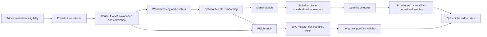

# Signal-based and risk-based models: consolidated empirical pipeline

Date: 2026-08-17  
Status: current signal specifications frozen; accepted risk evidence summarized with final-universe reconciliation disclosed

## Executive summary

The empirical evidence is organised as two distinct applications of the same clustering
layer:

1. **Signal-based models:** clustering changes cross-sectional score standardisation. It does
   not allocate capital to clusters and does not use covariance-based portfolio optimisation.
2. **Risk-based models:** no momentum or alpha signal is used. Clustering enters only through
   HRP or explicit cluster risk budgets in a fully invested long-only portfolio.

The snapshot methodology is named **Rolling EWMA-Ward correlation clustering**, shortened to
**Rolling-Ward**. When the M1-star partition-bonus smoother is used, the complete name is
**noise-calibrated Rolling-Ward clustering**. MCF is the separate lineage tracker and is not
part of the clustering name.

The current signal results are:

- U1: classic cluster-standardised momentum improves return relative to BICS-sector and
  global controls; it also lowers volatility relative to global.
- U2: the selected classic 12-minus-1 cluster score, AUM50 eligibility, and 55/35/10 sleeve
  construction beats the matched global score on net return, volatility, and Sharpe.
- U3: ROSAA short-span-3 cluster scoring with volatility-normalised contract sizing gives up
  some return but materially improves volatility and Sharpe.

The accepted risk results are:

- U1: Rolling-Ward HRP improves return, volatility, and Sharpe versus flat ERC and canonical
  single-link HRP.
- U2: unconstrained HRP is an informative failure because it concentrates almost entirely in
  low-volatility fixed-income funds. Equal-cluster risk budgeting still proves the intended
  risk-distribution mechanism.
- U3: equal-cluster risk budgeting improves return and Sharpe versus flat ERC and strongly
  reduces cluster-risk concentration.

## End-to-end architecture

## Shared point-in-time controls

The following rules apply throughout:

1. Membership, AUM, return-history, classification, and owner exclusions are applied using
   only information available at the decision date.
2. Eligibility is imposed before covariance estimation, clustering, signal scoring, ranking,
   and portfolio construction.
3. A weight decided at date `t` is implemented with one-period lag and applied over the next
   holding interval.
4. QIS holds units between rebalances and computes turnover and transaction costs from the
   realised trades.
5. Reported Sharpes use the frozen RF=0 convention.
6. EW-all is not a ranking or performance yardstick. It is used only as the market reference
   for separately reported beta and alpha columns.
7. The common headline window is 2009-08-31 through 2026-06-30.

## Part I: signal-based models

### Shared signal construction

At each decision date:

1. Compute one raw momentum panel from eligible price data.
2. Produce matched score panels from the same raw signal:
   - **global score:** standardise over the relevant broad cross-section;
   - **cluster score:** standardise inside the current Rolling-Ward cluster;
   - **classification score, U1 only:** apply the same cluster-scoring function with BICS
     sectors supplied as the groups.
3. A cluster or sector containing 10 or fewer eligible instruments uses the global mean and
   standard deviation. This prevents unstable small-group z-scores.
4. Rank each completed score panel once with the canonical OptimalPortfolios quantile
   function.
5. Apply the same eligibility, quantile, strategic budgets, implementation lag, and cost to
   the treatment and control.

The clusters affect score standardisation only. There is no cluster-equal capital budget in
the current signal experiments.

### Selected signal specifications

| Component | U1 equities | U2 BlackRock funds | U3 futures |
|---|---|---|---|
| Signal | Classic 12m ex 1m | Classic 12m ex 1m | ROSAA risk-adjusted |
| Portfolio | Long-short | Long-only | Long-short |
| Quantile | 25% top/bottom | 25% top | 25% top/bottom |
| Cluster fallback | 10 | 10 | 10 |
| Clustering | M1-star Rolling-Ward, delta 0.0866 | W-THU/span 156 Rolling-Ward | M1-star Rolling-Ward, delta 0.0691 |
| Controls | BICS sector and global | Global within sleeves | Global across all eligible futures |
| Strategic construction | One matched stock cross-section | 55% Equity / 35% FI / 10% Rest | One futures cross-section |
| Position sizing | Equal within each signed side | Equal within each sleeve's selected funds | Contract-level inverse volatility |
| Rebalancing | Monthly | Every two months | Monthly |
| Cost | 10 bp | 20 bp | 10 bp |

### U1 equities

#### Pipeline

- Universe: point-in-time MSCI US constituents.
- Primary comparison mask: an asset must be an eligible index member and have a non-missing
  Bloomberg BICS sector. The identical mask is applied to cluster, sector, and global legs.
- Signal: classic monthly momentum using 12 completed monthly observations after excluding
  the latest month.
- Cluster partition: cached U1 M1-star membership, delta 0.0866.
- BICS control: the same `compute_classic_momentum_cluster_alpha` function with point-in-time
  BICS sector groups.
- Portfolio: top quartile long with +1 exposure and bottom quartile short with -1 exposure;
  selected stocks are equally weighted inside each side.
- Minimum cluster/group size for local scoring: 10.

#### Measured performance

| U1 leg | Annual net return | Volatility | RF=0 Sharpe | One-way turnover |
|---|---:|---:|---:|---:|
| **M1-star cluster score** | **-3.285%** | 10.883% | **-0.2505** | 2.555x |
| BICS-sector score | -3.552% | **10.209%** | -0.3019 | **2.473x** |
| Global score | -3.975% | 12.799% | -0.2508 | 2.504x |

Cluster minus BICS:

- annual net return: +26.8 bp;
- volatility: +0.67 percentage points;
- Sharpe: +0.051;
- turnover: +0.081x.

Cluster minus global:

- annual net return: +69.1 bp;
- volatility: -1.92 percentage points;
- Sharpe: +0.0003, economically equal but directionally higher;
- turnover: +0.050x.

The U1 conclusion is comparative. Cluster scoring improves the economics of classic momentum
relative to both controls, but the standalone long-short return remains negative over this
sample.

### U2 BlackRock funds

#### Pipeline

- Universe: the complete BlackRock fund catalogue in the supplied data.
- AUM data: Bloomberg `FUND_TOTAL_ASSETS`, audited in USD millions.
- AUM statistic: arithmetic average of the latest 12 completed calendar month-end
  observations available before the decision date.
- Primary eligibility: rolling AUM strictly greater than USD50m. Missing or incomplete AUM
  histories are ineligible.
- The AUM rule is applied before clustering, signal benchmark construction, score
  standardisation, and ranking.
- Signal: classic monthly 12m-ex-1m momentum.
- Broad sleeve budgets: 55% Equity, 35% Fixed Income, and 10% Rest.
- Rest contains Multi Asset, Commodity, Digital Assets, Real Estate, and Cash.
- Within each sleeve, select the top 25%; every selected fund in that sleeve receives the same
  weight.
- Cluster scoring changes the z-score only. Correlation clusters receive no capital budget.
- Rebalance every two months with 20 bp one-way costs.

#### Measured performance

| U2 leg | Cumulative net | Annual net return | Volatility | RF=0 Sharpe | One-way turnover |
|---|---:|---:|---:|---:|---:|
| **Cluster score** | **145.219%** | **5.475%** | **10.492%** | **0.562** | 2.060x |
| Global score | 144.437% | 5.455% | 11.168% | 0.533 | **1.759x** |
| Cluster minus global | **+0.782 pp** | **+2.0 bp** | **-0.676 pp** | **+0.029** | +0.300x |

Classic momentum is retained because it is the only tested U2 signal under the 55/35/10
construction for which cluster scoring beats the matched global control on both net return
and Sharpe.

The ROSAA short-span-3 cluster portfolio has a higher standalone Sharpe of 0.632, but it does
not beat its corresponding global control on net return. That row remains a labelled signal
sensitivity rather than the selected cluster-value exhibit.

### U3 futures

#### Pipeline

- Universe: continuous futures with date-specific history eligibility.
- Frozen low-liquidity exclusions:
  - `BMR1 Curncy`, the available source alias for requested `MMR1 Curncy`;
  - `CUA1 Comdty`;
  - `IJ1 Comdty`;
  - `KC1 Comdty`;
  - `KM1 Index`;
  - `MES1 Index`;
  - `QC1 Index`;
  - `RS1 Comdty`;
  - `ST1 Index`;
  - `UXY1 Comdty`;
  - `WN1 Comdty`.
- Later-starting contracts enter only after sufficient point-in-time data are available.
- Signal: ROSAA risk-adjusted monthly momentum with long span 12, short span 3, signal
  volatility span 13, and EWMA mean adjustment.
- Minimum cluster size: 10.
- Rank all eligible futures in one cross-section; no asset-class capital split.
- Select the top and bottom 25%.
- Position volatility: EWMA daily log-return volatility with span 282 trading days, equivalent
  to 13 months under the 260-day convention.
- Contract scaler:

  `s(i,t) = min(5, 15% / sigma(i,t))`.

- Long weight: `s(i,t) / N_long`; short weight: `-s(i,t) / N_short`.
- Rebalance monthly with one-period lag and 10 bp one-way costs.

#### Measured performance

| U3 leg | Annual net return | Volatility | RF=0 Sharpe | One-way turnover |
|---|---:|---:|---:|---:|
| Cluster score | 5.749% | **8.181%** | **0.725** | **2.273x** |
| Global score | **6.345%** | 10.601% | 0.634 | 2.334x |
| Cluster minus global | -59.6 bp | **-2.420 pp** | **+0.091** | **-0.061x** |

The cluster portfolio gives up absolute return but produces a materially better risk-adjusted
portfolio. This is the strongest signal-volatility result across the three universes.

### Consolidated signal evidence

| Comparison | Higher cluster return | Lower cluster volatility | Higher cluster Sharpe |
|---|---:|---:|---:|
| U1 cluster vs global | Yes | Yes | Approximately equal / slightly yes |
| U1 cluster vs BICS | Yes | No | Yes |
| U2 cluster vs global | Yes | Yes | Yes |
| U3 cluster vs global | No | Yes | Yes |

The supported signal claim is:

> Standardising momentum inside endogenous correlation clusters can prevent heterogeneous
> instruments from dominating one cross-sectional scale. In the selected specifications it
> improves Sharpe in all three universes, improves net return in U1 and U2, and materially
> reduces volatility in U1, U2, and U3 relative to the global control.

U1's standalone return is negative and U3's cluster return is below global, so the evidence
does not support an unconditional claim that clustering always raises raw return.

## Part II: signal-free risk-allocation models

### Pipeline

1. Apply the point-in-time eligible asset set.
2. Estimate the causal covariance matrix and its corresponding correlation matrix.
3. Derive the Rolling-Ward hierarchy from the point-in-time correlation input.
4. Construct long-only, fully invested portfolios using the identical covariance matrix and
   asset set for all methods on a given date.
5. Apply one-period implementation lag and the common universe-specific transaction cost.
6. Measure realised performance and ex-ante Euler risk contributions aggregated through the
   Rolling-Ward clusters.

No alpha or momentum signal is used. Ward-HERC, NCO, and nested cluster risk budgeting are
excluded.

### Allocation methods

| Method | Definition |
|---|---|
| Flat ERC | Equal asset risk budgets solved with the production OptimalPortfolios risk-budget solver |
| Cluster RB sqrt(n) | Cluster budget proportional to the square root of cluster size; equal asset budget within cluster |
| Equal-cluster RB | Equal risk budget per cluster; equal asset budget within cluster |
| Rolling-Ward HRP | Standard inverse-variance recursive bisection on the selected Ward hierarchy |
| Canonical single-HRP | The same HRP recursion using canonical single linkage |

For cluster `g` containing `n_g` assets, define its budget as:

`B_g proportional to n_g^alpha`,

and each asset in the cluster receives target risk budget:

`b_i = B_g / n_g`.

The tested cases are:

- `alpha=1`: flat equal-asset risk budgets;
- `alpha=0.5`: square-root cluster-size budgets;
- `alpha=0`: equal risk budget per cluster.

### Covariance and hierarchy inputs

- **U1:** raw ME-return Rolling-Ward hierarchy with EWMA span 36, Ward linkage, `1-rho`
  distance, and cutoff 0.60. Allocation uses the frozen baseline HCGL/FF6 covariance on the
  same asset set.
- **U2:** W-THU returns, EWMA span 156, demeaned Pearson correlation, `1-rho` distance, Ward
  linkage, and cutoff 0.60. The causal allocation covariance is conditioned identically for
  all methods to a maximum condition number of 1e6 because of near-duplicate fund histories.
- **U3:** accepted M1-star HCGL covariance and M1-star Rolling-Ward hierarchy, W-WED returns,
  EWMA span 156, and delta 0.0691.

### Realised long-only performance

| Universe | Method | Annual net return | Volatility | RF=0 Sharpe | One-way turnover |
|---|---|---:|---:|---:|---:|
| U1 | Flat ERC | 7.505% | 12.247% | 0.656 | **0.548x** |
| U1 | Cluster RB sqrt(n) | 6.805% | 11.888% | 0.617 | 1.185x |
| U1 | Equal-cluster RB | 6.033% | **11.605%** | 0.566 | 2.018x |
| U1 | **Rolling-Ward HRP** | **7.675%** | 11.852% | **0.687** | 1.329x |
| U1 | Canonical single-HRP | 7.578% | 11.969% | 0.674 | 1.146x |
| U2 | **Flat ERC** | **0.936%** | 1.605% | **0.589** | 0.357x |
| U2 | Cluster RB sqrt(n) | 0.484% | 1.295% | 0.379 | 0.385x |
| U2 | Equal-cluster RB | 0.210% | 1.119% | 0.193 | 0.441x |
| U2 | Rolling-Ward HRP | -0.169% | 0.755% | -0.220 | 0.522x |
| U2 | Canonical single-HRP | -0.083% | **0.533%** | -0.153 | **0.298x** |
| U3 | Flat ERC | 0.836% | 1.671% | 0.497 | **0.237x** |
| U3 | Cluster RB sqrt(n) | 0.988% | 1.702% | 0.577 | 0.283x |
| U3 | **Equal-cluster RB** | **1.229%** | 1.816% | **0.672** | 0.358x |
| U3 | Rolling-Ward HRP | 0.026% | **0.933%** | 0.038 | 0.248x |
| U3 | Canonical single-HRP | 0.010% | 0.942% | 0.021 | 0.412x |

Costs are 10 bp one way for U1 and U3 and 20 bp one way for U2.

### Cluster-risk distribution

| Universe | Effective risk clusters: flat ERC | Equal-cluster RB | Largest cluster-risk share: flat ERC | Equal-cluster RB |
|---|---:|---:|---:|---:|
| U1 | 39.71 | **60.40** | 6.30% | **1.71%** |
| U2 | 5.93 | **13.98** | 32.49% | **8.22%** |
| U3 | 9.43 | **16.21** | 21.67% | **6.34%** |

This is the strongest universal risk result. Equal-cluster risk budgeting spreads risk more
evenly across endogenous economic groups in every universe.

### Interpretation by universe

#### U1

Rolling-Ward HRP is the positive familiar-method result:

- versus flat ERC: +17.0 bp annual return, -39.6 bp volatility, and +0.031 Sharpe;
- versus canonical single-HRP: +9.8 bp annual return, -11.8 bp volatility, and +0.013 Sharpe.

Equal-cluster risk budgeting is the mechanism exhibit: it increases effective risk clusters
from 39.71 to 60.40 and reduces the largest cluster-risk share from 6.30% to 1.71%, although
its higher turnover and changed capital allocation lower realised return.

#### U2

Unconstrained HRP is an informative failure. Rolling-Ward HRP allocates approximately 98.91%
to Fixed Income and only 0.15% to Equity on average, with about 2.54 effective assets. Its low
volatility is therefore produced by concentration in near-duplicate low-volatility funds, not
by broad diversification.

Equal-cluster risk budgeting still performs its intended mechanism: effective risk clusters
increase from 5.93 to 13.98 and the largest cluster-risk share falls from 32.49% to 8.22%.

#### U3

Equal-cluster risk budgeting is the strongest allocation result:

- +39.3 bp annual return versus flat ERC;
- +0.175 Sharpe;
- effective risk clusters increase from 9.43 to 16.21;
- largest cluster-risk share falls from 21.67% to 6.34%.

Both HRP variants are excessively defensive because they concentrate primarily in STIR and
bond futures. Rolling-Ward HRP nevertheless modestly improves on canonical single-link HRP.

### Supported risk claim

> Rolling-Ward groups provide an effective control layer for distributing portfolio risk
> across endogenous peer groups. Equal-cluster risk budgeting consistently reduces group-risk
> concentration, while realised performance improvements depend on universe composition.

The economic winners are Rolling-Ward HRP in U1 and equal-cluster risk budgeting in U3. U2 is
a transparent limitation rather than a third ex-post-selected winner.

## Required reconciliation before manuscript freeze

The signal tables above reflect the latest owner decisions. The accepted risk-allocation
tables remain numerically valid, but two were produced on earlier eligibility versions:

1. The accepted U2 risk run uses the former AUM100 universe, not the newly selected AUM50
   signal universe.
2. The accepted U3 risk run uses the earlier seven-contract exclusion set, not the final
   eleven-contract signal universe.
3. Signal-risk diagnostic panels embedded inside the earlier hierarchical-risk reports
   predate the latest U1 classic/minimum-10, U2 classic/AUM50/55-35-10, and U3
   ROSAA-short-3/volatility-normalised specifications.

The existing economic conclusions remain valid for their recorded samples, but a completely
unified manuscript table requires a cache-first reconciliation run of:

- U2 risk allocation on AUM50 eligibility;
- U3 risk allocation on the final eleven-exclusion universe;
- ex-ante signal-risk decomposition using the final selected signal portfolios.

No covariance-method redesign or new parameter search is required.

## Reproduction and source reports

### Current signal outputs

- U1 classic/minimum-size grid:
  `papers/cluster_lineage_2026/local_outputs/e5b/u1_classic_min_cluster_size_grid_20260816/`
- U2 AUM50 55/35/10 signal grid:
  `papers/cluster_lineage_2026/local_outputs/e5b/u2_aum50_E55_F35_R10_classic_rosaa_short_grid_20260816/`
- U3 volatility-normalised ROSAA short-span grid:
  `papers/cluster_lineage_2026/local_outputs/e5b/u3_rosaa_ra_min10_short_span_sweep_vol13m_20260816/`

### Risk execution reports

- `papers/cluster_lineage_2026/agents/2026-08-16_sol_U1_hierarchical_risk_report.md`
- `papers/cluster_lineage_2026/agents/2026-08-16_sol_U2_hierarchical_risk_report.md`
- `papers/cluster_lineage_2026/agents/2026-08-16_sol_U3_hierarchical_risk_report.md`

### Primary risk artifacts

- `C:/Users/artur/OneDrive/analytics/outputs/cluster_lineage_2026/risk_allocation/u1_hierarchical_20260816/`
- `C:/Users/artur/OneDrive/analytics/outputs/cluster_lineage_2026/risk_allocation/u2_hierarchical_20260816/`
- `C:/Users/artur/OneDrive/analytics/outputs/cluster_lineage_2026/risk_allocation/u3_hierarchical_20260816/`

No files were staged or pushed. The complete `papers/cluster_lineage_2026/` tree remains
gitignored as required.
